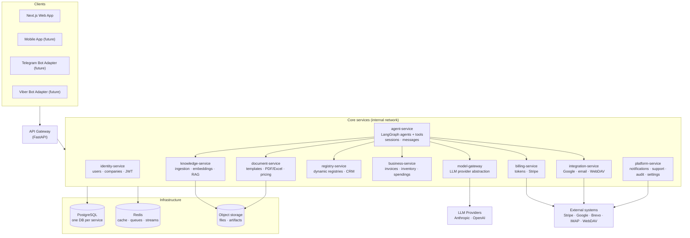
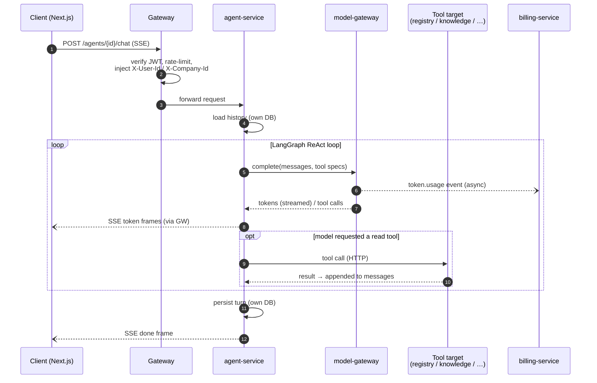
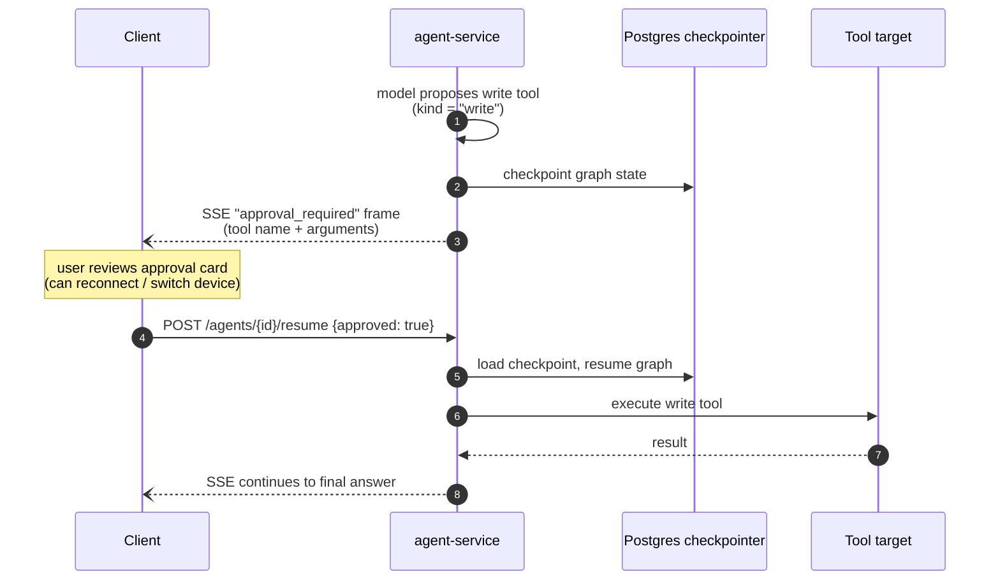
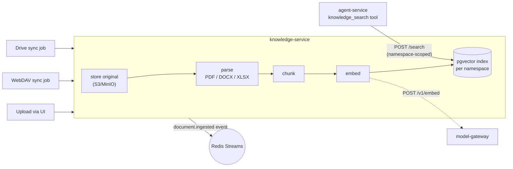
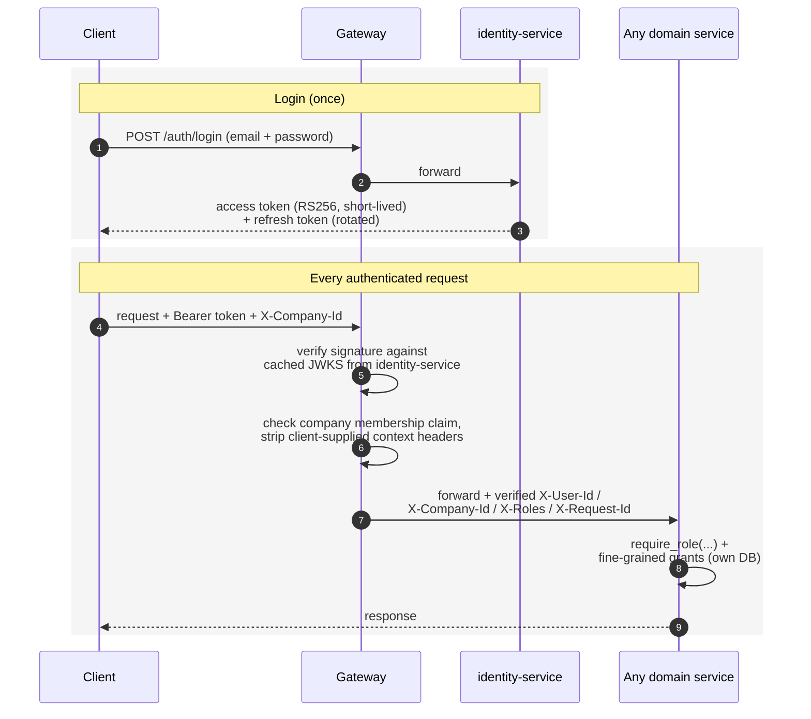
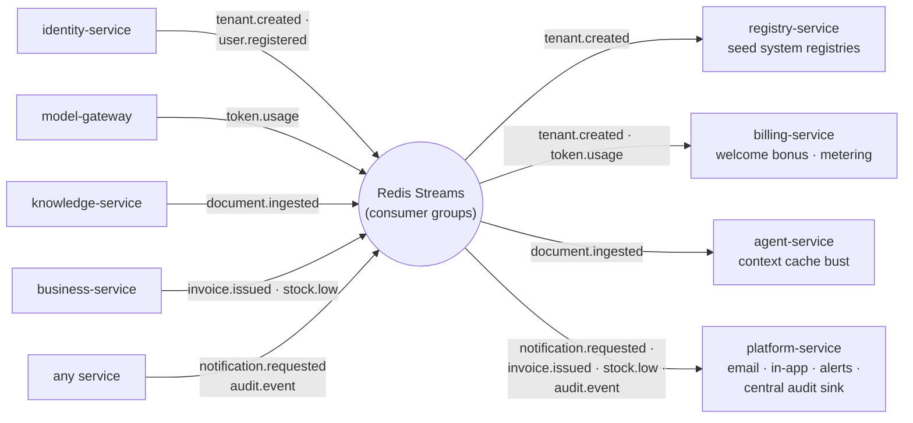

# 01 — Преглед на архитектурата

## 1. Какво изграждаме

**Агентна ERP платформа** за малки и средни компании наематели. Основните продуктови повърхности са:

- AI работно пространство (streaming chat с агенти, използващи инструменти), което може да чете и пише бизнес
  данни от името на потребителя, с човешко одобрение за действия, които променят данни.
- Конфигурируеми бизнес регистри (CRM pipeline, фактури, контрагенти, активи, …).
- Документен слой: library + RAG knowledge base, визуални шаблони, генериране на PDF/Excel,
  ценообразуване и маржове, KSS (construction cost sheets).
- Интеграции: Google Workspace (Drive/Gmail), IMAP/SMTP email, WebDAV file servers,
  token billing, базиран на Stripe.

Същият backend обслужва няколко frontend-а: Next.js web app днес; мобилно приложение и
Telegram/Viber ботове по-късно — всички през един gateway, без привилегирован достъп.

## 2. Архитектурни принципи

1. **Една входна точка.** Целият външен трафик минава през API Gateway. Услугите никога не
   са публично изложени; те живеят във вътрешна мрежа.
2. **Database-per-service.** Всяка услуга притежава своето хранилище за данни изключително.
   Данни между услуги се извличат през HTTP или се получават чрез events — никога чрез
   свързване към базата данни на друга услуга.
3. **Разширяемост чрез конвенция, не чрез промяна.** Нови агенти, инструменти и integration
   adapters се добавят чрез поставяне на файлове в автоматично откривана папка (manifest + implementation),
   а не чрез редактиране на core runtime кода. Вижте [03-agent-platform.md](./03-agent-platform.md).
4. **Hexagonal layering във всяка услуга.** Domain logic зависи от ports (Python
   `Protocol`s); concrete adapters (httpx clients, DB drivers, SDKs) са единственото място,
   където се импортира framework или driver, и се инжектират по границите чрез FastAPI dependencies.
5. **LLM достъп само през Model Gateway.** Никоя услуга не държи provider API keys освен
   Model Gateway. Това централизира смяната на доставчици, retries и token metering.
6. **Async-first.** FastAPI + async SQLAlchemy/asyncpg + httpx навсякъде; фонова работа
   чрез per-service workers (arq върху Redis); известия между услуги чрез Redis Streams.
7. **Tenant isolation навсякъде.** Всяка заявка носи tenant (company) context; всяка заявка
   във всяка услуга е tenant-scoped. Postgres RLS служи като defense-in-depth в услугите,
   които съхраняват tenant data.
8. **Започнете консолидирано, разделяйте при нужда.** Service catalog дефинира целевите
   граници, но услугите могат първоначално да бъдат co-deployed (един container, няколко
   router-а) и да се разделят, когато мащабирането или екипните граници го изискат. Същото правило
   вече е оформило самия catalog: граници, които не оправдават собствен deployable, са modules,
   а не services (виж [02 § Deliberately merged](./02-service-catalog.md#deliberately-merged-boundaries)).

## 3. Топология на системата

### Ключов поток 1 — chat turn

Client → gateway → agent-service. Агентът зарежда history от собственото си conversation store
(sessions и messages живеят в agent DB — без network hop по най-натоварения path), изпълнява
своя LangGraph graph (като извиква tools, които се обръщат към registry-service, knowledge-service и т.н.),
stream-ва tokens обратно през gateway-а чрез SSE и persist-ва turn-а. Model calls минават
през model-gateway, който публикува събитие `token.usage`, консумирано от billing-service.

### Ключов поток 2 — write actions изискват одобрение

Когато агент предложи write tool call (създаване на registry row, изпращане на email, генериране
на document), graph-ът **interrupts**: state-ът се checkpoint-ва в Postgres, client-ът показва
approval card и graph-ът продължава след потвърждение — дори след reconnect.

### Ключов поток 3 — document ingestion & retrieval

Upload или sync (WebDAV/Drive) → knowledge-service съхранява файла, parse-ва, chunk-ва, embed-ва
(чрез model-gateway) и index-ва във vector store-а си. Агентите извличат информация при query time
през knowledge-service API — никога чрез директен достъп до неговата DB.

## 4. Технологичен стек

| Област | Избор | Бележки |
|---------|--------|-------|
| Backend services | **Python 3.12 + FastAPI** | Pydantic v2 models като contract layer |
| Agent orchestration | **LangGraph** | Graphs per agent; Postgres checkpointer за interrupts/resume |
| Frontend | **Next.js (App Router) + TypeScript** | Говори само с gateway-а; SSE за streaming |
| Databases | **PostgreSQL 16** (една logical DB на услуга) | `pgvector` в knowledge-service |
| Cache / queues / events | **Redis 7** | arq за per-service jobs; Redis Streams за cross-service events |
| Object storage | **S3-compatible** (MinIO в dev) | Качени файлове, генерирани artifacts |
| Auth | **JWT RS256**, издаван от identity-service | Gateway проверява чрез JWKS; услугите се доверяват на gateway headers |
| Service-to-service HTTP | httpx (async, pooled) | Само вътрешна мрежа; short-lived service tokens |
| Migrations | Alembic per service | Всяка услуга притежава собствената schema history |
| Observability | OpenTelemetry traces + structured JSON logs (structlog) + Sentry | Trace ID се предава от gateway-а през всеки hop |
| Packaging / dev | Docker Compose (dev), one image per service | `uv` за dependency management |
| API contracts | OpenAPI per service, auto-generated TS client за frontend-а | Генерира се от FastAPI schemas |

## 5. API Gateway

Gateway-ът е умишлено тънък — той притежава *cross-cutting* concerns и нищо
domain-specific:

| Отговорност | Детайл |
|----------------|--------|
| Routing | Path-prefix routing table: `/api/v1/auth/* → identity-service`, `/api/v1/agents/* → agent-service` и т.н. |
| Authentication | Проверява JWT signature срещу JWKS на identity-service; отхвърля unauthenticated requests (освен public routes: login, register, webhooks, health) |
| Context propagation | Инжектира `X-User-Id`, `X-Company-Id`, `X-Roles`, `X-Request-Id` headers към downstream services; премахва всички client-supplied стойности за тези headers |
| Rate limiting | Redis-backed buckets по route class (auth, chat, default, webhooks) |
| Streaming | Прозрачен SSE/chunked passthrough за chat streams |
| CORS, body limits, IP allow-lists for admin routes | |

Webhooks (Stripe, Brevo) минават през gateway-а със запазване на raw-body и се route-ват
към owning service, която сама извършва signature verification.

Какво gateway-ът **не** прави: business logic, response transformation, aggregation.
Ако client се нуждае от aggregate view, owning service го expose-ва (например dashboard
briefing endpoint-ът живее в registry-service).

## 6. Identity, tenancy и authorization

- **identity-service** е source of truth за users, companies (tenants) и
  memberships с роли (`owner`, `co-owner`, `admin`, `member`, `viewer`).
- Login издава RS256 **access token** (short-lived, носи `user_id` и списък с
  company memberships) + **refresh token** (rotated, съхраняван server-side).
- Активният tenant се избира за всяка заявка чрез `X-Company-Id` header; gateway-ът
  валидира membership claims и forward-ва verified context headers.
- **Role enforcement е локален за всяка услуга** — услугите получават verified role и
  прилагат собствените си `require_role(...)` dependencies. Fine-grained grants (per-registry access
  matrices, margin access) остават вътре в owning service.
- **Platform admin** (cross-tenant) е отделен claim; admin routes връщат 404 към
  non-admins (без existence leakage), като запазват поведението ADR-015 от монолита.
- Internal service-to-service calls използват short-lived service tokens, издавани от
  identity-service (client-credentials style), така че откраднат internal URL сам по себе си не е достатъчен.
  За да остане identity-service **извън per-request path-а**: callers mint-ват веднъж и cache-ват
  token-а до малко преди expiry (helper-ът `x7-common` прави това, като refresh-ва във
  background), а receivers verify-ват tokens **locally** срещу service-token JWKS на
  identity-service — без verification call на всяка заявка. Кратък outage на identity-service
  следователно забавя само token *renewal*; traffic с cached tokens продължава незасегнат.
- **Internal trust model (accepted risk).** Услугите *extract*-ват user identity от
  gateway-verified headers вместо да re-verify-ват end-user JWT, а service token
  доказва само, че caller-ът е platform service — така че компрометирана internal service
  би могла да forge-не user context към peers. Това се приема, защото услугите никога не са
  публично достъпни, service tokens са audience-scoped и всеки write се audit-ва. Ако
  risk profile се промени, upgrade path-ът е gateway-signed identity headers (services
  verify-ват gateway signature на всяка заявка) — това се вписва в `x7_common.auth` без
  промяна на domain code.

## 7. Асинхронна работа и събития

Два отделни механизма, умишлено несмесени:

1. **Jobs (per-service, private)** — arq workers, които четат Redis queues, притежавани от услугата.
   Примери: knowledge-service embedding jobs и sync sweeps, billing-service auto-top-up
   checks, platform-service email sends, agent-service session retention purges. Опашките
   на една услуга са implementation detail; никоя друга услуга не enqueue-ва в тях.
2. **Events (cross-service, published facts)** — Redis Streams topics с consumer groups.
   Producers публикуват facts; consumers реагират независимо:

| Topic | Producer | Consumers | Purpose |
|-------|----------|-----------|---------|
| `token.usage` | model-gateway | billing-service | Metering за всяко LLM call (feature, agent, tenant, tokens) |
| `document.ingested` | knowledge-service | agent-service (cache bust) | Налично е ново знание |
| `notification.requested` | any service | platform-service | „Изпрати на този потребител email / in-app notification“ |
| `audit.event` | any service | platform-service | Централен audit trail sink |
| `tenant.created` | identity-service | registry-service (seed system registries), billing-service (welcome token bonus) | Tenant onboarding fan-out |
| `user.registered` | identity-service | none yet (reserved for onboarding/analytics) | Registration fact, публикуван за бъдещи consumers |
| `invoice.issued` | business-service | platform-service | Уведомяване на owner; бъдещи hooks (accounting export) се закачат тук |
| `stock.low` | business-service | platform-service | Alerts за minimum-stock threshold |

Events носят IDs + minimal payload; consumers fetch-ват full data през HTTP при нужда
(thin events). Всеки consumer е idempotent (events могат да бъдат доставени повече от веднъж).

**Durability.** Redis работи с AOF persistence (плюс replica в production), така че queued
events преживяват process restart. Events, които не трябва да се губят спрямо database
write — `token.usage` преди всичко, защото е billing data — допълнително минават през
**transactional outbox** в producing service: domain row-ът и pending event-ът се commit-ват
в една transaction, а worker flush-ва outbox-а към stream-а. Загубата на такова event тогава
изисква загуба на database-а на producer-а, не само на Redis process.

## 8. Frontend архитектура

- **Едно Next.js app** с две зони: tenant app (`/`) и admin SPA (`/admin`).
- Server Components за data-heavy pages (registries, library); client components за
  chat workspace (SSE streaming, approval cards) и interactive editors.
- **Generated TypeScript API client** от merged OpenAPI spec на gateway-а — без
  hand-written fetch wrappers, които се разминават с backend-а.
- i18n със съществуващите `bg`/`en` catalogs, пренесени напред.
- Future channels (Telegram/Viber bots, mobile) използват *същото* gateway API. Bot
  adapters са малки stateless services, които map-ват channel messages към
  `POST /api/v1/agents/{agent_id}/chat` и stream-ват responses обратно; държат channel
  token ↔ platform user link, нищо повече.

## 9. Deployment & environments

- **Dev**: един `docker-compose.yml` — gateway, всички services, Postgres, Redis, MinIO,
  плюс Next.js dev server. Една команда за стартиране на целия свят.
- **Prod (phase 1)**: същите images на един host чрез Compose; архитектурата не
  *изисква* Kubernetes, за да бъде коректна. Scale-out path: първо преместете chat-heavy services
  (agent-service, model-gateway, gateway) към multiple replicas.
- **Config**: 12-factor environment variables, по един `Settings(BaseSettings)` за всяка услуга,
  разширяващ shared `common.Settings`. Secrets чрез env/secret manager — никога в code.
- **CI**: per-service test + lint + image build, задействани от path filters; contract tests
  валидират, че OpenAPI spec-ът на всяка услуга е backward compatible.

## 10. Cross-cutting стандарти (всяка услуга)

- `GET /health` (liveness) и `GET /ready` (checks DB/Redis) endpoints.
- Structured JSON logs с `request_id`, `user_id`, `company_id`, `service` на всеки ред.
- OpenTelemetry tracing; gateway-ът започва trace-а, услугите го продължават.
- Pydantic-validated request/response models; без raw dicts, пресичащи service boundaries.
- Alembic migrations се изпълняват при deploy, преди новият код да започне да обслужва traffic.
- `tests/` suite, който може да се изпълнява изолирано с disposable Postgres (testcontainers).