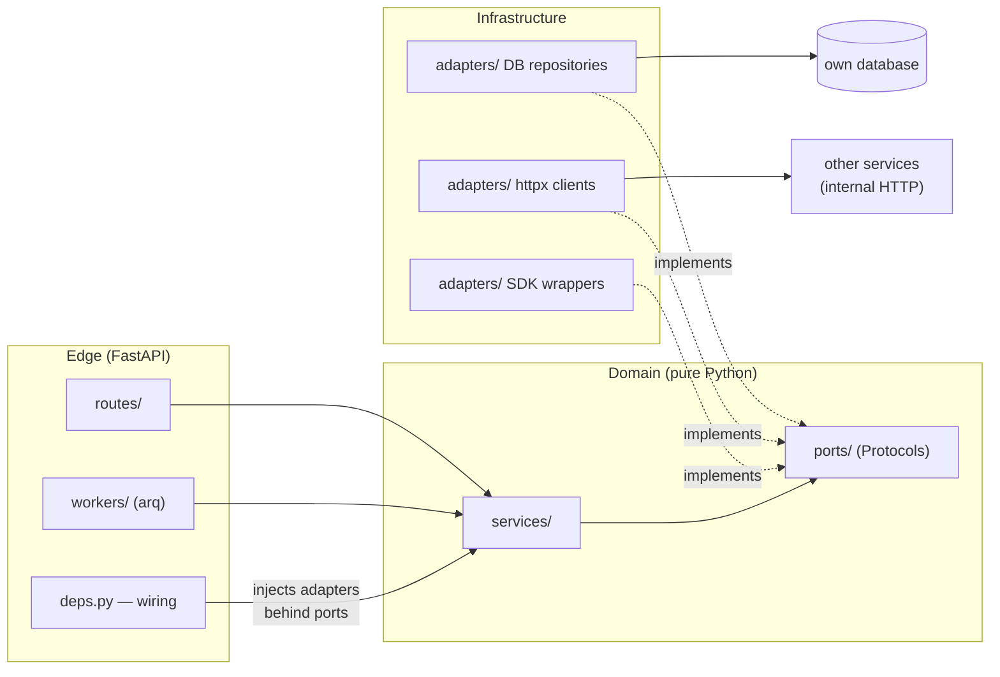
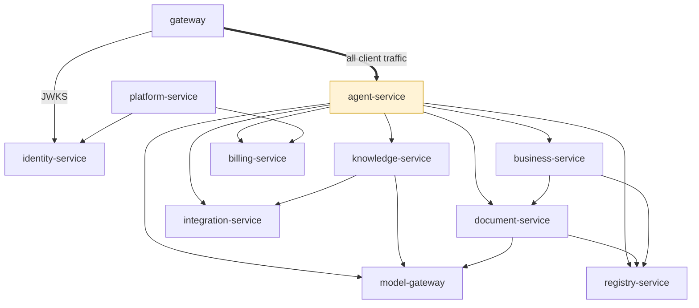

# 02 — Каталог на услугите

Всяка услуга е FastAPI приложение със същото вътрешно оформление:

```
services/<name>/
├── app/
│   ├── main.py            # app factory, router mounting, lifespan
│   ├── config.py          # Settings(BaseSettings) — all env-driven config
│   ├── deps.py            # dependency wiring (the only place adapters are constructed)
│   ├── routes/            # HTTP layer — thin, validates and delegates
│   ├── services/          # domain logic — depends only on ports
│   ├── ports/             # Protocols the domain depends on
│   ├── adapters/          # DB repositories, httpx clients, SDK wrappers
│   ├── models/            # Pydantic DTOs (API contract) — separate from DB models
│   └── workers/           # arq job handlers (if the service has background work)
├── alembic/               # migrations (if the service owns a DB)
├── tests/
└── pyproject.toml
```

Вътре във всяка услуга посоката на зависимостите е фиксирана — routes и workers извикват
домейна, домейнът вижда само ports, а adapters са единственото място, където е познат
driver или външен endpoint:



Споделеният пакет `libs/common` (**`x7-common`**, описан изцяло в
[libs/common/README.md](./libs/common/README.md)) предоставя: базови `Settings`,
извличане на auth context от gateway headers, настройка на logging/tracing, клиент за
Redis Streams event bus, помощни функции за pagination и споделени Pydantic primitives.
Той не съдържа **никаква business logic** и никоя услуга не може да импортира кода на
друга услуга.

Портовете по-долу са за dev compose; в production услугите се откриват една друга чрез
URL-и, конфигурирани през env.

---

## gateway (`:8000`)

Единствената публична входна точка. Вижте [01 §5](./01-architecture-overview.md#5-the-api-gateway).

| | |
|---|---|
| **Притежава** | Routing table, JWKS cache, rate-limit buckets (Redis), CORS policy |
| **База данни** | Няма |
| **Маршрути** | `/api/v1/{service-prefix}/**` reverse proxy; `/api/v1/webhooks/**` raw-body passthrough |
| **Jobs/Events** | Няма |

---

## identity-service (`:8010`)

Потребители, tenant-и и доверие.

| | |
|---|---|
| **Отговорност** | Регистрация (email OTP), login, издаване на JWT RS256 + refresh rotation, password reset, Google OAuth login, публикуване на JWKS, companies (tenants), memberships + roles, user profiles, company profiles/branding, impersonation sessions (admin), издаване на service-token-и за вътрешни извиквания |
| **API** | `/auth/*` (register, login, refresh, logout, verify, reset, oauth), `/users/*`, `/companies/*`, `/memberships/*`, `/.well-known/jwks.json`, `/internal/service-token` |
| **База данни** | `identity` — users, companies, user_companies, refresh_tokens, password_reset_tokens, oauth_identities, impersonation_sessions |
| **Jobs** | почистване на refresh/reset-token-и (ежедневно) |
| **Events out** | `tenant.created`, `user.registered`, `audit.event` |
| **Заменя (monolith)** | `core/auth`, `core/companies`, `core/users`, `core/google` (частта за OAuth login), impersonation |

Бележки: пароли с Argon2; OAuth/External tokens са криптирани с AES-256-GCM. Търсенето на
компания по български ЕИК (Commercial Register providers) е малък модул тук, защото
обслужва company onboarding.

---

## agent-service (`:8020`)

LangGraph agent runtime — сърцето на платформата. Пълният дизайн е в
[03-agent-platform.md](./03-agent-platform.md).

| | |
|---|---|
| **Отговорност** | Откриване на агенти (folder + manifest), изпълнение на LangGraph graph, споделеният tool catalog, ReAct loops, human-in-the-loop interrupts за write tools, per-agent RAG scoping, agent listing за clients, AI memory directives & user memory, инжектиране на skills (prompt snippets); **conversation persistence** — sessions (per user/agent/channel), message history, attachment metadata, long-history summaries, TTL purge |
| **API** | `GET /agents` (catalog), `POST /agents/{id}/chat` (SSE), `POST /agents/{id}/resume` (approval decisions), `GET /sessions`, `GET /sessions/{id}/messages`, `DELETE /sessions/{id}`, `GET/POST /memory`, `GET/POST /skills` |
| **База данни** | `agent` — LangGraph checkpoints (interrupt/resume state), sessions, messages, attachments, ai_memory, user_skills, tool_validation_log, ai_traces |
| **Jobs** | temp-skill expiry, trace retention, session purge (retention, daily) |
| **Events out** | `audit.event` |
| **Извиква** | model-gateway (LLM), knowledge-service (retrieve), registry/business/document/integration services (tools), billing-service (pre-flight balance check) |
| **Заменя (monolith)** | `core/workspace` (chat.js, toolDispatch, streamHandler, promptBuilder, contextLoader), workspace_sessions / workspace_messages, `core/orchestrator`, `core/ai` tools, `core/skills`, `core/memory` |

Бележка: conversation history живее тук като модул `conversations` зад port
`ConversationStore` — **съзнателно не е отделна услуга**. Agent-service е единственият
потребител (channel adapters влизат през chat API, никога през store), а четенията/записите
на history стоят във всеки chat turn — отделна услуга би добавила два HTTP hop-а към
най-горещия път без полза. Ако някога се появи втори consumer, port-ът прави extraction-а
евтин (виж [§ Deliberately merged](#deliberately-merged-boundaries)).

---

## model-gateway (`:8030`)

Единствената услуга, която говори с LLM providers.

| | |
|---|---|
| **Отговорност** | Единно chat-completion + embeddings API върху providers (Anthropic primary, OpenAI за embeddings), streaming passthrough, provider/model registry (admin-managed, encrypted keys), retries & timeouts, **token metering** (emits usage events with tenant/user/feature attribution), provider balance monitoring, global + per-tenant AI kill switch |
| **API** | `POST /v1/complete` (supports `stream=true`), `POST /v1/embed`, `GET/POST /v1/providers` (admin), `GET /v1/models` |
| **База данни** | `modelgw` — providers (encrypted credentials), model configs, kill-switch state |
| **Jobs** | provider balance check (daily) |
| **Events out** | `token.usage` (every call), `audit.event` |
| **Заменя (monolith)** | `core/ai/engine.js`, ai_providers admin, anthropic-balance-check, AI toggle |

---

## knowledge-service (`:8040`)

Документи влизат, grounded answers излизат.

| | |
|---|---|
| **Отговорност** | Document library (categories/files), file parsing (PDF/DOCX/XLSX), chunking + embeddings (via model-gateway), vector search over **namespaces** (pgvector), RAG facts (promoted knowledge), projects as retrieval scopes, archive views/permissions, **file sync engines**: WebDAV and Google Drive folder sync (per-file transactions, sweeps) |
| **API** | `POST /files` (upload), `GET /files`, `GET/POST /categories`, `POST /search` (namespace-scoped vector + keyword), `POST /facts/promote`, `GET/POST /projects`, `POST /sync/run`, `GET/POST /sync/folders` |
| **База данни** | `knowledge` — doc_categories, doc_files, document_chunks (pgvector), rag_facts, projects, sync_folders, sync_state |
| **Object storage** | Original files in S3/MinIO |
| **Jobs** | embed-document, sync-webdav, sync-drive, sync sweeps (30 min), reindex |
| **Events out** | `document.ingested` |
| **Извиква** | integration-service (WebDAV/Drive credentials + IO), model-gateway (embeddings) |
| **Заменя (monolith)** | `core/library`, `core/archive`, `core/embeddings`, `core/file-server` sync, drive sync, projects/RAG, `sync-worker.js` |

Бележка: Drive long-transaction anti-pattern, отбелязан в `TECH_DEBT.md` на monolith-а, е
поправен тук по дизайн — sync commit-ва per file с wall-clock deadline + continuation,
съответствайки на вече поправения WebDAV pattern.

---

## registry-service (`:8050`)

Гръбнакът на ERP за structured data.

| | |
|---|---|
| **Отговорност** | Dynamic registries (user-defined tables): columns, rows, optimistic locking, per-registry access matrix, audit trail, row revisions, XLSX export; **registry templates** (counterparties, offers, contracts, assets, employees, projects, purchase/sales invoices, tasks — core/standard/pro tiers); system registries seeded on tenant creation (work pipeline, invoices); **canonical column roles**, за да могат agents да resolve-ват полета семантично (`client_name`, `eik`, `offer_number`); clients (counterparties) convenience API; dashboard briefing aggregation; **tasks and office tasks modeled as system registry templates** (виж [04 §3](./04-functional-coverage.md)) |
| **API** | `GET/POST /registries`, `/registries/{id}/columns`, `/registries/{id}/rows` (CRUD + query + export), `/registries/{id}/access`, `/templates` + `/templates/{slug}/install`, `/clients/search`, `/dashboard/briefing` |
| **База данни** | `registry` — registries, registry_columns, registry_rows (JSONB values), registry_access, registry_audit, row_revisions, templates |
| **Jobs** | няма (synchronous domain) |
| **Events in** | `tenant.created` → seed system registries |
| **Заменя (monolith)** | `core/registries` (2500-LOC routes split into proper layers), registry templates, `core/clients`, `core/dashboard`, `core/tasks`, `core/officeTasks` |

---

## business-service (`:8100`)

Първокласна ERP domain logic — entities, при които **invariants must be enforced by code**,
а не от гъвкавия registry engine. Това е нова capability отвъд parity с monolith-а
(monolith-ът моделираше invoices като registry rows и изобщо нямаше inventory или expense
tracking — виж [04 §6](./04-functional-coverage.md)).

| | |
|---|---|
| **Отговорност** | **Invoicing**: sales & purchase invoices as typed entities — sequential legal numbering per tenant (Bulgarian requirement), VAT calculation, credit/debit notes, immutability after issue, statuses (draft → issued → paid/overdue/void), PDF via document-service; **Inventory**: items/SKUs, warehouses, stock movements (receipt, issue, transfer, adjustment) as an append-only ledger with derived stock levels, reservations, minimum-stock thresholds; **Spendings**: expense records with categories, supplier linkage, recurring expenses, simple budgets and cash-flow summaries |
| **API** | `GET/POST /invoices` (+ `/issue`, `/void`, `/credit-note`), `GET/POST /items`, `GET/POST /warehouses`, `POST /stock/movements`, `GET /stock/levels`, `GET/POST /expenses`, `GET /reports/cashflow` |
| **База данни** | `business` — invoices, invoice_lines, invoice_sequences, items, warehouses, stock_movements, stock_levels (materialized), expenses, expense_categories, budgets |
| **Jobs** | overdue-invoice sweep, low-stock check, recurring-expense generation |
| **Events out** | `invoice.issued`, `stock.low` (→ platform-service notifications) |
| **Извиква** | registry-service (counterparty lookup by canonical role), document-service (invoice/offer PDF rendering), with price data read from document-service's price list |
| **Заменя (monolith)** | Нищо директно — издига системния регистър "Фактури" в реален invoicing domain; inventory и spendings са net-new |

### Граница с registry-service (важно)

| | registry-service | business-service |
|---|---|---|
| Форма на данните | User-defined columns, JSONB rows | Fixed, typed schemas |
| Invariants | Generic (locking, audit, access) | Domain rules in code: stock ≥ 0, sequential invoice numbers, VAT math, immutable issued invoices, double-entry-style movement ledger |
| Кой го дефинира | The tenant (or a template) | The platform |
| Примери | CRM pipeline, contracts, assets, employees, custom trackers | Invoices, stock, expenses |

Практическо правило: ако грешна стойност е просто *разхвърляна*, това е registry; ако
грешна стойност е *незаконна или финансово неправилна*, тя принадлежи в business-service.
Deal pipeline-ът "Работен регистър" остава registry; invoice-ът, който произвежда, се
създава в business-service (чрез agent tool `invoice_create` или UI) и се реферира от
registry row по ID.

---

## document-service (`:8060`)

Всичко, което превръща business data в business documents — включително pricing, което
съществува, за да захранва offers и KSS.

| | |
|---|---|
| **Отговорност** | Visual document templates (section JSONB editor), PDF rendering (headless Chromium), Excel/Word generation, offer drafting, **master price list** (categories, items, history, AI-assisted XLSX import), **margins** (per category/item, access-controlled), **KSS** (construction cost sheet analyze/fill, Excel round-trip) |
| **API** | `GET/POST /templates`, `POST /render` (PDF), `POST /generate` (doc from template + data), `GET/POST /prices/**`, `GET/POST /margins/**`, `POST /kss/analyze`, `POST /kss/fill` |
| **База данни** | `document` — document_templates, price_categories, price_items, price_history, price_imports, category_margins, item_margins, margin_access |
| **Object storage** | Generated artifacts (PDF/XLSX) in S3/MinIO with signed download URLs |
| **Jobs** | price import processing |
| **Заменя (monolith)** | `core/templates`, `core/documents`, `core/priceList`, `core/margins`, `core/kss`, `core/offers` |

---

## billing-service (`:8070`)

Икономиката на tokens и плащанията.

| | |
|---|---|
| **Отговорност** | Token balance per tenant/user, metering (consumes `token.usage` events with feature attribution), token pricing config, limits + alerts + bell notifications data, token packages, **Stripe** checkout + webhook (signature-verified, idempotent via stored event IDs), saved cards, auto-top-up, welcome bonus on registration, limit-increase request flow |
| **API** | `GET /balance`, `GET /usage` (+ admin live SSE), `GET /packages`, `POST /checkout`, `POST /webhooks/stripe`, `GET/POST /auto-topup`, `POST /limit-requests` |
| **База данни** | `billing` — balances, usage_ledger, token_pricing, packages, purchases, stripe_events, auto_topup, limit_requests, bonus_settings |
| **Jobs** | auto-top-up check, usage aggregation rollups |
| **Events in** | `token.usage`, `tenant.created` (welcome bonus) |
| **Заменя (monolith)** | `core/tokens`, `core/payments`, token packages/purchases, auto-topup, limit requests. **Не се пренася**: legacy plan-based billing tables, marketplace commission ledger (виж [04 §4](./04-functional-coverage.md)) |

---

## integration-service (`:8080`)

Свързаност към външни системи зад единен adapter contract.

| | |
|---|---|
| **Отговорност** | Integration catalog + per-tenant install/connect lifecycle; encrypted credentials vault; **adapters**: Google Workspace (Drive browse/IO, Gmail read/send/label), universal email (IMAP/SMTP per-user connections + send log), WebDAV (connection CRUD, browse, file IO used by knowledge-service sync); admin access modes per integration (all/excluded/exclusive); adapter auto-discovery (folder + manifest, same pattern as agents) |
| **API** | `GET /catalog`, `GET /connected`, `POST /{provider}/connect`, `DELETE /{provider}`, `POST /{provider}/oauth/callback`, provider-specific verbs: `/google/drive/**`, `/google/gmail/**`, `/email/**`, `/webdav/**` |
| **База данни** | `integration` — connections, credentials (AES-256-GCM), email_log, integration_access |
| **Jobs** | connection health checks |
| **Заменя (monolith)** | `integrations/` registry, `core/google` (Drive/Gmail), `core/gmail`, `core/email`, `core/file-server` (connection layer), marketplace install flow. Bundled verticals (Virtual Office, Energy) се port-ват като два adapters, ако още са нужни (виж [04 §4](./04-functional-coverage.md)) |

---

## platform-service (`:8090`)

Platform plumbing на едно място: всичко, което говори с потребителите out-of-band, плюс
cross-tenant platform operations. Вътрешно това са четири малки модула —
`notifications/`, `support/`, `audit/`, `settings/` — обединени в една услуга, защото
всеки е low-traffic, основно event-consuming и няма domain coupling; отделно всеки би
струвал база данни, CI pipeline и dashboards за много малко код.

| | |
|---|---|
| **Отговорност** | **Notifications**: in-app notifications (bell), transactional email (Brevo provider + `log` fallback), email delivery webhooks, ops alerts (Telegram channel), notification preferences. **Support**: tickets + staff replies. **Audit**: central audit-log sink (consumes `audit.event`), error-log views, retention policies. **Settings**: platform-wide flags and defaults. Admin aggregation endpoints only where unavoidable — each domain service owns its own admin endpoints (tokens admin in billing-service, provider admin in model-gateway, …) |
| **API** | `GET /notifications`, `POST /notifications/read`, `GET/PATCH /preferences`, `POST /webhooks/brevo`, `GET/POST /support/**`, `GET /audit`, `GET/POST /settings` |
| **База данни** | `platform` — notifications, deliveries, preferences, support_tickets, support_messages, audit_log, platform_settings |
| **Jobs** | email send queue (retry with backoff), audit/trace retention |
| **Events in** | `notification.requested` (from any service), `invoice.issued`, `stock.low`, `audit.event` |
| **Заменя (monolith)** | `core/notifications`, `core/email/send.js`, Brevo webhook, `core/alerts`, `core/support`, `core/admin` (частите, които не са поети от domain services), audit/error retention. **Не се пренася**: Dev Studio (виж [04 §4](./04-functional-coverage.md)) |

---

## Optional / deferred services

| Услуга | Статус | Обосновка |
|---------|--------|-----------|
| **schematics-service** | Deferred, isolated | Нишата за electrical-schematic extraction (PDF → poppler → LLM structuring → XLSX) е напълно самостоятелна; port-нете я като собствена услуга само ако vertical-ът още е commercially active. Това е textbook кандидат за isolated microservice — тежък, bursty, без coupling. |
| **telegram-adapter / viber-adapter** | Future | Тънки channel clients към gateway chat API; няма domain logic. Viber никога не е бил имплементиран в monolith-а (само catalogue placeholder). |

## Service-to-service call matrix

Стрелките = synchronous HTTP (internal network, service tokens). Event flows са изброени в
[01 §7](./01-architecture-overview.md#7-asynchronous-work-and-events).



| Caller ↓ / Callee → | identity | model-gw | knowledge | registry | business | document | billing | integration | platform |
|---|---|---|---|---|---|---|---|---|---|
| **gateway** | ✓ (JWKS) | — | — | — | — | — | — | — | — |
| **agent-service** | — | ✓ | ✓ | ✓ | ✓ | ✓ | ✓ (balance check) | ✓ | — |
| **knowledge-service** | — | ✓ (embed) | — | — | — | — | — | ✓ (file IO) | — |
| **business-service** | — | — | — | ✓ (counterparties) | — | ✓ (PDF render, prices) | — | — | — |
| **document-service** | — | ✓ (AI import/format) | — | ✓ (row data for docs) | — | — | — | — | — |
| **billing-service** | — | — | — | — | — | — | — | — | — |
| **platform-service** | ✓ (user/tenant lookups) | — | — | — | — | — | ✓ (usage views) | — | — |

Правило за дизайн: **agent-service is the only fan-out hub** (така трябва да бъде —
tools докосват всичко). Всяка друга услуга държи synchronous dependencies до най-много две.

## Deliberately merged boundaries

Две граници, които *можеха* да бъдат услуги, умишлено са modules вместо това — критерият
е: отделна услуга трябва да купува isolation, който изплаща собствените си база данни,
CI pipeline и failure modes.

| Could-have-been service | Вместо това живее в | Защо е обединено |
|---|---|---|
| conversation-service (sessions, messages) | **agent-service** `conversations/` module behind a `ConversationStore` port | Agent-service е единственият consumer (channels влизат през chat API, никога през store); history read/write стои на всеки chat turn — network hop тук е чист latency tax. Extraction остава евтин чрез port-а, ако се появи втори consumer. |
| notification-service + admin-service | **platform-service** modules (`notifications/`, `support/`, `audit/`, `settings/`) | Всички са low-traffic event consumers + simple CRUD с нулев domain coupling; два допълнителни deployables не купуват нищо. |
