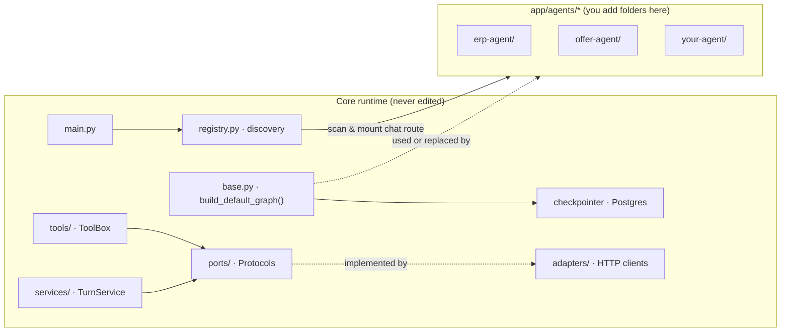
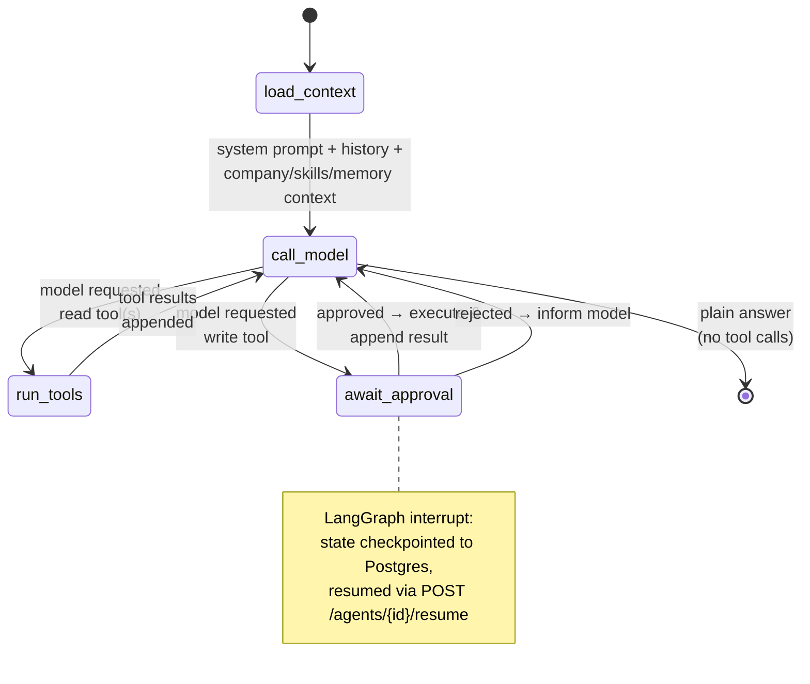
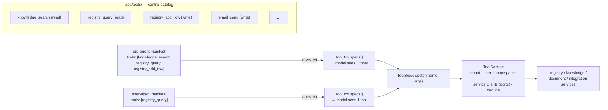

# 03 — Agent Platform (LangGraph) & разширяемост

> Как agent-service е направен разширяем и рецептите за нещата, които реално ще
> правите: **добавяне на нов агент** (със собствен RAG scope и tools), **добавяне на tool
> и споделянето му между agents**, и **смяна на infrastructure** без пренаписване на домейна.

Дизайнерското обещание, пренесено от доказани предишни подходи и адаптирано към LangGraph:

> **Създайте нова agent folder, пуснете вътре два файла (`manifest.yaml` + `graph.py`),
> рестартирайте — без core edits.**

---

## 1. Как се постига разширяемост



### Pillar 1 — Manifest-ът е declarative contract

Всеки agent идва с `manifest.yaml`, който се parse-ва в Pydantic `Manifest`. Всяко поле е
лост, който runtime-ът чете, за да свърже и ограничи agent-а — model, allowed tools,
RAG namespaces, channel availability. Променяте поведението чрез редакция на data, не на code.

### Pillar 2 — Default graph ви дава всичко; пишете само уникалната част

`build_default_graph(manifest, toolbox)` връща пълен LangGraph `StateGraph`:
context loading → ReAct tool loop → human-approval interrupt за write tools → answer.



Agent, който иска стандартно поведение, не доставя **никакъв graph code** (само manifest).
Agent, който има нужда от custom orchestration, export-ва собствен `build_graph()` от
`graph.py` и композира каквито nodes иска — пак получава `self`-style достъп до ToolBox,
LLM port-а и checkpointer-а.

### Pillar 3 — Единна state schema прави всеки agent взаимозаменяем

Всеки graph работи върху същия `AgentState` (TypedDict): `messages`, `tenant`, `user`,
`pending_approval`, `usage`, `artifacts`. Chat route-ът, SSE streamer-ът и
approval/resume endpoint-ът никога не знаят *кой* agent е стартирал — те четат state-а,
не class-а. Нови agent types пасват в съществуващия pipeline.

### Pillar 4 — Registry превръща folders в routes чрез reflection

При startup `registry.discover()` glob-ва `agents/*/manifest.yaml`, import-ва съседния
`graph.py`, ако съществува (иначе използва default graph), компилира graph-а със
споделения Postgres checkpointer и един **single parametric route**
`POST /agents/{agent_id}/chat` обслужва всички тях. Счупена agent folder се логва и
пропуска — никога не е fatal за startup.

### Pillar 5 — Write actions са interrupts, не доверие

Tools са класифицирани като `read` или `write` в техния spec. Default graph-ът
auto-execute-ва read tools вътре в loop-а; преди write tool удря LangGraph **interrupt**:
state-ът се checkpoint-ва в Postgres, client-ът получава `approval_required` SSE frame с
предложеното call, а `POST /agents/{id}/resume` продължава graph-а с решението на
потребителя. Това възпроизвежда approval-card UX-а на monolith-а с реален persistence
mechanism вместо in-stream hack — approvals преживяват reconnect-и и server restarts.

Resume е **exactly-once by construction**: всеки approved write носи idempotency key,
изведен от checkpoint + approval ID, подаден от ToolBox към downstream service. Ако
agent-service падне между изпълнението на write-а и записването на резултата, retry-ят
повтаря *същия* key и owning service връща оригиналния резултат, вместо да действа два
пъти — критично за tools като `invoice_create`, където sequential legal numbering прави
duplicate-а скъп за undo.

> **Защо infra остава swappable:** domain (`services/`, graph builders, `tools/`) зависи
> само от **ports** (Protocols): `LLM`, `Retriever`, `ConversationStore`,
> `RegistryClient`, `DocumentClient`, `IntegrationClient`. Concrete `adapters/` (httpx
> clients, DB repositories) са единственото място, където е познат външен endpoint или
> driver, и се inject-ват чрез `deps.py`.

---

## 2. Anatomy на agent folder

```
services/agent-service/app/agents/erp-agent/
├── manifest.yaml      # required — the declarative contract
├── graph.py           # optional — custom LangGraph graph (default used if absent)
├── prompts/           # optional — system prompt templates
└── tools/             # optional — agent-private tools, not in the shared catalog
```

### `manifest.yaml`

```yaml
id: erp-agent
name: ERP Assistant
description: General business assistant — registries, documents, email, knowledge.
default_model: claude-sonnet-4-5          # passed to model-gateway, overridable per request
tools:                                    # capability ALLOW-LIST — agent only sees these
  - knowledge_search
  - registry_query
  - registry_add_row        # write → triggers approval interrupt
  - price_match
  - offer_draft
  - generate_document       # write
  - email_send              # write
data_namespaces: [library, registry-docs] # RAG scope for knowledge_search / retrieval
channels: [web, telegram]                 # which client channels may invoke this agent
context:                                  # what the context loader injects per turn
  company_profile: true
  skills: true
  memory: true
  active_project: true
system_prompt: |
  You are the 7x7 ERP assistant. Answer in the user's language (default Bulgarian).
  Use tools to read business data; never invent registry contents. ...
```

| Поле | Какво контролира |
|-------|------------------|
| `id` | Route-ът: `POST /agents/erp-agent/chat`, и catalog entry-то в `GET /agents` |
| `default_model` | Model name, изпратено към model-gateway |
| `tools` | **Allow-list.** `ToolBox.specs()` expose-ва към model-а само тези |
| `data_namespaces` | Retrieval scope в knowledge-service |
| `channels` | Gateway/bot adapters филтрират agent catalog-а per channel |
| `context` | Кои context blocks loader-ът fetch-ва и inject-ва в system prompt-а |
| `system_prompt` | Инструкциите на agent-а; fallback към `"You are {name}."` |

### `graph.py` (само когато default loop-ът не стига)

```python
# app/agents/erp-agent/graph.py
from langgraph.graph import StateGraph, START, END
from app.base import AgentState, default_nodes


def build_graph(manifest, toolbox, llm, checkpointer):
    nodes = default_nodes(manifest, toolbox, llm)   # load_context, call_model,
                                                    # run_tools, await_approval
    g = StateGraph(AgentState)
    g.add_node("load_context", nodes.load_context)
    g.add_node("plan", my_planning_node)            # ← the custom part
    g.add_node("call_model", nodes.call_model)
    g.add_node("run_tools", nodes.run_tools)
    g.add_node("await_approval", nodes.await_approval)   # interrupt node

    g.add_edge(START, "load_context")
    g.add_edge("load_context", "plan")
    g.add_edge("plan", "call_model")
    g.add_conditional_edges("call_model", nodes.route_after_model, {
        "tools": "run_tools", "approval": "await_approval", "done": END,
    })
    g.add_edge("run_tools", "call_model")
    g.add_edge("await_approval", "call_model")
    return g.compile(checkpointer=checkpointer)
```

Default graph-ът е точно това минус `plan` node-а — така marginal cost-ът на custom
agent е само неговите custom nodes.

---

## 3. Стъпка по стъпка: добавяне на нов agent

Ще добавим `offer-agent`, който draft-ва offers от price list и counterparty data.

**Стъпка 1 — създайте folder-а.**

```bash
mkdir -p services/agent-service/app/agents/offer-agent
```

**Стъпка 2 — декларирайте го в `manifest.yaml`.**

```yaml
id: offer-agent
name: Offer Agent
description: Drafts commercial offers from the price list and client registry.
default_model: claude-sonnet-4-5
tools: [registry_query, price_match, offer_draft, generate_document]
data_namespaces: [library]
channels: [web]
system_prompt: >
  You draft commercial offers. Always resolve the client via registry_query,
  match items via price_match, and present a draft before generating the document.
```

**Стъпка 3 — (по желание) напишете `graph.py`.** Пропуснете го: default ReAct +
approval graph-ът е точно това, от което offer workflow има нужда.

**Стъпка 4 — рестартирайте service-а.**

```bash
docker compose restart agent-service
```

При boot discovery намира manifest-а, компилира graph-а и mount-ва route-а. Agent-ът се
появява в `GET /agents`. **Няма променен core file.**

**Стъпка 5 — verify.**

```bash
curl -N -X POST http://localhost:8000/api/v1/agents/offer-agent/chat \
  -H "authorization: Bearer $TOKEN" -H "x-company-id: $COMPANY" \
  -H "content-type: application/json" \
  -d '{"message": "Оферта за Контрагент ЕООД: 20 бр. ключ обикновен"}'
```

Трябва да видите SSE token stream; ако agent-ът предложи `generate_document`, stream-ът
emit-ва `approval_required` frame и pause-ва до `POST /agents/offer-agent/resume`.

### За самите RAG data

Agent-service **не** притежава и не index-ва documents. `data_namespaces` именуват
corpora, които живеят в **knowledge-service**. За да дадете на agent собствено знание,
ingest-нете documents в нов namespace (`POST /api/v1/knowledge/files` с
`namespace: offers-kb`) и добавете този namespace в manifest-а. Agents четат at query time
през `Retriever` port-а — никога директно от vector store.

---

## 4. Tools: споделеният catalog

Tools живеят централно в `app/tools/`, по един module per tool, expose-нати чрез
`ToolBox`. Споделянето на tool е движение от две части: **добавете го в catalog-а веднъж**,
после всеки agent **opt-in-ва чрез manifest-а си**. Capability остава централна; exposure
остава per-agent.



### Tool protocol

```python
# app/tools/base.py
class Tool(Protocol):
    name: str
    kind: Literal["read", "write"]      # write → approval interrupt
    spec: ToolSpec                       # JSON-schema params for the model

    async def dispatch(self, ctx: ToolContext, args: dict[str, Any]) -> str: ...
```

`ToolContext` се конструира веднъж per turn и носи: tenant/user identity, downstream
service clients (registry, knowledge, document, integration — всички ports),
`data_namespaces` на agent-а, `Settings` и per-turn dedupe state (повторен идентичен
`knowledge_search` не струва втори round trip).

### Добавяне на tool

```python
# app/tools/registry_query.py
REGISTRY_QUERY_SPEC = ToolSpec(
    name="registry_query",
    description="Query rows from a tenant registry by filters or free text.",
    parameters={...},
)

class RegistryQueryTool:
    name = "registry_query"
    kind = "read"
    spec = REGISTRY_QUERY_SPEC

    async def dispatch(self, ctx: ToolContext, args: dict) -> str:
        rows = await ctx.registry.query(
            tenant=ctx.tenant, registry=args["registry"], filters=args.get("filters"),
        )
        return format_rows(rows)
```

После регистрирайте една instance в `app/tools/__init__.py` — **единственият** existing
file, който докосвате:

```python
_AVAILABLE_TOOLS: list[Tool] = [
    KnowledgeSearchTool(),
    RegistryQueryTool(),
    RegistryAddRowTool(),      # kind="write"
    PriceMatchTool(),
    OfferDraftTool(),
    GenerateDocumentTool(),    # kind="write"
    EmailSendTool(),           # kind="write"
    # ...
]
```

`ToolBox.specs(allowed)` връща specs само за позволените от manifest-а names;
`dispatch()` търси по name. Не са нужни промени в agent code, за да *получи* shared tool —
default graph-ът вече извиква `specs()`/`dispatch()` generic-но.

### Правила за дизайн на tools

- **Allow-list-ът е security boundary.** Tool в catalog-а е невидим за agent, докато
  manifest-ът му не го изброи. Дръжте списъците tight.
- **Safety живее в tool-а, не в agent-а.** Outbound-host allow-lists, tenant scoping,
  argument validation, per-turn dedupe — всичко е вътре в tool/ToolBox, така че никой
  agent да не може да ги забрави.
- **`kind="write"` не е advisory.** Graph-ът enforce-ва approval interrupt-а централно;
  tool author не може да opt out-не чрез prompt wording.
- **Write tools са idempotent.** Всеки write dispatch носи approval-derived
  idempotency key (виж Pillar 5); backing service endpoint-ът трябва да dedupe-ва по него
  и да връща оригиналния резултат при replay. Write tool, чиято target услуга не може да
  dedupe-ва, не е готов.
- **Agent-private tools** живеят в собствената `tools/` folder на agent-а и се регистрират
  само в ToolBox instance-а на този agent — невидими за всички други agents.

### Първоначален tool catalog (пренесен от monolith-а)

| Read | Write (approval) |
|------|------------------|
| `knowledge_search`, `registry_list`, `registry_query`, `registry_suggest`, `price_match`, `price_categories`, `offer_draft`, `email_inbox`, `email_read`, `task_list`*, `analyze_document`, `kss_analyze`, `list_integrations`, `switch_project`, `invoice_list`, `inventory_check`, `expense_summary` | `registry_add_row`, `registry_update_row`, `generate_document`, `generate_excel`, `kss_fill`, `save_margins`, `email_send`, `gmail_actions`, `task_create`*, `task_complete`*, `learn_skill`, `invoice_create`, `stock_move`, `expense_add` |

`remember` (memory write) остава auto-execute, както в monolith-а — то пише само в
собствената AI memory на потребителя. *Task tools работят върху tasks system registry (виж
[04 §3](./04-functional-coverage.md)).

---

## 5. Смяна на infrastructure

Правилото, идентично във всички услуги:

> **Domain-ът зависи от port. Infrastructure е adapter зад него. За да смените
> infrastructure, напишете нов adapter и rewire-нете един ред в `deps.py` — domain-ът и
> agents не се променят.**

### Case A — смяна на adapter в agent-service

"Infrastructure" на agent-service са неговите adapters зад ports `ConversationStore`,
`Retriever`, `LLM`, `RegistryClient`, … — HTTP clients за downstream services, DB
repository за conversation history. За да сложите Redis read-through cache пред history
store: запазете port-а, напишете `CachedConversationStore`, който го implement-ва,
rewire-нете един ред:

```python
# app/deps.py
def get_turn_service() -> TurnService:
    return TurnService(
        conversations=CachedConversationStore(pg_store, redis),   # ← swapped
        retriever=KnowledgeRetriever(settings, client),
        llm=ModelGatewayLLM(settings, client),
        settings=settings,
    )
```

### Case B — смяна на database в услуга, която притежава DB

Същият механизъм във всяка sibling service: domain-ът зависи от repository/store port;
adapter-ът е единственият file, който import-ва driver-а. Преместването на vector store-а
на knowledge-service от pgvector към Qdrant = един нов adapter + един ред в `deps.py`.
Две твърди правила:

- **Database-per-service.** Никоя услуга никога не се свързва към store-а на друга.
- **DTOs ≠ DB models.** Adapters map-ват между API DTOs и storage shapes, така че API-то
  остава stable, докато storage evolves.

### Case C — смяна на LLM provider

Нищо в agent-service не се променя изобщо: providers живеят зад model-gateway. Добавете
provider adapter *там*, сменете model name-а в manifest (или admin provider config).

---

## 6. Quick reference

| Искам да… | Направете това | Докоснати файлове |
|------------|---------|---------------|
| Добавя agent | Folder + `manifest.yaml` (+ optional `graph.py`), restart | само `app/agents/<id>/*` |
| Дам RAG data на agent | Задайте `data_namespaces`; ingest-нете в тези namespaces чрез knowledge-service | manifest + knowledge ingest |
| Дам existing tool на agent | Добавете name-а в manifest `tools:` list | само manifest |
| Споделя нов tool | Нов module в `app/tools/` + един registry line; opt in per manifest | `app/tools/` + manifests |
| Направя tool да изисква approval | `kind="write"` в tool class-а | tool module-ът |
| Custom orchestration | Export-нете `build_graph()` от `graph.py` на agent-а, compose-нете `default_nodes()` | `app/agents/<id>/graph.py` |
| Expose-на agent към нов channel | Добавете channel-а в `channels:` в manifest-а | само manifest |
| Сменя downstream client | Нов adapter, който implement-ва port-а + един ред в `deps.py` | `adapters/` + `deps.py` |
| Променя provider/endpoint/limit | Env var / `Settings` field / admin provider config | `.env` |

### Златни правила

- Agents живеят изцяло под `app/agents/<id>/`. Добавянето на един не докосва core module.
- Agent code зависи от ToolBox и ports — никога от adapters, raw HTTP или provider SDKs.
- Write tools винаги interrupt-ват за approval; graph-ът го enforce-ва, не prompt-ът.
- Счупена agent folder се пропуска, не е fatal — проверете startup logs, ако agent липсва
  от `GET /agents`.
