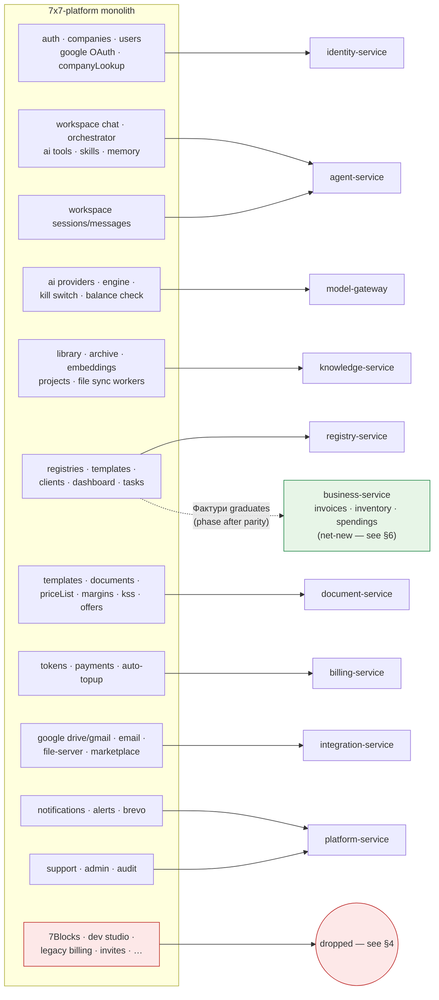

# 04 — Functional Coverage: Monolith → Microservices

This document maps every capability of the existing `7x7-platform` monolith to its home in
the new architecture, and lists what is **deliberately not carried over** (with the
evidence from the monolith's own audits: `DEAD_CODE_AUDIT.md`, `BLOCKS_AUDIT.md`,
`TECH_DEBT.md`, `CODE_QUALITY_REPORT.md`).

The big picture — where the monolith's modules land:

## 1. Carried over — feature mapping

| Monolith capability | Monolith location | New home | Notes |
|---|---|---|---|
| Register / login / JWT RS256 + refresh / OTP verify / password reset | `core/auth` | **identity-service** | Same token model; Argon2 kept |
| Google OAuth login | `core/google` (auth part) | **identity-service** | Drive/Gmail scopes handled separately by integration-service |
| Companies, memberships, roles (owner…viewer) | `core/companies`, `core/users` | **identity-service** | `X-Company-Id` tenant header kept |
| Company EIK lookup (BG Commercial Register) | `core/companyLookup` | **identity-service** | Provider adapters, env-gated as today |
| Impersonation (admin, read-only guard) | impersonation middleware | **identity-service** + gateway | Claim-based; mutating requests blocked at gateway |
| Workspace SSE chat + multimodal attachments | `core/workspace/chat.js` (2516 LOC) | **agent-service** (graph + own conversation store) | The monster file becomes a LangGraph graph + thin route |
| Agentic tool loop + approval cards | `streamHandler` + `AGENTIC_LOOP_ENABLED` flag | **agent-service** | LangGraph interrupts replace the in-stream pause; approvals survive reconnects |
| AI tools (registry, tasks, knowledge, prices, KSS, email, gmail, documents…) | `core/ai/tools.js`, `toolDispatch.js` | **agent-service** tool catalog | Same read/write split; see [03 §4](./03-agent-platform.md#4-tools-the-shared-catalog) |
| System prompt building + context loading (company, skills, memory, project, prices) | `promptBuilder.minimal.js`, `contextLoader.js` | **agent-service** `load_context` node | Driven by the manifest `context:` block |
| History summarization for long chats | `historySummarizer.js` | **agent-service** | Summaries stored with the session in the agent DB |
| AI memory (`remember`), directives, personalization | `core/memory`, ai_memory tables | **agent-service** | |
| Skills (Умения) + folders + temp expiry | `core/skills` | **agent-service** | Injected via context loader |
| Proactive page summaries | `POST /core/ai/proactive` | **agent-service** (ephemeral endpoint) | |
| Pluggable AI providers (admin), encrypted keys, AI kill switch, Anthropic balance watch | `core.ai_providers`, `core/owner/aiToggle` | **model-gateway** | Centralized for *all* services, not just chat |
| Token metering per feature, limits, alerts | `core/tokens` | **billing-service** (via `token.usage` events from model-gateway) | Metering becomes automatic — no per-callsite bookkeeping |
| Token packages, Stripe checkout + webhook, saved cards, auto-top-up, welcome bonus, limit requests | `core/payments` | **billing-service** | Untested-in-monolith payments code gets a tested rewrite |
| Dynamic registries (columns, rows, locking, access matrix, audit, revisions, XLSX export) | `core/registries` (2507-LOC routes) | **registry-service** | Same model incl. `canonical_role` semantic columns |
| Registry templates (9 domains × 3 tiers) + system registries (Работен регистър, Фактури) | seeds + `registry-templates` | **registry-service** | Seeded on `tenant.created` event |
| Clients/counterparties shortcut API | `core/clients` | **registry-service** | Convenience view over the canonical registry |
| Dashboard briefing | `core/dashboard` | **registry-service** | |
| Personal tasks + office tasks | `core/tasks`, `core/officeTasks` | **registry-service** (as system registry templates — see §3) | |
| Master price list + history + AI XLSX import | `core/priceList` | **document-service** | |
| Margins (category/item, access) | `core/margins` | **document-service** | |
| KSS analyze/fill (construction cost sheets) | `core/kss` | **document-service** | |
| Visual document templates + PDF render (Puppeteer) | `core/templates`, `core/documents` | **document-service** | Headless-Chromium rendering isolated in one service |
| Offer drafting | `core/offers` | **document-service** + `offer_draft` tool | |
| Document library, categories, bulk upload | `core/library` | **knowledge-service** | |
| Embeddings + chunking + knowledge search | `core/embeddings`, `document_chunks` | **knowledge-service** (pgvector) | Embeddings via model-gateway |
| Archive (sources, promote-to-facts, permissions, reindex) | `core/archive` | **knowledge-service** | |
| Projects as retrieval scopes (`switch_project`) | `core/projects` | **knowledge-service** | Active project in Redis, as today |
| WebDAV connections + folder sync | `core/file-server`, sync-worker | **integration-service** (connections/IO) + **knowledge-service** (sync engine) | Per-file transactions kept |
| Google Drive browse/upload/sync | `core/google` | same split as WebDAV | Long-transaction anti-pattern (open item in `TECH_DEBT.md`) fixed by design |
| Gmail tools (read/send/label/filter) | `core/gmail` | **integration-service** + agent tools | |
| Universal email (IMAP/SMTP), Brevo delivery webhook | `core/email` | **integration-service** (connections) + **platform-service** (transactional send) | |
| Integration catalog, install/connect lifecycle, access modes, encrypted credentials | `core/marketplace`, `integrations/` | **integration-service** | Same folder-discovered adapter pattern |
| In-app notifications (bell) | `core/notifications` | **platform-service** | |
| Ops alerts to Telegram | `core/alerts` | **platform-service** | |
| Support tickets + staff replies + email notify | `core/support` | **platform-service** | |
| Admin: tenants, users, tokens live view, payments, prompts, providers, integration access | `core/admin`, admin SPA | Domain services (each owns its admin endpoints) + **platform-service** + Next.js `/admin` zone | 404-for-non-admins behavior kept |
| Audit log, error log, AI traces, retention | `core.audit_log` etc. | per-service + **platform-service** sink (`audit.event`) | |
| Rate limiting (14 buckets, Redis) | `core/middleware/rateLimiter` | **gateway** | Single implementation — removes the 14× duplicated handler noted in `CODE_QUALITY_REPORT.md` |
| Multi-page frontend (27 HTML pages, 63 JS files, bg/en i18n) | `public/` | **Next.js app** | See §2 |
| Schematics extraction (PDF → circuits → XLSX) | `core/schematics` | **schematics-service** (deferred/optional) | Isolated vertical; port only if commercially active |

## 2. Frontend coverage

The monolith's `public/` multi-page HTML + vanilla JS (including the 4205-line
`ai-chat.js`) is replaced by one Next.js application:

| Monolith page(s) | Next.js route |
|---|---|
| `dashboard.html` | `/` (dashboard with briefing widget) |
| `workspace.html` + `ai-chat.js` | `/workspace` — chat with SSE streaming, approval cards, attachments |
| `registries.html`, `registry-detail.html` | `/registries`, `/registries/[id]` |
| `library.html`, `archive.html` | `/library`, `/archive` |
| `prices.html` | `/prices` |
| `template-editor.html` | `/templates/[id]/edit` |
| `skills.html` | `/skills` |
| `settings.html` | `/settings/**` (profile, AI, integrations, email, file server) |
| `marketplace.html` | `/integrations` (integration catalog; no block marketplace — see §4) |
| `support.html` | `/support` |
| `register/login/verify/reset` pages | `/auth/**` |
| `pricing.html`, `landing-v2.html` | `/pricing`, `/` (marketing — can live in the same app or a separate site) |
| `admin/index.html` SPA | `/admin/**` zone |
| `schematic-spec.html`, `symbol-library.html` | only if schematics-service is ported |

## 3. Simplifications (kept the capability, removed the bespoke machinery)

These are intentional design consolidations, not feature losses:

1. **Tasks become registries.** The monolith has two bespoke task modules (`core/tasks`
   per-user, `core/officeTasks` company-wide) next to a generic registry engine that
   already models exactly such tables — and its own `tasks` registry template. The new
   system ships "Лични задачи" and "Задачи офис" as system registry templates with
   canonical roles; the `task_*` agent tools operate on them. Two modules, two tables, and
   duplicate CRUD/UI disappear; tasks gain registry features (audit, revisions, export,
   access matrix) for free.
2. **One metering pipeline.** Token accounting moves from per-callsite bookkeeping
   scattered across the monolith into a single `token.usage` event stream emitted by the
   model-gateway. Feature attribution travels as call metadata.
3. **One rate limiter, one auth middleware chain** — at the gateway, instead of 14
   duplicated Express buckets and per-route guard stacks.
4. **Skills + document templates + agent tools replace 7Blocks** for the use cases blocks
   actually served (calculators, formatters, offer generators) — see §4.

## 4. Deliberately NOT carried over (redundant / dead / retired)

| Dropped item | Evidence / rationale |
|---|---|
QUERY LENGTH LIMIT EXCEEDED. MAX ALLOWED QUERY : 500 CHARS
| **AI block suggestions** (`block_suggestions`, suggestion crons) | Already unscheduled in the monolith (2026-05-04), explicitly replaced by Skills |
| **Dev Studio** (`dev_tasks`, analyze/merge queue, dev-worker sandbox) | Analyzer was a stub; merge job audit-only. Internal tooling that never matured — modern agentic IDEs cover the need |
| **Legacy plan-based billing** (`billing.plans`, `billing.subscriptions`, `STRIPE_PRICE_*`) | Retired in the monolith; token packages are the only live model |
| **Marketplace commission ledger** (`marketplace-accrue`) | Env-gated OFF by default, never enabled in production |
| **Trial reminders** (`trial-reminder-sweep`) | Unscheduled in the monolith |
| **Neural memory** (`fact_search`/`chunk_search`) | Already dropped by monolith migration 172; `knowledge_search` is the survivor |
| **Token-based invite flow** (`core.invites`, `send-invite-email`) | Replaced by direct grant-access in the monolith |
| **PWA service worker** | Self-unregistering stub in the monolith |
| **Worker stubs** (`send-email` generic, `generate-report`, `sync-integration`) | Never implemented |
| **`sync-ai-knowledge-daily`** | Superseded by the file-server sweep |
| **Microsoft + generic-ERP integration stubs** | `NotImplementedError` adapters; the catalog entry can return when a real adapter exists |
| **Activity feed** (`/api/v2/activity`, `activity` schema) | Empty placeholder returning `[]`; the `audit.event` stream provides the data to build it properly later |
| **NG Technology tenant seeds** (migrations 073/080/081/085) | Tenant-specific historical data; flagged OBSOLETE pattern in `DEAD_CODE_AUDIT.md` |
| **Owner block-visibility settings** | Removed in the monolith 2026-05-31 |

## 5. Decide-during-migration

| Item | Question | Recommendation |
|---|---|---|
| **Bundled verticals** (Virtual Office, Energy — HMAC handshake, health sweeps) | Are these partnerships still live? | If yes: port as two integration-service adapters (the HMAC install/callback flow fits the adapter contract). If no: drop, the catalog stays |
| **Schematics vertical** | Still commercially active? | If yes: isolated **schematics-service** (perfect microservice candidate). If no: drop |
| **Marketing pages** (`landing-v2`, `pricing`) | Same app or separate marketing site? | Separate static site keeps the product app lean |
| **Viber/IMAP "coming soon" catalog entries** | Keep placeholder entries? | Keep in catalog data only — no code |

## 6. New capabilities beyond parity: business-service

One service in the catalog has **no monolith counterpart**: the
[business-service](./02-service-catalog.md#business-service-8100) (invoicing, inventory,
spendings). The monolith approximated these domains with generic registries — invoices were
rows in the "Фактури" system registry, and inventory/expense tracking did not exist. That
approach cannot enforce ERP invariants: sequential legal invoice numbering, VAT math,
immutability of issued invoices, non-negative stock.

What this means for the migration:

- **Phase parity first.** During the strangler migration, "Фактури" ports as a system
  registry exactly as in the monolith — no behavior change for existing tenants.
- **Graduation second.** Once business-service ships, the "Фактури" registry data migrates
  into typed `invoices` rows (the canonical-role columns — `client_name`, `eik`, amounts —
  make this mapping mechanical), and the registry is retired or kept read-only as history.
- **The boundary rule** (also in [02](./02-service-catalog.md#boundary-with-registry-service-important)):
  user-defined, flexible data stays in registry-service; data whose incorrectness is
  *illegal or financially wrong* lives in business-service. The deal pipeline registry
  links to invoices by ID; it does not duplicate them.
- **Agent tools** (`invoice_create`, `invoice_list`, `inventory_check`, `stock_move`,
  `expense_add`, `expense_summary`) make the new domains immediately available in the
  workspace chat with the standard write-approval flow.
