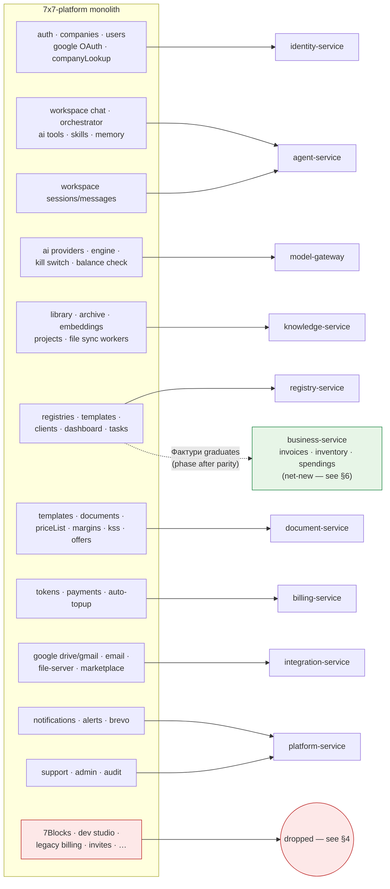

# 04 — Functional Coverage: Monolith → Microservices

Този документ map-ва всяка capability на съществуващия monolith `7x7-platform` към нейния
дом в новата архитектура и изброява какво **съзнателно не се пренася** (с evidence от
собствените audit-и на monolith-а: `DEAD_CODE_AUDIT.md`, `BLOCKS_AUDIT.md`,
`TECH_DEBT.md`, `CODE_QUALITY_REPORT.md`).

Голямата картина — къде попадат modules на monolith-а:

## 1. Пренесено — feature mapping

| Monolith capability | Monolith location | Нов дом | Бележки |
|---|---|---|---|
| Register / login / JWT RS256 + refresh / OTP verify / password reset | `core/auth` | **identity-service** | Същият token model; Argon2 се запазва |
| Google OAuth login | `core/google` (auth part) | **identity-service** | Drive/Gmail scopes се обработват отделно от integration-service |
| Companies, memberships, roles (owner…viewer) | `core/companies`, `core/users` | **identity-service** | `X-Company-Id` tenant header се запазва |
| Company EIK lookup (BG Commercial Register) | `core/companyLookup` | **identity-service** | Provider adapters, env-gated както днес |
| Impersonation (admin, read-only guard) | impersonation middleware | **identity-service** + gateway | Claim-based; mutating requests се блокират в gateway |
| Workspace SSE chat + multimodal attachments | `core/workspace/chat.js` (2516 LOC) | **agent-service** (graph + own conversation store) | Monster file-ът става LangGraph graph + thin route |
| Agentic tool loop + approval cards | `streamHandler` + `AGENTIC_LOOP_ENABLED` flag | **agent-service** | LangGraph interrupts заменят in-stream pause; approvals преживяват reconnect-и |
| AI tools (registry, tasks, knowledge, prices, KSS, email, gmail, documents…) | `core/ai/tools.js`, `toolDispatch.js` | **agent-service** tool catalog | Същият read/write split; виж [03 §4](./03-agent-platform.md#4-tools-the-shared-catalog) |
| System prompt building + context loading (company, skills, memory, project, prices) | `promptBuilder.minimal.js`, `contextLoader.js` | **agent-service** `load_context` node | Водено от manifest `context:` block-а |
| History summarization for long chats | `historySummarizer.js` | **agent-service** | Summaries се съхраняват със session-а в agent DB |
| AI memory (`remember`), directives, personalization | `core/memory`, ai_memory tables | **agent-service** | |
| Skills (Умения) + folders + temp expiry | `core/skills` | **agent-service** | Inject-ват се чрез context loader |
| Proactive page summaries | `POST /core/ai/proactive` | **agent-service** (ephemeral endpoint) | |
| Pluggable AI providers (admin), encrypted keys, AI kill switch, Anthropic balance watch | `core.ai_providers`, `core/owner/aiToggle` | **model-gateway** | Централизирано за *всички* услуги, не само за chat |
| Token metering per feature, limits, alerts | `core/tokens` | **billing-service** (via `token.usage` events from model-gateway) | Metering става automatic — без per-callsite bookkeeping |
| Token packages, Stripe checkout + webhook, saved cards, auto-top-up, welcome bonus, limit requests | `core/payments` | **billing-service** | Untested-in-monolith payments code получава tested rewrite |
| Dynamic registries (columns, rows, locking, access matrix, audit, revisions, XLSX export) | `core/registries` (2507-LOC routes) | **registry-service** | Същият model incl. `canonical_role` semantic columns |
| Registry templates (9 domains × 3 tiers) + system registries (Работен регистър, Фактури) | seeds + `registry-templates` | **registry-service** | Seeded on `tenant.created` event |
| Clients/counterparties shortcut API | `core/clients` | **registry-service** | Convenience view over the canonical registry |
| Dashboard briefing | `core/dashboard` | **registry-service** | |
| Personal tasks + office tasks | `core/tasks`, `core/officeTasks` | **registry-service** (as system registry templates — see §3) | |
| Master price list + history + AI XLSX import | `core/priceList` | **document-service** | |
| Margins (category/item, access) | `core/margins` | **document-service** | |
| KSS analyze/fill (construction cost sheets) | `core/kss` | **document-service** | |
| Visual document templates + PDF render (Puppeteer) | `core/templates`, `core/documents` | **document-service** | Headless-Chromium rendering isolated in one service |
| Offer drafting | `core/offers` | **document-service** + `offer_draft` tool | |
| Document library, categories, bulk upload | `core/library` | **knowledge-service** | |
| Embeddings + chunking + knowledge search | `core/embeddings`, `document_chunks` | **knowledge-service** (pgvector) | Embeddings via model-gateway |
| Archive (sources, promote-to-facts, permissions, reindex) | `core/archive` | **knowledge-service** | |
| Projects as retrieval scopes (`switch_project`) | `core/projects` | **knowledge-service** | Active project in Redis, as today |
| WebDAV connections + folder sync | `core/file-server`, sync-worker | **integration-service** (connections/IO) + **knowledge-service** (sync engine) | Per-file transactions kept |
| Google Drive browse/upload/sync | `core/google` | same split as WebDAV | Long-transaction anti-pattern (open item in `TECH_DEBT.md`) fixed by design |
| Gmail tools (read/send/label/filter) | `core/gmail` | **integration-service** + agent tools | |
| Universal email (IMAP/SMTP), Brevo delivery webhook | `core/email` | **integration-service** (connections) + **platform-service** (transactional send) | |
| Integration catalog, install/connect lifecycle, access modes, encrypted credentials | `core/marketplace`, `integrations/` | **integration-service** | Същият folder-discovered adapter pattern |
| In-app notifications (bell) | `core/notifications` | **platform-service** | |
| Ops alerts to Telegram | `core/alerts` | **platform-service** | |
| Support tickets + staff replies + email notify | `core/support` | **platform-service** | |
| Admin: tenants, users, tokens live view, payments, prompts, providers, integration access | `core/admin`, admin SPA | Domain services (each owns its admin endpoints) + **platform-service** + Next.js `/admin` zone | 404-for-non-admins behavior се запазва |
| Audit log, error log, AI traces, retention | `core.audit_log` etc. | per-service + **platform-service** sink (`audit.event`) | |
| Rate limiting (14 buckets, Redis) | `core/middleware/rateLimiter` | **gateway** | Single implementation — премахва 14× duplicated handler, отбелязан в `CODE_QUALITY_REPORT.md` |
| Multi-page frontend (27 HTML pages, 63 JS files, bg/en i18n) | `public/` | **Next.js app** | Виж §2 |
| Schematics extraction (PDF → circuits → XLSX) | `core/schematics` | **schematics-service** (deferred/optional) | Isolated vertical; port only if commercially active |

## 2. Frontend coverage

Multi-page HTML + vanilla JS на monolith `public/` (включително 4205-line `ai-chat.js`)
се заменя от едно Next.js приложение:

| Monolith page(s) | Next.js route |
|---|---|
| `dashboard.html` | `/` (dashboard with briefing widget) |
| `workspace.html` + `ai-chat.js` | `/workspace` — chat with SSE streaming, approval cards, attachments |
| `registries.html`, `registry-detail.html` | `/registries`, `/registries/[id]` |
| `library.html`, `archive.html` | `/library`, `/archive` |
| `prices.html` | `/prices` |
| `template-editor.html` | `/templates/[id]/edit` |
| `skills.html` | `/skills` |
| `settings.html` | `/settings/**` (profile, AI, integrations, email, file server) |
| `marketplace.html` | `/integrations` (integration catalog; no block marketplace — виж §4) |
| `support.html` | `/support` |
| `register/login/verify/reset` pages | `/auth/**` |
| `pricing.html`, `landing-v2.html` | `/pricing`, `/` (marketing — може да живее в същото app или в отделен site) |
| `admin/index.html` SPA | `/admin/**` zone |
| `schematic-spec.html`, `symbol-library.html` | само ако schematics-service се port-не |

## 3. Опростявания (capability се запазва, bespoke machinery се премахва)

Това са intentional design consolidations, не feature losses:

1. **Tasks стават registries.** Monolith-ът има два bespoke task modules (`core/tasks`
   per-user, `core/officeTasks` company-wide) до generic registry engine, който вече
   моделира точно такива таблици — и има собствен `tasks` registry template. Новата
   система доставя "Лични задачи" и "Задачи офис" като system registry templates с
   canonical roles; agent tools `task_*` работят върху тях. Два modules, две tables и
   duplicate CRUD/UI изчезват; tasks получават registry features (audit, revisions,
   export, access matrix) безплатно.
2. **Един metering pipeline.** Token accounting се мести от per-callsite bookkeeping,
   разпръснат из monolith-а, в един `token.usage` event stream, emit-ван от
   model-gateway. Feature attribution пътува като call metadata.
3. **Един rate limiter, една auth middleware chain** — в gateway, вместо 14 duplicated
   Express buckets и per-route guard stacks.
4. **Skills + document templates + agent tools заменят 7Blocks** за use cases, които
   blocks реално са обслужвали (calculators, formatters, offer generators) — виж §4.

## 4. Съзнателно НЕ се пренася (redundant / dead / retired)

| Dropped item | Evidence / rationale |
|---|---|
| **7Blocks marketplace** (block registry, iframe sandbox, postMessage bridge, wizard, block recipes, favorites, fsSync, ai-format endpoint) | `BLOCKS_AUDIT.md`: **zero workspace installations** across audited blocks; bridge-ът изисква нови message types per domain; flagship `ktp-kalkulator` е 2.1 MB tenant-branded DB blob. Jobs, които blocks са вършили (calculators, offer generation, document formatting), са покрити от agent tools + document templates. Ако embeddable widgets се върнат като requirement, трябва да са thin renderer върху service APIs — не parallel platform. |
| **AI block suggestions** (`block_suggestions`, suggestion crons) | Вече unscheduled в monolith-а (2026-05-04), explicitly replaced by Skills |
| **Dev Studio** (`dev_tasks`, analyze/merge queue, dev-worker sandbox) | Analyzer беше stub; merge job audit-only. Internal tooling, което никога не е узряло — modern agentic IDEs покриват нуждата |
| **Legacy plan-based billing** (`billing.plans`, `billing.subscriptions`, `STRIPE_PRICE_*`) | Retired в monolith-а; token packages са единственият live model |
| **Marketplace commission ledger** (`marketplace-accrue`) | Env-gated OFF by default, never enabled in production |
| **Trial reminders** (`trial-reminder-sweep`) | Unscheduled в monolith-а |
| **Neural memory** (`fact_search`/`chunk_search`) | Вече dropped by monolith migration 172; `knowledge_search` е survivor-ът |
| **Token-based invite flow** (`core.invites`, `send-invite-email`) | Replaced by direct grant-access в monolith-а |
| **PWA service worker** | Self-unregistering stub в monolith-а |
| **Worker stubs** (`send-email` generic, `generate-report`, `sync-integration`) | Never implemented |
| **`sync-ai-knowledge-daily`** | Superseded by file-server sweep |
| **Microsoft + generic-ERP integration stubs** | `NotImplementedError` adapters; catalog entry-то може да се върне, когато има real adapter |
| **Activity feed** (`/api/v2/activity`, `activity` schema) | Empty placeholder returning `[]`; `audit.event` stream-ът предоставя data, за да се изгради правилно по-късно |
| **NG Technology tenant seeds** (migrations 073/080/081/085) | Tenant-specific historical data; flagged OBSOLETE pattern in `DEAD_CODE_AUDIT.md` |
| **Owner block-visibility settings** | Removed in the monolith 2026-05-31 |

## 5. Decide-during-migration

| Item | Въпрос | Препоръка |
|---|---|---|
| **Bundled verticals** (Virtual Office, Energy — HMAC handshake, health sweeps) | Още ли са live тези partnerships? | Ако да: port като два integration-service adapters (HMAC install/callback flow пасва на adapter contract-а). Ако не: drop, catalog-ът остава |
| **Schematics vertical** | Още ли е commercially active? | Ако да: isolated **schematics-service** (перфектен microservice candidate). Ако не: drop |
| **Marketing pages** (`landing-v2`, `pricing`) | Същото app или отделен marketing site? | Отделен static site държи product app-а lean |
| **Viber/IMAP "coming soon" catalog entries** | Да се пазят ли placeholder entries? | Да се пазят само в catalog data — без code |

## 6. Нови capabilities отвъд parity: business-service

Една услуга в catalog-а няма **monolith counterpart**:
[business-service](./02-service-catalog.md#business-service-8100) (invoicing, inventory,
spendings). Monolith-ът approximated тези domains с generic registries — invoices бяха
rows в системния registry "Фактури", а inventory/expense tracking не съществуваше. Този
подход не може да enforce-не ERP invariants: sequential legal invoice numbering, VAT math,
immutability of issued invoices, non-negative stock.

Какво означава това за migration-а:

- **Phase parity first.** По време на strangler migration "Фактури" се port-ва като system
  registry точно както в monolith-а — без behavior change за existing tenants.
- **Graduation second.** След като business-service ship-не, registry data на "Фактури" се
  мигрира в typed `invoices` rows (canonical-role columns — `client_name`, `eik`, amounts —
  правят mapping-а mechanical), а registry-то се retire-ва или се пази read-only като history.
- **Boundary rule** (също в [02](./02-service-catalog.md#boundary-with-registry-service-important)):
  user-defined, flexible data остава в registry-service; data, чиято incorrectness е
  *illegal or financially wrong*, живее в business-service. Deal pipeline registry-то
  links to invoices by ID; то не ги duplicate-ва.
- **Agent tools** (`invoice_create`, `invoice_list`, `inventory_check`, `stock_move`,
  `expense_add`, `expense_summary`) правят новите domains веднага достъпни в workspace chat
  със standard write-approval flow.
