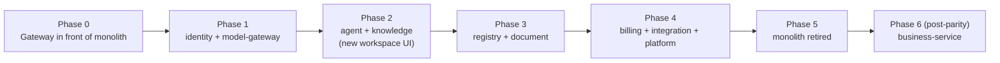
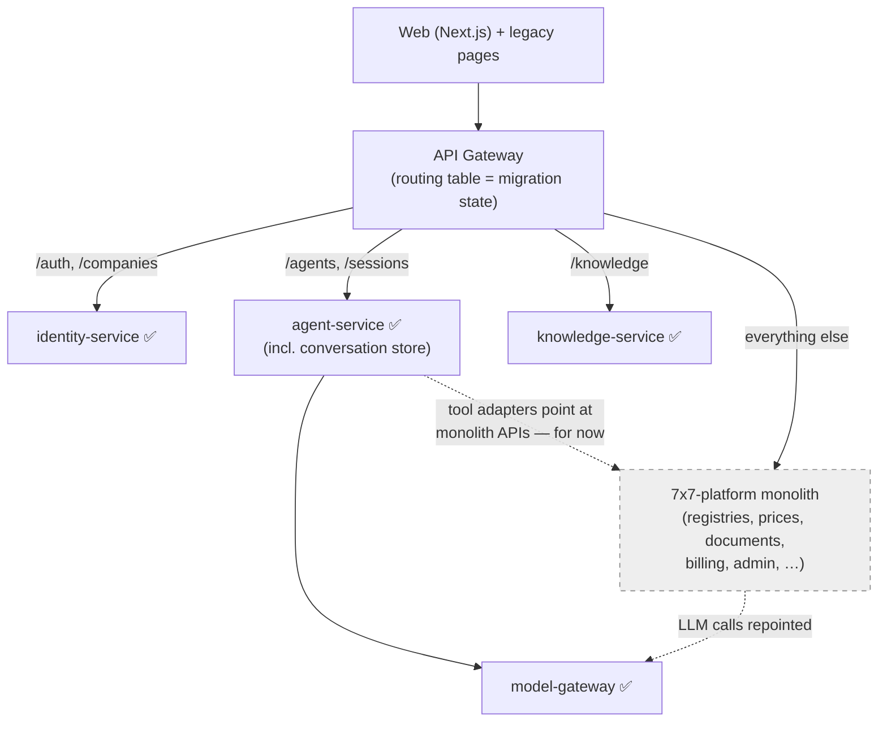

# 05 — Миграция: плюсове и минуси

Честна оценка на преминаването от монолита `7x7-platform` (Node.js/Express, PM2,
един Postgres, ръчно изграден агентски цикъл, многостраничен frontend с vanilla JS) към целевата
архитектура (FastAPI микросървиси + gateway, LangGraph агенти, Next.js).

## 1. Какво всъщност променяме

Това **не е една миграция, а четири**, и всяка носи свои разходи и ползи:

| Измерение | От | Към |
|---|---|---|
| Форма на deployment | Модулен монолит (3 PM2 процеса) | 10 услуги зад gateway (11 с post-parity business-service) |
| Backend език/runtime | Node.js + Express | Python + FastAPI |
| Agent runtime | Ръчно изграден Anthropic tool loop (2516 LOC `chat.js`) | LangGraph графи с checkpoint-нати interrupts |
| Frontend | 27 статични HTML страници + vanilla JS (4205 LOC `ai-chat.js`) | Next.js + TypeScript + генериран API client |

Струва си да се каже ясно, че има и достоверна алтернатива: да запазим монолита,
да рефакторираме `chat.js` и `registries/routes.js`, и да добавим LangGraph чрез Python sidecar.
Причините тази алтернатива да губи са описани в "Защо все пак да мигрираме" (§4), но
минусите по-долу са реални и трябва да бъдат включени в сметката.

## 2. Плюсове

### Архитектура и мащабиране

- **Една входна точка с реални граници.** Днес редът на mount-ване на route-ове в `server.js` е
  критичен за работата, а admin/tenant/webhook concerns са преплетени в едно Express приложение. Gateway +
  router-и по услуги прави security surface-а одитируем: едно място проверява JWTs, едно
  място прави rate limiting, а услугите изобщо не са достъпни отвън.
- **Независимо мащабиране на горещите пътища.** Chat/LLM traffic (agent-service, model-gateway) има
  съвсем различен профил на натоварване от registry CRUD или file sync. В монолита всичко
  споделя 2 cluster workers; един тежък Drive sync или Puppeteer render се конкурира с
  latency на чата. Услугите се мащабират независимо и crash в PDF rendering не може да свали
  login.
- **Database-per-service прекратява скритото свързване.** ~80-те `core.*` таблици на монолита са
  един общ blast radius: всеки модул може да join-ва всяка таблица, и одитите го показват
  (registry routes четат price tables, workspace чете всичко). Явните HTTP/event contracts
  правят зависимостите видими и тестируеми.
- **Изолация на откази при background work.** Монолитът вече научи този урок наполовина
  (sync-worker беше отделен, защото Drive sync изтощаваше другите jobs); целевата
  архитектура довършва идеята — всяка услуга притежава своите queues.

### Agent platform (основният продуктов залог)

- **LangGraph заменя ~3 000 реда bespoke orchestration** (`chat.js`,
  `streamHandler.js`, `toolDispatch.js`) с поддържан framework: graph composition,
  state checkpointing, retries, streaming и sub-graphs идват готови.
- **Устойчив human-in-the-loop.** Днешното approval за write-tool е пауза в stream-а — при
  паднала SSE връзка pending action се губи. LangGraph interrupts checkpoint-ват към
  Postgres: approvals преживяват reconnects, restarts и дори могат по-късно да бъдат одобрени
  от друго устройство или канал.
- **Multi-agent става папка, не fork.** Монолитът има точно един global orchestrator;
  добавянето на специализиран агент означава още branches вътре в `chat.js`. Manifest-driven
  registry ([03-agent-platform.md](./03-agent-platform.md)) прави новите agents и tools
  additive — изричното extensibility requirement за тази система.
- **Python е мястото, където живее AI екосистемата.** LangGraph, evaluation tooling, parsers и
  повечето provider SDKs са Python-first. Монолитът вече се удари в тази стена (без framework,
  всичко ръчно изградено).

### Multi-frontend стратегия

- **Channel adapters стават тривиални.** Понеже *всички* clients говорят с един и същ gateway API
  и agents декларират `channels:` в manifest-ите си, Telegram bot е ~200-редов adapter,
  не нова интеграция във вътрешностите на Express. Монолитът днес няма път към това
  (Telegram е само за ops-alerts; Viber е catalog placeholder).
- **Typed contract между FE и BE.** OpenAPI-generated TypeScript clients премахват
  тихото разминаване, което 63 ръчно писани JS файла натрупват спрямо недокументирани routes.

### Качество и операции

- **Metering проблемът се решава структурно.** Token accounting днес е bookkeeping по callsite;
  model-gateway излъчва usage events за всеки call по самата си конструкция — billing
  не може да бъде заобиколен от забравен callsite.
- **Чисто отделяне от одитирания dead weight.** Миграцията е естественият момент да отпаднат
  7Blocks платформата (нула installs), Dev Studio, legacy billing и другите елементи в
  [04 §4](./04-functional-coverage.md) — приблизително една четвърт от surface-а на монолита.
- **Познати anti-patterns се поправят по дизайн**: дългият transaction lock в Drive sync
  (`TECH_DEBT.md` open item), 14-те дублирани rate-limiter handlers, monster files
  (`chat.js` 2516 LOC, `registries/routes.js` 2507 LOC, `ai-chat.js` 4205 LOC).
- **Тестова изолация по услуги.** Нетестваните високорискови области на монолита (payments има
  нула директни тестове според `CODE_QUALITY_REPORT.md`) се пренаписват зад малки, mockable
  ports с disposable-DB tests.

## 3. Минуси

### Цена и график

- **Пълен rewrite, не refactor.** ~110K LOC, 177 migrations, 571 tests и значителна
  domain subtlety (semantics на registry locking, KSS Excel round-trips, Bulgarian-language
  prompts, настройвани през версии v20–v24, Stripe edge cases). Очаквайте месеци работа преди
  feature parity, през които монолитът все още трябва да се поддържа — период на двойно
  счетоводство.
- **Два стека по време на прехода.** Node.js умения/код остават нужни, докато Python
  услугите влизат в употреба. Ако екипът е малък (commit history подсказва, че е), context
  switching между Express *и* FastAPI *и* Next.js е реален разход.
- **Frontend rewrite-ът тихо е най-големият line item.** 27 страници, 63 JS файла,
  ~2 244 i18n keys, admin SPA и силно stateful chat UI (streaming, approval cards,
  attachments, block-less workspace). Нищо от това не е reusable as-is в React.

### Оперативна сложност

- **10 услуги все още са много moving parts за един екип.** Всяка има нужда от CI, migrations,
  health checks, dashboards, version compatibility. PM2 + един Postgres е наистина прост
  за operate-ване; новата система изисква дисциплинирана observability (tracing през hops),
  само за да debug-ва това, което днес един stack trace показва. *Mitigations:* catalog-ът вече
  е слял границите, които не се изплащат (conversations в agent-service;
  notifications/support/audit/settings в един platform-service — виж
  [02 § Deliberately merged](./02-service-catalog.md#deliberately-merged-boundaries)), а
  услугите могат първоначално да се co-deploy-ват по няколко в container и да се разделят по-късно
  (boundaries са първо code boundaries, второ deployment boundaries).
- **Distributed-systems failure modes идват от първия ден.** Partial failures, retries,
  idempotency, eventual consistency между billing events и chat, network timeouts
  между agent tools и domain services. Монолитът няма тези проблеми — in-process calls
  не fail-ват наполовина.
- **Latency tax върху agent tools.** Всеки tool call, който е бил in-process function + SQL
  query, става HTTP hop (agent → registry-service → DB). При chatty agent loops това
  добавя десетки ms на call; още от началото са нужни connection pooling и разумна tool granularity.

### Данни и риск при cutover

- **Data migration през schema boundaries.** Една база става десет — девет с мигрирани данни,
  плюс net-new schema на business-service. Registry JSONB rows, vector chunks, encrypted
  credentials (AES keys трябва да бъдат re-wrapped или пренесени), Stripe customer/subscription
  state, refresh tokens — всяко изисква migration script и verification pass. Грешки тук се виждат
  от клиенти.
- **Behavioral parity е трудно да се докаже.** Locking/audit/canonical-role поведението на
  registry engine-а и tuned Bulgarian outputs на prompt stack-а нямат executable spec освен
  стария код и неговите 571 tests (които не се port-ват между езици). Фините regressions ще
  изплуват като user reports, не като test failures.
- **Live-tenant cutover.** Реални компании използват това ежедневно. Big-bang switch рискува
  целия бизнес; strangler approach (виж §5) удвоява инфраструктурата за периода.

### Технологичен риск

- **LangGraph е бързо движеща се dependency.** API churn между версии е реален; нужни са pinning
  и upgrade budget. Ръчно изграденият loop, при целия си размер, няма external framework risk.
- **Rewrite second-system risk.** Класическият failure mode: да се rebuild-ват features, които
  никой не е валидирал (собствените одити на монолита показват, че той *вече* е построил няколко
  такива — blocks, dev studio). Functional-coverage документът ([04](./04-functional-coverage.md))
  е guardrail-ът: не се строи нищо, което не е в carried-over таблицата.

## 4. Защо все пак да мигрираме (решаващите аргументи)

1. **Product thesis е agentic.** Differentiator-ът е AI workspace, multi-agent workflows
   и бъдещи chat channels — точно областта, където монолитът е най-слаб (един ръчно изграден
   loop, един global agent, няма durable approvals, JS вместо Python AI ecosystem).
   Refactor-ът на монолита подобрява *старата* архитектура; не купува agent platform.
2. **Multi-frontend е заявено изискване.** Gateway + channel-scoped agent manifests е
   структурният отговор; Express route-mount ordering не е.
3. **Монолитът е в естествена повратна точка.** Собственият му platform review от април 2026
   му дава ~4.9/10; одитите му вече са идентифицирали dead weight-а. Миграция, която
   *премахва* това тегло, е по-евтина от такава, която го port-ва — а екипът вече е платил
   discovery cost-а.
4. **Рискът може да се контролира чрез sequencing** — виж по-долу.

## 5. Risk-reducing migration strategy (strangler, не big-bang)

| Фаза | Какво се доставя | Защо този ред |
|---|---|---|
| **0** | FastAPI gateway proxy-ва *всичко* към монолита без промяна. Next.js shell се вдига и сервира новите auth pages. | Нулев риск: установява single entry point, request IDs, rate limiting и новия domain, без да пипа features |
| **1** | identity-service (JWT issuance се мести; монолитът проверява същите RS256 keys) + model-gateway (`engine.js` на монолита се пренасочва към него). | И двете са leaf concerns с ясни contracts; token metering events започват да текат веднага |
| **2** | agent-service (с conversation store-а си) + knowledge-service; новият Next.js workspace UI. Agent tools викат API-тата на *монолита* за registries/prices/documents чрез adapter clients. | Rebuild-ът с най-висока стойност влиза първи, валидиран срещу реални users, докато long tail остава в монолита |
| **3** | registry-service + document-service; agent tool adapters се обръщат от monolith URLs към новите услуги. Данните се мигрират tenant-by-tenant. | Port-based tool design прави обръщането config change за всеки tool |
| **4** | billing, integration, platform services; останалите monolith pages се заменят в Next.js. | Stripe migration последна — най-опасна е за грешки и печели от вече доказания event pipeline |
| **5** | Монолитът се decommission-ва; bundled-verticals / schematics решенията са изпълнени ([04 §5](./04-functional-coverage.md)). | |
| **6 (post-parity)** | business-service (invoicing, inventory, spendings); registry rows "Фактури" стават typed invoices ([04 §6](./04-functional-coverage.md#6-new-capabilities-beyond-parity-business-service)). | Net-new capability, умишлено строена само след доказан parity — тя никога не се конкурира с migration work |

В средата на миграцията (Phase 2) gateway routing-ът е по path prefix — новите услуги поемат
chat path-а, докато монолитът още обслужва long tail-а, а agent tools достигат данни от монолита
през adapter clients, които по-късно се обръщат към новите услуги с config change:

Правила, които държат strangler-а честен:

- **Gateway притежава routing-а от Phase 0**, така че всяка фаза е routing-table change, не
  client change.
- **Никаква feature work не влиза в монолита** по време на миграцията освен security fixes —
  иначе parity е движеща се цел.
- **Per-tenant cutover с read-back verification** за всяка data migration; старите
  таблици остават read-only (не се drop-ват), докато минат два чисти billing cycles.
- **Parity checklist = carried-over таблицата в [04](./04-functional-coverage.md)**; една
  фаза е готова, когато редовете ѝ са отметнати, не когато кодът "изглежда готов".

## 6. Извод

| | Присъда |
|---|---|
| Да мигрираме ли **agent platform, gateway и frontend**? | **Да — това е продуктът.** Монолитът не може да достави durable multi-agent workflows или multi-channel frontends без rewrite на core-а си така или иначе. |
| Да мигрираме ли към **пълни microservices от ден първи**? | **Не — да convergе-нем към тях.** Приемете service *boundaries* веднага (отделни FastAPI apps, отделни schemas, ports/adapters), но co-deploy-вайте агресивно и разделяйте процеси само когато load или team structure го наложи. |
| Да port-нем ли **всичко**, което прави монолитът? | **Не.** [04 §4](./04-functional-coverage.md) премахва одитирания dead weight (~25% от surface-а) — това намаление е голяма част от ROI на миграцията. |
| Big-bang cutover? | **Никога.** Strangler phases 0–5 по-горе, gateway-first, Stripe last. |
