# 08 — Database Architecture

How data is stored across the platform: the **database-per-service** model, what each
database owns, and — most importantly — how databases that may **never share a table or a
join** still reference each other through *logical* links resolved over HTTP, events, and
denormalized snapshots.

> **Status note.** All services are 📋 planned. The table inventories below are taken from
> each service's *Data owned* section (see [02 — service catalog](./02-service-catalog.md)
> and the per-service READMEs under [services/](./services/README.md)); column-level
> details are the **intended/target** schema and are indicative until the Alembic
> baselines land.

---
## 1. The one rule: database per service

Every service owns exactly one PostgreSQL database. No service connects to another
service's database — there are **no cross-database foreign keys and no cross-database
joins**. The only way to read another service's data is through its public API (sync HTTP
with a service token) or by reacting to its events.

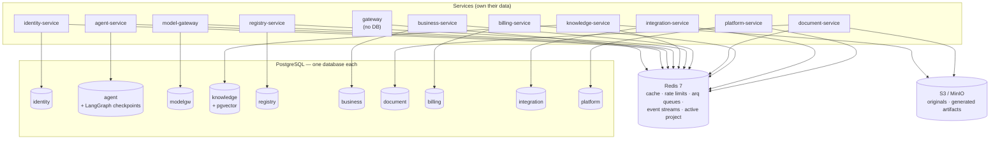

### Why
- **Independent deployability & blast radius** — a schema migration or an outage in one
  database cannot corrupt or block another service.
- **Clear ownership** — one writer per table; everyone else reads through the API.
- **Polyglot persistence where it pays** — `knowledge` runs the `pgvector` extension and
  `agent` hosts LangGraph's checkpoint tables; the rest stay plain relational.

### The cost (and how we pay it)
- No DB-level referential integrity across services → integrity is enforced by the owning
  service and by **idempotent, eventually-consistent** event consumers.
- No joins across services → you either call the owner's API or keep a **denormalized
  snapshot** of the few fields you need (see invoices ↔ counterparties below).

---
## 2. Cross-cutting conventions

These hold for every database unless noted.

| Convention | Detail |
|---|---|
| **Tenant scoping** | Almost every business table carries a `company_id` (the tenant). This is a *logical* reference to `identity.companies.id` — never a SQL FK. Postgres **Row-Level Security (RLS)** policies enforce tenant isolation (called out in the registry/agent checklists). |
| **User reference** | User-owned rows carry `user_id`, a logical reference to `identity.users.id`. |
| **Primary keys** | UUIDs (safe to mint client-side, no cross-service sequence coupling). The exception is **legal invoice numbering**, which uses per-tenant sequence rows for gap-free numbers. |
| **Encryption at rest (field level)** | Secrets are AES-256-GCM encrypted in-column: `identity` external tokens, `modelgw.providers` credentials, `integration.credentials`. |
| **Migrations** | Alembic per service; each service has its own migration history. |
| **Idempotency** | Event-fed tables dedupe on an event/idempotency key (`billing.usage_ledger` by event ID, `billing.stripe_events` by Stripe event ID, notifications by payload dedupe key). |
| **Object storage** | Large binaries never live in Postgres — originals and generated artifacts go to S3/MinIO; the database stores keys/metadata only. |

---
## 3. Database catalog

| Database | Owning service | Port | Extensions / notable | Stores |
|---|---|---|---|---|
| `identity` | identity-service | 8010 | RS256 keypair (JWKS) | users, companies, memberships, tokens |
| `agent` | agent-service | 8020 | LangGraph checkpoint tables | sessions, messages, memory, skills, traces |
| `modelgw` | model-gateway | 8030 | AES-GCM credentials | providers, model configs, kill switch |
| `knowledge` | knowledge-service | 8040 | **pgvector** | documents, chunks+embeddings, facts, sync state |
| `registry` | registry-service | 8050 | JSONB rows, RLS | dynamic registries, templates, audit |
| `document` | document-service | 8060 | JSONB templates | templates, price list, margins |
| `billing` | billing-service | 8070 | append-only ledger | balances, usage ledger, Stripe data |
| `integration` | integration-service | 8080 | AES-GCM credentials | connections, credentials vault, email log |
| `platform` | platform-service | 8090 | — | notifications, support, audit sink, settings |
| `business` | business-service | 8100 | per-tenant sequences | invoices, inventory, expenses |
| — | gateway | 8000 | **no database** | (Redis only: rate limits, JWKS cache) |

---
## 4. Per-database schemas

Each diagram shows the **intra-database** relationships (real FKs inside that DB). Columns
suffixed with `_ref` or annotated *"logical → …"* are cross-service references that are
**not** SQL foreign keys (resolved per §5).

### 4.1 `identity` — users, tenants, trust

Source of truth that every other database's `company_id` / `user_id` ultimately points at.

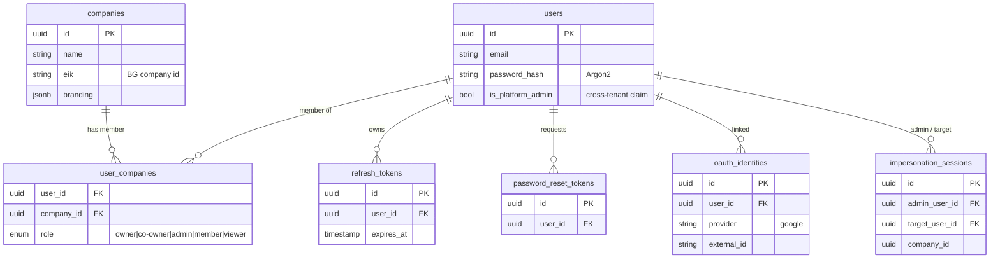

`user_companies` is the membership/role join that powers the `X-Roles` header and all
tenant authorization (see [01 §6](./01-architecture-overview.md#6-identity-tenancy-and-authorization)).

### 4.2 `agent` — conversations & agent runtime

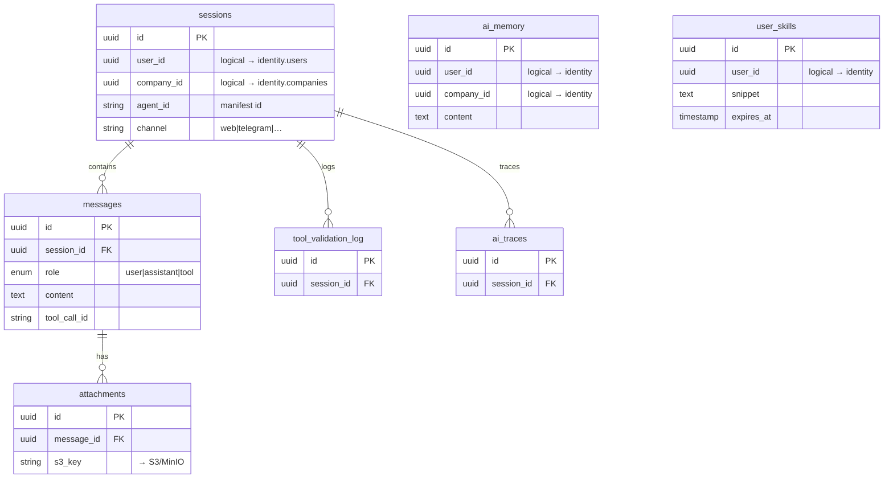

Plus **LangGraph checkpoint tables** (managed by the Postgres checkpointer) keyed by a
thread id aligned with `sessions` — these store interrupt/resume state for write-approval
pauses.

### 4.3 `modelgw` — provider registry

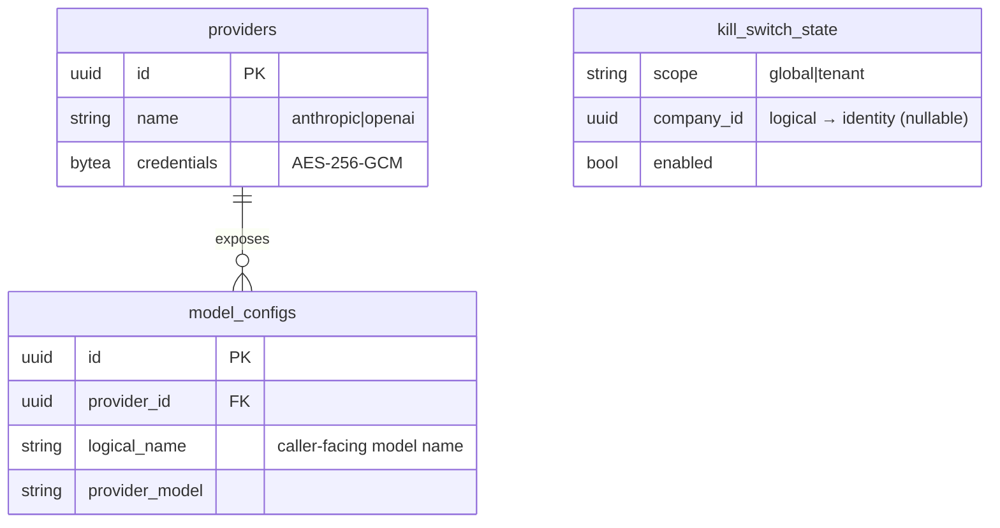

### 4.4 `knowledge` — library, vectors, sync

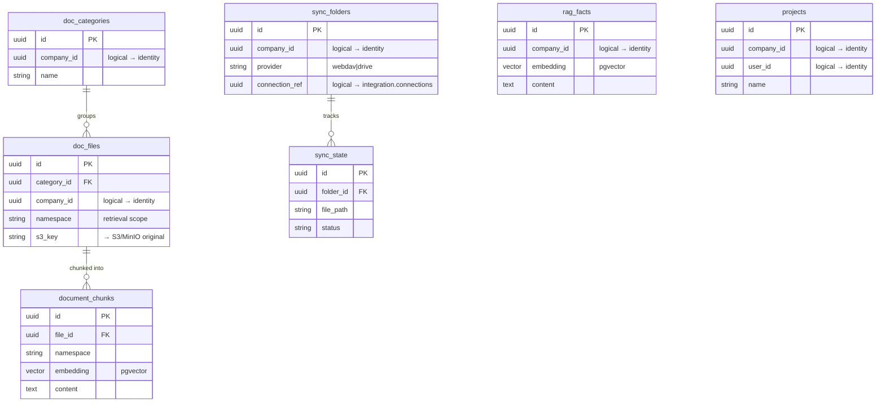

The active project per user is cached in **Redis**, not stored here.

### 4.5 `registry` — dynamic tables

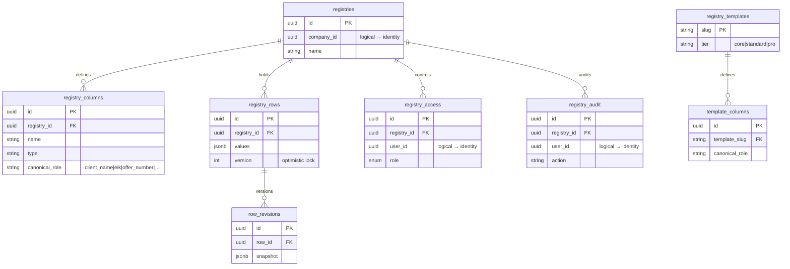

**Canonical column roles** are the semantic glue that lets other services (and agents)
find e.g. a counterparty by `client_name`/`eik` across differently-named tenant tables.

### 4.6 `document` — templates, price list, margins

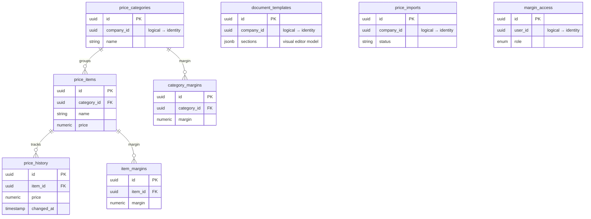

### 4.7 `billing` — token economy & payments

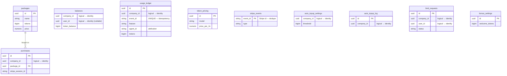

`usage_ledger` is **append-only** and keyed by the `token.usage` event ID so at-least-once
delivery never double-bills.

### 4.8 `integration` — connections & credential vault

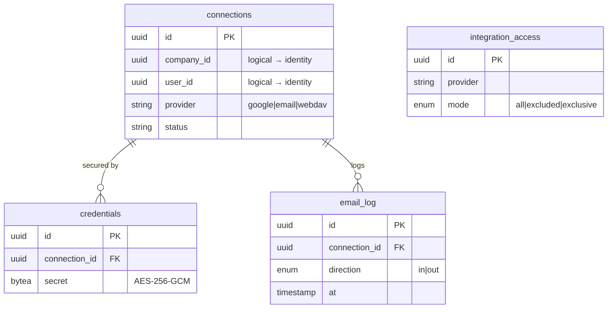

`connections` rows are the target of `knowledge.sync_folders.connection_ref`.

### 4.9 `platform` — notifications, support, audit, settings

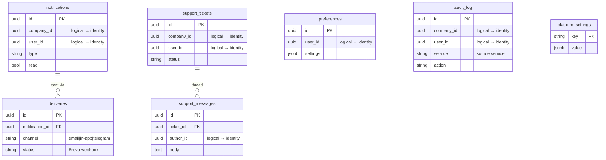

`audit_log` is the **central sink** — every service writes here indirectly by publishing
`audit.event`; rows reference users/companies/actions across all services logically.

### 4.10 `business` — invoicing, inventory, spendings

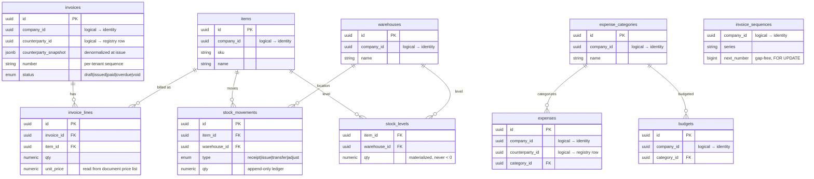

`invoices.counterparty_snapshot` is the key denormalization: a legal document must not
change when the counterparty's registry row is later edited.

---
## 5. Connections between databases

Because there are no cross-database FKs, every inter-database "connection" is a **logical
reference** resolved at runtime by one of three mechanisms:

| Mechanism | When used | Consistency | Example |
|---|---|---|---|
| **Sync HTTP** (service token) | Need fresh data right now | Strong (read-through) | business → registry counterparty lookup; business → document price reads |
| **Event (Redis Streams)** | React to a fact; decouple producers | Eventual, at-least-once | `tenant.created` → registry seeds + billing bonus; `token.usage` → billing ledger |
| **Denormalized snapshot** | Value must be frozen / hot path | Point-in-time copy | invoice counterparty snapshot; `X-Roles` claims copied into the JWT |

### 5.1 Logical reference map

Solid = synchronous HTTP read; dashed = event-driven write/seed; every `company_id` /
`user_id` column is an implicit reference to `identity` (drawn as the central hub).

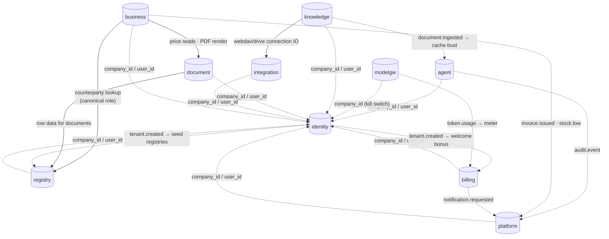

> The gateway has no database; it injects the verified `X-User-Id` / `X-Company-Id` /
> `X-Roles` headers that let every service *use* `identity` references without calling
> `identity` on the hot path.

### 5.2 Notable cross-database links explained

| From (DB.column) | To (DB.table) | How resolved | Notes |
|---|---|---|---|
| *every* `*.company_id` | `identity.companies` | header/JWT claim (no call) | tenant scoping; RLS enforced locally |
| *every* `*.user_id` | `identity.users` | header/JWT claim (no call) | row ownership |
| `business.invoices.counterparty_id` | `registry.registry_rows` | sync HTTP + **snapshot** | snapshot frozen at issue for legal immutability |
| `business.expenses.counterparty_id` | `registry.registry_rows` | sync HTTP | supplier linkage |
| `business.invoice_lines.unit_price` | `document.price_items` | sync HTTP | prices live in document-service |
| `knowledge.sync_folders.connection_ref` | `integration.connections` | sync HTTP | sync engine uses integration's file IO |
| `billing.usage_ledger.{feature,agent_id}` | model-gateway call metadata | **event** `token.usage` | attribution carried in event payload |
| `registry` system registries | `identity.companies` | **event** `tenant.created` | seeded on tenant creation |
| `billing.balances` welcome bonus | `identity.companies` | **event** `tenant.created` | initial token grant |
| `agent` context cache | `knowledge` | **event** `document.ingested` | invalidate stale retrieval cache |
| `platform.audit_log` | all services | **event** `audit.event` | central audit sink |
| `platform.notifications` | all services | **event** `notification.requested` | central delivery |

---
## 6. Shared infrastructure (not per-service databases)

### 6.1 Redis 7
One logical Redis, used by many services but with **non-overlapping key namespaces** — it
is infrastructure, not a shared database.

| User | What it stores in Redis |
|---|---|
| gateway | rate-limit buckets, JWKS cache |
| identity | token-cleanup queue |
| agent | event streams, retention queues |
| model-gateway | balance-check queue, `token.usage` outbox flush |
| knowledge | embed/sync queues, **active project per user** |
| registry | event consumption |
| business | sweep queues |
| document | import queue |
| billing | top-up/rollup queues |
| integration | health-check queue |
| platform | email send queue |
| *all* | **event bus** (Redis Streams topics + consumer groups) |

Durability: AOF persistence (+ a replica in production); billing-critical events also use a
**transactional outbox** in the producing service so a Redis outage delays but never loses
them (see [01 §7](./01-architecture-overview.md#7-asynchronous-work-and-events)).

### 6.2 S3 / MinIO
Binary blobs that never belong in Postgres:

| Owner | Objects | DB pointer |
|---|---|---|
| knowledge-service | uploaded document originals | `doc_files.s3_key` |
| agent-service | chat attachments | `attachments.s3_key` |
| document-service | generated PDFs/XLSX/DOCX artifacts | returned as signed URLs |

---
## 7. See also

- [01 §6 — Identity, tenancy, authorization](./01-architecture-overview.md#6-identity-tenancy-and-authorization)
- [01 §7 — Asynchronous work and events](./01-architecture-overview.md#7-asynchronous-work-and-events)
- [02 — Service catalog](./02-service-catalog.md) (per-service *Data owned*)
- [06 — Architectural patterns](./06-architectural-patterns.md) (database-per-service, events, outbox)
- [07 §4 — Infrastructure dependency graph](./07-dependency-graphs.md#4-infrastructure-dependency-graph)
- Per-service detail: [services/](./services/README.md)
