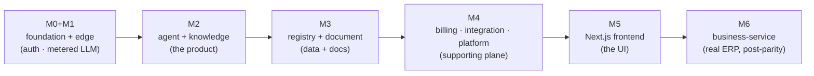

# Обяснителни документи — „какво получавате“ за всеки етап

Ръководства на ясен език, които обясняват за всеки етап от изграждането от нулата **какво
платформата реално може да прави, след като бъде реализирана, и как работи** — за хората,
които се включват в проекта, и за бъдещи AI изпълнения. Те са четимото допълнение към
формалните спецификации в `docs/` и поетапните планове за изграждане в `plans/`.

Всеки документ следва една и съща структура: резултат в едно изречение → какво съществува
(конкретно) → мисловен модел → как работи (с диаграми) → идеи, които си струва да се усвоят
→ защо този ред → как ще разберете, че работи → какво НЕ Е.

## Етапите

| Документ | Етап | Какво получавате |
|---|---|---|
| [`m0-m1-what-you-get.md`](./m0-m1-what-you-get.md) | M0 + M1 | Основа (uv monorepo, `x7-common`, infra, CI) + първи работещ вертикален срез: gateway + identity-service + model-gateway. Login → JWT → измерено LLM извикване. |
| [`m2-what-you-get.md`](./m2-what-you-get.md) | M2 | AI работното пространство: agent-service (LangGraph чат, инструменти, прекъсвания за одобрение) + knowledge-service (ingest + RAG търсене). |
| [`m3-what-you-get.md`](./m3-what-you-get.md) | M3 | Структурирани данни + документи: registry-service (динамични таблици, канонични роли) + document-service (шаблони, PDF/Excel, цени, KSS). |
| [`m4-what-you-get.md`](./m4-what-you-get.md) | M4 | Поддържащият слой: billing-service (токени + Stripe), integration-service (Google/email/WebDAV), platform-service (известия/поддръжка/одит/настройки). |
| [`m5-what-you-get.md`](./m5-what-you-get.md) | M5 | Уеб приложението: едно Next.js приложение (tenant `/` + `/admin`), генериран TS клиент, чат работно пространство със SSE + карти за одобрение. |
| [`m6-what-you-get.md`](./m6-what-you-get.md) | M6 | Истински ERP (след parity, net-new): business-service — типизирано фактуриране, складова книга, разходи. |

## Как етапите се надграждат

## Къде се вписват сред останалите документи

- **`docs/01`–`docs/08`** — авторитетната архитектурна спецификация (преглед, каталог на
  услугите, agent platform, функционално покритие, patterns, графи на зависимости, дизайн на
  базата данни).
- **`docs/services/*/README.md`** — договори и checklists за всяка услуга.
- **`docs/libs/common/README.md`** — договорът на споделеното ядро `x7-common`.
- **`plans/`** — изпълнимите поетапни планове за изграждане (с псевдокод).
- **`docs/explanation/`** (тази папка) — повествователният слой „защо и какво получавате“.

> Източникът на истината за *какво трябва да се изгради* е `docs/` + `plans/`. Тези
> обяснителни документи са ориентационният слой; ако някога се разминават със спецификациите,
> спецификациите печелят.
