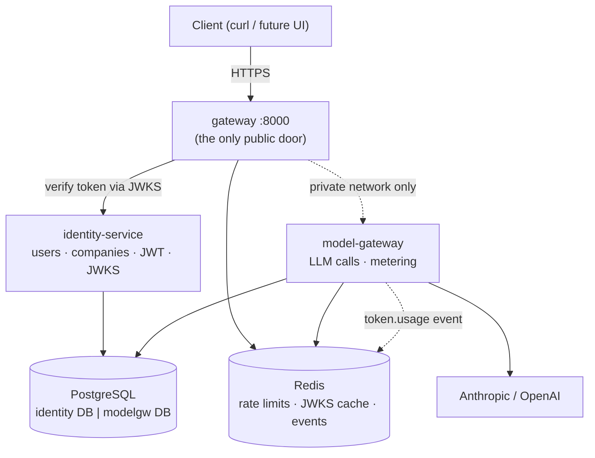
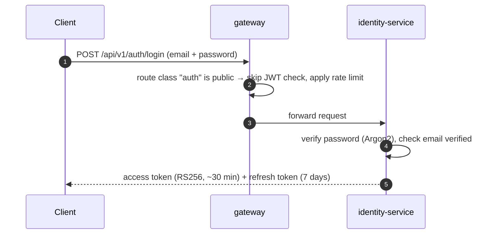
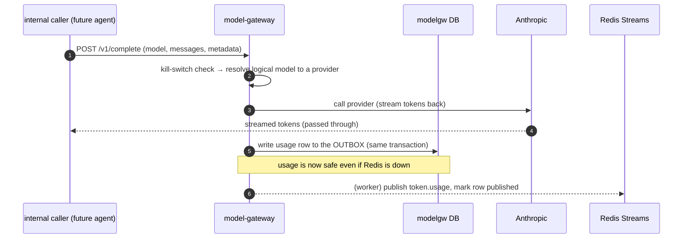

# Какво получавате след етапи 0 и 1 — и как работи

> Обяснение на ясен език към `plans/m0_m1_foundation_and_edge.md`. Прочетете това, за да
> разберете *какво платформата реално може да прави*, след като тези два етапа са изградени,
> *защо* частите са оформени по този начин и *как една заявка преминава* през тях от край до край.

---

## 1. Резултатът в едно изречение

След етапи 0 и 1 имате **работещ backend скелет с истинска входна врата**: потребител може да
се регистрира и да влезе през един публичен gateway, да получи подписан token, а този token
отключва измерено извикване към голям езиков модел — като всяко LLM извикване вече се отчита
за бъдещо таксуване, въпреки че billing-service още не съществува.

Нищо потребителско не е „завършено“ (още няма чат, регистри или UI). Това, което *е*
завършено, е **основата, върху която ще стъпи всяка бъдеща функция**: споделената инфраструктура,
моделът за сигурност, начинът, по който услугите говорят помежду си, и доказателството, че
всичко работи заедно с едно `docker compose up`.

---

## 2. Какво съществува, когато приключите (конкретно)

| Можете да… | Благодарение на… |
|---|---|
| Стартирате целия backend с една команда | infra `docker-compose` (Postgres + Redis + MinIO) + 3 services |
| Регистрирате компания + собственик, потвърдите email, влезете | **identity-service** |
| Получите access token + refresh token (RS256) | **identity-service** JWT издаване |
| Достигате всеки endpoint през **един** публичен URL (`:8000`) | **gateway** |
| Накарате gateway да отхвърля подправени/неавтентикирани заявки | gateway JWT проверка + премахване на headers |
| Направите streaming LLM completion | **model-gateway** |
| Видите всяко LLM извикване записано за бъдещо таксуване | model-gateway **transactional outbox** + `token.usage` event |
| Добавите нова услуга чрез копиране на папка | **service-template** + `x7-common` |
| Пускате lint + type-check + tests при всяка промяна | **CI** |

Работят три услуги, но само **една** от тях (gateway, port `8000`) е достъпна отвън.
identity-service и model-gateway живеят в частна мрежа — не можете да ги извикате директно,
което е целият смисъл на модела за сигурност.

---

## 3. Мисловният модел: тънка врата, големи стаи, споделена инфраструктура

Мислете за платформата като за сграда:

- **gateway е входната врата и охраната.** Той умишлено е „прост“ — проверява документа ви,
  поставя гривна и ви насочва към правилната стая. Никога не върши реална бизнес работа. Ако
  падне, го заменяте евтино, защото не държи данни.
- **Всяка услуга е стая със собствен заключен шкаф.** identity-service притежава базата
  `identity`; model-gateway притежава `modelgw`. **Никоя стая не може да отвори шкафа на друга
  стая** — ако й трябва информация, трябва да *попита* стаята собственик през HTTP или да
  *слуша* за съобщения (events). Това е правилото database-per-service и то спира бъркотията в
  една услуга да се превърне в проблем за всички.
- **`x7-common` са споделените комунални системи на сградата** — окабеляване, водопровод,
  пожароизвестяване. Всяка стая е построена по един и същ стандарт, така че всички се стартират,
  логват, автентикират и emit-ват events по еднакъв начин. Ключово: там няма **никаква бизнес
  логика** — то никога не знае какво е invoice или agent. Това е чиста инфраструктура.



---

## 4. Как реално преминава една заявка

### 4.1 Влизане (ръкостискането на доверието)



Access token е **подписано твърдение**: „това е user X, член на companies A и B с тези roles.“
То е подписано с private RS256 key на identity-service. Всеки може да го провери със съответния
public key, който identity-service публикува на добре познат URL (`/.well-known/jwks.json`).
Това е JWKS — публичен keyring.

### 4.2 Всяка автентикирана заявка след това

```mermaid
sequenceDiagram
    autonumber
    participant C as Client
    participant GW as gateway
    participant S as any service
    C->>GW: request + "Bearer <token>" + X-Company-Id
    GW->>GW: verify token signature against cached JWKS (no call to identity!)
    GW->>GW: confirm you belong to that company; STRIP any client-sent identity headers
    GW->>S: forward + trusted X-User-Id / X-Company-Id / X-Roles / X-Request-Id
    S->>S: extract identity from headers, apply role checks, query its own DB
    S-->>C: response
```

Две идеи правят това сигурно и бързо:

1. **gateway проверява token; услугите вярват на gateway.** Downstream услугите не проверяват
   JWT повторно — те четат проверените headers, които gateway е добавил. gateway *премахва*
   всички identity headers, които клиентът се опитва да промъкне, така че не можете да се
   представите за друг user, като сами зададете `X-User-Id`.
2. **Проверката не изисква телефонно обаждане.** gateway кешира public keys на identity-service,
   така че проверява tokens локално. identity-service може за кратко да е недостъпен, а
   съществуващите users продължават да работят — засегнати биха били само *новите logins*.

### 4.3 Измерено LLM извикване



Умната част е **измерване, което не може да се заобиколи**. Понеже *всяко* LLM извикване в
цялата платформа трябва да мине през model-gateway, а model-gateway записва usage като вграден
страничен ефект, бъдеща функционалност няма как да „забрави“ да таксува. И понеже usage се
записва в database **outbox** в същата transaction като извикването, срив в Redis може да
*забави* таксуването, но не може да го *загуби*. billing-service (който се изгражда много
по-късно, в M4) просто ще чете тези `token.usage` events и ще ги сумира — а понеже всеки event
има unique ID, не може да таксува двойно дори ако event бъде доставен два пъти.

---

## 5. Четирите идеи, които си струва да усвоите

Това са проектните решения, които всичко по-късно наследява. Ако ги разберете сега, ще си
спестите объркване във всеки следващ етап.

### 5.1 Database-per-service
Всяка услуга притежава една база данни и е *единственият* writer към нея. Трябват ви данни от
друга услуга? Питайте през HTTP или реагирайте на нейните events — никога не влизайте директно в
нейните tables. **Защо е важно:** в стария monolith всеки module можеше да join-ва всяка table,
така че всяка промяна беше риск за цялата платформа. Тук всяка зависимост е явен, видим contract.

### 5.2 Hexagonal layering (ports & adapters)
Вътре във всяка услуга слоевете сочат в една посока: `routes → services → ports ← adapters`.

- `routes/` = HTTP layer (тънък; валидира и делегира).
- `services/` = реалната бизнес логика, която познава само **ports** (interfaces).
- `adapters/` = единственото място, където се появяват database driver, SDK или URL към друга услуга.
- `deps.py` = единственият „табло за свързване“, където adapters се включват към ports.

**Защо е важно:** смяната на LLM provider, database или downstream service е *един нов adapter
+ един wiring ред* — бизнес логиката не се променя. Затова и database driver, импортиран
където и да е извън `adapters/`, е провал на review.

### 5.3 gateway е тънък нарочно
Той прави routing, auth, rate limiting и streaming passthrough — и *нищо друго*. Няма бизнес
логика, няма комбиниране на данни от няколко услуги. Ако client има нужда от комбиниран изглед,
услугата, която притежава тези данни, го излага. **Защо е важно:** вратата остава проста, бърза
и лесна за репликиране; бизнес сложността остава в стаите, където й е мястото.

### 5.4 Два начина за разговор: попитай сега или обяви
- **Synchronous HTTP**, когато ви трябва отговор *веднага* (gateway пита identity за login).
- **Events** (Redis Streams), когато *обявявате факт*, който може да интересува други
  (`tenant.created`, `token.usage`). Обявяващият не знае и не го интересува кой слуша.

**Защо е важно:** identity-service публикува „създаден е нов tenant“, без да знае, че по-късно
registry-service ще създаде starter tables, а billing ще даде welcome bonus. Нови listeners се
закачат, без да се пипа обявяващият — системата расте без прекабеляване.

---

## 6. Защо този ред? (M0, после тези три услуги)

- **M0 първо**, защото shared kernel и service-template са основата, от която се строи всяка
  услуга. Ако объркате инфраструктурата, плащате за това единадесет пъти.
- **identity-service** след това, защото създава и подписва tokens, които *всичко останало
  проверява*. Нищо не може да бъде защитено, преди тя да съществува.
- **model-gateway**, защото зависи от почти нищо (само identity, за internal trust) и доказва
  LLM + metering пътя рано.
- **gateway** ги връзва заедно и ви дава единната публична входна точка, с която да тествате
  целия срез от край до край.

Тези три бяха избрани като първи срез точно защото имат *най-малко* зависимости помежду си —
така първото нещо, което debug-вате, няма заплетена мрежа зад себе си.

---

## 7. Как ще разберете, че работи (exit test)

Една scripted проверка доказва етапа:

```bash
docker compose up --build

# 1. Register + log in through the public door
curl -X POST localhost:8000/api/v1/auth/register \
  -d '{"email":"a@b.co","password":"pw","company_name":"Acme"}'
TOKEN=$(curl -s -X POST localhost:8000/api/v1/auth/login \
  -d '{"email":"a@b.co","password":"pw"}' | jq -r .access_token)

# 2. The gateway verifies the token and injects trusted identity
curl localhost:8000/api/v1/users/me -H "Authorization: Bearer $TOKEN"

# 3. A streamed LLM completion runs and is metered
#    → a row appears in modelgw.usage_outbox and a token.usage event is published
```

Ако и трите стъпки минат, основата, моделът за сигурност, доверието между услуги и metering
pipeline са доказани — и всеки следващ етап (agent workspace, registries, billing, UI) се
включва в същата рамка.

---

## 8. Какво това НЕ Е (за да са правилни очакванията)

- **Още няма chat agent.** model-gateway може да complete-не prompt, но LangGraph agent runtime,
  tools и approval flow идват в Milestone 2.
- **Още няма UI.** Всичко се упражнява през `curl`/tests; Next.js app е Milestone 5.
- **Още няма реално billing.** Usage се *записва* (outbox + events), но услугата, която таксува,
  идва в Milestone 4. Contract-ът е на място; consumer-ът още не е.
- **Няма registries, documents, knowledge base или integrations.** Те са следващи етапи, всеки
  от които е просто още една „стая“, копирана от същия `service-template`.

Доставената стойност тук е **лост**: след M0+M1 всяка нова capability е добавъчна и бърза,
защото трудните, хоризонтални решения вече са взети и доказани.

---

## 9. Registry-service на прост език

Най-лесно е да мислите за него така:

- `registry-service` е **engine за динамични таблици** за tenant-specific бизнес данни.
- Tenant може да дефинира registry (columns + types), да съхранява rows, да задава access rules
  и да пази audit/revision trail, без да кара engineers да добавят нови SQL tables.
- Това е мястото за данни, когато формата е гъвкава и специфична за бизнеса.

### Какъв проблем решава

Различните компании следят различни неща и наричат полетата по различен начин. „Project
Tracker“ на един tenant е „Deals Pipeline“ на друг. Ако hardcode-нем всяка вариация като
backend code, доставяме бавно и създаваме schema chaos.

`registry-service` централизира тази гъвкавост:

- Създаване на registry definitions по време на runtime
- Съхраняване на rows като dynamic values (JSONB)
- Добавяне на row-level history/revisions
- Налагане на registry access matrix
- Еднакъв export/query през API
- Seed-ване на default registries от templates при `tenant.created`

### Конкретен пример A: добър случай за registry-service

**Сценарий**: tenant иска custom sales tracker.

- Registry: `Deals`
- Columns: `stage`, `client_name`, `expected_value`, `next_followup_at`, `owner`
- По-късно добавя `referral_source` и `probability` без backend migration.

Това е идеално за `registry-service`, защото:

- schema е tenant-defined и се променя често
- грешките са бизнес-бъркотия, не юридическа невалидност
- agent tools пак могат да го използват, защото canonical roles мапват semantics
  (например `client_name`, `eik`, `offer_number`), дори display labels да се различават

### Конкретен пример B: НЕ е registry, трябва да е business-service

**Сценарий**: издаване на законови фактури.

Фактурите изискват строги invariants:

- законова номерация без пропуски за всеки tenant
- коректна VAT math
- immutable issued records
- валидни state transitions (`draft -> issued -> paid/overdue/void`)

Това са твърди правила, не гъвкаво проследяване. Затова invoices принадлежат в
`business-service`, не в `registry-service`.

### Правилото за границата (използвайте го всеки път)

- Ако грешните данни са предимно **разхвърляни/оперативни**, вероятно са registry.
- Ако грешните данни са **незаконни/финансово грешни**, те принадлежат в typed domain service
  (`business-service`, по-късно и части от `document-service`).

Тази граница е причината архитектурата да пази и двете услуги: `registry-service` за
гъвкавост, `business-service` за строга финансова/юридическа коректност.

---

## Вижте също
- `plans/m0_m1_foundation_and_edge.md` — поетапният build plan с псевдокод.
- `docs/01-architecture-overview.md` — пълната target architecture (§5 gateway, §6 identity, §7 events).
- `docs/02-service-catalog.md` — отговорностите на всяка услуга и call matrix.
- `docs/06-architectural-patterns.md` — логиката зад всеки named pattern.
- `docs/08-database-architecture.md` — database-per-service и схемите `identity`/`modelgw`.
- `docs/libs/common/README.md` — договорът на shared kernel `x7-common`.
