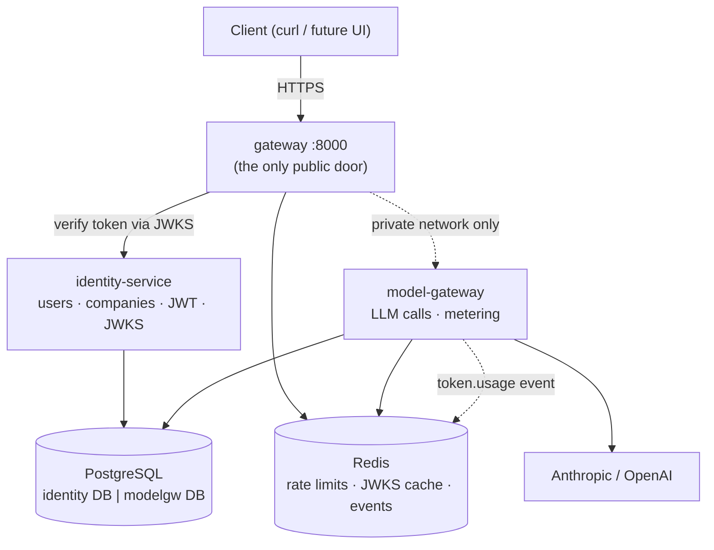
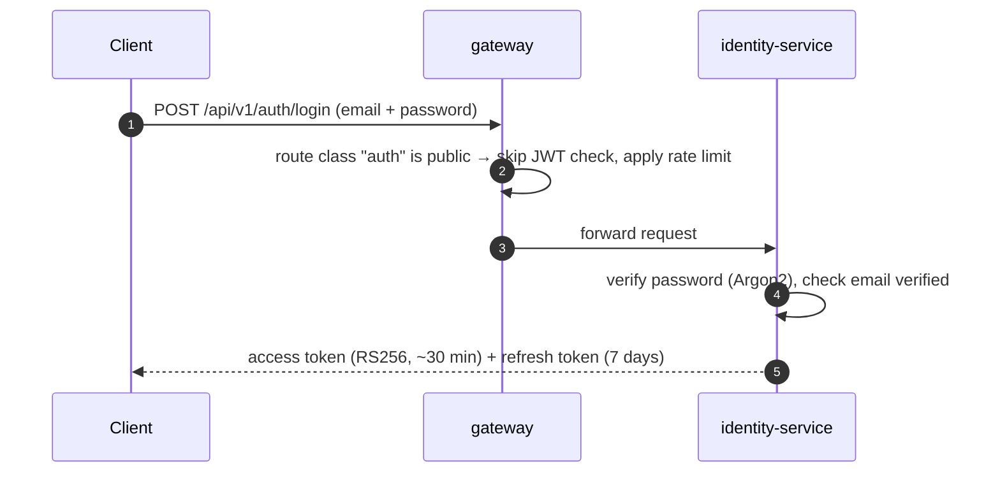
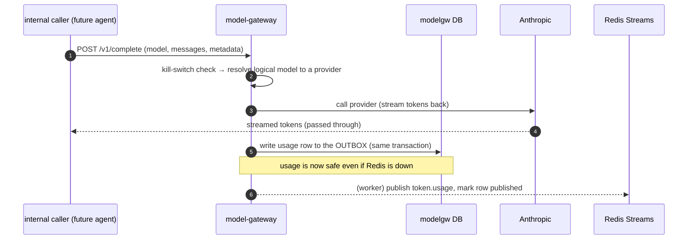

# What you get after Milestones 0 & 1 — and how it works

> A plain-language companion to `plans/m0_m1_foundation_and_edge.md`. Read this to understand
> *what the platform can actually do* once these two milestones are built, *why* the pieces
> are shaped the way they are, and *how a request flows* through them end to end.

---
## 1. The one-sentence outcome

After Milestone 0 and 1 you have a **running backend skeleton with a real front door**: a
user can register and log in through a single public gateway, receive a signed token, and
that token unlocks a metered call to a large language model — with every LLM call already
counted for billing, even though the billing service doesn't exist yet.

Nothing user-facing is "finished" (there's no chat, no registries, no UI yet). What *is*
finished is the **foundation every future feature stands on**: the shared plumbing, the
security model, the way services talk to each other, and the proof that all of it works
together on one `docker compose up`.

---
## 2. What exists when you're done (concretely)

| You can… | Because of… |
|---|---|
| Boot the whole backend with one command | infra `docker-compose` (Postgres + Redis + MinIO) + 3 services |
| Register a company + owner, verify email, log in | **identity-service** |
| Get an access token + refresh token (RS256) | **identity-service** JWT issuance |
| Hit any endpoint through **one** public URL (`:8000`) | **gateway** |
| Have the gateway reject forged/unauthenticated requests | gateway JWT verification + header stripping |
| Make a streaming LLM completion | **model-gateway** |
| See every LLM call recorded for future billing | model-gateway **transactional outbox** + `token.usage` event |
| Add a new service by copying a folder | **service-template** + `x7-common` |
| Run lint + type-check + tests on every change | **CI** |

Three services run, but only **one** of them (the gateway, port `8000`) is reachable from
outside. identity-service and model-gateway live on a private network — you cannot call them
directly, which is the entire point of the security model.

---
## 3. The mental model: a thin door, fat rooms, shared plumbing

Think of the platform as a building:

- **The gateway is the front door and the security desk.** It's deliberately "dumb" — it
  checks your ID, stamps your wristband, and points you to the right room. It never does any
  actual business work. If it falls over, you replace it cheaply because it holds no data.
- **Each service is a room with its own locked filing cabinet.** identity-service owns the
  `identity` database; model-gateway owns `modelgw`. **No room can open another room's
  cabinet** — if it needs information, it has to *ask* the owning room over HTTP, or *listen*
  for announcements (events). This is the database-per-service rule, and it's what keeps one
  service's mess from becoming everyone's problem.
- **`x7-common` is the building's shared utilities** — wiring, plumbing, fire alarms. Every
  room is built with the same electrical standard so they all boot, log, authenticate, and
  emit events identically. Crucially, it contains **no business logic** — it never knows what
  an invoice or an agent is. It's pure infrastructure.



---
## 4. How a request actually flows

### 4.1 Logging in (the trust handshake)



The access token is a **signed statement**: "this is user X, a member of companies A and B
with these roles." It's signed with identity-service's private RS256 key. Anyone can verify
it using the matching public key, which identity-service publishes at a well-known URL
(`/.well-known/jwks.json`). That's the JWKS — a public keyring.

### 4.2 Every authenticated request afterward

```mermaid
sequenceDiagram
    autonumber
    participant C as Client
    participant GW as gateway
    participant S as any service
    C->>GW: request + "Bearer <token>" + X-Company-Id
    GW->>GW: verify token signature against cached JWKS (no call to identity!)
    GW->>GW: confirm you belong to that company; STRIP any client-sent identity headers
    GW->>S: forward + trusted X-User-Id / X-Company-Id / X-Roles / X-Request-Id
    S->>S: extract identity from headers, apply role checks, query its own DB
    S-->>C: response
```

Two ideas make this secure and fast:

1. **The gateway verifies the token; services trust the gateway.** Downstream services
   don't re-check the JWT — they read the verified headers the gateway injected. The gateway
   *strips* any identity headers a client tries to sneak in, so you can't forge your way to
   another user by setting `X-User-Id` yourself.
2. **Verification needs no phone call.** The gateway caches identity-service's public keys, so
   it verifies tokens locally. identity-service can be briefly down and existing users keep
   working — only *new logins* would be affected.

### 4.3 Making a metered LLM call



The clever part is **metering you cannot bypass**. Because *every* LLM call in the whole
platform must go through model-gateway, and model-gateway records usage as a built-in side
effect, there's no way for a future feature to "forget" to bill. And because usage is written
to a database **outbox** in the same transaction as the call, a Redis outage can *delay*
billing but can never *lose* it. The billing service (built much later, in M4) will simply
read these `token.usage` events and tally them up — and because each event has a unique ID,
it can never double-charge even if an event is delivered twice.

---
## 5. The four ideas worth internalizing

These are the design decisions that everything later inherits. Understanding them now saves
confusion in every future milestone.

### 5.1 Database-per-service
Each service owns one database and is the *only* writer to it. Need another service's data?
Ask over HTTP or react to its events — never reach into its tables. **Why it matters:** in the
old monolith any module could join any table, so every change was a platform-wide risk. Here
every dependency is an explicit, visible contract.

### 5.2 Hexagonal layering (ports & adapters)
Inside each service the layers point one way: `routes → services → ports ← adapters`.

- `routes/` = the HTTP layer (thin; validate and delegate).
- `services/` = the actual business logic, which only knows **ports** (interfaces).
- `adapters/` = the only place a database driver, an SDK, or another service's URL appears.
- `deps.py` = the single "wiring panel" where adapters are plugged into ports.

**Why it matters:** swapping the LLM provider, the database, or a downstream service is *one
new adapter + one wiring line* — the business logic never changes. It's also why a database
driver imported anywhere outside `adapters/` is a review failure.

### 5.3 The gateway is thin on purpose
It does routing, auth, rate limiting, and streaming passthrough — and *nothing else*. No
business logic, no combining data from multiple services. If a client needs a combined view,
the service that owns that data exposes it. **Why it matters:** the door stays simple, fast,
and easy to replicate; business complexity stays in the rooms where it belongs.

### 5.4 Two ways to talk: ask now, or announce
- **Synchronous HTTP** when you need an answer *right now* (gateway asking identity to log in).
- **Events** (Redis Streams) when you're *announcing a fact* others may care about
  (`tenant.created`, `token.usage`). The announcer doesn't know or care who's listening.

**Why it matters:** identity-service publishes "a new tenant was created" without knowing that
later the registry service will seed starter tables and billing will grant a welcome bonus.
New listeners attach without touching the announcer — the system grows without rewiring.

---
## 6. Why this order? (M0 then these three services)

- **M0 first** because the shared kernel and the service-template are what every service is
  built from. Get the plumbing wrong and you pay for it eleven times.
- **identity-service** next because it mints and signs the tokens *everything else verifies*.
  Nothing can be secured until it exists.
- **model-gateway** because it depends on almost nothing (just identity, for internal trust)
  and proves the LLM + metering path early.
- **gateway** ties them together and gives you the single public entry point to test the whole
  slice end to end.

These three were chosen as the first slice precisely because they have the *fewest*
dependencies on each other — so the first thing you debug has no tangled web behind it.

---
## 7. How you'll know it works (the exit test)

A single scripted check proves the milestone:

```bash
docker compose up --build

# 1. Register + log in through the public door
curl -X POST localhost:8000/api/v1/auth/register \
  -d '{"email":"a@b.co","password":"pw","company_name":"Acme"}'
TOKEN=$(curl -s -X POST localhost:8000/api/v1/auth/login \
  -d '{"email":"a@b.co","password":"pw"}' | jq -r .access_token)

# 2. The gateway verifies the token and injects trusted identity
curl localhost:8000/api/v1/users/me -H "Authorization: Bearer $TOKEN"

# 3. A streamed LLM completion runs and is metered
#    → a row appears in modelgw.usage_outbox and a token.usage event is published
```

If all three steps pass, the foundation, the security model, the service-to-service trust,
and the metering pipeline are all proven — and every later milestone (the agent workspace,
registries, billing, the UI) plugs into this exact frame.

---
## 8. What this is NOT (so expectations are right)

- **No chat agent yet.** The model-gateway can complete a prompt, but the LangGraph agent
  runtime, tools, and approval flow come in Milestone 2.
- **No UI yet.** Everything is exercised via `curl`/tests; the Next.js app is Milestone 5.
- **No real billing yet.** Usage is *recorded* (the outbox + events), but the service that
  charges for it arrives in Milestone 4. The contract is in place; the consumer isn't.
- **No registries, documents, knowledge base, or integrations.** Those are later milestones,
  each of which is just another "room" copied from the same `service-template`.

The value delivered here is **leverage**: after M0+M1 every new capability is additive and
fast, because the hard, cross-cutting decisions are already made and proven.

---
## 9. Registry-service in plain English

This is the easiest way to think about it:

- `registry-service` is a **dynamic tables engine** for tenant-specific business data.
- A tenant can define a registry (columns + types), store rows, set access rules, and keep an
  audit/revision trail, without asking engineers to add new SQL tables.
- It is where data lives when the shape is flexible and business-specific.

### What problem it solves

Different companies track different things and rename fields differently. One tenant's
\"Project Tracker\" is another tenant's \"Deals Pipeline\". If we hardcode each variation as
backend code, we ship slowly and create schema chaos.

`registry-service` centralizes that flexibility:

- Create registry definitions at runtime
- Store rows as dynamic values (JSONB)
- Add row-level history/revisions
- Enforce registry access matrix
- Export/query consistently via API
- Seed default registries from templates on `tenant.created`

### Concrete example A: good fit for registry-service

**Scenario**: A tenant wants a custom sales tracker.

- Registry: `Deals`
- Columns: `stage`, `client_name`, `expected_value`, `next_followup_at`, `owner`
- They later add `referral_source` and `probability` without a backend migration.

This is perfect for `registry-service` because:

- schema is tenant-defined and evolves often
- mistakes are business-messy, not legally invalid
- agent tools can still use it because canonical roles map semantics
  (for example `client_name`, `eik`, `offer_number`) even if display labels differ

### Concrete example B: NOT a registry, should be business-service

**Scenario**: issuing legal invoices.

Invoices require strict invariants:

- gap-free legal numbering per tenant
- VAT math correctness
- immutable issued records
- valid state transitions (`draft -> issued -> paid/overdue/void`)

Those are hard rules, not flexible tracking. So invoices belong in `business-service`, not in
`registry-service`.

### The boundary rule (use this every time)

- If wrong data is mostly **messy/operational**, it is likely a registry.
- If wrong data is **illegal/financially wrong**, it belongs in a typed domain service
  (`business-service`, later also parts of `document-service`).

That boundary is why the architecture keeps both services: `registry-service` for flexibility,
`business-service` for strict financial/legal correctness.

---
## See also
- `plans/m0_m1_foundation_and_edge.md` — the step-by-step build plan with pseudo-code.
- `docs/01-architecture-overview.md` — the full target architecture (§5 gateway, §6 identity, §7 events).
- `docs/02-service-catalog.md` — every service's responsibilities and the call matrix.
- `docs/06-architectural-patterns.md` — the reasoning behind each named pattern.
- `docs/08-database-architecture.md` — database-per-service and the `identity`/`modelgw` schemas.
- `docs/libs/common/README.md` — the `x7-common` shared-kernel contract.
