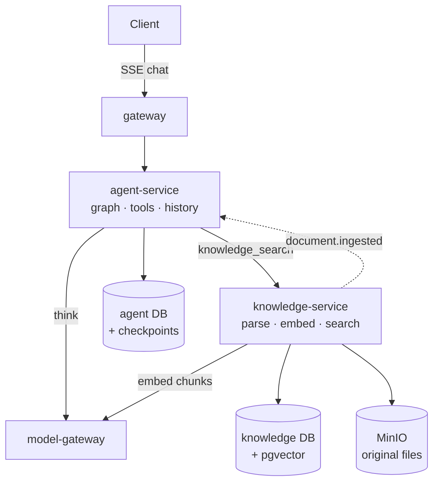
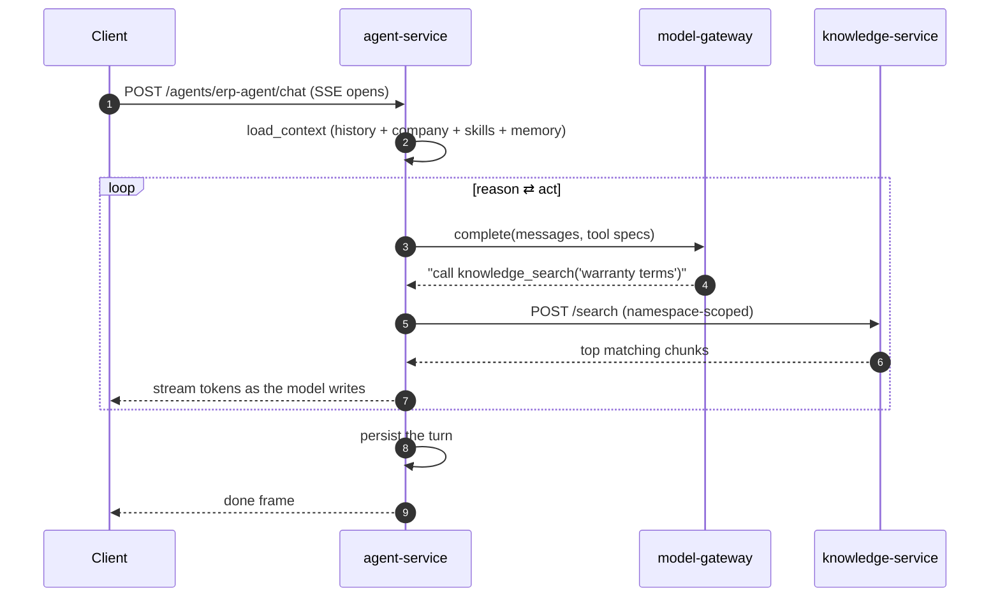
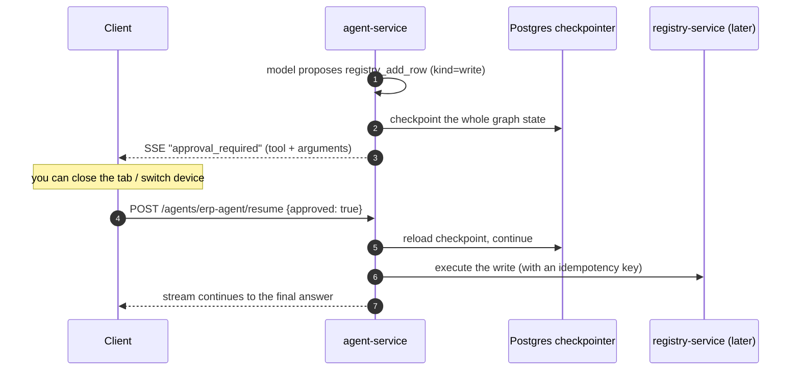
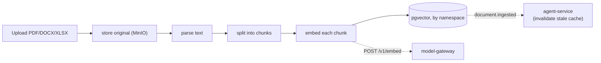

# Какво получавате след етап 2 — AI работното пространство

> Обяснение на ясен език към `plans/` и milestone картата
> (`.cursor/plans/7x7_greenfield_build_e8060d34.plan.md`). Етап 2 изгражда
> **agent-service** и **knowledge-service** — най-ценния вертикален срез, реалния продукт.
> Първо прочетете `m0-m1-what-you-get.md`; това надгражда директно върху онзи срез.

---

## 1. Резултатът в едно изречение

След етап 2 имате **истински AI chat**, който може да чете документите и бизнес данните на
вашата компания, да отговаря grounded в тях и **да предлага промени, които човек трябва да
одобри**, преди да се случат — като всичко се stream-ва live към клиента.

Това е моментът, в който платформата спира да бъде инфраструктура и започва да бъде продукт.
M0/M1 доказа, че raw model call работи; M2 го превръща в agent, който използва tools, има
memory, retrieval и предпазна релса при всеки write.

---

## 2. Какво съществува, когато приключите (конкретно)

| Можете да… | Благодарение на… |
|---|---|
| Водите streaming chat с agent | **agent-service** + SSE (token-by-token) |
| Накарате agent да извиква tools по средата на отговор (първо чете данни, после разсъждава) | ReAct loop в default graph |
| Накарате agent да извлича факти от качените ви docs | **knowledge-service** `/search` + tool-ът `knowledge_search` |
| Качвате PDFs/DOCX/XLSX и те да се индексират за search | knowledge-service ingest pipeline (parse → chunk → embed) |
| Получавате карта „одобрявате ли това действие?“ преди всеки write | human-in-the-loop **interrupt** при tools с `kind="write"` |
| Възобновите paused chat след затваряне на tab | Postgres **checkpointer** + `POST /agents/{id}/resume` |
| Добавите съвсем нов agent, като пуснете folder | manifest discovery (`app/agents/<id>/manifest.yaml`) |
| Пазите conversation history за всеки user/agent | module-ът `conversations/` в agent DB |

Първият доставен agent е `erp-agent` (общият бизнес асистент), с първите tools:
`knowledge_search` (read), `registry_query` (read) и `registry_add_row` (write — за да видите
approval flow от край до край).

---

## 3. Мисловният модел: две нови стаи

- **agent-service е мозъкът и разговорът.** Той изпълнява agent „graph“ (мислете за flowchart,
  през който AI минава), пази chat history в собствената си база, говори с model-gateway, за да
  мисли, и извиква tools, за да действа. Това е **единствената услуга, която се разклонява**
  към всичко останало — защото tools трябва да докосват всичко.
- **knowledge-service е търсимата памет на компанията.** Качвате documents; той ги parse-ва,
  нарязва ги на chunks, превръща всеки chunk във vector (числов отпечатък на meaning) чрез
  model-gateway и ги съхранява, за да може agent по-късно да попита „какво знаем за X?“ и да
  получи релевантните passages.

---

## 4. Как работи

### 4.1 Grounded chat turn (ReAct loop)

Agent **разсъждава, действа, наблюдава, повтаря** — може да прочете registry, да търси в
documents и после да състави отговор, всичко в един turn. Read tools се изпълняват автоматично;
model никога не вижда tool, който не му е изрично разрешен в manifest (allow-list е security
boundary).

### 4.2 Write изисква вашето одобрение (durable interrupt)

Ключовата идея: **AI не може да промени нищо без човешко „да“.** И понеже paused state се
записва в Postgres (не се държи в memory), approval оцелява при disconnect, server restart или
преминаване от web към phone. Write носи и idempotency key, така че дори системата да retry-не,
действието се случва точно веднъж.

### 4.3 Documents стават търсими

**namespace** е просто именувана кофа със знание (напр. `library`, `offers-kb`). Manifest-ът на
agent изброява кои namespaces може да търси, така че различните agents могат да имат различно
knowledge.

---

## 5. Идеите, които си струва да усвоите

- **Extensibility by convention.** Нов agent е folder + `manifest.yaml`; нов tool е един module
  + един ред в catalog, след което agents opt in през manifest. Няма промени в core code. Това е
  същият plugin pattern, използван по-късно за integration adapters.
- **manifest е contract, не code.** Model, allowed tools, knowledge namespaces и channels са
  *data*, които можете да редактирате и review-вате — не са скрити в logic.
- **Write = interrupt, by construction.** Tool, маркиран като `write`, винаги спира за approval;
  авторът на tool не може да го заобиколи с хитър prompt. Safety е structural.
- **Conversation history е module, не service.** Тя стои вътре в agent-service зад
  `ConversationStore` port, защото history reads/writes се случват на всеки turn — network hop
  там би бил чист latency tax. Port го държи евтино за отделяне по-късно, ако някога потрябва.
- **Agent никога не докосва базата на друга услуга.** Той извлича през `/search` API на
  knowledge-service и действа чрез tool HTTP calls — никога чрез влизане директно в tables.

---

## 6. Защо този етап идва тук

Agent platform е ядрото на стойността на продукта, затова се изгражда възможно най-рано, щом
основата позволява — веднага след като M1 му дава работещ model-gateway (за мислене) и identity
(за да знае кой пита). knowledge-service се доставя заедно с него, защото agent без retrieval не
може да отговаря grounded на бизнес въпроси. Structured-data tools (registries, documents) тук
са stubbed/minimal и получават реалните си backends в M3.

---

## 7. Как ще разберете, че работи (exit test)

> Реален chat turn, който извлича grounded context **и** предлага одобрен write.

1. Качете document в namespace; потвърдете, че се chunk-ва и embed-ва.
2. Попитайте `erp-agent` въпрос, чийто отговор е в този document → agent извиква
   `knowledge_search` и отговаря с използване на retrieved passages.
3. Помолете го да добави row към registry → stream-ът спира с `approval_required`; одобрявате →
   write се изпълнява и отговорът завършва.
4. Затворете tab по време на approval и го отворете пак → pending approval още е там.

---

## 8. Какво това НЕ Е (за да са правилни очакванията)

- **Registries и documents още не са напълно реални.** `registry_query`/`registry_add_row`
  работят срещу ранен registry-service; богатият registry engine, templates, pricing и document
  generation идват в **Milestone 3**.
- **Още няма billing enforcement.** Agent прави stub за pre-flight balance check, но
  billing-service, който реално следи balances, идва в **Milestone 4**. (Metering events от M1
  вече текат.)
- **Още няма integrations (email/Drive/WebDAV).** Тези tools и file-sync engines се свързват в
  **Milestone 4**, когато integration-service съществува.
- **Още няма UI.** Упражнява се през `curl`/tests; chat workspace UI е **Milestone 5**.

---

## Вижте също
- `docs/explanation/m0-m1-what-you-get.md` — основата, върху която това надгражда.
- `docs/03-agent-platform.md` — пълният design за agent/tool/graph и рецептата „add an agent“.
- `docs/services/agent-service/README.md`, `docs/services/knowledge-service/README.md`.
- `docs/01-architecture-overview.md` §key flows 1–3 (chat turn, approval, ingestion).
