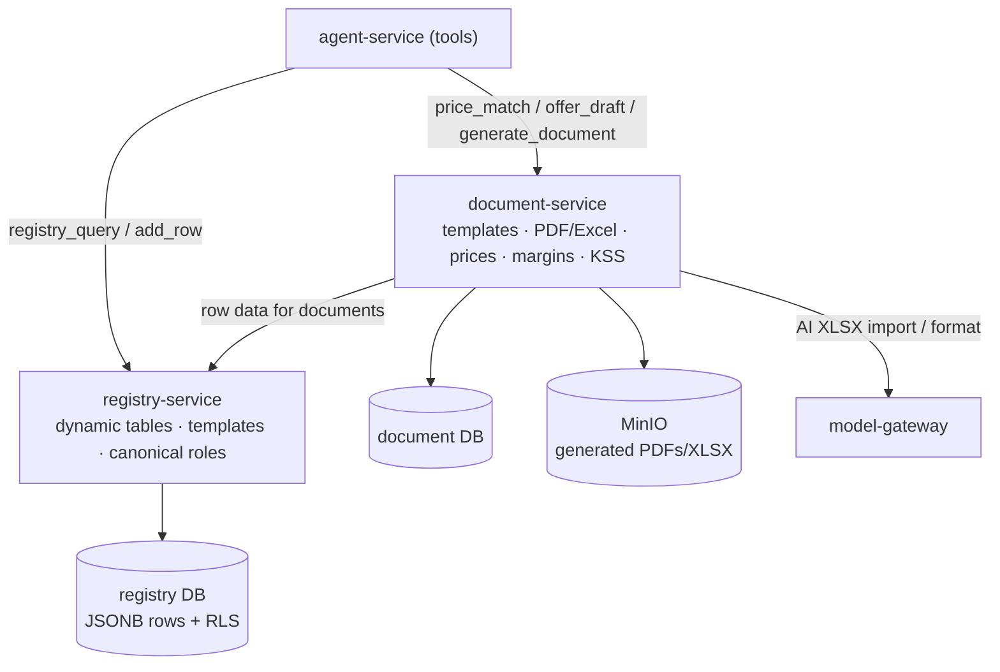
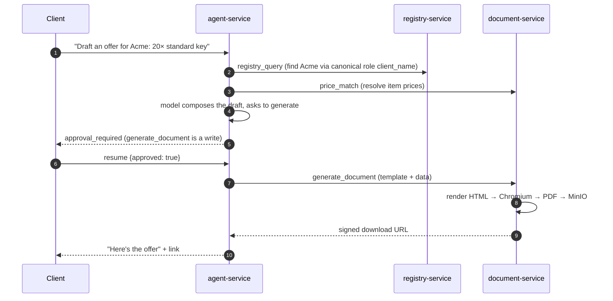

# Какво получавате след етап 3 — структурирани данни + документи

> Обяснение на ясен език към milestone картата
> (`.cursor/plans/7x7_greenfield_build_e8060d34.plan.md`). Етап 3 изгражда
> **registry-service** (гръбнака за structured data) и **document-service** (templates,
> PDF/Excel, pricing, margins, KSS), след което насочва tools на agent към тях реално.

---

## 1. Резултатът в едно изречение

След етап 3 вашият agent може **да работи с реални бизнес данни и да създава реални документи**:
да query-ва и update-ва tenant-defined registries (CRM, contracts, assets, tasks…), да match-ва
prices, да draft-ва offers и да generate-ва PDFs/Excel — всичко през същия approve-before-write
flow.

M2 ви даде умен chat, който можеше да *говори за* данните ви. M3 му дава реални ръце:
structured tables, които чете/пише, и document engine, от който генерира.

---

## 2. Какво съществува, когато приключите (конкретно)

| Можете да… | Благодарение на… |
|---|---|
| Създавате custom tables (registries) с typed columns | **registry-service** |
| Съхранявате/query-вате/update-вате rows с безопасни concurrent edits | registry rows (JSONB) + optimistic locking |
| Контролирате кой може да вижда/edit-ва всеки registry; виждате audit trail + revisions | access matrix + audit + `row_revisions` |
| Получавате starter registries автоматично при създаване на компания | template install при `tenant.created` |
| Накарате agents да намират field по *meaning* в различно именувани tables | **canonical column roles** (`client_name`, `eik`, …) |
| Поддържате master price list с history и AI-assisted import | **document-service** prices |
| Генерирате branded PDF/Excel/Word от template + data | document-service render (headless Chromium) |
| Draft-вате offer / попълвате KSS cost sheet | offer + KSS endpoints + agent tools |
| Export-вате всеки registry към XLSX | registry export |

Agent tools, които тук са добавени/превключени към реални backends: `registry_query`,
`registry_add_row`, `registry_update_row`, `price_match`, `offer_draft`, `generate_document`
(write), `kss_*`.

---

## 3. Мисловният модел: още две стаи, с ясна граница

- **registry-service е вашият engine „направи си сам таблици“.** Всеки tenant дефинира какво
  следи (columns + types); rows се съхраняват гъвкаво (JSONB), но с реални backend контроли:
  permissions, audit history, versioning, export. Това е Airtable-like гъвкавост с enterprise
  guardrails.
- **document-service превръща данни в документи.** Visual templates, PDF rendering (изолирано в
  собствена услуга, за да не задушава тежкият Chromium rendering нищо друго), Excel/Word
  generation, плюс **price list и margins**, които захранват offers и KSS.

Ключовото design правило (ще го използвате постоянно):

> Ако грешните данни са просто **разхвърляни** → това е **registry**.
> Ако грешните данни са **незаконни или финансово грешни** → принадлежат в typed service
> (business-service, M6). Pricing/margins живеят в document-service, защото задачата им е да
> захранват offers и KSS.

---

## 4. Как работи

### 4.1 Как registry съхранява данни (schema vs rows)

Registries разделят **definition** от **data**:

- `registry_columns` = schema (column `key`, `label`, `type`, optional `canonical_role`).
- `registry_rows.values` = реалният row, съхранен като JSONB, keyed by column.
- `version` на всеки row = optimistic locking, така че две едновременни edits не могат тихо да
  се презапишат една друга (на втората се казва „row се промени, прочети го отново“).

**Canonical roles** са умната част: tenant A нарича колона „Клиент“, а tenant B я нарича
"Customer", но и двамата я tag-ват с canonical role `client_name`. Тогава agent tool намира
client field семантично, независимо от labels на tenant.

### 4.2 Agent генерира document

### 4.3 Tenant onboarding seed-ва registries

Когато identity-service публикува `tenant.created` (още в M1), registry-service сега
**реагира** на него: инсталира system registries (work pipeline „Работен регистър“, invoices
„Фактури“, personal/office tasks) от templates — така нова компания започва с полезни tables,
а не с празен лист. Обявяващият (identity) все още не знае нищо за registries; listener-ът
върши работата.

---

## 5. Идеите, които си струва да усвоите

- **Schema-as-data.** Tenants променят data model по време на runtime (добавят column) без
  database migration и без deploy — защото columns са rows в `registry_columns`, не SQL DDL.
- **Defense-in-depth tenancy (RLS).** Освен че всяка query е tenant-scoped в code, Postgres
  Row-Level Security го налага още веднъж в database — забравен filter връща нищо, вместо да
  leaked-не данни на друг tenant.
- **Canonical roles са семантичното лепило.** Те позволяват agents, document generation и
  (по-късно) business-service да resolve-ват „the client“ / „the EIK“ / „the offer number“ при
  tenants, които са кръстили columns различно.
- **Pricing живее при documents, не при money.** То е тук, защото целта му е да захранва
  offers/KSS; financial/legal invariants (invoices) идват по-късно в business-service, който
  *чете* тези prices през API.
- **Tasks са просто registries.** Два bespoke task modules от старата система се свиват до
  system registry templates — и безплатно получават audit, revisions, export и access control.

---

## 6. Защо този етап идва тук

Agent в M2 е толкова полезен, колкото са данните и документите, които може да докосва. M3
доставя двата най-големи backends зад tools на agent, така че workspace става наистина
продуктивен. Идва след agent (а не преди), защото tool *contracts* — дефинирани като ports в
M2 — позволяват тези услуги да бъдат изградени и „включени“ чрез rewiring на `deps.py`, без да
се променя agent.

---

## 7. Как ще разберете, че работи (exit test)

1. Създайте registry с няколко typed columns; добавете и update-нете rows; потвърдете, че audit
   trail и нова revision се появяват и че stale-version update се отхвърля.
2. Създайте втора компания → потвърдете, че system registries се auto-seed-ват.
3. Помолете agent да намери client и да draft-не offer → той resolve-ва client по canonical
   role, match-ва prices и (след approval) връща generated PDF link.
4. Export-нете registry към XLSX.

---

## 8. Какво това НЕ Е (за да са правилни очакванията)

- **Още няма реално invoicing/inventory/expenses.** „Фактури“ тук все още е flexible registry;
  typed, legally-numbered invoices са **Milestone 6** (business-service).
- **Още няма billing, email, Drive или WebDAV.** Тези услуги идват в **Milestone 4**.
- **Още няма UI.** Registries, prices и template editor получават своите screens в
  **Milestone 5**; тук всичко е API/agent-driven.

---

## Вижте също
- `docs/explanation/m2-what-you-get.md` — agent, който използва тези backends.
- `docs/services/registry-service/README.md`, `docs/services/document-service/README.md`.
- `docs/08-database-architecture.md` §4.5–4.6 — схемите `registry` и `document`.
- `docs/02-service-catalog.md` — boundary таблицата registry ↔ business-service.
