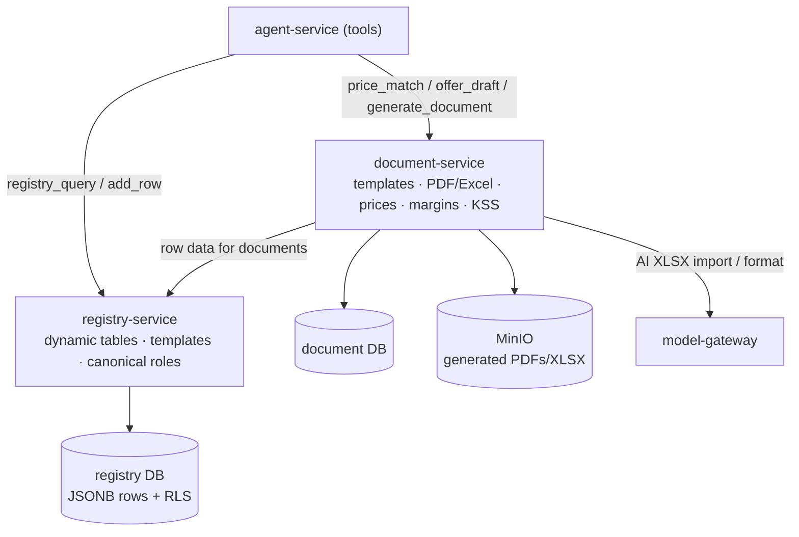
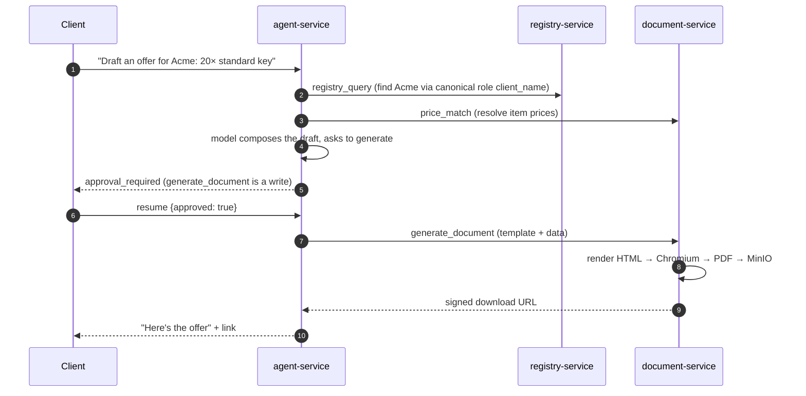

# What you get after Milestone 3 — structured data + documents

> Plain-language companion to the milestone map
> (`.cursor/plans/7x7_greenfield_build_e8060d34.plan.md`). Milestone 3 builds the
> **registry-service** (the structured-data backbone) and the **document-service** (templates,
> PDF/Excel, pricing, margins, KSS), then points the agent's tools at them for real.

---
## 1. The one-sentence outcome

After Milestone 3 your agent can **work with real business data and produce real documents**:
query and update tenant-defined registries (CRM, contracts, assets, tasks…), match prices,
draft offers, and generate PDFs/Excel — all through the same approve-before-write flow.

M2 gave you a clever chat that could *talk about* your data. M3 gives it actual hands: the
structured tables it reads/writes and the document engine it generates from.

---
## 2. What exists when you're done (concretely)

| You can… | Because of… |
|---|---|
| Create custom tables (registries) with typed columns | **registry-service** |
| Store/query/update rows with safe concurrent edits | registry rows (JSONB) + optimistic locking |
| Control who can see/edit each registry; see an audit trail + revisions | access matrix + audit + `row_revisions` |
| Get starter registries automatically when a company is created | template install on `tenant.created` |
| Have agents find a field by *meaning* across differently-named tables | **canonical column roles** (`client_name`, `eik`, …) |
| Keep a master price list with history and AI-assisted import | **document-service** prices |
| Generate a branded PDF/Excel/Word from a template + data | document-service render (headless Chromium) |
| Draft an offer / fill a KSS cost sheet | offer + KSS endpoints + agent tools |
| Export any registry to XLSX | registry export |

Agent tools added/flipped to real backends here: `registry_query`, `registry_add_row`,
`registry_update_row`, `price_match`, `offer_draft`, `generate_document` (write), `kss_*`.

---
## 3. The mental model: two more rooms, with a sharp boundary

- **registry-service is your "build-your-own-tables" engine.** Each tenant defines what they
  track (columns + types); rows are stored flexibly (JSONB) but with real backend controls:
  permissions, audit history, versioning, export. It's Airtable-like flexibility with
  enterprise guardrails.
- **document-service turns data into documents.** Visual templates, PDF rendering (isolated in
  its own service so heavy Chromium rendering never starves anything else), Excel/Word
  generation, plus the **price list and margins** that feed offers and KSS.

The crucial design rule (you'll use it constantly):

> If wrong data is merely **messy** → it's a **registry**.
> If wrong data is **illegal or financially wrong** → it belongs in a typed service
> (business-service, M6). Pricing/margins live in document-service because their job is to
> feed offers and KSS.

---
## 4. How it works

### 4.1 How a registry stores data (schema vs rows)

Registries split **definition** from **data**:

- `registry_columns` = the schema (column `key`, `label`, `type`, optional `canonical_role`).
- `registry_rows.values` = the actual row, stored as JSONB keyed by column.
- `version` on each row = optimistic locking, so two simultaneous edits can't silently
  overwrite each other (the second one is told "the row changed, re-read it").

**Canonical roles** are the clever part: tenant A calls a column "Клиент" and tenant B calls it
"Customer", but both tag it with the canonical role `client_name`. An agent tool then finds the
client field semantically, regardless of the tenant's labels.

### 4.2 An agent generates a document

### 4.3 Tenant onboarding seeds registries

When identity-service published `tenant.created` (back in M1), registry-service now **reacts**
to it: it installs the system registries (work pipeline "Работен регистър", invoices "Фактури",
personal/office tasks) from templates — so a new company starts with useful tables, not a blank
slate. The announcer (identity) still knows nothing about registries; the listener does the work.

---
## 5. The ideas worth internalizing

- **Schema-as-data.** Tenants change their data model at runtime (add a column) with no
  database migration and no deploy — because columns are rows in `registry_columns`, not SQL
  DDL.
- **Defense-in-depth tenancy (RLS).** On top of every query being tenant-scoped in code,
  Postgres Row-Level Security enforces it again at the database — a forgotten filter returns
  nothing instead of leaking another tenant's data.
- **Canonical roles are the semantic glue.** They let agents, document generation, and (later)
  business-service resolve "the client" / "the EIK" / "the offer number" across tenants that
  named their columns differently.
- **Pricing lives with documents, not with money.** It's here because its purpose is feeding
  offers/KSS; the financial/legal invariants (invoices) come later in business-service, which
  *reads* these prices over the API.
- **Tasks are just registries.** Two bespoke task modules from the old system collapse into
  system registry templates — and gain audit, revisions, export, and access control for free.

---
## 6. Why this milestone comes here

The agent in M2 is only as useful as the data and documents it can touch. M3 delivers the two
biggest backends behind the agent's tools, so the workspace becomes genuinely productive. It
comes after the agent (rather than before) because the tool *contracts* — defined as ports in
M2 — let these services be built and "plugged in" by rewiring `deps.py`, without changing the
agent.

---
## 7. How you'll know it works (the exit test)

1. Create a registry with a few typed columns; add and update rows; confirm the audit trail and
   a new revision appear, and that a stale-version update is rejected.
2. Create a second company → confirm the system registries are auto-seeded.
3. Ask the agent to find a client and draft an offer → it resolves the client by canonical role,
   matches prices, and (after approval) returns a generated PDF link.
4. Export a registry to XLSX.

---
## 8. What this is NOT (so expectations are right)

- **No real invoicing/inventory/expenses yet.** "Фактури" is still a flexible registry here;
  typed, legally-numbered invoices are **Milestone 6** (business-service).
- **No billing, email, Drive, or WebDAV yet.** Those services arrive in **Milestone 4**.
- **No UI yet.** Registries, prices, and the template editor get their screens in
  **Milestone 5**; here everything is API/agent-driven.

---
## See also
- `docs/explanation/m2-what-you-get.md` — the agent that uses these backends.
- `docs/services/registry-service/README.md`, `docs/services/document-service/README.md`.
- `docs/08-database-architecture.md` §4.5–4.6 — the `registry` and `document` schemas.
- `docs/02-service-catalog.md` — the registry ↔ business-service boundary table.
