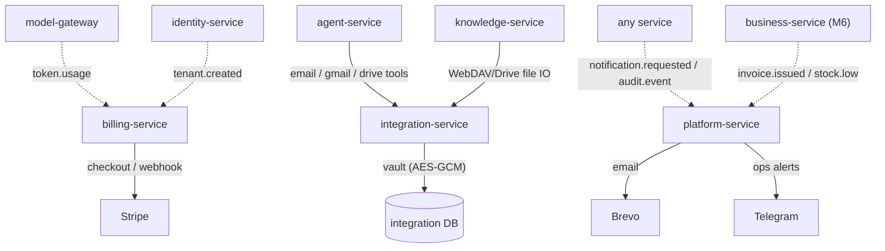
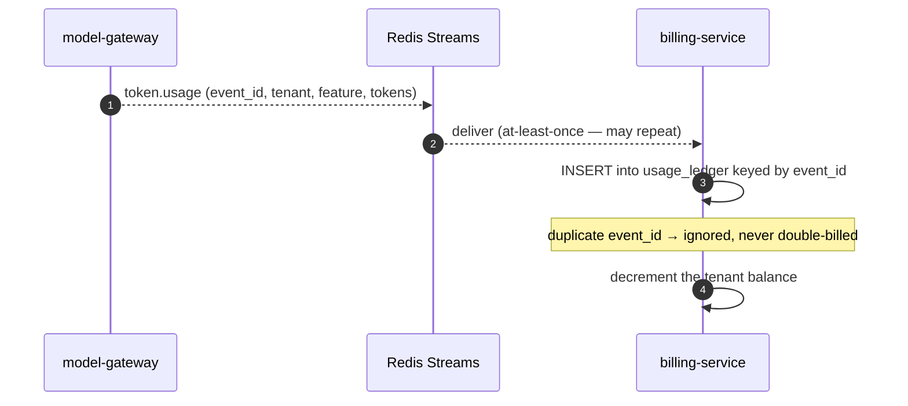
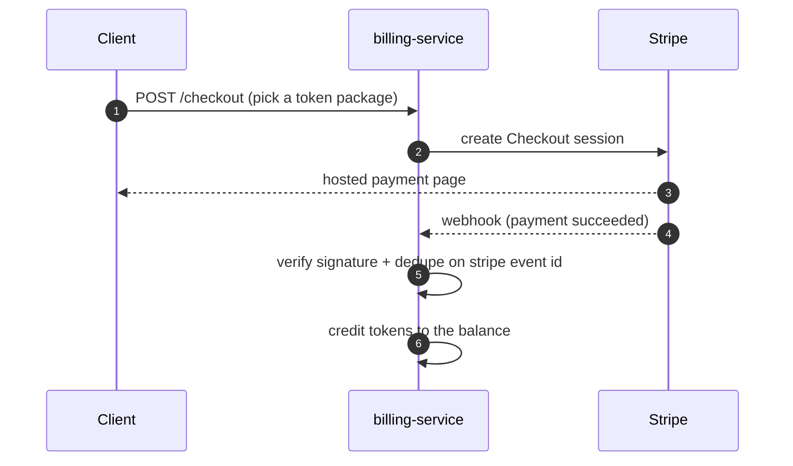

# Какво получавате след етап 4 — billing, integrations, platform plumbing

> Обяснение на ясен език към milestone картата
> (`.cursor/plans/7x7_greenfield_build_e8060d34.plan.md`). Етап 4 завършва
> **supporting plane**: **billing-service** (token economy + Stripe), **integration-service**
> (Google/email/WebDAV connectors) и **platform-service** (notifications, support, audit,
> settings).

---

## 1. Резултатът в едно изречение

След етап 4 платформата може **да таксува себе си и да достига външния свят**: token usage се
измерва в реални balances, customers купуват tokens през Stripe, agent може да чете/изпраща
email и да преглежда Drive/WebDAV, а цялата система изпраща notifications и пази централен
audit trail.

M1–M3 изградиха продукта. M4 го прави управляем като бизнес: пари влизат, външни системи са
свързани, users са информирани, всичко е auditable.

---

## 2. Какво съществува, когато приключите (конкретно)

| Можете да… | Благодарение на… |
|---|---|
| Виждате реален token balance, който намалява, докато AI се използва | **billing-service**, който consume-ва `token.usage` |
| Купувате token packages с card | Stripe Checkout + idempotent webhook |
| Получавате auto-top-up и welcome bonus при signup | auto-top-up job + `tenant.created` consumer |
| Накарате agents да четат/изпращат email, да преглеждат Drive/WebDAV | **integration-service** adapters + agent tools |
| Синхронизирате WebDAV/Drive folder в knowledge base | knowledge-service sync engines, свързани към integration IO |
| Получавате in-app (bell) + email notifications | **platform-service** notifications + Brevo |
| Подавате и отговаряте на support tickets | platform-service support module |
| Query-вате един централен audit log през всички услуги | platform-service `audit.event` sink |

Сега metering pipeline, изграден още в M1, най-после има consumer: `token.usage` events, които
model-gateway emit-ва от самото начало, се сумират в balances.

---

## 3. Мисловният модел: support plane около продукта

Тези три услуги не добавят product features — те правят продукта **устойчив**:

- **billing-service е касата и броячът.** Той слуша за usage events и изважда от balances,
  продава token packages през Stripe и top-up-ва автоматично. Никога не извиква други услуги, за
  да измерва — само consume-ва events, затова metering не може да бъде заобиколен.
- **integration-service е универсалният adapter socket.** Един унифициран contract
  (connect/disconnect/read/verbs) с **folder-discovered adapters** (същият plugin pattern като
  agents): Google (Drive/Gmail), email (IMAP/SMTP), WebDAV. Той държи всички external
  credentials в encrypted vault — никоя друга услуга не го прави.
- **platform-service е рецепцията + black box recorder.** In-app notifications, *единственото*
  място с email (Brevo) credentials, support tickets, central audit sink и platform settings.
  Четири малки modules в една услуга, защото всеки е малък и event-driven.

---

## 4. Как работи

### 4.1 Metering става balance (idempotent ledger)

Ledger е **append-only и keyed by event's unique ID**, така че дори event да бъде доставен два
пъти, ви таксуват веднъж. Balance reads са *advisory* — могат да изостават от последните calls с
event-bus latency, така че user близо до нула може да overspend-не с turn или два; overdraft е
bounded и се изравнява, когато consumer навакса. (Това е умишлен trade-off за speed.)

### 4.2 Плащане със Stripe (безопасно)

Stripe webhooks се проверяват със signature и се deduplicate-ват по съхранения Stripe event ID
— payments code (нетестван в старата система) се третира като код с най-висок риск и получава
пълен test suite срещу Stripe mock.

### 4.3 Agent достига външния свят

Email/Gmail/Drive tools на agent (добавени тук) извикват integration-service, който взема
encrypted credentials на tenant от vault и говори с реалния provider. Изпращането на email е
`write` tool — затова пак минава през approval card. Отделно WebDAV/Drive **sync engines** на
knowledge-service (stubbed в M2) вече използват integration-service за file IO, така че folder
contents влизат в търсимия knowledge base.

### 4.4 Един начин за notification, едно място за audit

Всяка услуга, която иска да изпрати email на user, просто публикува
`notification.requested` event; platform-service е единственото нещо, което държи email
credentials и прави реалното изпращане (с retry/backoff), плюс in-app bell entry. По същия начин
всяка услуга публикува `audit.event`, а platform-service ги събира в един queryable trail.

---

## 5. Идеите, които си струва да усвоите

- **Centralize credentials, centralize trust.** Както само model-gateway държи LLM keys, само
  integration-service държи external-system credentials и само platform-service държи email
  creds. По-малко места за leak, едно място за rotate.
- **Events decouple producers from consumers.** billing не съществуваше, когато model-gateway
  започна да emit-ва `token.usage`; той просто се закачи като consumer. Нови consumers се
  закачат, без да се пипат producers.
- **Idempotency everywhere money or delivery is involved.** Usage ledger keyed by event ID,
  Stripe webhooks keyed by Stripe event ID, notifications keyed by dedupe key — at-least-once
  delivery е безопасна, защото всеки consumer dedupe-ва.
- **Adapters are plugins.** Добавянето на нова integration (или LLM provider) е folder +
  manifest + adapter class — open/closed principle в operational вид.
- **Pre-flight checks are advisory, not gates.** Agent поглежда balance преди turn, но реалното
  accounting е eventual; системата предпочита ниска latency с bounded overdraft.

---

## 6. Защо този етап идва тук

Продуктът (M2–M3) трябва да съществува, преди да си струва да се таксува, интегрира или
известява за него. M4 умишлено групира трите „supporting“ услуги заедно, защото нито една не е
по най-горещия product path и всички са предимно event consumers — те се закачат към events,
които по-ранните етапи вече emit-ват (`token.usage`, `tenant.created`), и към новите
(`invoice.issued`, `stock.low`), които M6 ще добави.

---

## 7. Как ще разберете, че работи (exit test)

1. Пуснете няколко AI chats → вижте как token balance намалява и как matching rows се появяват
   в usage ledger; replay-нете event и потвърдете, че няма double charge.
2. Купете token package през Stripe (test mode) → balance се увеличава след webhook; replay-нете
   webhook → няма double credit.
3. Свържете email account → помолете agent да изпрати email → approve → изпраща го и се появява
   send log entry.
4. Свържете WebDAV/Drive folder → пуснете sync → файловете му стават searchable в knowledge
   base.
5. Trigger-нете low-balance alert → излизат bell notification + email; проверете, че central
   audit log показва activity.

---

## 8. Какво това НЕ Е (за да са правилни очакванията)

- **Още няма typed invoicing/inventory/expenses.** business-service е **Milestone 6**;
  `invoice.issued`/`stock.low` consumers в platform-service са свързани и чакат.
- **Още няма UI.** Billing screens, integrations page, bell и support живеят в **Milestone 5**;
  тук е API/agent/events.
- **Не е god-service.** platform-service умишлено *не* притежава всички admin endpoints — всяка
  domain service пази собствените си admin routes (tokens admin в billing, providers в
  model-gateway и т.н.).

---

## Вижте също
- `docs/explanation/m2-what-you-get.md`, `docs/explanation/m3-what-you-get.md`.
- `docs/services/billing-service/README.md`, `.../integration-service/README.md`, `.../platform-service/README.md`.
- `docs/01-architecture-overview.md` §7 — events table и fan-out diagram.
- `docs/06-architectural-patterns.md` §3.2 (events/outbox), §4.2 (plugin adapters).
