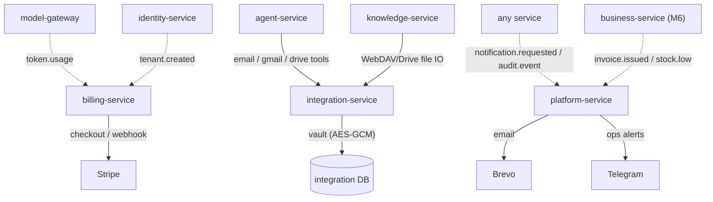
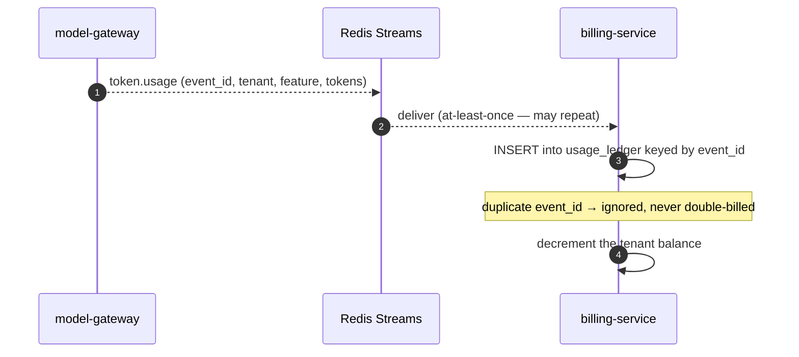
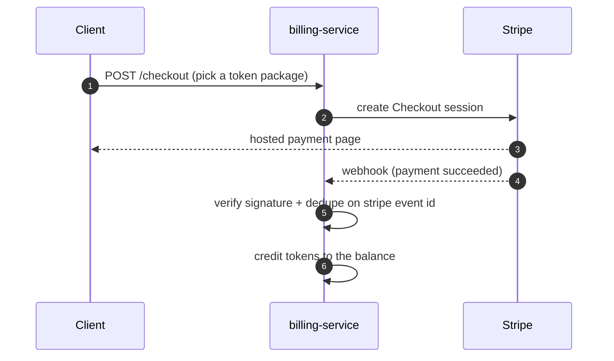

# What you get after Milestone 4 — billing, integrations, platform plumbing

> Plain-language companion to the milestone map
> (`.cursor/plans/7x7_greenfield_build_e8060d34.plan.md`). Milestone 4 completes the
> **supporting plane**: **billing-service** (the token economy + Stripe), **integration-service**
> (Google/email/WebDAV connectors), and **platform-service** (notifications, support, audit,
> settings).

---
## 1. The one-sentence outcome

After Milestone 4 the platform can **charge for itself and reach the outside world**: token
usage is metered into real balances, customers buy tokens through Stripe, the agent can read/
send email and browse Drive/WebDAV, and the whole system sends notifications and keeps a
central audit trail.

M1–M3 built the product. M4 makes it operable as a business: money in, external systems
connected, users kept informed, everything auditable.

---
## 2. What exists when you're done (concretely)

| You can… | Because of… |
|---|---|
| See a real token balance that drops as the AI is used | **billing-service** consuming `token.usage` |
| Buy token packages with a card | Stripe Checkout + idempotent webhook |
| Get auto-topped-up and a welcome bonus on signup | auto-top-up job + `tenant.created` consumer |
| Have agents read/send email, browse Drive/WebDAV | **integration-service** adapters + agent tools |
| Sync a WebDAV/Drive folder into the knowledge base | knowledge-service sync engines wired to integration IO |
| Receive in-app (bell) + email notifications | **platform-service** notifications + Brevo |
| File and answer support tickets | platform-service support module |
| Query one central audit log across all services | platform-service `audit.event` sink |

Now the metering pipeline built way back in M1 finally has a consumer: the `token.usage` events
that model-gateway has been emitting all along get tallied into balances.

---
## 3. The mental model: the support plane around the product

These three services don't add product features — they make the product **sustainable**:

- **billing-service is the cash register and the meter.** It listens for usage events and
  subtracts from balances, sells token packages via Stripe, and tops up automatically. It never
  calls other services to meter — it just consumes events, which is why metering can't be
  bypassed.
- **integration-service is the universal adapter socket.** One uniform contract
  (connect/disconnect/read/verbs) with **folder-discovered adapters** (same plugin pattern as
  agents): Google (Drive/Gmail), email (IMAP/SMTP), WebDAV. It holds all external credentials in
  an encrypted vault — no other service does.
- **platform-service is the front desk + black box recorder.** In-app notifications, the *only*
  place that holds email (Brevo) credentials, support tickets, the central audit sink, and
  platform settings. Four small modules in one service because each is tiny and event-driven.

---
## 4. How it works

### 4.1 Metering becomes a balance (idempotent ledger)

The ledger is **append-only and keyed by the event's unique ID**, so even if an event is
delivered twice, you're charged once. Balance reads are *advisory* — they can lag the latest
calls by event-bus latency, so a user near zero might overspend by a turn or two; that overdraft
is bounded and settles as the consumer catches up. (This is a deliberate trade-off for speed.)

### 4.2 Paying with Stripe (safely)

Stripe webhooks are signature-verified and deduplicated on the stored Stripe event ID — the
payments code (untested in the old system) is treated as the highest-risk code and gets a full
test suite against a Stripe mock.

### 4.3 The agent reaches the outside world

The agent's email/Gmail/Drive tools (added here) call integration-service, which pulls the
tenant's encrypted credentials from its vault and talks to the real provider. Sending an email
is a `write` tool — so it still goes through the approval card. Separately, knowledge-service's
WebDAV/Drive **sync engines** (stubbed in M2) now use integration-service for file IO, so folder
contents flow into the searchable knowledge base.

### 4.4 One way to notify, one place to audit

Every service that wants to email a user just publishes a `notification.requested` event;
platform-service is the only thing holding email credentials and does the actual send (with
retry/backoff) plus an in-app bell entry. Likewise, every service publishes `audit.event` and
platform-service collects them into one queryable trail.

---
## 5. The ideas worth internalizing

- **Centralize credentials, centralize trust.** Just as only model-gateway holds LLM keys, only
  integration-service holds external-system credentials and only platform-service holds email
  creds. Fewer places to leak, one place to rotate.
- **Events decouple producers from consumers.** billing didn't exist when model-gateway started
  emitting `token.usage`; it just attached as a consumer. New consumers attach without touching
  producers.
- **Idempotency everywhere money or delivery is involved.** Usage ledger keyed by event ID,
  Stripe webhooks keyed by Stripe event ID, notifications keyed by a dedupe key — at-least-once
  delivery is safe because every consumer dedupes.
- **Adapters are plugins.** Adding a new integration (or LLM provider) is a folder + manifest +
  adapter class — the open/closed principle made operational.
- **Pre-flight checks are advisory, not gates.** The agent peeks at the balance before a turn,
  but true accounting is eventual; the system favors low latency with a bounded overdraft.

---
## 6. Why this milestone comes here

The product (M2–M3) has to exist before it's worth billing for, integrating, or notifying about.
M4 deliberately bundles the three "supporting" services together because none is on the hottest
product path and all are mostly event consumers — they slot onto the events the earlier
milestones already emit (`token.usage`, `tenant.created`) and the new ones (`invoice.issued`,
`stock.low`) that M6 will add.

---
## 7. How you'll know it works (the exit test)

1. Run several AI chats → watch the token balance drop and matching rows appear in the usage
   ledger; replay an event and confirm no double charge.
2. Buy a token package through Stripe (test mode) → balance increases after the webhook; replay
   the webhook → no double credit.
3. Connect an email account → ask the agent to send an email → approve → it sends, and a send
   log entry appears.
4. Connect a WebDAV/Drive folder → run a sync → its files become searchable in the knowledge
   base.
5. Trigger a low-balance alert → a bell notification + email go out; check the central audit log
   shows the activity.

---
## 8. What this is NOT (so expectations are right)

- **No typed invoicing/inventory/expenses yet.** business-service is **Milestone 6**; the
  `invoice.issued`/`stock.low` consumers in platform-service are wired and waiting.
- **No UI yet.** Billing screens, the integrations page, the bell, and support live in
  **Milestone 5**; here it's API/agent/events.
- **Not a god-service.** platform-service deliberately does *not* own all admin endpoints — each
  domain service keeps its own admin routes (tokens admin in billing, providers in
  model-gateway, etc.).

---
## See also
- `docs/explanation/m2-what-you-get.md`, `docs/explanation/m3-what-you-get.md`.
- `docs/services/billing-service/README.md`, `.../integration-service/README.md`, `.../platform-service/README.md`.
- `docs/01-architecture-overview.md` §7 — the events table and fan-out diagram.
- `docs/06-architectural-patterns.md` §3.2 (events/outbox), §4.2 (plugin adapters).
