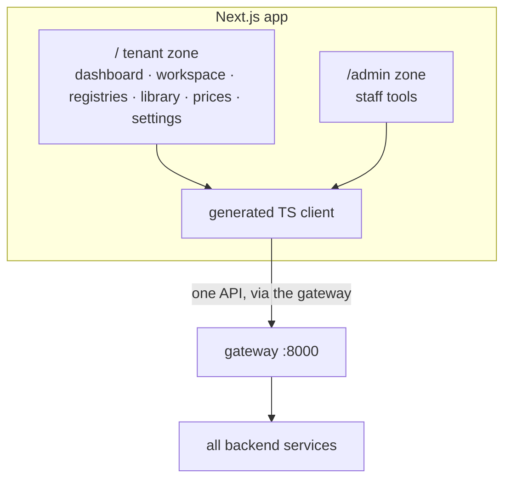
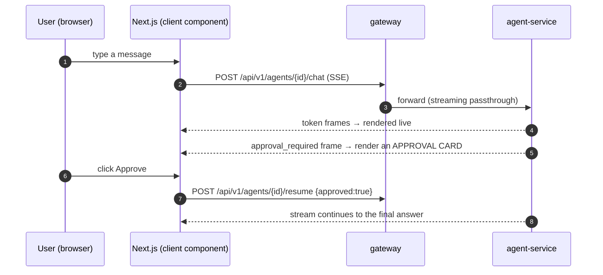

# Какво получавате след етап 5 — уеб приложението

> Обяснение на ясен език към milestone картата
> (`.cursor/plans/7x7_greenfield_build_e8060d34.plan.md`). Етап 5 изгражда **Next.js
> frontend** — едно app, две zones (`/` tenant app и `/admin`) — върху всичко, което backend
> вече излага.

---

## 1. Резултатът в едно изречение

След етап 5 има **истински продукт, върху който хората могат да кликат**: login, chat с agents
(с live streaming и approval cards), преглед и редакция на registries, управление на library,
prices и templates, конфигуриране на integrations и settings, и — за staff — admin zone.

M1–M4 направиха backend напълно способен през APIs. M5 поставя пред него полиран, модерен UI,
така че да е използваем от хора, не само от `curl`.

---

## 2. Какво съществува, когато приключите (конкретно)

| Можете да… | Благодарение на… |
|---|---|
| Влизате / регистрирате се / reset-вате password в реален UI | `/auth/**` pages → identity-service |
| Chat-вате с agent, гледате tokens stream, одобрявате writes | `/workspace` (client components + SSE + approval cards) |
| Преглеждате dashboard briefing | `/` (server-rendered, data from registry-service) |
| Преглеждате/edit-вате registries и rows | `/registries`, `/registries/[id]` |
| Управлявате document library и archive | `/library`, `/archive` |
| Управлявате price list | `/prices` |
| Редактирате visual document templates | `/templates/[id]/edit` |
| Управлявате skills, settings, integrations, support | `/skills`, `/settings/**`, `/integrations`, `/support` |
| Използвате отделна staff admin area | `/admin/**` zone |
| Използвате приложението на български или английски | bg/en i18n catalogs |

Целият UI говори с backend през **generated TypeScript client**, изграден от merged OpenAPI spec
на gateway — няма hand-written fetch code, който може да drift-не от API.

---

## 3. Мисловният модел: едно app, което говори само с вратата

- **Това е едно Next.js application** с две zones: tenant app на `/` и staff admin SPA на
  `/admin`. Всичко минава през **gateway** — frontend никога не знае internal service URLs и
  няма privileged access.
- **Server Components за data-heavy pages** (registries, library, dashboard) render-ват на
  server за speed и малки bundles. **Client Components за interactivity** (chat workspace със
  streaming и approval cards, editors).
- **API client е generated, не written.** Понеже gateway излага merged OpenAPI spec, TS types и
  calls се generate-ват от него — когато backend contract се промени, client се regenerate-ва и
  type errors излизат веднага.

---

## 4. Как работи

### 4.1 Chat workspace (най-интерактивният screen)

Approval card е UI за durable interrupt от M2: stream спира, user вижда точно какво agent иска
да направи (tool + arguments), а clicking Approve/Reject resume-ва backend graph. Понеже паузата
е checkpoint-ната server-side, refresh не я губи.

### 4.2 Защо повечето pages са server-rendered

Registry list или library е много data и малко interaction — rendering на server (React Server
Component) означава, че browser сваля HTML, не голям JavaScript bundle плюс data-fetch waterfall.
Chat workspace е обратното (постоянно interaction, live streaming), затова е client component.
Разделението държи всяка page бърза за нейната задача.

### 4.3 Две zones, един security model

`/admin` zone е същото app, но gated от platform-admin claim. gateway налага admin access (и
404-for-non-admins behavior) и impersonation read-only guard — frontend просто render-ва това,
което му е позволено да види. В browser няма special backend access.

---

## 5. Идеите, които си струва да усвоите

- **gateway е единствената API surface.** Всеки настоящ и бъдещ client (web сега; mobile,
  Telegram/Viber по-късно) удря същия gateway със същата security. Web app е просто първият
  client.
- **Generated client = no drift.** Contract е OpenAPI spec; client е downstream от него. Не
  поддържате request/response types на ръка.
- **Render where it makes sense.** Server Components за data, Client Components за interactivity
  и streaming — не everything-is-a-SPA.
- **UI не държи privilege.** Цялата authorization се налага в gateway и services; browser не
  може да я заобиколи, като извика service директно (services не са reachable).
- **i18n е first-class.** bg/en catalogs се запазват, така че продуктът да се доставя bilingual.

---

## 6. Защо този етап идва тук

Frontend се изгражда последен (преди post-parity M6) нарочно: той е тънък consumer на backend
capabilities, така че изграждането му след стабилизиране на APIs означава без rework в гонене
на moving contract. Generated client прави това конкретно — той може да бъде generated едва
когато merged OpenAPI на gateway е реален, а това е така след M1–M4.

---

## 7. Как ще разберете, че работи (exit test)

1. Регистрирайте се и влезте изцяло през UI.
2. Отворете workspace, изпратете message, гледайте как tokens stream-ват; trigger-нете write,
   вижте approval card, approve-нете го, гледайте как answer завършва; refresh-нете по средата
   на approval и потвърдете, че още е pending.
3. Прегледайте/edit-нете registry; управлявайте library и prices; редактирайте template.
4. Свържете integration и променете settings от UI.
5. Като staff user отворете `/admin`; като normal user потвърдете, че `/admin` routes връщат 404.
6. Превключете language bg ↔ en.

---

## 8. Какво това НЕ Е (за да са правилни очакванията)

- **Няма нова backend capability.** M5 излага това, което M1–M4 вече правят; ако нещо не е в
  API, не е на screen.
- **Още няма typed invoicing/inventory UI** отвъд registry-based „Фактури“ — screens за
  business-service идват с **Milestone 6**.
- **Marketing site е optional/separate.** Landing/pricing pages може да живеят в отделен static
  site, за да остане product app lean (decide-during item).

---

## Вижте също
- `docs/explanation/m0-m1-what-you-get.md` … `m4-what-you-get.md` — backend-ът, който UI използва.
- `docs/01-architecture-overview.md` §8 — frontend architecture.
- `docs/04-functional-coverage.md` §2 — картата monolith-page → Next.js-route.
# Какво получавате след Milestone 5 — уеб приложението
> Придружител на обикновен език към картата на важните събития> (`.cursor/plans/7x7_greenfield_build_e8060d34.plan.md`). Milestone 5 изгражда **Next.js> интерфейс** — едно приложение, две зони (`/`приложение за наемател и`/admin`) — на всичкото отгоре the> задната част вече излага.
---

## 1. Резултатът от едно изречение
След етап 5 има **истински продукт, върху който хората могат да кликнат**: влезте, чатете с агенти (споточно предаване на живо и карти за одобрение), преглеждайте и редактирайте регистри, управлявайте библиотеката, цените ишаблони, конфигуриране на интеграции и настройки и — за персонала — административна зона.
M1–M4 направи бекенда напълно способен чрез API. M5 поставя излъскан, модерен потребителски интерфейс пред себе ситака че може да се използва от хора, не само`curl`.

---

## 2. Какво съществува, когато сте готови (конкретно)
| Можете да… | поради… |
|---|---|
| Влезте / регистрирайте се / нулирайте парола в реален потребителски интерфейс | `/auth/**`страници → identity-service |
| Разговаряйте с агент, гледайте поточно предаване на токени, одобрявайте записи | `/workspace`(клиентски компоненти + SSE + карти за одобрение) |
| Прегледайте брифинг на таблото за управление | `/`(изобразени от сървъра, данни от регистър-услуга) |
| Преглед/редактиране на регистри и редове | `/registries`, `/registries/[id]` |
| Управлявайте библиотеката с документи и архива | `/library`, `/archive` |
| Управлявайте ценовата листа | `/prices` |
| Редактирайте визуални шаблони на документи | `/templates/[id]/edit` |
| Управлявайте умения, настройки, интеграции, поддръжка | `/skills`, `/settings/**`, `/integrations`, `/support` |
| Използвайте отделна зона за администриране на персонала | `/admin/**`зона |
| Използвайте приложението на български или английски език | bg/en i18n каталози |

Целият потребителски интерфейс комуникира с бекенда чрез **генериран TypeScript клиент**, изграден отобединената OpenAPI спецификация на шлюза — без ръчно написан код за извличане, който може да се отклони от API.
---

## 3. Мисловният модел: едно приложение, говорещо само на вратата
- **Това е едно приложение Next.js** с две зони: приложението на клиента в`/`и щатен администраторСПА при`/admin`. Всичко минава през **gateway** — фронтендът никога не знае вътрешнияURL адреси на услуги и няма привилегирован достъп.- **Сървърни компоненти за страници с много данни** (регистри, библиотека, табло за управление) рендират насървър за скорост и малки пакети. **Клиентски компоненти за интерактивност** (чатътработно пространство с поточно предаване и карти за одобрение, редакторите).- **API клиентът е генериран, а не написан.** Тъй като шлюзът излага обединен OpenAPIспецификация, TS типовете и повикванията се генерират от него - когато договорът за бекенда се промени, theклиентът се регенерира и типичните грешки се появяват незабавно.

---

## 4. Как работи
### 4.1 Работното пространство за чат (най-интерактивният екран)

Картата за одобрение е потребителският интерфейс за трайното прекъсване от M2: потокът спира, потребителят виждаточно това, което агентът иска да направи (инструмент + аргументи), и щракването върху Одобряване/Отхвърляне възобновяваbackend графика. Тъй като паузата е с контролна точка от страна на сървъра, опресняването не я губи.
### 4.2 Защо повечето страници се изобразяват от сървъра
Списъкът на регистъра или библиотеката е много данни и малко взаимодействие - изобразяването му насървър (компонент на React Server) означава, че браузърът изтегля HTML, а не голям пакет с JavaScriptплюс каскада за извличане на данни. Работното пространство за чат е обратното (постоянно взаимодействие, на живострийминг), така че е клиентски компонент. Разделянето поддържа всяка страница бърза за своята работа.
### 4.3 Две зони, един модел за сигурност
The`/admin`zone е същото приложение, но е затворено от претенцията на администратора на платформата. Порталът налагаадминистраторски достъп (и поведението 404-for-non-admins) и защитата само за четене на имитация -frontend просто изобразява това, което му е позволено да вижда. В браузъра не съществува специален бекенд достъп.
---

## 5. Идеите, които си струва да бъдат интернализирани
- **Шлюзът е единствената API повърхност.** Всеки настоящ и бъдещ клиент (уеб сега; мобилен,Telegram/Viber по-късно) достига до същия шлюз със същата сигурност. Уеб приложението е простопърви клиент.- **Генериран клиент = без дрейф.** Договорът е спецификацията на OpenAPI; клиентът е надолу по веригатато. Вие не поддържате ръчно типове заявка/отговор.- **Изобразяване, където има смисъл.** Сървърни компоненти за данни, клиентски компоненти заинтерактивност и стрийминг — не всичко е SPA.- **Потребителският интерфейс няма привилегии.** Цялото разрешение се прилага на шлюза и в услугите;браузърът не може да го заобиколи чрез директно извикване на услуга (услугите не са достъпни).- **i18n е първокласен.** bg/en каталозите се пренасят, така че продуктът се доставя на два езика.
---

## 6. Защо този етап идва тук
Предният интерфейс е изграден последен (преди постпаритетния M6) нарочно: той е тънък потребител наbackend възможности, така че изграждането му, след като API-тата са стабилни, означава без преработване, преследващо преместванедоговор. Генерираният клиент прави това конкретно - може да се генерира само след като шлюзът еобединеният OpenAPI е реален, което е след M1–M4.
---

## 7. Как ще разберете, че работи (изходен тест)
1. Регистрирайте се и влезте изцяло през потребителския интерфейс.2. Отворете работното пространство, изпратете съобщение, гледайте потока на токени; задействайте запис, вижте одобрениетокарта, одобри я, гледай отговора завършен; опреснете одобрението по средата и потвърдете, че е все ощев очакване.3. Преглед/редактиране на регистър; управлява библиотеката и цените; редактирайте шаблон.4. Свържете интеграция и коригирайте настройките от потребителския интерфейс.5. Като персонален потребител отворете`/admin`; като нормален потребител, потвърдете`/admin`маршрути 404.6. Превключете езика bg ↔ en.
---

## 8. Какво НЕ е това (така че очакванията са правилни)
- **Няма нови възможности за бекенд.** M5 показва това, което M1–M4 вече правят; ако нещо не е вAPI, не е на екрана.- **Все още няма въведен потребителски интерфейс за фактуриране/инвентаризация** извън базираните на регистъра „Фактури“ —екраните за бизнес услуги идват с **Milestone 6**.- **Маркетинговият сайт е незадължителен/отделен.** Целевите страници/страниците с цени може да съществуват в отделна статична страницасайт, за да поддържа приложението на продукта икономично (елемент, който трябва да се реши по време на).
---

## Вижте също- `docs/explanation/m0-m1-what-you-get.md` … `m4-what-you-get.md`— бекенда, който консумира.- `docs/01-architecture-overview.md`§8 — интерфейсна архитектура.- `docs/04-functional-coverage.md`§2 — монолитната страница → Next.js-карта на маршрута.