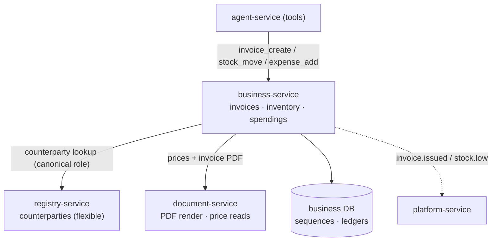

# What you get after Milestone 6 — real ERP (business-service)

> Plain-language companion to the milestone map
> (`.cursor/plans/7x7_greenfield_build_e8060d34.plan.md`). Milestone 6 is **post-parity and
> net-new**: the **business-service** adds typed invoicing, inventory, and spendings — the
> entities whose correctness is *legal/financial*, so their rules must be enforced by code, not
> by the flexible registry engine.

---
## 1. The one-sentence outcome

After Milestone 6 the platform is a **real ERP**: it issues legally-numbered invoices with
correct VAT and immutability, tracks stock as an auditable ledger that can't go negative, and
records expenses with budgets and cash-flow — and the agent can drive all of it through the
usual approve-before-write flow.

Everything before this reached feature-parity with the old system (minus deliberately dropped
parts). M6 goes *beyond* it: capabilities the monolith never had.

---
## 2. What exists when you're done (concretely)

| You can… | Because of… |
|---|---|
| Issue sales/purchase invoices with gap-free legal numbers | **business-service** invoice sequences |
| Get correct VAT, credit/debit notes, and immutable issued invoices | invoice lifecycle + VAT math + immutability |
| Track stock as receipts/issues/transfers/adjustments | append-only `stock_movements` ledger |
| Trust that stock never goes negative and levels are derived | materialized `stock_levels` + non-negativity rule |
| Record expenses, recurring costs, budgets, cash-flow | spendings module + cashflow report |
| Have the agent create invoices / move stock / add expenses | tools `invoice_create`, `stock_move`, `expense_add`, … (write → approval) |
| Get notified when an invoice is issued or stock runs low | `invoice.issued` / `stock.low` events → platform-service |
| Render an invoice PDF | document-service render |

Counterparties still live in registry-service (flexible); business-service stores only their ID
plus a **frozen snapshot** on issued invoices, so a legal document never changes when the
counterparty record is later edited.

---
## 3. The mental model: the room where mistakes are illegal, not just messy

This is the other side of the boundary you met in M3:

> **registry-service** = flexible, tenant-defined data; a wrong value is *messy*.
> **business-service** = fixed, typed schemas with hard invariants; a wrong value is *illegal or
> financially wrong* (a gap in invoice numbers, bad VAT, negative stock, an edited issued
> invoice).

So the "Работен регистър" deal pipeline stays a registry, but the invoice it produces is a
typed entity here, referenced from the registry row by ID.



---
## 4. How it works

### 4.1 Gap-free legal invoice numbering

Bulgarian law requires invoice numbers with no gaps and no duplicates, even under concurrent
issuing. business-service uses a dedicated per-tenant sequence row locked during allocation:

```mermaid
sequenceDiagram
    autonumber
    participant A as caller (agent/UI)
    participant B as business-service
    participant DB as business DB
    A->>B: POST /invoices/{id}/issue
    B->>DB: SELECT next_number FROM invoice_sequences ... FOR UPDATE
    Note over B,DB: the row is locked, so two issues can't grab the same number
    B->>DB: write invoice with that number; bump the sequence; freeze counterparty snapshot
    B-->>A: issued invoice (now immutable)
    B-->>plat: invoice.issued event
```

After issue, the invoice is **immutable** — corrections happen only via credit/debit notes,
never by editing. That's the difference between a flexible row and a legal document.

### 4.2 Stock as an append-only ledger

You never edit a stock level directly. Instead you record **movements** (receipt, issue,
transfer, adjustment), and the level is *derived* from the ledger — like a bank account that's
the sum of its transactions. A non-negativity rule rejects any movement that would push stock
below zero, and crossing a minimum threshold emits `stock.low`. This makes inventory auditable
and impossible to silently corrupt.

### 4.3 Agent writes are exactly-once

Creating an invoice from chat goes through the same approval card as any write — but here
correctness matters even more. Each approved write carries an idempotency key (derived from the
approval), and business-service dedupes on it: if the system retries after a crash, the invoice
is **not** numbered twice. A duplicate legal invoice is expensive to undo, so this guarantee is
non-negotiable.

---
## 5. The ideas worth internalizing

- **Invariants belong in code.** Sequential numbering, VAT math, immutability, non-negative
  stock — these can't be left to a generic table engine; they're enforced here, in types and
  constraints.
- **The boundary rule, made real.** Flexible/messy → registry; illegal/financially-wrong →
  business-service. The same canonical-role columns that registries use make graduating
  "Фактури" rows into typed invoices mechanical.
- **Denormalized snapshots freeze legal facts.** An issued invoice copies the counterparty
  details at issue time, so later edits to the CRM record can't alter history.
- **Exactly-once via idempotency keys.** Append-only ledgers + idempotent writes mean retries
  are safe even for money and legal documents.
- **Still database-per-service.** business-service reads counterparties from registry-service and
  prices from document-service over HTTP — never by joining their tables.

---
## 6. Why this milestone comes last

It's deliberately built **only after parity is proven**. Until the rest of the platform matches
the old system's behavior, adding net-new ERP domains would risk destabilizing the migration.
Once parity is solid, business-service graduates the flexible "Фактури" registry into a real
invoicing domain — additive, not a rewrite — and slots onto events (`invoice.issued`,
`stock.low`) whose consumer (platform-service) already exists from M4.

---
## 7. How you'll know it works (the exit test)

1. Create and issue several invoices concurrently → numbers are sequential with no gaps or
   duplicates; issued invoices reject edits; a credit note adjusts correctly; VAT is right.
2. Record stock movements → levels derive correctly; an over-issue is rejected; crossing the min
   threshold emits `stock.low` and a notification arrives.
3. Add expenses (including a recurring one) → the cash-flow report reflects them.
4. From chat, ask the agent to create an invoice → approve → it's issued once; replay the
   operation → no duplicate.
5. Confirm an issued invoice's counterparty snapshot doesn't change when you edit the CRM row.

---
## 8. What this is NOT (so expectations are right)

- **Not a replacement for registries.** Flexible, tenant-defined trackers stay in
  registry-service; business-service only owns the strict financial/legal entities.
- **Not a new pricing owner.** Prices/margins remain in document-service; business-service reads
  them to build invoice lines.
- **Not the end of the boundary discipline.** New features still get the same test: messy →
  registry, illegal/financially-wrong → business-service.

---
## See also
- `docs/explanation/m3-what-you-get.md` — the registry side of the boundary.
- `docs/services/business-service/README.md`.
- `docs/04-functional-coverage.md` §6 — new capabilities beyond parity.
- `docs/02-service-catalog.md` — the registry ↔ business-service boundary table.
- `docs/08-database-architecture.md` §4.10 — the `business` schema.
