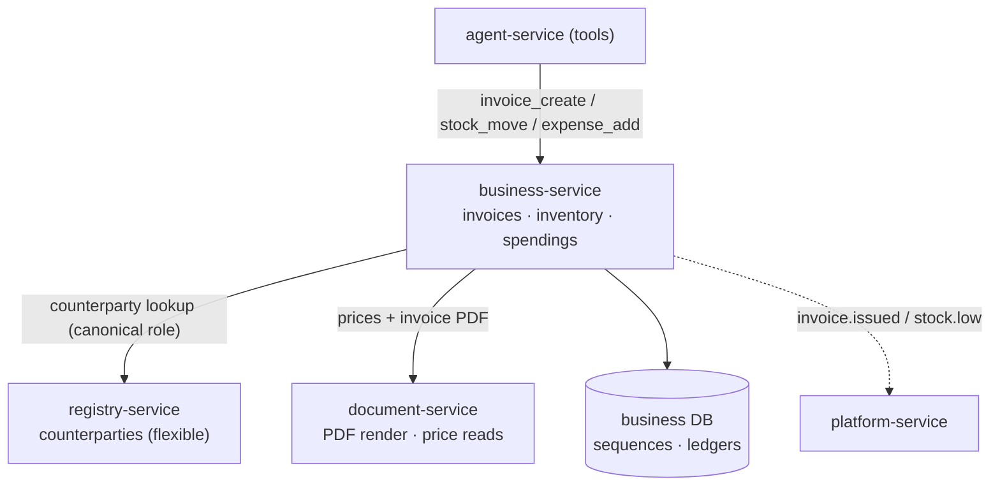

# Какво получавате след етап 6 — истински ERP (business-service)

> Обяснение на ясен език към milestone картата
> (`.cursor/plans/7x7_greenfield_build_e8060d34.plan.md`). Етап 6 е **post-parity и
> net-new**: **business-service** добавя typed invoicing, inventory и spendings — entities,
> чиято коректност е *legal/financial*, така че правилата им трябва да се налагат от code, не
> от гъвкавия registry engine.

---

## 1. Резултатът в едно изречение

След етап 6 платформата е **истински ERP**: издава legally-numbered invoices с правилен VAT и
immutability, следи stock като auditable ledger, който не може да стане отрицателен, и записва
expenses с budgets и cash-flow — а agent може да управлява всичко това през обичайния
approve-before-write flow.

Всичко преди това достигна feature-parity със старата система (минус умишлено премахнатите
части). M6 отива *отвъд* това: capabilities, които monolith никога не е имал.

---

## 2. Какво съществува, когато приключите (конкретно)

| Можете да… | Благодарение на… |
|---|---|
| Издавате sales/purchase invoices със законови номера без пропуски | **business-service** invoice sequences |
| Получавате правилен VAT, credit/debit notes и immutable issued invoices | invoice lifecycle + VAT math + immutability |
| Следите stock като receipts/issues/transfers/adjustments | append-only `stock_movements` ledger |
| Вярвате, че stock никога не става отрицателен и levels са derived | materialized `stock_levels` + non-negativity rule |
| Записвате expenses, recurring costs, budgets, cash-flow | spendings module + cashflow report |
| Накарате agent да create-ва invoices / move-ва stock / add-ва expenses | tools `invoice_create`, `stock_move`, `expense_add`, … (write → approval) |
| Получавате notification, когато invoice е issued или stock е low | `invoice.issued` / `stock.low` events → platform-service |
| Render-вате invoice PDF | document-service render |

Counterparties все още живеят в registry-service (flexible); business-service съхранява само
техния ID плюс **frozen snapshot** върху issued invoices, така че legal document никога да не се
променя, когато counterparty record бъде редактиран по-късно.

---

## 3. Мисловният модел: стаята, където грешките са незаконни, не просто разхвърляни

Това е другата страна на границата, която видяхте в M3:

> **registry-service** = flexible, tenant-defined data; грешна стойност е *разхвърляна*.
> **business-service** = fixed, typed schemas with hard invariants; грешна стойност е *illegal or
> financially wrong* (пропуск в invoice numbers, грешен VAT, negative stock, редактиран issued
> invoice).

Така deal pipeline „Работен регистър“ остава registry, но invoice, който произвежда, е typed
entity тук, referenced от registry row чрез ID.



---

## 4. Как работи

### 4.1 Законова номерация на invoices без пропуски

Българското законодателство изисква invoice numbers без пропуски и без duplicates, дори при
concurrent issuing. business-service използва dedicated per-tenant sequence row, заключен при
allocation:

```mermaid
sequenceDiagram
    autonumber
    participant A as caller (agent/UI)
    participant B as business-service
    participant DB as business DB
    A->>B: POST /invoices/{id}/issue
    B->>DB: SELECT next_number FROM invoice_sequences ... FOR UPDATE
    Note over B,DB: the row is locked, so two issues can't grab the same number
    B->>DB: write invoice with that number; bump the sequence; freeze counterparty snapshot
    B-->>A: issued invoice (now immutable)
    B-->>plat: invoice.issued event
```

След issue invoice е **immutable** — corrections се правят само чрез credit/debit notes, никога
чрез edit. Това е разликата между flexible row и legal document.

### 4.2 Stock като append-only ledger

Никога не edit-вате stock level директно. Вместо това записвате **movements** (receipt, issue,
transfer, adjustment), а level е *derived* от ledger — като bank account, който е сумата на
transactions. Non-negativity rule отхвърля всяко movement, което би свалило stock под нула, а
преминаване под minimum threshold emit-ва `stock.low`. Това прави inventory auditable и
невъзможен за тиха корупция.

### 4.3 Agent writes са exactly-once

Създаването на invoice от chat минава през същата approval card като всеки write — но тук
коректността е още по-важна. Всеки одобрен write носи idempotency key (derived from approval), а
business-service dedupe-ва по него: ако системата retry-не след crash, invoice **не** се номерира
два пъти. Duplicate legal invoice е скъп за поправяне, затова тази гаранция е non-negotiable.

---

## 5. Идеите, които си струва да усвоите

- **Invariants belong in code.** Sequential numbering, VAT math, immutability, non-negative
  stock — тези неща не могат да останат на generic table engine; налагат се тук, в types и
  constraints.
- **The boundary rule, made real.** Flexible/messy → registry; illegal/financially-wrong →
  business-service. Същите canonical-role columns, които registries използват, правят
  graduated-ването на rows от „Фактури“ към typed invoices механично.
- **Denormalized snapshots freeze legal facts.** Issued invoice копира counterparty details в
  момента на issue, така че по-късни edits на CRM record не могат да променят history.
- **Exactly-once via idempotency keys.** Append-only ledgers + idempotent writes означават, че
  retries са безопасни дори за пари и legal documents.
- **Still database-per-service.** business-service чете counterparties от registry-service и
  prices от document-service през HTTP — никога чрез join към техните tables.

---

## 6. Защо този етап идва последен

Той нарочно се изгражда **само след като parity е доказан**. Докато останалата част от
платформата не съвпадне с поведението на старата система, добавянето на net-new ERP domains би
рискувало да destabilize-не migration. Когато parity е стабилен, business-service превръща
flexible registry „Фактури“ в реален invoicing domain — добавъчно, не rewrite — и се закача към
events (`invoice.issued`, `stock.low`), чиито consumer (platform-service) вече съществува от M4.

---

## 7. Как ще разберете, че работи (exit test)

1. Създайте и issue-нете няколко invoices concurrently → numbers са sequential, без gaps или
   duplicates; issued invoices отхвърлят edits; credit note adjusts correctly; VAT е правилен.
2. Запишете stock movements → levels се derive-ват правилно; over-issue се отхвърля; пресичане
   на min threshold emit-ва `stock.low` и пристига notification.
3. Добавете expenses (включително recurring one) → cash-flow report ги отразява.
4. От chat помолете agent да create-не invoice → approve → issue-ва се веднъж; replay-нете
   operation → няма duplicate.
5. Потвърдете, че counterparty snapshot на issued invoice не се променя, когато edit-нете CRM row.

---

## 8. Какво това НЕ Е (за да са правилни очакванията)

- **Не е заместител на registries.** Flexible, tenant-defined trackers остават в
  registry-service; business-service притежава само строгите financial/legal entities.
- **Не е нов pricing owner.** Prices/margins остават в document-service; business-service ги
  чете, за да build-ва invoice lines.
- **Не е краят на boundary discipline.** Новите features все още минават през същия тест:
  messy → registry, illegal/financially-wrong → business-service.

---

## Вижте също
- `docs/explanation/m3-what-you-get.md` — registry страната на границата.
- `docs/services/business-service/README.md`.
- `docs/04-functional-coverage.md` §6 — нови capabilities beyond parity.
- `docs/02-service-catalog.md` — boundary таблицата registry ↔ business-service.
- `docs/08-database-architecture.md` §4.10 — схемата `business`.
