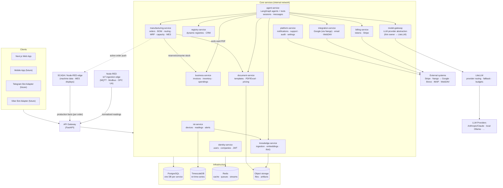
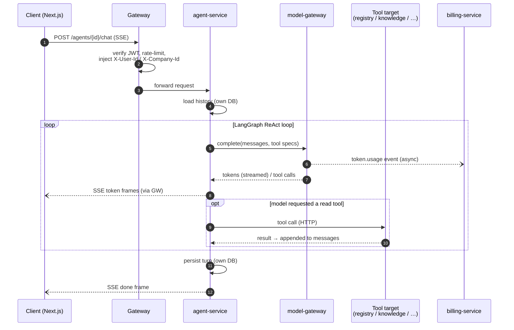
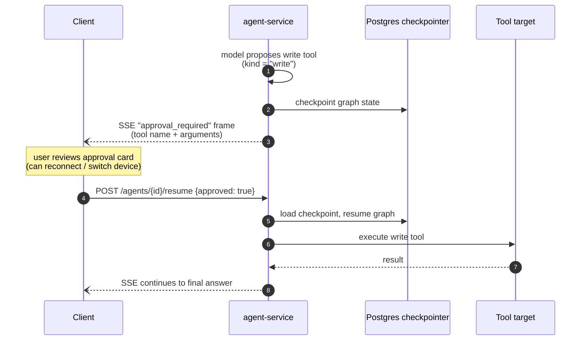
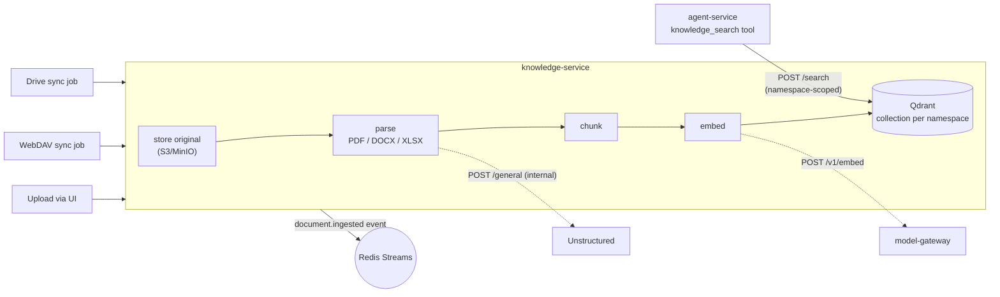
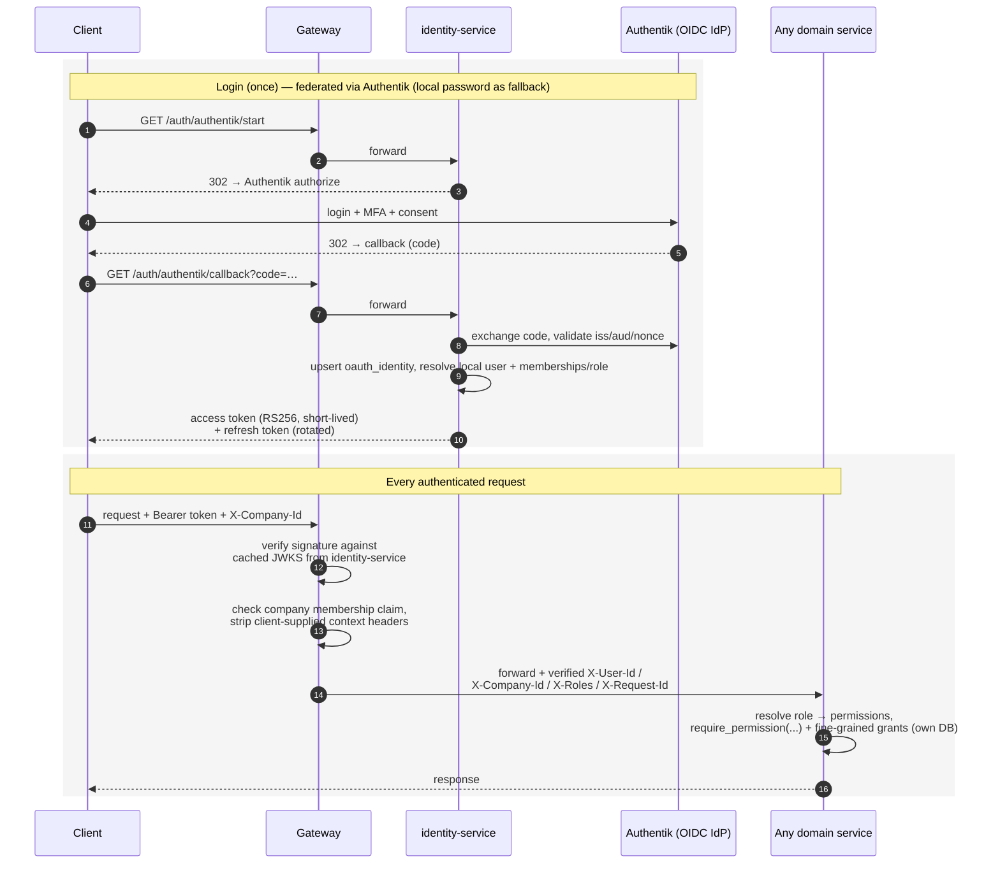
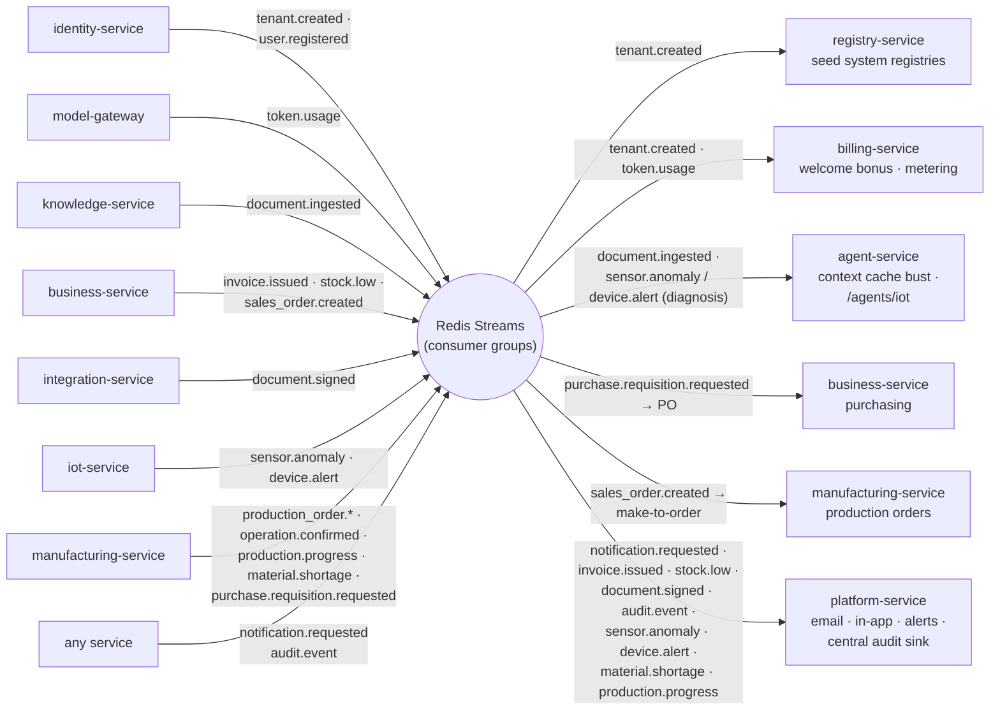

# 01 — Architecture Overview

## 1. What we are building

An **agentic ERP platform** for SME tenants. The core product surfaces are:

- An AI workspace (streaming chat with tool-using agents) that can read and write business
  data on the user's behalf, with human approval for write actions.
- Configurable business registries (CRM pipeline, invoices, counterparties, assets, …).
- A document layer: library + RAG knowledge base, visual templates, PDF/Excel generation,
  pricing and margins, KSS (construction cost sheets).
- Integrations: Google Workspace (Drive/Gmail), IMAP/SMTP email, WebDAV file servers,
  Stripe-based token billing.

The same backend serves multiple frontends: the Next.js web app today; a mobile app and
Telegram/Viber bots later — all through one gateway, none with privileged access.

## 2. Architectural principles

1. **Single entry point.** All external traffic goes through the API Gateway. Services are
   never exposed publicly; they live on an internal network.
2. **Database-per-service.** Each service owns its data store exclusively. Cross-service
   data is fetched over HTTP or received via events — never by connecting to another
   service's database.
3. **Extensibility by convention, not modification.** New agents, tools, and integration
   adapters are added by dropping files into a discovered folder (manifest + implementation),
   not by editing core runtime code. See [03-agent-platform.md](./03-agent-platform.md).
4. **Hexagonal layering inside every service.** Domain logic depends on ports (Python
   `Protocol`s); concrete adapters (httpx clients, DB drivers, SDKs) are the only place a
   framework or driver is imported, injected at the edge via FastAPI dependencies.
5. **LLM access only through the Model Gateway.** No service holds provider API keys except
   the Model Gateway. It is a **thin owner backed by LiteLLM**: LiteLLM supplies multi-provider
   routing/fallback/budgets across cloud (Anthropic/Claude) and local (Ollama) models, while
   model-gateway centralizes the internal contract, tenant-attributed token metering (billing
   truth), and the per-tenant kill switch (see [09 §3.2](./09-industry4z-platform-integration.md#32-llm-access--litellm-vs-model-gateway-)).
6. **Async-first.** FastAPI + async SQLAlchemy/asyncpg + httpx everywhere; background work
   via per-service workers (arq on Redis); cross-service notifications via Redis Streams.
7. **Tenant isolation everywhere.** Every request carries a tenant (company) context;
   every query in every service is tenant-scoped. Postgres RLS as defense-in-depth in
   services that store tenant data.
8. **Start consolidated, split when forced.** The service catalog defines target boundaries,
   but services may be co-deployed initially (one container, multiple routers) and split
   when scaling or team boundaries demand it. The same rule already shaped the catalog
   itself: boundaries that don't pay for their own deployable are modules, not services
   (see [02 § Deliberately merged](./02-service-catalog.md#deliberately-merged-boundaries)).

## 3. System topology

### Key flow 1 — a chat turn

Client → gateway → agent-service. The agent loads history from its own conversation store
(sessions and messages live in the agent DB — no network hop on the hottest path), runs
its LangGraph graph (calling tools that hit registry-service, knowledge-service, etc.),
streams tokens back through the gateway via SSE, and persists the turn. Model calls go
through model-gateway, which emits a `token.usage` event that billing-service consumes.

### Key flow 2 — write actions need approval

When an agent proposes a write tool call (create registry row, send email, generate
document), the graph **interrupts**: state is checkpointed to Postgres, the client renders
an approval card, and the graph resumes on confirmation — even after a reconnect.

### Key flow 3 — document ingestion & retrieval

Upload or sync (WebDAV/Drive) → knowledge-service stores the file, parses it (via the
internal **Unstructured** service), chunks, embeds (via model-gateway), and indexes into its
vector store. Agents retrieve at query time through the knowledge-service API — never by
touching its DB.

## 4. Technology stack

| Concern | Choice | Notes |
|---------|--------|-------|
| Backend services | **Python 3.12 + FastAPI** | Pydantic v2 models as the contract layer |
| Agent orchestration | **LangGraph** | Graphs per agent; Postgres checkpointer for interrupts/resume |
| LLM access | **LiteLLM** behind `model-gateway` | Multi-provider: Anthropic/Claude cloud + local **Ollama**; routing/fallback/budgets in LiteLLM, metering/tenancy/kill-switch in model-gateway |
| Frontend | **Next.js (App Router) + TypeScript** | Talks only to the gateway; SSE for streaming |
| Databases | **PostgreSQL 16** (one logical DB per service) | **Qdrant** vector store in knowledge-service; **TimescaleDB** (Postgres + extension) for the `iot` time-series DB in iot-service |
| IoT ingestion | **Node-RED** behind `iot-service` | Visual edge that decodes MQTT/Modbus/OPC UA and posts normalized readings **through the gateway only** (same rule as n8n); IoT dashboards + alerting are first-party — **Grafana is not used** (see [09 §3.10](./09-industry4z-platform-integration.md#310-iot-vertical--iot-service--timescaledb--node-red--decided-adopt-grafana-rejected)) |
| Cache / queues / events | **Redis 7** | arq for per-service jobs; Redis Streams for cross-service events |
| Object storage | **S3-compatible** (MinIO in dev) | Uploaded files, generated artifacts; bucket-per-owning-service |
| Document parsing | **Unstructured** (internal service) | knowledge-service calls it at ingest (PDF/DOCX/XLSX, OCR); replaces in-process parser libraries |
| Document rendering | **Carbone** behind `document-service` | One engine for template → PDF/DOCX/XLSX (PDF via bundled headless LibreOffice); replaces headless Chromium + Word/Excel libraries. Stateless, internal-only, behind the render port |
| Outbound integrations (OAuth) | **Nango** behind `integration-service` | Self-hosted OAuth/token backend + Connect UI for SaaS providers (Google, …); handles the OAuth dance + token refresh so agents act on a user's behalf without holding tokens. Non-OAuth (IMAP/SMTP, WebDAV) stay in the local vault |
| E-signature | **Documenso** behind `integration-service` | Self-hosted (own Postgres) e-signature behind a `SignaturePort`; request signing on generated documents, emits `document.signed`. Net-new capability |
| Authentication | **Authentik** (OIDC IdP) federated into identity-service; local password fallback | SSO/MFA/social handled by Authentik; identity-service resolves to a local user |
| Authorization | **JWT RS256** issued by identity-service; tenant-scoped RBAC (roles → permission catalog) | Gateway verifies via JWKS; services resolve role→permissions and `require_permission` |
| Service-to-service HTTP | httpx (async, pooled) | Internal network only; short-lived service tokens |
| Migrations | Alembic per service | Each service owns its schema history |
| Observability | OpenTelemetry traces + structured JSON logs (structlog) + Sentry | Trace ID propagated from gateway through every hop |
| Packaging / dev | Docker Compose (dev), one image per service | `uv` for dependency management |
| API contracts | OpenAPI per service, auto-generated TS client for the frontend | Generated from FastAPI schemas |

## 5. The API Gateway

The gateway is deliberately thin — it owns *cross-cutting* concerns and nothing
domain-specific:

| Responsibility | Detail |
|----------------|--------|
| Routing | Path-prefix routing table: `/api/v1/auth/* → identity-service`, `/api/v1/agents/* → agent-service`, etc. |
| Authentication | Verifies the JWT signature against identity-service's JWKS; rejects unauthenticated requests (except public routes: login, register, webhooks, health) |
| Context propagation | Injects `X-User-Id`, `X-Company-Id`, `X-Roles`, `X-Request-Id` headers for downstream services; strips any client-supplied values of those headers |
| Rate limiting | Redis-backed buckets per route class (auth, chat, default, webhooks) |
| Streaming | Transparent SSE/chunked passthrough for chat streams |
| CORS, body limits, IP allow-lists for admin routes | |

Webhooks (Stripe, Brevo) pass through the gateway with raw-body preservation and are routed
to the owning service, which performs signature verification itself.

What the gateway does **not** do: business logic, response transformation, aggregation.
If a client needs an aggregate view, the owning service exposes it (e.g. the dashboard
briefing endpoint lives in registry-service).

## 6. Identity, tenancy, and authorization

- **identity-service** is the source of truth for users, companies (tenants), memberships,
  the **role model**, and the **permission catalog** (see *Authorization model* below).
- **Authentication is federated to Authentik** (the Industry4Z SSO). Authentik is the
  upstream OIDC identity provider (login, MFA, social, SSO sessions); **identity-service
  remains the platform token issuer** — it resolves the federated login to a local user and
  mints our own tokens. This is option C of
  [09 §3.1](./09-industry4z-platform-integration.md#31-identity--authentik-): authentication
  is outsourced, **authorization stays ours**. Email/password login is retained as a
  fallback and for tenants that do not use SSO.
- Login (via Authentik or local credentials) issues an RS256 **access token** (short-lived,
  carries `user_id` and the user's company memberships with their assigned role) +
  a **refresh token** (rotated, stored server-side).
- The active tenant is selected per request via the `X-Company-Id` header; the gateway
  validates membership claims and forwards verified context headers.
- **Platform admin** (cross-tenant) is a separate claim; admin routes return 404 to
  non-admins (no existence leakage), preserving the monolith's ADR-015 behavior.

### Authorization model — roles & permissions (RBAC)

The five fixed roles of the monolith are generalized into a **tenant-scoped,
permission-backed RBAC model** so organizations can define their own roles (the platform
targets 15+ distinct roles across tenants) without any service code change:

- **Permissions are the platform contract.** A seeded, platform-owned **permission catalog**
  defines fine-grained, verb-style permissions grouped by domain — e.g. `registry.read`,
  `registry.write`, `invoice.approve`, `margin.view`, `document.generate`,
  `integration.connect`, `roles.manage`. Permissions are **not** tenant-editable; adding one
  is a platform change. Services check **permissions, never role names**.
- **Roles are bundles of permissions.** A role maps to a set of permissions. There are two
  tiers:
  - **System roles** (platform-defined, fixed, `company_id = NULL`): `owner`, `co-owner`,
    `admin`, `member`, `viewer`. Cannot be deleted or renamed by tenants; guarantee baseline
    behavior (e.g. every company has exactly one `owner`).
  - **Custom roles** (tenant-defined, scoped to one `company_id`): an org admin creates roles
    such as *Warehouse Manager*, *Accountant*, *SCADA Operator* and assigns permissions to
    them **from the platform catalog** (a checkbox matrix). A new custom role is just a new
    bundle of existing permissions → zero service changes.
- **Roles are tenant-scoped.** Membership and the assigned role live in `user_companies`; a
  user may be `owner` in company A and a custom *Viewer+* in company B. The active role is
  selected per request via `X-Company-Id`.
- **Managing roles is itself a permission** (`roles.manage`), granted to `owner`/`admin` by
  default and delegable to a custom role. Platform admins manage the system roles and the
  permission catalog globally.
- **Enforcement is local to each service.** The token/header carries the user's *role*; each
  service resolves that role to its **permission set** (via a cached role→permission map
  shared through `x7-common`) and applies `require_permission(...)` dependencies.
  `require_role(...)` remains for coarse system-role checks. Fine-grained, data-level grants
  (per-registry access matrices, margin access) still live inside the owning service, keyed
  off these permissions.

### Service-to-service trust

- Internal service-to-service calls use short-lived service tokens minted by
  identity-service (client-credentials style), so a stolen internal URL alone is not enough.
  To keep identity-service **off the per-request path**: callers mint once and cache the
  token until shortly before expiry (the `x7-common` helper does this, refreshing in the
  background), and receivers verify tokens **locally** against identity-service's
  service-token JWKS — no verification call per request. A brief identity-service outage
  therefore delays only token *renewal*; traffic with cached tokens continues unaffected.
- **Internal trust model (accepted risk).** Services *extract* user identity from
  gateway-verified headers rather than re-verifying the end-user JWT, and a service token
  proves only that the caller is a platform service — so a compromised internal service
  could forge user context toward its peers. This is accepted because services are never
  publicly reachable, service tokens are audience-scoped, and every write is audited. If
  the risk profile changes, the upgrade path is gateway-signed identity headers (services
  verify the gateway's signature per request) — it slots into `x7_common.auth` without
  touching any domain code.

## 7. Asynchronous work and events

Two distinct mechanisms, deliberately not conflated:

1. **Jobs (per-service, private)** — arq workers reading Redis queues owned by the service.
   Examples: knowledge-service embedding jobs and sync sweeps, billing-service auto-top-up
   checks, platform-service email sends, agent-service session retention purges. A
   service's queues are an implementation detail; no other service enqueues into them.
2. **Events (cross-service, published facts)** — Redis Streams topics with consumer groups.
   Producers publish facts; consumers react independently:

| Topic | Producer | Consumers | Purpose |
|-------|----------|-----------|---------|
| `token.usage` | model-gateway | billing-service | Metering every LLM call (feature, agent, tenant, tokens) |
| `document.ingested` | knowledge-service | agent-service (cache bust) | New knowledge available |
| `notification.requested` | any service | platform-service | "Send this user an email / in-app notification" |
| `audit.event` | any service | platform-service | Central audit trail sink |
| `tenant.created` | identity-service | registry-service (seed system registries), billing-service (welcome token bonus) | Tenant onboarding fan-out |
| `user.registered` | identity-service | none yet (reserved for onboarding/analytics) | Registration fact published for future consumers |
| `invoice.issued` | business-service | platform-service; integration-service (optional — start a signing request) | Notify owner; future hooks (accounting export) attach here |
| `stock.low` | business-service | platform-service | Minimum-stock threshold alerts |
| `sales_order.created` | business-service | manufacturing-service (make-to-order → production order) | Sales order triggers production (ТЗ §4.5) |
| `document.signed` | integration-service (Documenso webhook) | platform-service (notify); business-service (optional — update signed-doc state) | E-signature completed on a generated document |
| `sensor.anomaly` | iot-service | platform-service (notify); agent-service (optional — `/agents/iot` diagnosis) | Tenant alert-rule breach on sensor data; carries trusted `company_id` |
| `device.alert` | iot-service | platform-service (notify); agent-service (optional) | Device-level alert (offline/fault); carries trusted `company_id` |
| `production_order.released` / `production_order.completed` | manufacturing-service | SCADA display edge (active-order push); platform-service (notify) | Order dispatched to / finished on the shop floor |
| `operation.confirmed` / `production.progress` | manufacturing-service | platform-service (notify); analytics/dashboards | Real-time shop-floor progress (machine + MES); feeds §4.2 OEE |
| `material.shortage` | manufacturing-service | platform-service (notify planner) | MRP detected a net shortage for an order |
| `purchase.requisition.requested` | manufacturing-service | business-service (purchasing → PO) | MRP auto-requisition on shortage (ТЗ §4.4) |

Events carry IDs + minimal payload; consumers fetch full data over HTTP if needed
(thin events). Every consumer is idempotent (events may be delivered more than once).

**Durability.** Redis runs with AOF persistence (plus a replica in production) so queued
events survive a process restart. Events that must not be lost relative to a database
write — `token.usage` above all, since it is billing data — additionally go through a
**transactional outbox** in the producing service: the domain row and the pending event
commit in one transaction, and a worker flushes the outbox to the stream. Losing such an
event then requires losing the producer's database, not just a Redis process.

## 8. Frontend architecture

- **One Next.js app** with two zones: the tenant app (`/`) and the admin SPA (`/admin`).
- Server Components for data-heavy pages (registries, library); client components for the
  chat workspace (SSE streaming, approval cards) and interactive editors.
- A **generated TypeScript API client** from the gateway's merged OpenAPI spec — no
  hand-written fetch wrappers drifting from the backend.
- i18n with the existing `bg`/`en` catalogs carried over.
- Future channels (Telegram/Viber bots, mobile) consume the *same* gateway API. Bot
  adapters are small stateless services that map channel messages onto
  `POST /api/v1/agents/{agent_id}/chat` and stream responses back; they hold a channel
  token ↔ platform user link, nothing more.

## 9. Deployment & environments

- **Dev**: single `docker-compose.yml` — gateway, all services, Postgres, Redis, MinIO,
  plus the Next.js dev server. One command to boot the world.
- **Prod (phase 1)**: same images on a single host via Compose; the architecture does not
  *require* Kubernetes to be correct. The 13 logical services co-deploy into ~5 process units
  for this phase — the grouping rationale and split triggers are in
  [10-phase1-co-deployment.md](./10-phase1-co-deployment.md), and the full operational guide
  (image, `SERVICES` wiring, data-plane init, migrations, scaling) is in
  [11-deployment.md](./11-deployment.md). Scale-out path: move chat-heavy services
  (agent-service, model-gateway, gateway) to multiple replicas first. Data plane stays
  **standalone PostgreSQL 16 + an S3-compatible object store** (MinIO or any S3-compatible
  service); only the endpoint/credentials differ between dev and prod.
- **Config**: 12-factor environment variables, one `Settings(BaseSettings)` per service
  extending a shared `common.Settings`. Secrets via env/secret manager — never in code.
- **CI**: per-service test + lint + image build, triggered by path filters; contract tests
  validate that each service's OpenAPI spec is backward compatible.

## 10. Cross-cutting standards (every service)

- `GET /health` (liveness) and `GET /ready` (checks DB/Redis) endpoints.
- Structured JSON logs with `request_id`, `user_id`, `company_id`, `service` on every line.
- OpenTelemetry tracing; the gateway starts the trace, services continue it.
- Pydantic-validated request/response models; no raw dicts crossing service boundaries.
- Alembic migrations run on deploy, before the new code serves traffic.
- A `tests/` suite runnable in isolation with a disposable Postgres (testcontainers).
