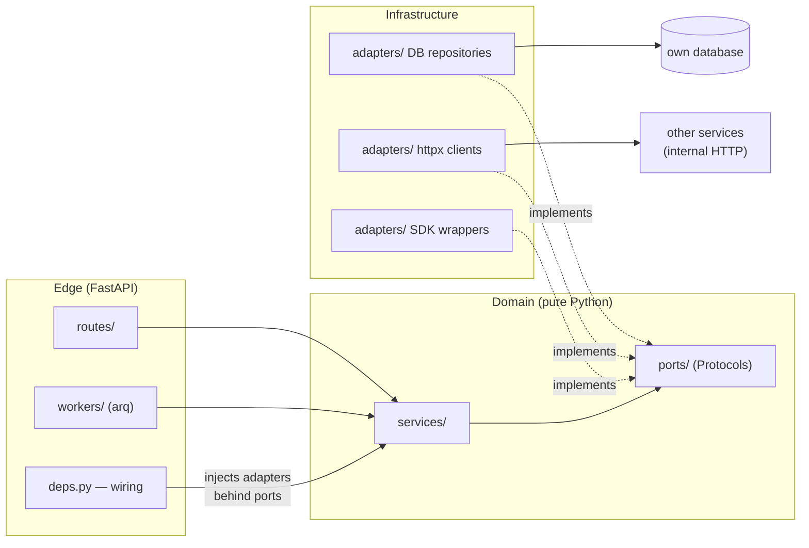
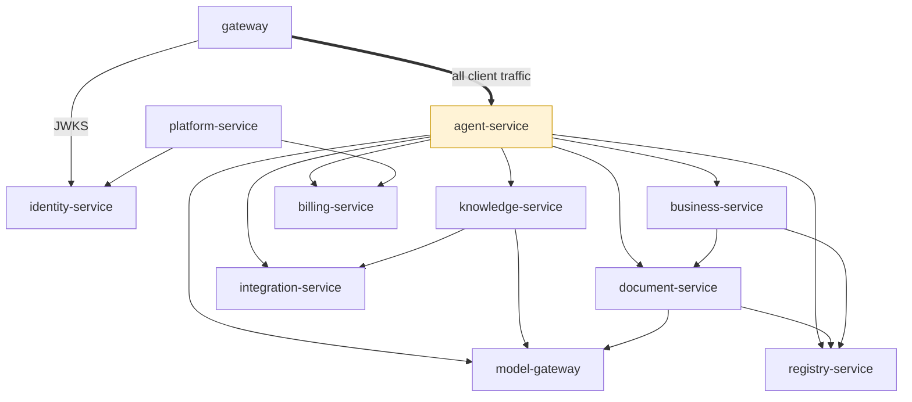

# 02 — Service Catalog

Every service is a FastAPI app with the same internal layout:

```
services/<name>/
├── app/
│   ├── main.py            # app factory, router mounting, lifespan
│   ├── config.py          # Settings(BaseSettings) — all env-driven config
│   ├── deps.py            # dependency wiring (the only place adapters are constructed)
│   ├── routes/            # HTTP layer — thin, validates and delegates
│   ├── services/          # domain logic — depends only on ports
│   ├── ports/             # Protocols the domain depends on
│   ├── adapters/          # DB repositories, httpx clients, SDK wrappers
│   ├── models/            # Pydantic DTOs (API contract) — separate from DB models
│   └── workers/           # arq job handlers (if the service has background work)
├── alembic/               # migrations (if the service owns a DB)
├── tests/
└── pyproject.toml
```

Inside every service the dependency direction is fixed — routes and workers call the
domain, the domain sees only ports, and adapters are the only place a driver or external
endpoint is known:



A shared `libs/common` package (**`x7-common`**, fully specified in
[libs/common/README.md](./libs/common/README.md)) provides: base `Settings`, auth context
extraction from gateway headers, logging/tracing setup, the Redis Streams event bus
client, pagination helpers, and shared Pydantic primitives. It contains **no business
logic** and no service may import another service's code.

Port assignments below are for dev compose; in production services discover each other via
env-configured URLs.

---

## gateway (`:8000`)

The single public entry point. See [01 §5](./01-architecture-overview.md#5-the-api-gateway).

| | |
|---|---|
| **Owns** | Routing table, JWKS cache, rate-limit buckets (Redis), CORS policy |
| **Database** | None |
| **Routes** | `/api/v1/{service-prefix}/**` reverse proxy; `/api/v1/webhooks/**` raw-body passthrough |
| **Jobs/Events** | None |

---

## identity-service (`:8010`)

Users, tenants, and trust.

| | |
|---|---|
| **Responsibility** | Registration (email OTP), login, JWT RS256 issuance + refresh rotation, password reset, Google OAuth login, JWKS publication, companies (tenants), memberships + roles, user profiles, company profiles/branding, impersonation sessions (admin), service-token minting for internal calls |
| **API** | `/auth/*` (register, login, refresh, logout, verify, reset, oauth), `/users/*`, `/companies/*`, `/memberships/*`, `/.well-known/jwks.json`, `/internal/service-token` |
| **Database** | `identity` — users, companies, user_companies, refresh_tokens, password_reset_tokens, oauth_identities, impersonation_sessions |
| **Jobs** | refresh/reset-token cleanup (daily) |
| **Events out** | `tenant.created`, `user.registered`, `audit.event` |
| **Replaces (monolith)** | `core/auth`, `core/companies`, `core/users`, `core/google` (OAuth login part), impersonation |

Notes: passwords with Argon2; OAuth/External tokens encrypted AES-256-GCM. Company lookup
by Bulgarian EIK (Commercial Register providers) is a small module here since it serves
company onboarding.

---

## agent-service (`:8020`)

The LangGraph agent runtime — the heart of the platform. Full design in
[03-agent-platform.md](./03-agent-platform.md).

| | |
|---|---|
| **Responsibility** | Agent discovery (folder + manifest), LangGraph graph execution, the shared tool catalog, ReAct loops, human-in-the-loop interrupts for write tools, per-agent RAG scoping, agent listing for clients, AI memory directives & user memory, skills (prompt snippets) injection; **conversation persistence** — sessions (per user/agent/channel), message history, attachment metadata, long-history summaries, TTL purge |
| **API** | `GET /agents` (catalog), `POST /agents/{id}/chat` (SSE), `POST /agents/{id}/resume` (approval decisions), `GET /sessions`, `GET /sessions/{id}/messages`, `DELETE /sessions/{id}`, `GET/POST /memory`, `GET/POST /skills` |
| **Database** | `agent` — LangGraph checkpoints (interrupt/resume state), sessions, messages, attachments, ai_memory, user_skills, tool_validation_log, ai_traces |
| **Jobs** | temp-skill expiry, trace retention, session purge (retention, daily) |
| **Events out** | `audit.event` |
| **Calls** | model-gateway (LLM), knowledge-service (retrieve), registry/business/document/integration services (tools), billing-service (pre-flight balance check) |
| **Replaces (monolith)** | `core/workspace` (chat.js, toolDispatch, streamHandler, promptBuilder, contextLoader), workspace_sessions / workspace_messages, `core/orchestrator`, `core/ai` tools, `core/skills`, `core/memory` |

Note: conversation history lives here as a `conversations` module behind a
`ConversationStore` port — **deliberately not a separate service**. Agent-service is its
only consumer (channel adapters enter through the chat API, never the store), and history
reads/writes sit on every chat turn — a separate service would add two HTTP hops to the
hottest path for nothing. If a second consumer ever appears, the port makes extraction
cheap (see [§ Deliberately merged](#deliberately-merged-boundaries)).

---

## model-gateway (`:8030`)

The only service that talks to LLM providers.

| | |
|---|---|
| **Responsibility** | Unified chat-completion + embeddings API over providers (Anthropic primary, OpenAI for embeddings), streaming passthrough, provider/model registry (admin-managed, encrypted keys), retries & timeouts, **token metering** (emits usage events with tenant/user/feature attribution), provider balance monitoring, global + per-tenant AI kill switch |
| **API** | `POST /v1/complete` (supports `stream=true`), `POST /v1/embed`, `GET/POST /v1/providers` (admin), `GET /v1/models` |
| **Database** | `modelgw` — providers (encrypted credentials), model configs, kill-switch state |
| **Jobs** | provider balance check (daily) |
| **Events out** | `token.usage` (every call), `audit.event` |
| **Replaces (monolith)** | `core/ai/engine.js`, ai_providers admin, anthropic-balance-check, AI toggle |

---

## knowledge-service (`:8040`)

Documents in, grounded answers out.

| | |
|---|---|
| **Responsibility** | Document library (categories/files), file parsing (PDF/DOCX/XLSX), chunking + embeddings (via model-gateway), vector search over **namespaces** (pgvector), RAG facts (promoted knowledge), projects as retrieval scopes, archive views/permissions, **file sync engines**: WebDAV and Google Drive folder sync (per-file transactions, sweeps) |
| **API** | `POST /files` (upload), `GET /files`, `GET/POST /categories`, `POST /search` (namespace-scoped vector + keyword), `POST /facts/promote`, `GET/POST /projects`, `POST /sync/run`, `GET/POST /sync/folders` |
| **Database** | `knowledge` — doc_categories, doc_files, document_chunks (pgvector), rag_facts, projects, sync_folders, sync_state |
| **Object storage** | Original files in S3/MinIO |
| **Jobs** | embed-document, sync-webdav, sync-drive, sync sweeps (30 min), reindex |
| **Events out** | `document.ingested` |
| **Calls** | integration-service (WebDAV/Drive credentials + IO), model-gateway (embeddings) |
| **Replaces (monolith)** | `core/library`, `core/archive`, `core/embeddings`, `core/file-server` sync, drive sync, projects/RAG, `sync-worker.js` |

Note: the Drive long-transaction anti-pattern flagged in the monolith's `TECH_DEBT.md` is
fixed by design here — sync commits per file with a wall-clock deadline + continuation,
matching the already-fixed WebDAV pattern.

---

## registry-service (`:8050`)

The structured-data backbone of the ERP.

| | |
|---|---|
| **Responsibility** | Dynamic registries (user-defined tables): columns, rows, optimistic locking, per-registry access matrix, audit trail, row revisions, XLSX export; **registry templates** (counterparties, offers, contracts, assets, employees, projects, purchase/sales invoices, tasks — core/standard/pro tiers); system registries seeded on tenant creation (work pipeline, invoices); **canonical column roles** so agents resolve fields semantically (`client_name`, `eik`, `offer_number`); clients (counterparties) convenience API; dashboard briefing aggregation; **tasks and office tasks modeled as system registry templates** (see [04 §3](./04-functional-coverage.md)) |
| **API** | `GET/POST /registries`, `/registries/{id}/columns`, `/registries/{id}/rows` (CRUD + query + export), `/registries/{id}/access`, `/templates` + `/templates/{slug}/install`, `/clients/search`, `/dashboard/briefing` |
| **Database** | `registry` — registries, registry_columns, registry_rows (JSONB values), registry_access, registry_audit, row_revisions, templates |
| **Jobs** | none (synchronous domain) |
| **Events in** | `tenant.created` → seed system registries |
| **Replaces (monolith)** | `core/registries` (2500-LOC routes split into proper layers), registry templates, `core/clients`, `core/dashboard`, `core/tasks`, `core/officeTasks` |

---

## business-service (`:8100`)

First-class ERP domain logic — the entities where **invariants must be enforced by code**,
not by the flexible registry engine. This is new capability beyond monolith parity (the
monolith modeled invoices as registry rows and had no inventory or expense tracking at all
— see [04 §6](./04-functional-coverage.md)).

| | |
|---|---|
| **Responsibility** | **Invoicing**: sales & purchase invoices as typed entities — sequential legal numbering per tenant (Bulgarian requirement), VAT calculation, credit/debit notes, immutability after issue, statuses (draft → issued → paid/overdue/void), PDF via document-service; **Inventory**: items/SKUs, warehouses, stock movements (receipt, issue, transfer, adjustment) as an append-only ledger with derived stock levels, reservations, minimum-stock thresholds; **Spendings**: expense records with categories, supplier linkage, recurring expenses, simple budgets and cash-flow summaries |
| **API** | `GET/POST /invoices` (+ `/issue`, `/void`, `/credit-note`), `GET/POST /items`, `GET/POST /warehouses`, `POST /stock/movements`, `GET /stock/levels`, `GET/POST /expenses`, `GET /reports/cashflow` |
| **Database** | `business` — invoices, invoice_lines, invoice_sequences, items, warehouses, stock_movements, stock_levels (materialized), expenses, expense_categories, budgets |
| **Jobs** | overdue-invoice sweep, low-stock check, recurring-expense generation |
| **Events out** | `invoice.issued`, `stock.low` (→ platform-service notifications) |
| **Calls** | registry-service (counterparty lookup by canonical role), document-service (invoice/offer PDF rendering), with price data read from document-service's price list |
| **Replaces (monolith)** | Nothing directly — graduates the "Фактури" system registry into a real invoicing domain; inventory and spendings are net-new |

### Boundary with registry-service (important)

| | registry-service | business-service |
|---|---|---|
| Data shape | User-defined columns, JSONB rows | Fixed, typed schemas |
| Invariants | Generic (locking, audit, access) | Domain rules in code: stock ≥ 0, sequential invoice numbers, VAT math, immutable issued invoices, double-entry-style movement ledger |
| Who defines it | The tenant (or a template) | The platform |
| Examples | CRM pipeline, contracts, assets, employees, custom trackers | Invoices, stock, expenses |

Rule of thumb: if a wrong value is merely *messy*, it's a registry; if a wrong value is
*illegal or financially incorrect*, it belongs in business-service. The "Работен регистър"
deal pipeline stays a registry; the invoice it produces is created in business-service (via
the `invoice_create` agent tool or the UI) and referenced from the registry row by ID.

---

## document-service (`:8060`)

Everything that turns business data into business documents — including pricing, which
exists to feed offers and KSS.

| | |
|---|---|
| **Responsibility** | Visual document templates (section JSONB editor), PDF rendering (headless Chromium), Excel/Word generation, offer drafting, **master price list** (categories, items, history, AI-assisted XLSX import), **margins** (per category/item, access-controlled), **KSS** (construction cost sheet analyze/fill, Excel round-trip) |
| **API** | `GET/POST /templates`, `POST /render` (PDF), `POST /generate` (doc from template + data), `GET/POST /prices/**`, `GET/POST /margins/**`, `POST /kss/analyze`, `POST /kss/fill` |
| **Database** | `document` — document_templates, price_categories, price_items, price_history, price_imports, category_margins, item_margins, margin_access |
| **Object storage** | Generated artifacts (PDF/XLSX) in S3/MinIO with signed download URLs |
| **Jobs** | price import processing |
| **Replaces (monolith)** | `core/templates`, `core/documents`, `core/priceList`, `core/margins`, `core/kss`, `core/offers` |

---

## billing-service (`:8070`)

The token economy and payments.

| | |
|---|---|
| **Responsibility** | Token balance per tenant/user, metering (consumes `token.usage` events with feature attribution), token pricing config, limits + alerts + bell notifications data, token packages, **Stripe** checkout + webhook (signature-verified, idempotent via stored event IDs), saved cards, auto-top-up, welcome bonus on registration, limit-increase request flow |
| **API** | `GET /balance`, `GET /usage` (+ admin live SSE), `GET /packages`, `POST /checkout`, `POST /webhooks/stripe`, `GET/POST /auto-topup`, `POST /limit-requests` |
| **Database** | `billing` — balances, usage_ledger, token_pricing, packages, purchases, stripe_events, auto_topup, limit_requests, bonus_settings |
| **Jobs** | auto-top-up check, usage aggregation rollups |
| **Events in** | `token.usage`, `tenant.created` (welcome bonus) |
| **Replaces (monolith)** | `core/tokens`, `core/payments`, token packages/purchases, auto-topup, limit requests. **Not carried over**: legacy plan-based billing tables, marketplace commission ledger (see [04 §4](./04-functional-coverage.md)) |

---

## integration-service (`:8080`)

External-system connectivity behind a uniform adapter contract.

| | |
|---|---|
| **Responsibility** | Integration catalog + per-tenant install/connect lifecycle; encrypted credentials vault; **adapters**: Google Workspace (Drive browse/IO, Gmail read/send/label), universal email (IMAP/SMTP per-user connections + send log), WebDAV (connection CRUD, browse, file IO used by knowledge-service sync); admin access modes per integration (all/excluded/exclusive); adapter auto-discovery (folder + manifest, same pattern as agents) |
| **API** | `GET /catalog`, `GET /connected`, `POST /{provider}/connect`, `DELETE /{provider}`, `POST /{provider}/oauth/callback`, provider-specific verbs: `/google/drive/**`, `/google/gmail/**`, `/email/**`, `/webdav/**` |
| **Database** | `integration` — connections, credentials (AES-256-GCM), email_log, integration_access |
| **Jobs** | connection health checks |
| **Replaces (monolith)** | `integrations/` registry, `core/google` (Drive/Gmail), `core/gmail`, `core/email`, `core/file-server` (connection layer), marketplace install flow. Bundled verticals (Virtual Office, Energy) port as two adapters if still needed (see [04 §4](./04-functional-coverage.md)) |

---

## platform-service (`:8090`)

Platform plumbing in one place: everything that talks to users out-of-band, plus
cross-tenant platform operations. Internally four small modules — `notifications/`,
`support/`, `audit/`, `settings/` — merged into one service because each is low-traffic,
mostly event-consuming, and has no domain coupling; separately they'd each cost a
database, CI pipeline, and dashboards for very little code.

| | |
|---|---|
| **Responsibility** | **Notifications**: in-app notifications (bell), transactional email (Brevo provider + `log` fallback), email delivery webhooks, ops alerts (Telegram channel), notification preferences. **Support**: tickets + staff replies. **Audit**: central audit-log sink (consumes `audit.event`), error-log views, retention policies. **Settings**: platform-wide flags and defaults. Admin aggregation endpoints only where unavoidable — each domain service owns its own admin endpoints (tokens admin in billing-service, provider admin in model-gateway, …) |
| **API** | `GET /notifications`, `POST /notifications/read`, `GET/PATCH /preferences`, `POST /webhooks/brevo`, `GET/POST /support/**`, `GET /audit`, `GET/POST /settings` |
| **Database** | `platform` — notifications, deliveries, preferences, support_tickets, support_messages, audit_log, platform_settings |
| **Jobs** | email send queue (retry with backoff), audit/trace retention |
| **Events in** | `notification.requested` (from any service), `invoice.issued`, `stock.low`, `audit.event` |
| **Replaces (monolith)** | `core/notifications`, `core/email/send.js`, Brevo webhook, `core/alerts`, `core/support`, `core/admin` (the parts not absorbed by domain services), audit/error retention. **Not carried over**: Dev Studio (see [04 §4](./04-functional-coverage.md)) |

---

## Optional / deferred services

| Service | Status | Rationale |
|---------|--------|-----------|
| **schematics-service** | Deferred, isolated | The electrical-schematic extraction niche (PDF → poppler → LLM structuring → XLSX) is fully self-contained; port it as its own service only if the vertical is still commercially active. It is the textbook candidate for an isolated microservice — heavy, bursty, no coupling. |
| **telegram-adapter / viber-adapter** | Future | Thin channel clients of the gateway chat API; no domain logic. Viber was never implemented in the monolith (catalogue placeholder only). |

## Service-to-service call matrix

Arrows = synchronous HTTP (internal network, service tokens). Event flows are listed in
[01 §7](./01-architecture-overview.md#7-asynchronous-work-and-events).



| Caller ↓ / Callee → | identity | model-gw | knowledge | registry | business | document | billing | integration | platform |
|---|---|---|---|---|---|---|---|---|---|
| **gateway** | ✓ (JWKS) | — | — | — | — | — | — | — | — |
| **agent-service** | — | ✓ | ✓ | ✓ | ✓ | ✓ | ✓ (balance check) | ✓ | — |
| **knowledge-service** | — | ✓ (embed) | — | — | — | — | — | ✓ (file IO) | — |
| **business-service** | — | — | — | ✓ (counterparties) | — | ✓ (PDF render, prices) | — | — | — |
| **document-service** | — | ✓ (AI import/format) | — | ✓ (row data for docs) | — | — | — | — | — |
| **billing-service** | — | — | — | — | — | — | — | — | — |
| **platform-service** | ✓ (user/tenant lookups) | — | — | — | — | — | ✓ (usage views) | — | — |

Design rule: the **agent-service is the only fan-out hub** (it must be — tools touch
everything). Every other service keeps its synchronous dependencies to at most two.

## Deliberately merged boundaries

Two boundaries that *could* be services are deliberately modules instead — the criterion
is: a separate service must buy isolation that pays for its own database, CI pipeline, and
failure modes.

| Could-have-been service | Lives instead in | Why merged |
|---|---|---|
| conversation-service (sessions, messages) | **agent-service** `conversations/` module behind a `ConversationStore` port | Agent-service is the only consumer (channels enter via the chat API, never the store); history read/write sits on every chat turn — a network hop here is pure latency tax. Extraction stays cheap via the port if a second consumer appears. |
| notification-service + admin-service | **platform-service** modules (`notifications/`, `support/`, `audit/`, `settings/`) | All low-traffic event consumers + simple CRUD with zero domain coupling; two extra deployables bought nothing. |
