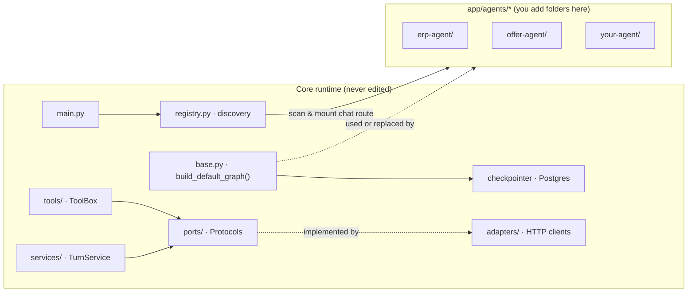
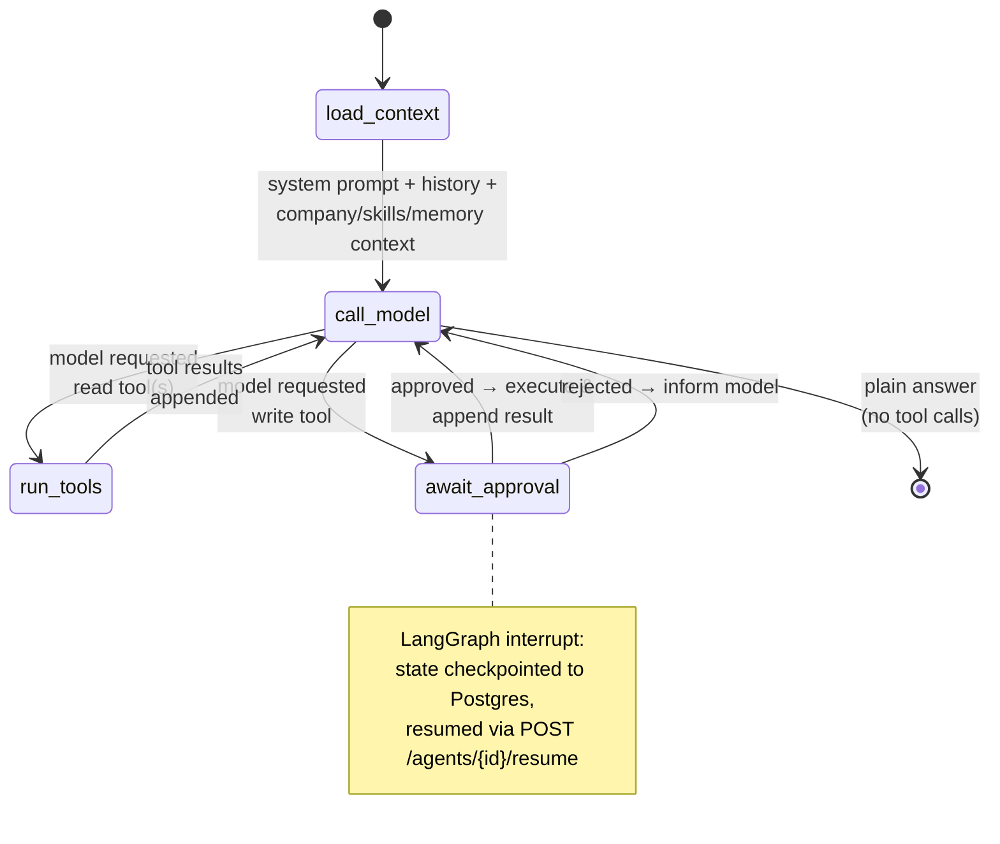
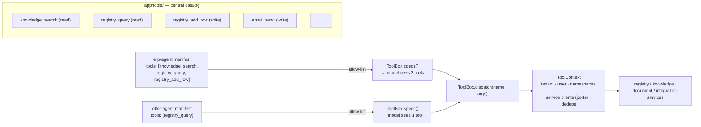

# 03 — Agent Platform (LangGraph) & Extensibility

> How the agent-service is made extensible, and the recipes for the things you'll actually
> do: **add a new agent** (with its own RAG scope and tools), **add a tool and share it
> across agents**, and **swap infrastructure** without rewriting the domain.

The design promise, carried over from proven prior art and adapted to LangGraph:

> **Create a new agent folder, drop in two files (`manifest.yaml` + `graph.py`),
> restart — no core edits.**

---

## 1. How extensibility is achieved



### Pillar 1 — The manifest is a declarative contract

Each agent ships a `manifest.yaml` parsed into a Pydantic `Manifest`. Every field is a
lever the runtime reads to wire and constrain the agent — model, allowed tools, RAG
namespaces, channel availability. You change behaviour by editing data, not code.

### Pillar 2 — A default graph gives you everything; you write only the unique part

`build_default_graph(manifest, toolbox)` returns a complete LangGraph `StateGraph`:
context loading → ReAct tool loop → human-approval interrupt for write tools → answer.



An agent that wants standard behaviour ships **no graph code at all** (manifest only).
An agent that needs custom orchestration exports its own `build_graph()` from `graph.py`
and composes whatever nodes it wants — it still gets `self`-style access to the ToolBox,
the LLM port, and the checkpointer.

### Pillar 3 — A uniform state schema makes every agent interchangeable

Every graph operates on the same `AgentState` (TypedDict): `messages`, `tenant`, `user`,
`pending_approval`, `usage`, `artifacts`. The chat route, the SSE streamer, and the
approval/resume endpoint never know *which* agent ran — they read the state, not the class.
New agent types fit the existing pipeline.

### Pillar 4 — The registry turns folders into routes by reflection

At startup `registry.discover()` globs `agents/*/manifest.yaml`, imports the sibling
`graph.py` if present (else uses the default graph), compiles the graph with the shared
Postgres checkpointer, and a **single parametric route** `POST /agents/{agent_id}/chat`
serves all of them. A broken agent folder is logged and skipped — never fatal to startup.

### Pillar 5 — Write actions are interrupts, not trust

Tools are classified `read` or `write` in their spec. The default graph auto-executes read
tools inside the loop; before a write tool it hits a LangGraph **interrupt**: the state is
checkpointed to Postgres, the client receives an `approval_required` SSE frame with the
proposed call, and `POST /agents/{id}/resume` continues the graph with the user's decision.
This reproduces the monolith's approval-card UX with a real persistence mechanism instead
of an in-stream hack — approvals survive reconnects and server restarts.

Resume is **exactly-once by construction**: every approved write carries an idempotency
key derived from the checkpoint + approval ID, passed by the ToolBox to the downstream
service. If agent-service crashes between executing the write and recording the result,
the retry replays the *same* key and the owning service returns the original result
instead of acting twice — critical for tools like `invoice_create`, where sequential
legal numbering makes a duplicate expensive to undo.

> **Why infra stays swappable:** the domain (`services/`, graph builders, `tools/`)
> depends only on **ports** (Protocols): `LLM`, `Retriever`, `ConversationStore`,
> `RegistryClient`, `DocumentClient`, `IntegrationClient`. Concrete `adapters/` (httpx
> clients, DB repositories) are the only place an external endpoint or driver is known,
> injected via `deps.py`.

---

## 2. Anatomy of an agent folder

```
services/agent-service/app/agents/erp-agent/
├── manifest.yaml      # required — the declarative contract
├── graph.py           # optional — custom LangGraph graph (default used if absent)
├── prompts/           # optional — system prompt templates
└── tools/             # optional — agent-private tools, not in the shared catalog
```

### `manifest.yaml`

```yaml
id: erp-agent
name: ERP Assistant
description: General business assistant — registries, documents, email, knowledge.
default_model: claude-sonnet-4-5          # passed to model-gateway, overridable per request
tools:                                    # capability ALLOW-LIST — agent only sees these
  - knowledge_search
  - registry_query
  - registry_add_row        # write → triggers approval interrupt
  - price_match
  - offer_draft
  - generate_document       # write
  - email_send              # write
data_namespaces: [library, registry-docs] # RAG scope for knowledge_search / retrieval
channels: [web, telegram]                 # which client channels may invoke this agent
context:                                  # what the context loader injects per turn
  company_profile: true
  skills: true
  memory: true
  active_project: true
system_prompt: |
  You are the 7x7 ERP assistant. Answer in the user's language (default Bulgarian).
  Use tools to read business data; never invent registry contents. ...
```

| Field | What it controls |
|-------|------------------|
| `id` | The route: `POST /agents/erp-agent/chat`, and the `GET /agents` catalog entry |
| `default_model` | Model name sent to the model-gateway |
| `tools` | **Allow-list.** `ToolBox.specs()` exposes only these to the model |
| `data_namespaces` | Retrieval scope in knowledge-service |
| `channels` | Gateway/bot adapters filter the agent catalog per channel |
| `context` | Which context blocks the loader fetches and injects into the system prompt |
| `system_prompt` | The agent's instructions; falls back to `"You are {name}."` |

### `graph.py` (only when the default loop isn't enough)

```python
# app/agents/erp-agent/graph.py
from langgraph.graph import StateGraph, START, END
from app.base import AgentState, default_nodes


def build_graph(manifest, toolbox, llm, checkpointer):
    nodes = default_nodes(manifest, toolbox, llm)   # load_context, call_model,
                                                    # run_tools, await_approval
    g = StateGraph(AgentState)
    g.add_node("load_context", nodes.load_context)
    g.add_node("plan", my_planning_node)            # ← the custom part
    g.add_node("call_model", nodes.call_model)
    g.add_node("run_tools", nodes.run_tools)
    g.add_node("await_approval", nodes.await_approval)   # interrupt node

    g.add_edge(START, "load_context")
    g.add_edge("load_context", "plan")
    g.add_edge("plan", "call_model")
    g.add_conditional_edges("call_model", nodes.route_after_model, {
        "tools": "run_tools", "approval": "await_approval", "done": END,
    })
    g.add_edge("run_tools", "call_model")
    g.add_edge("await_approval", "call_model")
    return g.compile(checkpointer=checkpointer)
```

The default graph is exactly this minus the `plan` node — so the marginal cost of a custom
agent is only its custom nodes.

---

## 3. Step-by-step: add a new agent

We'll add an `offer-agent` that drafts offers from the price list and counterparty data.

**Step 1 — create the folder.**

```bash
mkdir -p services/agent-service/app/agents/offer-agent
```

**Step 2 — declare it in `manifest.yaml`.**

```yaml
id: offer-agent
name: Offer Agent
description: Drafts commercial offers from the price list and client registry.
default_model: claude-sonnet-4-5
tools: [registry_query, price_match, offer_draft, generate_document]
data_namespaces: [library]
channels: [web]
system_prompt: >
  You draft commercial offers. Always resolve the client via registry_query,
  match items via price_match, and present a draft before generating the document.
```

**Step 3 — (optional) write `graph.py`.** Skip it: the default ReAct + approval graph is
exactly what an offer workflow needs.

**Step 4 — restart the service.**

```bash
docker compose restart agent-service
```

On boot, discovery finds the manifest, compiles the graph, and mounts the route. The agent
appears in `GET /agents`. **No core file changed.**

**Step 5 — verify.**

```bash
curl -N -X POST http://localhost:8000/api/v1/agents/offer-agent/chat \
  -H "authorization: Bearer $TOKEN" -H "x-company-id: $COMPANY" \
  -H "content-type: application/json" \
  -d '{"message": "Оферта за Контрагент ЕООД: 20 бр. ключ обикновен"}'
```

You should see an SSE token stream; if the agent proposes `generate_document`, the stream
emits an `approval_required` frame and pauses until `POST /agents/offer-agent/resume`.

### About the RAG data itself

The agent-service does **not** own or index documents. `data_namespaces` name corpora that
live in the **knowledge-service**. To give an agent its own knowledge, ingest documents
into a new namespace (`POST /api/v1/knowledge/files` with `namespace: offers-kb`) and list
that namespace in the manifest. Agents read at query time through the `Retriever` port —
never the vector store directly.

### The `iot` agent (`/agents/iot`)

A built-in agent for the IoT vertical, added the same way (a folder + `manifest.yaml`, no core
change). It is the diagnosis half of the **alert loop**: when
[`iot-service`](../services/iot-service/README.md) emits `sensor.anomaly` / `device.alert`
(after one of an organization's own alert rules breaches), the event — carrying the trusted
`company_id` — triggers `/agents/iot` (directly, or via the n8n bridge). The agent reads device
and time-series context from `iot-service`, retrieves similar past incidents from the
`iot_anomalies` knowledge namespace, asks model-gateway (Claude) for a diagnosis, and routes the
result to `platform-service` notifications. Its `data_namespaces` include `iot_anomalies`; its
tools are read-oriented (device/series lookups) with any write/remediation tool approval-gated
like any other. See
[09 §3.10](../09-industry4z-platform-integration.md#310-iot-vertical--iot-service--timescaledb--node-red--decided-adopt-grafana-rejected).

---

## 4. Tools: the shared catalog

Tools live centrally in `app/tools/`, one module per tool, exposed through the `ToolBox`.
Sharing a tool is a two-part move: **add it to the catalog once**, then each agent **opts
in via its manifest**. Capability stays central; exposure stays per-agent.



### The Tool protocol

```python
# app/tools/base.py
class Tool(Protocol):
    name: str
    kind: Literal["read", "write"]      # write → approval interrupt
    spec: ToolSpec                       # JSON-schema params for the model

    async def dispatch(self, ctx: ToolContext, args: dict[str, Any]) -> str: ...
```

`ToolContext` is constructed once per turn and carries: the tenant/user identity, the
downstream service clients (registry, knowledge, document, integration — all ports), the
agent's `data_namespaces`, `Settings`, and per-turn dedupe state (a repeated identical
`knowledge_search` costs no second round trip).

### Adding a tool

```python
# app/tools/registry_query.py
REGISTRY_QUERY_SPEC = ToolSpec(
    name="registry_query",
    description="Query rows from a tenant registry by filters or free text.",
    parameters={...},
)

class RegistryQueryTool:
    name = "registry_query"
    kind = "read"
    spec = REGISTRY_QUERY_SPEC

    async def dispatch(self, ctx: ToolContext, args: dict) -> str:
        rows = await ctx.registry.query(
            tenant=ctx.tenant, registry=args["registry"], filters=args.get("filters"),
        )
        return format_rows(rows)
```

Then register one instance in `app/tools/__init__.py` — the **only** existing file you
touch:

```python
_AVAILABLE_TOOLS: list[Tool] = [
    KnowledgeSearchTool(),
    RegistryQueryTool(),
    RegistryAddRowTool(),      # kind="write"
    PriceMatchTool(),
    OfferDraftTool(),
    GenerateDocumentTool(),    # kind="write"
    EmailSendTool(),           # kind="write"
    # ...
]
```

`ToolBox.specs(allowed)` returns specs only for manifest-allowed names; `dispatch()` looks
up by name. No agent code changes are required to *gain* a shared tool — the default graph
already calls `specs()`/`dispatch()` generically.

### Tool design rules

- **The allow-list is the security boundary.** A tool in the catalog is invisible to an
  agent until its manifest lists it. Keep lists tight.
- **Safety lives in the tool, not the agent.** Outbound-host allow-lists, tenant scoping,
  argument validation, per-turn dedupe — all inside the tool/ToolBox, so no agent can
  forget them.
- **`kind="write"` is not advisory.** The graph enforces the approval interrupt centrally;
  a tool author cannot opt out by prompt wording.
- **Write tools are idempotent.** Every write dispatch carries the approval-derived
  idempotency key (see Pillar 5); the backing service endpoint must dedupe on it and
  return the original result on replay. A write tool whose target cannot dedupe is not
  done.
- **Agent-private tools** live in the agent's own `tools/` folder and are registered only
  into that agent's ToolBox instance — invisible to all other agents.

### Initial tool catalog (carried over from the monolith)

| Read | Write (approval) |
|------|------------------|
| `knowledge_search`, `registry_list`, `registry_query`, `registry_suggest`, `price_match`, `price_categories`, `offer_draft`, `email_inbox`, `email_read`, `task_list`*, `analyze_document`, `kss_analyze`, `list_integrations`, `switch_project`, `invoice_list`, `inventory_check`, `expense_summary` | `registry_add_row`, `registry_update_row`, `generate_document`, `generate_excel`, `kss_fill`, `save_margins`, `email_send`, `gmail_actions`, `task_create`*, `task_complete`*, `learn_skill`, `invoice_create`, `stock_move`, `expense_add` |

`remember` (memory write) stays auto-execute, as in the monolith — it only writes to the
user's own AI memory. *Task tools operate on the tasks system registry (see
[04 §3](./04-functional-coverage.md)).

---

## 5. Swapping infrastructure

The rule, identical across all services:

> **The domain depends on a port. Infrastructure is an adapter behind it. To change
> infrastructure, write a new adapter and rewire one line of `deps.py` — the domain and
> the agents do not change.**

### Case A — swap an adapter in agent-service

The agent-service's "infrastructure" is its adapters behind the `ConversationStore`,
`Retriever`, `LLM`, `RegistryClient`, … ports — HTTP clients for downstream services,
a DB repository for conversation history. To put a Redis read-through cache in front of
the history store: keep the port, write `CachedConversationStore` implementing it,
rewire one line:

```python
# app/deps.py
def get_turn_service() -> TurnService:
    return TurnService(
        conversations=CachedConversationStore(pg_store, redis),   # ← swapped
        retriever=KnowledgeRetriever(settings, client),
        llm=ModelGatewayLLM(settings, client),
        settings=settings,
    )
```

### Case B — swap a database in a DB-owning service

Same mechanism in any sibling service: the domain depends on a repository/store port; the
adapter is the only file importing the driver. knowledge-service's vector store sits behind
a `VectorStore` port (Qdrant today); swapping it for another engine = one new adapter + one
`deps.py` line. Two hard rules:

- **Database-per-service.** No service ever connects to another's store.
- **DTOs ≠ DB models.** Adapters map between API DTOs and storage shapes, so the API stays
  stable while storage evolves.

### Case C — swap the LLM provider

Nothing in agent-service changes at all: providers live behind the model-gateway, which is
backed by **LiteLLM**. Adding/switching a provider (e.g. routing to a local **Ollama** model)
is LiteLLM config + flipping the model name in a manifest (or the admin provider config) — no
new hand-written adapter, no agent change.

---

## 6. Quick reference

| I want to… | Do this | Files touched |
|------------|---------|---------------|
| Add an agent | Folder + `manifest.yaml` (+ optional `graph.py`), restart | `app/agents/<id>/*` only |
| Give an agent RAG data | Set `data_namespaces`; ingest into those namespaces via knowledge-service | manifest + knowledge ingest |
| Give an agent an existing tool | Add the name to the manifest `tools:` list | manifest only |
| Share a new tool | New module in `app/tools/` + one registry line; opt in per manifest | `app/tools/` + manifests |
| Make a tool require approval | `kind="write"` in the tool class | the tool module |
| Custom orchestration | Export `build_graph()` from the agent's `graph.py`, compose `default_nodes()` | `app/agents/<id>/graph.py` |
| Expose an agent to a new channel | Add the channel to `channels:` in the manifest | manifest only |
| Swap a downstream client | New adapter implementing the port + one `deps.py` line | `adapters/` + `deps.py` |
| Change a provider/endpoint/limit | Env var / `Settings` field / admin provider config | `.env` |

### Golden rules

- Agents live entirely under `app/agents/<id>/`. Adding one touches no core module.
- Agent code depends on the ToolBox and ports — never on adapters, raw HTTP, or provider SDKs.
- Write tools always interrupt for approval; the graph enforces it, not the prompt.
- A broken agent folder is skipped, not fatal — check startup logs if an agent is missing
  from `GET /agents`.
