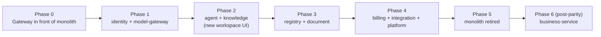
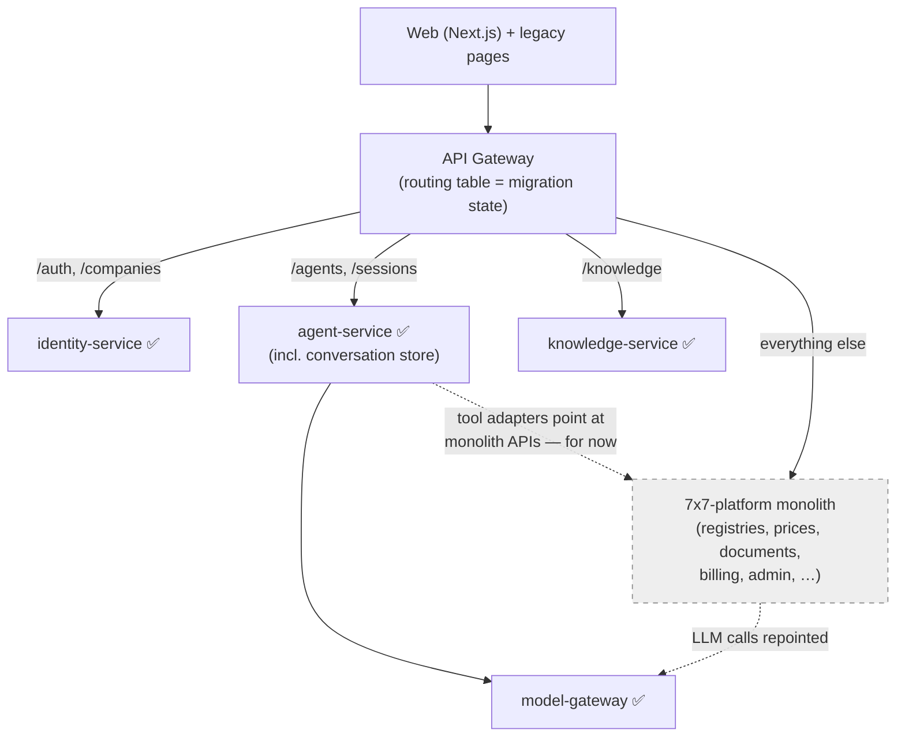

# 05 — Migration: Pros and Cons

An honest assessment of moving from the `7x7-platform` monolith (Node.js/Express, PM2,
single Postgres, hand-rolled agent loop, vanilla-JS multi-page frontend) to the target
architecture (FastAPI microservices + gateway, LangGraph agents, Next.js).

## 1. What we are actually changing

This is **not one migration but four**, and each carries its own cost/benefit:

| Dimension | From | To |
|---|---|---|
| Deployment shape | Modular monolith (3 PM2 processes) | 10 services behind a gateway (11 with the post-parity business-service) |
| Backend language/runtime | Node.js + Express | Python + FastAPI |
| Agent runtime | Hand-rolled Anthropic tool loop (2516-LOC `chat.js`) | LangGraph graphs with checkpointed interrupts |
| Frontend | 27 static HTML pages + vanilla JS (4205-LOC `ai-chat.js`) | Next.js + TypeScript + generated API client |

It is worth being explicit that a credible alternative exists: keep the monolith, refactor
`chat.js` and `registries/routes.js`, and bolt LangGraph on via a Python sidecar. The
reasons that alternative loses are listed under "Why migrate anyway" (§4), but the cons
below are real and should be priced in.

## 2. Pros

### Architecture & scaling

- **Single entry point with real boundaries.** Today route-mount ordering in `server.js` is
  load-bearing and admin/tenant/webhook concerns interleave in one Express app. A gateway +
  per-service routers makes the security surface auditable: one place verifies JWTs, one
  place rate-limits, services cannot be reached from outside at all.
- **Independent scaling of hot paths.** Chat/LLM traffic (agent-service, model-gateway) has
  a completely different load profile than registry CRUD or file sync. In the monolith all
  of it shares 2 cluster workers; one heavy Drive sync or Puppeteer render competes with
  chat latency. Services scale independently and a crash in PDF rendering cannot take down
  login.
- **Database-per-service ends the hidden coupling.** The monolith's ~80 `core.*` tables are
  a single blast radius: any module can join any table, and the audits show it (registry
  routes reading price tables, workspace reading everything). Explicit HTTP/event contracts
  make dependencies visible and testable.
- **Failure isolation for background work.** The monolith already learned this lesson
  half-way (sync-worker was split out because Drive sync starved other jobs); the target
  architecture finishes the thought — every service owns its queues.

### Agent platform (the core product bet)

- **LangGraph replaces ~3,000 lines of bespoke orchestration** (`chat.js`,
  `streamHandler.js`, `toolDispatch.js`) with a maintained framework: graph composition,
  state checkpointing, retries, streaming, and sub-graphs come for free.
- **Durable human-in-the-loop.** Today's write-tool approval is an in-stream pause — a
  dropped SSE connection loses the pending action. LangGraph interrupts checkpoint to
  Postgres: approvals survive reconnects, restarts, and can even be approved from a
  different device or channel later.
- **Multi-agent becomes a folder, not a fork.** The monolith has exactly one global
  orchestrator; adding a specialized agent means more branches inside `chat.js`. The
  manifest-driven registry ([03-agent-platform.md](./03-agent-platform.md)) makes new
  agents and tools additive — the explicit extensibility requirement for this system.
- **Python is where the AI ecosystem lives.** LangGraph, evaluation tooling, parsers, and
  most provider SDKs are Python-first. The monolith already hit this wall (no framework,
  hand-rolled everything).

### Multi-frontend strategy

- **Channel adapters become trivial.** Because *all* clients speak to the same gateway API
  and agents declare `channels:` in their manifests, a Telegram bot is a ~200-line adapter,
  not a new integration into Express internals. The monolith has no path to this today
  (Telegram is ops-alerts only; Viber is a catalog placeholder).
- **Typed contract between FE and BE.** OpenAPI-generated TypeScript clients eliminate the
  silent drift that 63 hand-written JS files accumulate against undocumented routes.

### Quality & operations

- **The metering problem gets solved structurally.** Token accounting today is per-callsite
  bookkeeping; the model-gateway emits usage events for every call by construction — billing
  cannot be bypassed by a forgotten callsite.
- **A clean break from audited dead weight.** The migration is the natural moment to drop
  the 7Blocks platform (zero installs), Dev Studio, legacy billing, and the other items in
  [04 §4](./04-functional-coverage.md) — roughly a quarter of the monolith's surface.
- **Known anti-patterns fixed by design**: the Drive sync long-transaction lock
  (`TECH_DEBT.md` open item), the 14 duplicated rate-limiter handlers, the monster files
  (`chat.js` 2516 LOC, `registries/routes.js` 2507 LOC, `ai-chat.js` 4205 LOC).
- **Per-service test isolation.** The untested high-risk areas of the monolith (payments has
  zero direct tests per `CODE_QUALITY_REPORT.md`) get rewritten behind small, mockable
  ports with disposable-DB tests.

## 3. Cons

### Cost & schedule

- **A full rewrite, not a refactor.** ~110K LOC, 177 migrations, 571 tests, and substantial
  domain subtlety (registry locking semantics, KSS Excel round-trips, Bulgarian-language
  prompts tuned over versions v20–v24, Stripe edge cases). Expect months of effort before
  feature parity, during which the monolith still needs maintenance — a period of double
  bookkeeping.
- **Two stacks during transition.** Node.js skills/code remain necessary while Python
  services come online. If the team is small (the commit history suggests it is), context
  switching across Express *and* FastAPI *and* Next.js is a real tax.
- **The frontend rewrite is silently the biggest line item.** 27 pages, 63 JS files,
  ~2,244 i18n keys, an admin SPA, and a highly stateful chat UI (streaming, approval cards,
  attachments, block-less workspace). None of it is reusable as-is in React.

### Operational complexity

- **10 services is still a lot of moving parts for one team.** Each needs CI, migrations,
  health checks, dashboards, version compatibility. PM2 + one Postgres is genuinely simple
  to operate; the new system needs disciplined observability (tracing across hops) just to
  debug what a single stack trace shows today. *Mitigations:* the catalog already merged
  the boundaries that didn't pay for themselves (conversations into agent-service;
  notifications/support/audit/settings into one platform-service — see
  [02 § Deliberately merged](./02-service-catalog.md#deliberately-merged-boundaries)), and
  services may be co-deployed several per container initially and split later (boundaries
  are code boundaries first, deployment boundaries second).
- **Distributed-systems failure modes arrive on day one.** Partial failures, retries,
  idempotency, eventual consistency between billing events and chat, network timeouts
  between agent tools and domain services. The monolith has none of these problems —
  in-process calls don't fail halfway.
- **Latency tax on agent tools.** Every tool call that was an in-process function + SQL
  query becomes an HTTP hop (agent → registry-service → DB). For chatty agent loops this
  adds tens of ms per call; needs connection pooling and sane tool granularity from the
  start.

### Data & cutover risk

- **Data migration across schema boundaries.** One database becomes ten — nine carrying
  migrated data, plus business-service's net-new schema. Registry JSONB
  rows, vector chunks, encrypted credentials (AES keys must be re-wrapped or carried over),
  Stripe customer/subscription state, refresh tokens — each needs a migration script and a
  verification pass. Mistakes here are customer-visible.
- **Behavioral parity is hard to prove.** The registry engine's locking/audit/canonical-role
  behavior and the prompt stack's tuned Bulgarian outputs have no executable spec other
  than the old code and its 571 tests (which don't port across languages). Subtle
  regressions will surface as user reports, not test failures.
- **Live-tenant cutover.** Real companies use this daily. A big-bang switch risks the whole
  business; a strangler approach (see §5) doubles infrastructure for the duration.

### Technology risk

- **LangGraph is a fast-moving dependency.** API churn between versions is real; pinning and
  an upgrade budget are required. The hand-rolled loop, for all its size, has zero external
  framework risk.
- **Rewrite second-system risk.** The classic failure mode: rebuilding features nobody
  validated (the monolith's own audits show it has *already* built several of those —
  blocks, dev studio). The functional-coverage doc ([04](./04-functional-coverage.md)) is
  the guardrail: nothing gets built that isn't in the carried-over table.

## 4. Why migrate anyway (the deciding arguments)

1. **The product thesis is agentic.** The differentiator is the AI workspace, multi-agent
   workflows, and future chat channels — exactly the area where the monolith is weakest
   (one hand-rolled loop, one global agent, no durable approvals, JS instead of the Python
   AI ecosystem). Refactoring the monolith improves the *old* architecture; it doesn't buy
   the agent platform.
2. **Multi-frontend is a stated requirement.** Gateway + channel-scoped agent manifests is
   the structural answer; Express route-mount ordering is not.
3. **The monolith is at a natural inflection point.** Its own April-2026 platform review
   scored it ~4.9/10; its audits have already identified the dead weight. A migration that
   *drops* that weight is cheaper than one that ports it — and the team has already paid
   the discovery cost.
4. **The risk is controllable by sequencing** — see below.

## 5. Risk-reducing migration strategy (strangler, not big-bang)

| Phase | What ships | Why this order |
|---|---|---|
| **0** | The FastAPI gateway proxies *everything* to the monolith unchanged. Next.js shell goes up serving the new auth pages. | Zero-risk: establishes the single entry point, request IDs, rate limiting, and the new domain without touching features |
| **1** | identity-service (JWT issuance moves; monolith verifies the same RS256 keys) + model-gateway (monolith's `engine.js` repointed to it). | Both are leaf concerns with crisp contracts; token metering events start flowing immediately |
| **2** | agent-service (with its conversation store) + knowledge-service; the new Next.js workspace UI. Agent tools call *the monolith's* APIs for registries/prices/documents via adapter clients. | The highest-value rebuild lands first, validated against real users, while the long tail stays on the monolith |
| **3** | registry-service + document-service; agent tool adapters flip from monolith URLs to the new services. Data migrated tenant-by-tenant. | The port-based tool design makes the flip a config change per tool |
| **4** | billing, integration, platform services; remaining monolith pages replaced in Next.js. | Stripe migration last — it's the most dangerous to get wrong and benefits from the event pipeline being proven |
| **5** | Monolith decommissioned; bundled-verticals / schematics decisions executed ([04 §5](./04-functional-coverage.md)). | |
| **6 (post-parity)** | business-service (invoicing, inventory, spendings); "Фактури" registry rows graduate into typed invoices ([04 §6](./04-functional-coverage.md#6-new-capabilities-beyond-parity-business-service)). | Net-new capability, deliberately built only after parity is proven — it never competes with migration work |

Mid-migration (Phase 2), the gateway routes per path prefix — new services take the chat
path while the monolith still serves the long tail, and agent tools reach monolith data
through adapter clients that later flip to the new services with a config change:

Rules that keep the strangler honest:

- **The gateway owns routing from Phase 0**, so each phase is a routing-table change, not a
  client change.
- **No feature work lands in the monolith** during the migration except security fixes —
  otherwise parity is a moving target.
- **Per-tenant cutover with read-back verification** for every data migration; the old
  tables stay read-only (not dropped) until two clean billing cycles pass.
- **Parity checklist = the carried-over table in [04](./04-functional-coverage.md)**; a
  phase is done when its rows are checked off, not when the code "looks done".

## 6. Bottom line

| | Verdict |
|---|---|
| Migrate the **agent platform, gateway, and frontend**? | **Yes — this is the product.** The monolith cannot deliver durable multi-agent workflows or multi-channel frontends without a rewrite of its core anyway. |
| Migrate to **full microservices on day one**? | **No — converge on it.** Adopt the service *boundaries* immediately (separate FastAPI apps, separate schemas, ports/adapters), but co-deploy aggressively and split processes only when load or team structure forces it. The concrete phase-1 grouping (~5 deployables) and split triggers are in [10-phase1-co-deployment.md](./10-phase1-co-deployment.md). |
| Port **everything** the monolith does? | **No.** [04 §4](./04-functional-coverage.md) drops the audited dead weight (~25% of surface) — that reduction is a large share of the migration's ROI. |
| Big-bang cutover? | **Never.** Strangler phases 0–5 above, gateway-first, Stripe last. |
