# 07 — Dependency Graphs

Every dependency in the system, drawn. Section 1–4 cover the **whole system** from four
angles (full picture, synchronous HTTP, asynchronous events, infrastructure). Section 5
gives **one graph per service** showing its internal (in-service) structure and every
external dependency it has — callers, callees, events, infrastructure, and third-party
systems.

Legend used throughout:

| Edge style | Meaning |
|---|---|
| `==>` thick arrow | Primary client traffic path |
| `-->` solid arrow | Synchronous HTTP call (internal network, service tokens) |
| `-.->` dashed arrow | Asynchronous event (Redis Streams, at-least-once) |
| cylinder node | Data store owned exclusively by one service |

---

## 1. Whole-system dependency graph

Everything on one canvas: clients, gateway, all 11 services, the event bus, owned
databases, shared infrastructure, and third-party systems.

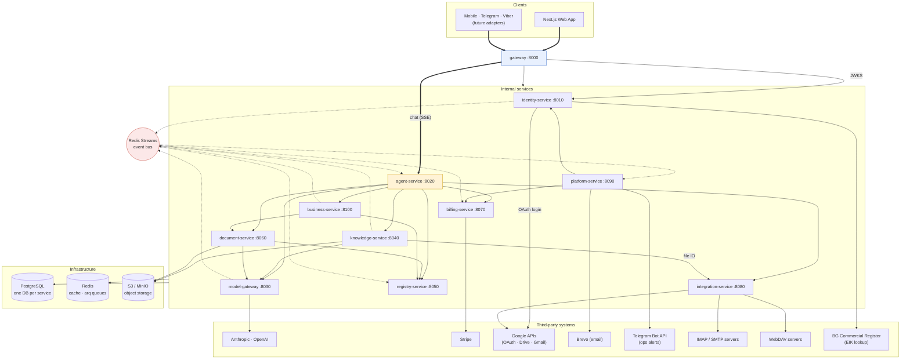

Reading hints:

- **agent-service is the only fan-out hub** (highlighted) — it must reach everything,
  because tools touch everything. Every other service keeps its synchronous fan-out ≤ 2.
- **identity-service and registry-service are leaf services** for synchronous calls —
  they call no other internal service.
- All services share three pieces of infrastructure (own Postgres DB, Redis, and the
  `x7-common` package); only knowledge-service and document-service touch object storage.

---

## 2. Synchronous HTTP dependency graph

Only request/response edges, with what each call is for. An arrow `A --> B` means *A
breaks if B is down* (modulo retries/timeouts) — this is the graph that matters for
deployment ordering and failure-mode analysis.

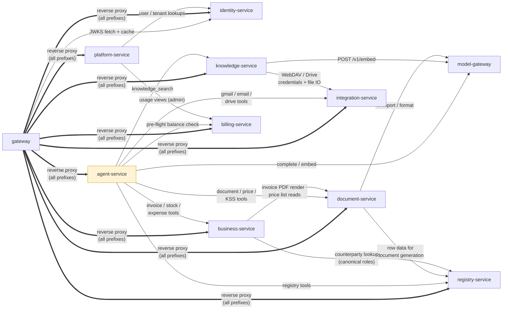

**Depth check** — the longest synchronous chain is 3 hops:
`gateway → agent-service → business-service → document-service` (invoice tool that
renders a PDF). No cycles exist; the graph is a DAG.

| Service | Sync fan-out (calls) | Sync fan-in (called by) |
|---|---|---|
| gateway | 1 (identity JWKS) + proxy | clients only |
| identity-service | 0 — leaf | gateway, platform |
| agent-service | 7 — the hub | gateway, future channel adapters |
| model-gateway | 0 internal (LLM APIs only) | agent, knowledge, document |
| knowledge-service | 2 (model-gw, integration) | agent, gateway |
| registry-service | 0 — leaf | agent, business, document, gateway |
| business-service | 2 (registry, document) | agent, gateway |
| document-service | 2 (model-gw, registry) | agent, business, gateway |
| billing-service | 0 internal (Stripe only) | agent, platform, gateway |
| integration-service | 0 internal (external systems only) | agent, knowledge, gateway |
| platform-service | 2 (identity, billing) | gateway |

One dependency is deliberately absent from this matrix: **service-token minting**. Every
service that makes internal calls obtains short-lived tokens from identity-service, but
callers cache tokens until expiry and receivers verify them locally against the
service-token JWKS — so identity-service sits on the token-*renewal* path, never the
per-request path (see [01 §6](./01-architecture-overview.md#6-identity-tenancy-and-authorization)).

---

## 3. Event (asynchronous) dependency graph

Redis Streams topics with consumer groups. Producers publish facts and move on;
consumers react independently and idempotently. An event edge is a *soft* dependency:
if the consumer is down, events queue and are processed on recovery — nothing upstream
breaks.

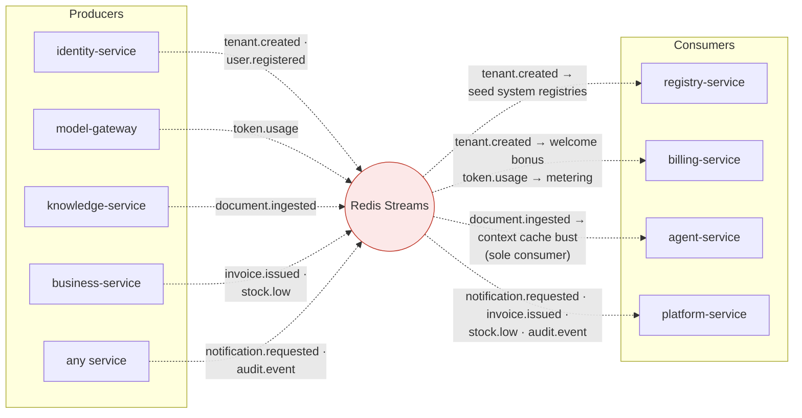

| Topic | Producer | Consumers | Hard or soft? |
|---|---|---|---|
| `token.usage` | model-gateway | billing-service | Soft — metering catches up after downtime |
| `tenant.created` | identity-service | registry-service, billing-service | Soft — seeding/bonus delayed, not lost |
| `user.registered` | identity-service | none yet (reserved for onboarding/analytics) | Soft |
| `document.ingested` | knowledge-service | agent-service | Soft — cache bust delayed |
| `invoice.issued` | business-service | platform-service | Soft — notification delayed |
| `stock.low` | business-service | platform-service | Soft |
| `notification.requested` | any service | platform-service | Soft — email queue with retry |
| `audit.event` | any service | platform-service | Soft — audit sink |

---

## 4. Infrastructure dependency graph

What each service needs to boot and serve. Every service additionally installs the
`x7-common` shared kernel (config, auth plumbing, pooled httpx, event bus client,
observability) — a build-time dependency, not a runtime hop.

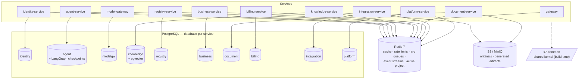

| Service | Own database | Redis usage | Object storage | Third-party |
|---|---|---|---|---|
| gateway | — | rate-limit buckets, JWKS cache | — | — |
| identity-service | `identity` | events, token-cleanup queue | — | Google OAuth, EIK registers |
| agent-service | `agent` (+ checkpoints) | events, retention queues | — | — (everything via services) |
| model-gateway | `modelgw` | events, balance-check queue | — | Anthropic, OpenAI |
| knowledge-service | `knowledge` (pgvector) | events, embed/sync queues, active project | originals | — (Drive/WebDAV via integration-service) |
| registry-service | `registry` | event consumption | — | — |
| business-service | `business` | events, sweep queues | — | — |
| document-service | `document` | import queue | artifacts (signed URLs) | — (Chromium is in-process) |
| billing-service | `billing` | events, top-up/rollup queues | — | Stripe |
| integration-service | `integration` | health-check queue | — | Google, IMAP/SMTP, WebDAV |
| platform-service | `platform` | events, email send queue | — | Brevo, Telegram Bot API |

---

## 5. Per-service dependency graphs

Each graph shows three things at once:

1. **In-service dependencies** (center) — the hexagonal layering inside the service:
   routes/workers → domain services → ports ← adapters. Arrows inside the service box
   follow the fixed dependency direction; adapters *implement* ports (dashed).
2. **Inbound** (left) — who calls this service and why.
3. **Outbound** (right) — internal services, infrastructure, and third-party systems this
   service depends on, plus events produced/consumed.

### 5.1 gateway

No database, no domain logic — pure edge. Its only hard internal dependency is
identity-service's JWKS endpoint (cached, so brief identity downtime does not take the
edge down).

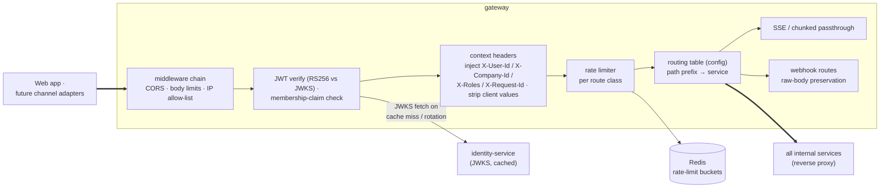

| Direction | Dependency | Failure impact |
|---|---|---|
| Outbound | identity-service JWKS | Cached — tolerates brief outage; cold start needs it |
| Outbound | Redis | Rate limiting degrades (fail-open or fail-closed by config) |
| Outbound | every service | Per-route: only that prefix 502s |
| Inbound | all clients | Single point of entry — run ≥ 2 replicas first |

### 5.2 identity-service

A deliberate **leaf**: calls no internal service, so the auth path never has a
transitive dependency. Sends OTP/reset emails by publishing events, never by holding
SMTP credentials.

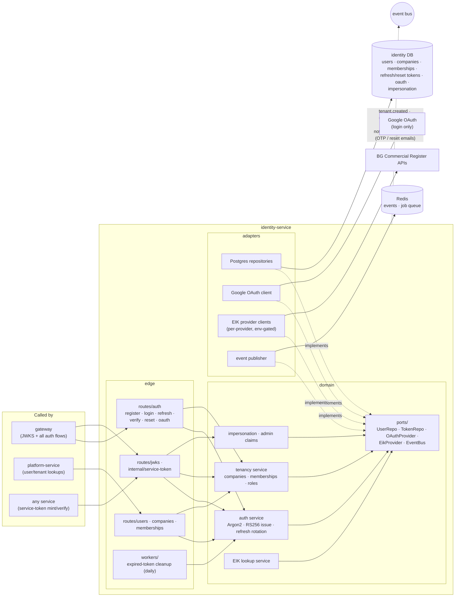

| Direction | Dependency | Notes |
|---|---|---|
| Calls (internal) | **none** — leaf service | Keeps the auth path dependency-free |
| Calls (external) | Google OAuth, EIK registers | Login federation; company onboarding lookup |
| Events out | `tenant.created`, `user.registered`, `audit.event`, `notification.requested` | Email delivery is platform-service's job |
| Inbound | gateway (JWKS, auth), platform-service, any service (service tokens) | JWKS consumers cache keys |

### 5.3 agent-service

The **only fan-out hub** in the system — every tool target is a port + httpx adapter so
targets can be flipped (monolith → new service) during migration without touching the
domain. Conversations are an internal module, not a service.

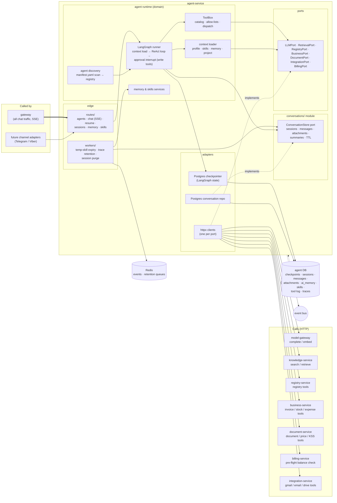

| Direction | Dependency | Notes |
|---|---|---|
| Calls | model-gateway, knowledge, registry, business, document, billing, integration | All behind ports — tool targets are swappable |
| Events out / in | `audit.event` / `document.ingested` | Cache bust is soft |
| Inbound | gateway, future channel adapters | Channels use the chat API, never the store |
| Critical path | model-gateway | A chat turn cannot complete without it |

### 5.4 model-gateway

The only service holding LLM provider keys. Internal fan-out: zero — it only goes
outward to providers. Metering is a structural side effect: every completion emits
`token.usage`, so billing cannot be bypassed.

```mermaid
flowchart LR
    subgraph callers["Called by"]
        agent["agent-service<br/>(chat completions, streaming)"]
        kn["knowledge-service<br/>(embeddings)"]
        doc["document-service<br/>(AI import / format)"]
    end

    subgraph mg["model-gateway"]
        direction TB
        subgraph edge["edge"]
            r1["routes/<br/>v1/complete · v1/embed · v1/models ·<br/>v1/providers (admin) · kill-switch (admin)"]
            w1["workers/<br/>provider balance check (daily)"]
        end
        subgraph domain["domain"]
            comp["completion service<br/>streaming passthrough · retries ·<br/>error normalization"]
            emb["embedding service"]
            meter["metering<br/>token.usage on every call"]
            ks["kill switch<br/>global + per-tenant"]
            preg["provider registry<br/>logical model → provider+model"]
            p1["ports/<br/>LLM · Embedder · ProviderRepo · EventBus"]
        end
        subgraph adapters["adapters"]
            a1["Anthropic adapter"]
            a2["OpenAI adapter"]
            a3["Postgres repo<br/>(encrypted credentials)"]
            a4["event publisher"]
        end
        r1 --> comp & emb
        comp & emb --> ks & meter & preg
        comp & emb & preg --> p1
        w1 --> p1
        a1 & a2 & a3 & a4 -.implements.-> p1
    end

    anthropic["Anthropic API"]
    openai["OpenAI API"]
    db[("modelgw DB<br/>providers · model configs ·<br/>kill-switch state")]
    rd[("Redis<br/>events · job queue")]
    bus(("event bus"))

    agent ==> r1
    kn --> r1
    doc --> r1
    a1 --> anthropic
    a2 --> openai
    a3 --> db
    a4 --> rd
    mg -.->|"token.usage (every call) ·<br/>audit.event ·<br/>notification.requested (balance alert)"| bus
```

| Direction | Dependency | Notes |
|---|---|---|
| Calls (internal) | **none** | Leaf for internal traffic |
| Calls (external) | Anthropic, OpenAI | Provider switch = config change here, invisible to callers |
| Events out | `token.usage`, `audit.event` | Metering is not optional for callers |
| Inbound | agent (hottest path), knowledge, document | Streaming must add near-zero latency |

### 5.5 knowledge-service

The ingestion pipeline is in-service (parse → chunk → embed → index); the two outbound
dependencies are embeddings (model-gateway) and file IO for sync sources
(integration-service). The vector store hides behind a port — pgvector now, swappable.

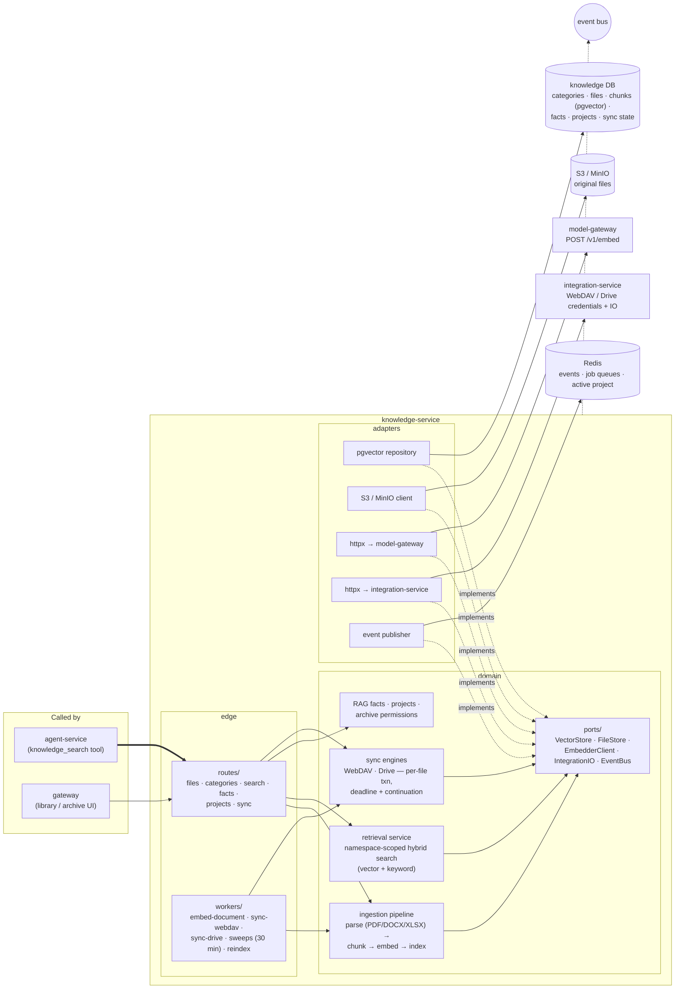

| Direction | Dependency | Notes |
|---|---|---|
| Calls | model-gateway (embed), integration-service (sync IO) | Both only on ingestion paths — search itself is self-contained |
| Events out | `document.ingested` | Consumed by agent (cache bust) + platform |
| Inbound | agent-service, gateway | Search is on the agent tool path |
| Infra | pgvector DB, S3, Redis | Only service (with document) needing object storage |

### 5.6 registry-service

A synchronous **leaf** with no jobs — the simplest runtime profile in the system. Its
only asynchronous duty is consuming `tenant.created` to seed system registries.

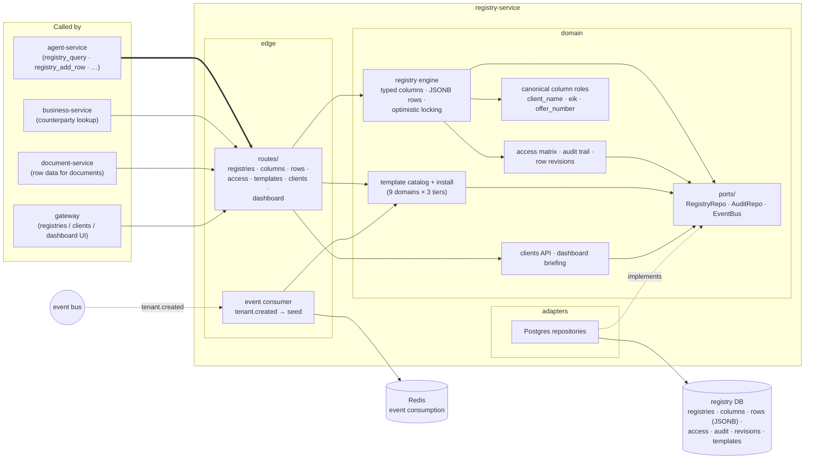

| Direction | Dependency | Notes |
|---|---|---|
| Calls (internal) | **none** — leaf | No jobs either; fully synchronous domain |
| Events in | `tenant.created` | Seeds work pipeline, invoices, tasks registries |
| Inbound | agent, business, document, gateway | Highest sync fan-in after the gateway |

### 5.7 business-service

Typed ERP domains with hard invariants. Two outbound dependencies: registry-service for
counterparty resolution and document-service for PDF rendering + price reads. Issued
invoices snapshot counterparty data — so a registry outage never corrupts a legal
document, only blocks new lookups.

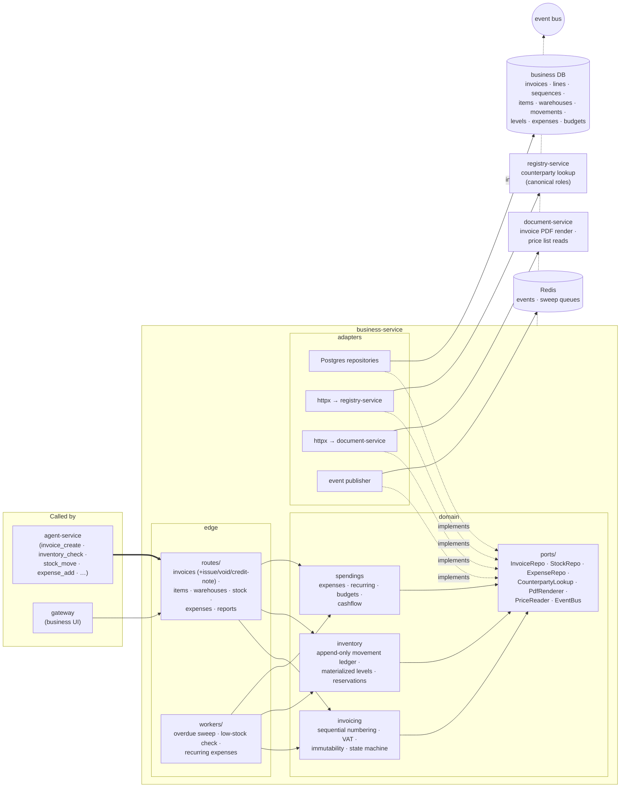

| Direction | Dependency | Notes |
|---|---|---|
| Calls | registry-service, document-service | Counterparty IDs + display snapshots stored locally on issue |
| Events out | `invoice.issued`, `stock.low` | Turned into notifications by platform-service |
| Inbound | agent-service (write tools → approval interrupts), gateway | |

### 5.8 document-service

Rendering is isolated here on purpose (Chromium worker pool with hard memory/time
limits). Outbound: model-gateway for AI-assisted imports/formatting and registry-service
for row data feeding document generation.

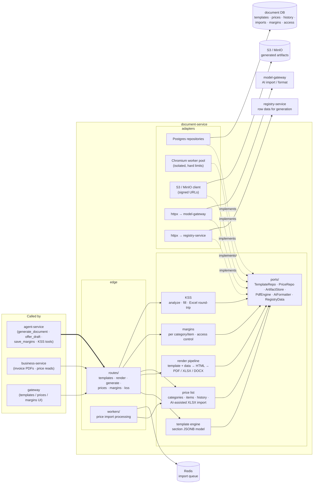

| Direction | Dependency | Notes |
|---|---|---|
| Calls | model-gateway (AI import), registry-service (row data) | Both optional per endpoint — plain rendering needs neither |
| Inbound | agent, business, gateway | business → doc is on the invoice-issue path |
| Infra | document DB, S3, Redis, in-process Chromium | Artifacts never touch local disk |

### 5.9 billing-service

Listens more than it talks: metering and the welcome bonus arrive as events; the only
outbound calls go to Stripe. The webhook enters through the gateway with raw body
preserved and is signature-verified here.

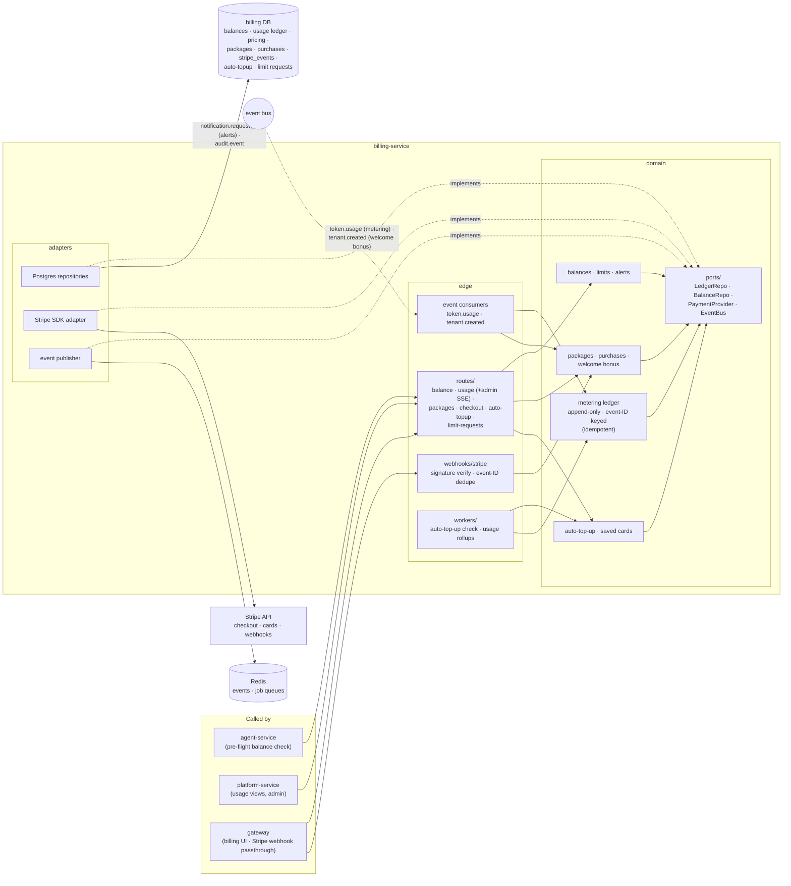

| Direction | Dependency | Notes |
|---|---|---|
| Calls (internal) | **none** | Leaf for internal sync traffic |
| Calls (external) | Stripe | Highest-risk code — idempotent webhooks, stored event IDs |
| Events in / out | `token.usage`, `tenant.created` / `notification.requested`, `audit.event` | Ledger keyed by event ID |
| Inbound | agent (balance check), platform, gateway | |

### 5.10 integration-service

The platform's outward arm: every external connectivity concern (OAuth scopes,
IMAP/SMTP, WebDAV) lives behind folder-discovered adapters with a uniform contract.
Calls no internal service.

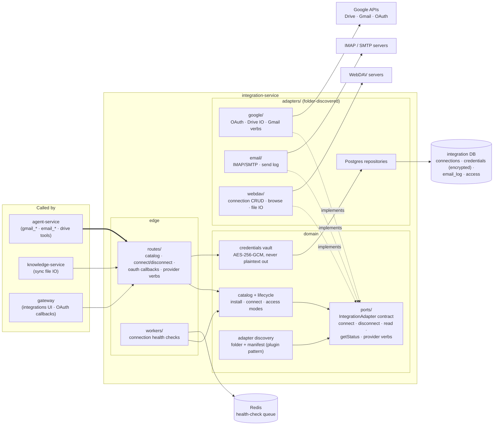

| Direction | Dependency | Notes |
|---|---|---|
| Calls (internal) | **none** | Leaf for internal sync traffic |
| Calls (external) | Google, IMAP/SMTP, WebDAV | Each behind one adapter folder |
| Inbound | agent (email/drive tools), knowledge (sync IO), gateway | |

### 5.11 platform-service

The event sink of the system — four low-traffic modules that mostly consume what other
services publish. Only service holding email (Brevo) and ops-alert (Telegram)
credentials.

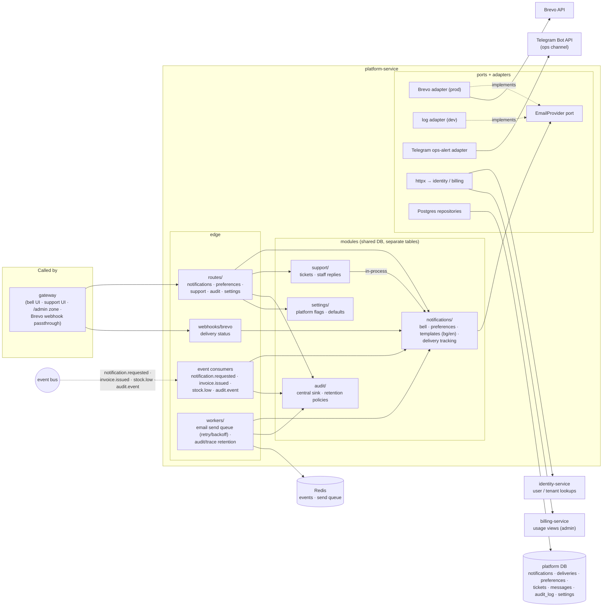

| Direction | Dependency | Notes |
|---|---|---|
| Calls | identity-service (lookups), billing-service (usage views) | Both read-only, admin/UI paths |
| Calls (external) | Brevo, Telegram Bot API | Sole holder of these credentials |
| Events in | `notification.requested`, `invoice.issued`, `stock.low`, `audit.event` | All consumers idempotent (dedupe keys) |
| Inbound | gateway only | Lowest sync fan-in in the system |

---

## 6. Dependency rules (the invariants behind the graphs)

These are the rules the graphs above must keep satisfying as the system grows — review
any new edge against them:

1. **One hub.** Only agent-service may have sync fan-out > 2. A second hub means a
   boundary was drawn wrong.
2. **Leaves stay leaves.** identity-service and registry-service call no internal
   service. The auth path and the data backbone must not acquire transitive
   dependencies. (Service-token minting is the one sanctioned inbound exception for
   identity — and it is cached and locally verified precisely so it never becomes a
   per-request edge.)
3. **No cycles.** The sync HTTP graph is a DAG (§2). If a new feature seems to need
   `A → B → A`, the shared concept belongs in one of them — or in an event.
4. **External systems have exactly one owner.** LLM providers → model-gateway; Stripe →
   billing; Google/IMAP/WebDAV → integration; Brevo/Telegram → platform; OAuth login +
   EIK → identity. No second service may ever hold those credentials.
5. **Databases are private.** No edge may ever point at another service's cylinder.
   Cross-service data moves over HTTP or events only.
6. **Events for facts, HTTP for questions.** If the caller needs an answer to proceed,
   it's a sync call; if it's informing the world, it's an event. Don't disguise
   commands as events.
7. **Inside a service, dependencies point inward.** routes/workers → domain → ports;
   adapters implement ports. A domain module importing httpx or SQLAlchemy is a
   layering bug.
8. **`x7-common` is the only shared code.** Build-time, business-logic-free. Service A
   importing service B's code is forbidden in all cases.

## References

- [01 §3 — system topology](./01-architecture-overview.md#3-system-topology) ·
  [01 §7 — events](./01-architecture-overview.md#7-asynchronous-work-and-events)
- [02 — service catalog + call matrix](./02-service-catalog.md#service-to-service-call-matrix)
- [06 — architectural patterns](./06-architectural-patterns.md)
- Per-service READMEs under [services/](./services/README.md) — each `Dependencies`
  table is the source for the graphs here
