# 07 — Dependency Graphs

Every dependency in the system, drawn. Section 1–4 cover the **whole system** from four
angles (full picture, synchronous HTTP, asynchronous events, infrastructure); §4.5 overlays
the **phase-1 process grouping** on top of those edges. Section 5 gives **one graph per
service** showing its internal (in-service) structure and every external dependency it has —
callers, callees, events, infrastructure, and third-party systems.

Legend used throughout:

| Edge style | Meaning |
|---|---|
| `==>` thick arrow | Primary client traffic path |
| `-->` solid arrow | Synchronous HTTP call (internal network, service tokens) |
| `-.->` dashed arrow | Asynchronous event (Redis Streams, at-least-once) |
| cylinder node | Data store owned exclusively by one service |

---

## 1. Whole-system dependency graph

Everything on one canvas: clients, gateway, all 13 services, the event bus, owned
databases, shared infrastructure, and third-party systems.

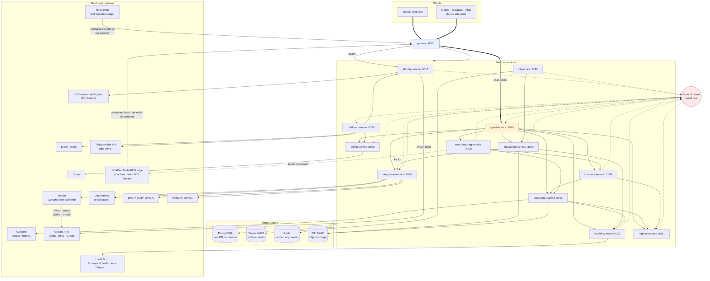
```mermaid
flowchart TB
    subgraph clients["Clients"]
        web["Next.js Web App"]
        future["Mobile · Telegram · Viber<br/>(future adapters)"]
    end

    gw["gateway :8000"]

    subgraph services["Internal services"]
        id["identity-service :8010"]
        agent["agent-service :8020"]
        mg["model-gateway :8030"]
        kn["knowledge-service :8040"]
        reg["registry-service :8050"]
        doc["document-service :8060"]
        bill["billing-service :8070"]
        intg["integration-service :8080"]
        plat["platform-service :8090"]
        biz["business-service :8100"]
        iot["iot-service :8110"]
        mf["manufacturing-service :8120"]
    end

    bus(("Redis Streams<br/>event bus"))

    subgraph infra["Infrastructure"]
        pg[("PostgreSQL<br/>one DB per service")]
        ts[("TimescaleDB<br/>iot time-series")]
        rd[("Redis<br/>cache · arq queues")]
        s3[("S3 / MinIO<br/>object storage")]
    end

    subgraph ext["Third-party systems"]
        llm["LiteLLM → Anthropic/Claude · local Ollama · …"]
        stripe["Stripe"]
        carbone["Carbone<br/>(doc rendering)"]
        nango["Nango<br/>(OAuth/token backend)"]
        documenso["Documenso<br/>(e-signature)"]
        nodered["Node-RED<br/>(IoT ingestion edge)"]
        scada["SCADA / Node-RED edge<br/>(machine data · MES displays)"]
        google["Google APIs<br/>(login · Drive · Gmail)"]
        brevo["Brevo (email)"]
        tgapi["Telegram Bot API<br/>(ops alerts)"]
        mail["IMAP / SMTP servers"]
        wdav["WebDAV servers"]
        eik["BG Commercial Register<br/>(EIK lookup)"]
    end

    %% client traffic
    web ==> gw
    future ==> gw
    gw -->|"JWKS"| id
    gw ==>|"chat (SSE)"| agent
    gw --> services

    %% service-to-service HTTP
    agent --> mg & kn & reg & biz & doc & bill & intg & mf
    kn --> mg
    kn -->|"file IO"| intg
    doc --> mg
    doc --> reg
    biz --> reg
    biz --> doc
    mf --> biz
    mf --> doc
    plat --> id
    plat --> bill

    %% events (condensed — see §3)
    id & mg & kn & biz & intg & iot & mf -.-> bus
    bus -.-> reg & bill & agent & plat & intg

    %% infrastructure
    services --> pg
    services --> rd
    kn & doc --> s3
    iot --> ts

    %% iot ingestion + anomaly knowledge
    nodered -->|"normalized readings<br/>via gateway"| gw
    iot --> kn

    %% scada production facts + active-order push
    scada -->|"production facts (per order)<br/>via gateway"| gw
    mf -.->|"active order push"| scada

    %% third-party
    mg --> llm
    bill --> stripe
    doc --> carbone
    id -->|"OAuth login"| google
    id --> eik
    intg --> nango & documenso & mail & wdav
    nango -->|"OAuth · proxy<br/>(Drive · Gmail)"| google
    plat --> brevo & tgapi

    style agent fill:#fff3d6,stroke:#cc9a06
    style gw fill:#e8f0fe,stroke:#3b6fc9
    style bus fill:#fce8e8,stroke:#c0392b
```

Reading hints:

- **agent-service is the only fan-out hub** (highlighted) — it must reach everything,
  because tools touch everything. Every other service keeps its synchronous fan-out ≤ 2.
- **identity-service and registry-service are leaf services** for synchronous calls —
  they call no other internal service.
- All services share three pieces of infrastructure (own Postgres DB, Redis, and the
  `x7-common` package); only knowledge-service and document-service touch object storage
  (iot-service does too, *only if* sensors emit binary payloads). iot-service's `iot` DB runs
  on TimescaleDB (still Postgres, still database-per-service).

---

## 2. Synchronous HTTP dependency graph

Only request/response edges, with what each call is for. An arrow `A --> B` means *A
breaks if B is down* (modulo retries/timeouts) — this is the graph that matters for
deployment ordering and failure-mode analysis.

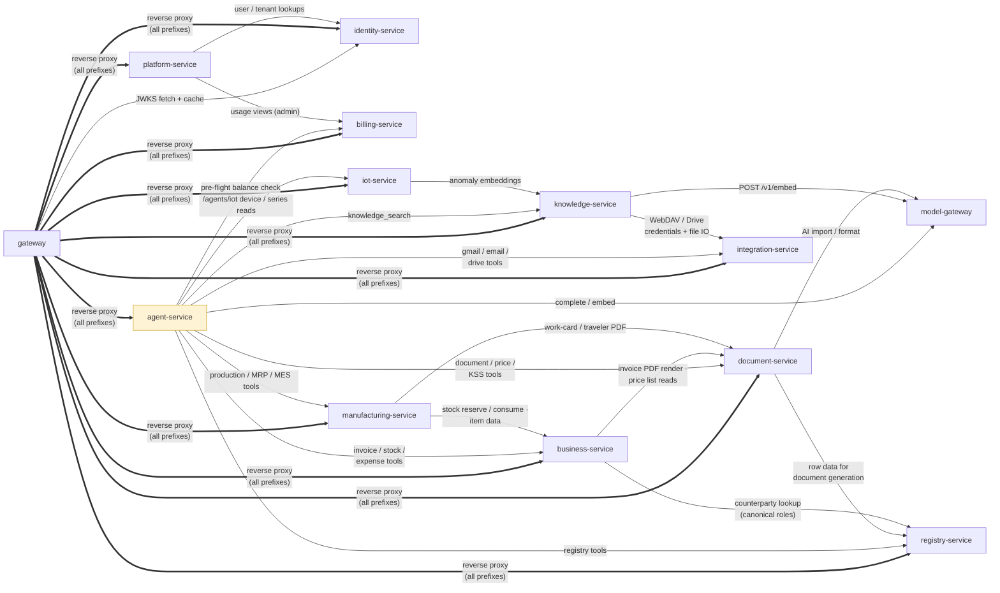
```mermaid
flowchart LR
    gw["gateway"]
    id["identity-service"]
    agent["agent-service"]
    mg["model-gateway"]
    kn["knowledge-service"]
    reg["registry-service"]
    biz["business-service"]
    doc["document-service"]
    bill["billing-service"]
    intg["integration-service"]
    plat["platform-service"]
    iot["iot-service"]
    mf["manufacturing-service"]

    gw -->|"JWKS fetch + cache"| id
    gw ==>|"reverse proxy<br/>(all prefixes)"| agent & id & kn & reg & biz & doc & bill & intg & plat & iot & mf

    agent -->|"complete / embed"| mg
    agent -->|"knowledge_search"| kn
    agent -->|"registry tools"| reg
    agent -->|"invoice / stock /<br/>expense tools"| biz
    agent -->|"document / price /<br/>KSS tools"| doc
    agent -->|"pre-flight balance check"| bill
    agent -->|"gmail / email /<br/>drive tools"| intg

    kn -->|"POST /v1/embed"| mg
    kn -->|"WebDAV / Drive<br/>credentials + file IO"| intg

    doc -->|"AI import / format"| mg
    doc -->|"row data for<br/>document generation"| reg

    biz -->|"counterparty lookup<br/>(canonical roles)"| reg
    biz -->|"invoice PDF render ·<br/>price list reads"| doc

    plat -->|"user / tenant lookups"| id
    plat -->|"usage views (admin)"| bill

    iot -->|"anomaly embeddings"| kn
    agent -->|"/agents/iot device / series reads"| iot

    agent -->|"production / MRP / MES tools"| mf
    mf -->|"stock reserve / consume ·<br/>item data"| biz
    mf -->|"work-card / traveler PDF"| doc

    style agent fill:#fff3d6,stroke:#cc9a06
```

**Depth check** — the longest synchronous *path* in the DAG is now 4 hops:
`gateway → agent-service → manufacturing-service → business-service → document-service`.
This is a **static** path, not a single cascading request — a production tool reserves
stock (`mf → biz`) and, separately, business-service renders invoice PDFs (`biz → doc`);
no one request traverses all four. No cycles exist; the graph remains a DAG. (The previous
3-hop invoice path `gateway → agent → business → document` is unchanged.)

| Service | Sync fan-out (calls) | Sync fan-in (called by) |
|---|---|---|
| gateway | 1 (identity JWKS) + proxy | clients only |
| identity-service | 0 — leaf | gateway, platform |
| agent-service | 9 — the hub | gateway, future channel adapters |
| model-gateway | 0 internal (LiteLLM → providers only) | agent, knowledge, document |
| knowledge-service | 2 (model-gw, integration) | agent, gateway, iot |
| registry-service | 0 — leaf | agent, business, document, gateway |
| business-service | 2 (registry, document) | agent, gateway, manufacturing |
| document-service | 2 internal (model-gw, registry) + Carbone (external rendering) | agent, business, gateway, manufacturing |
| billing-service | 0 internal (Stripe only) | agent, platform, gateway |
| integration-service | 0 internal (external systems only: Nango, Documenso, Google, IMAP/SMTP, WebDAV) | agent, knowledge, gateway |
| platform-service | 2 (identity, billing) | gateway |
| iot-service | 1 (knowledge) + Node-RED (external ingestion) | gateway, agent (`/agents/iot`) |
| manufacturing-service | 2 (business, document) + SCADA/Node-RED (external ingestion) | gateway, agent (production/MRP/MES tools) |

One dependency is deliberately absent from this matrix: **service-token minting**. Every
service that makes internal calls obtains short-lived tokens from identity-service, but
callers cache tokens until expiry and receivers verify them locally against the
service-token JWKS — so identity-service sits on the token-*renewal* path, never the
per-request path (see [01 §6](./01-architecture-overview.md#6-identity-tenancy-and-authorization)).

---

## 3. Event (asynchronous) dependency graph

Redis Streams topics with consumer groups. Producers publish facts and move on;
consumers react independently and idempotently. An event edge is a *soft* dependency:
if the consumer is down, events queue and are processed on recovery — nothing upstream
breaks.

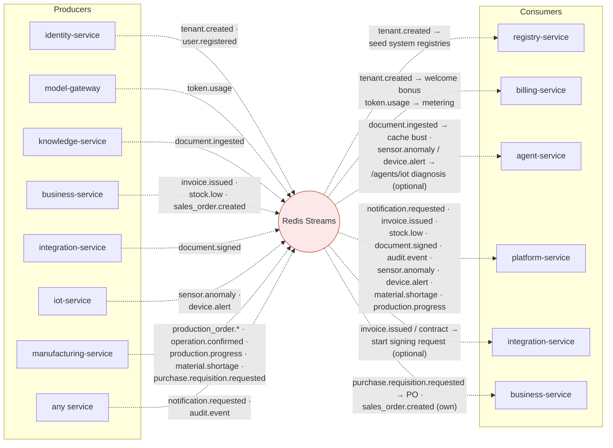
```mermaid
flowchart LR
    subgraph producers["Producers"]
        id["identity-service"]
        mg["model-gateway"]
        kn["knowledge-service"]
        biz["business-service"]
        intg["integration-service"]
        iot["iot-service"]
        mf["manufacturing-service"]
        any["any service"]
    end

    bus(("Redis Streams"))

    subgraph consumers["Consumers"]
        reg["registry-service"]
        bill["billing-service"]
        agent["agent-service"]
        plat["platform-service"]
        intgc["integration-service"]
        bizc["business-service"]
    end

    id -.->|"tenant.created ·<br/>user.registered"| bus
    mg -.->|"token.usage"| bus
    kn -.->|"document.ingested"| bus
    biz -.->|"invoice.issued ·<br/>stock.low · sales_order.created"| bus
    intg -.->|"document.signed"| bus
    iot -.->|"sensor.anomaly ·<br/>device.alert"| bus
    mf -.->|"production_order.* · operation.confirmed ·<br/>production.progress · material.shortage ·<br/>purchase.requisition.requested"| bus
    any -.->|"notification.requested ·<br/>audit.event"| bus

    bus -.->|"tenant.created →<br/>seed system registries"| reg
    bus -.->|"tenant.created → welcome bonus<br/>token.usage → metering"| bill
    bus -.->|"document.ingested → cache bust ·<br/>sensor.anomaly / device.alert →<br/>/agents/iot diagnosis (optional)"| agent
    bus -.->|"notification.requested · invoice.issued ·<br/>stock.low · document.signed · audit.event ·<br/>sensor.anomaly · device.alert ·<br/>material.shortage · production.progress"| plat
    bus -.->|"invoice.issued / contract →<br/>start signing request (optional)"| intgc
    bus -.->|"purchase.requisition.requested → PO ·<br/>sales_order.created (own)"| bizc

    style bus fill:#fce8e8,stroke:#c0392b
```

| Topic | Producer | Consumers | Hard or soft? |
|---|---|---|---|
| `token.usage` | model-gateway | billing-service | Soft — metering catches up after downtime |
| `tenant.created` | identity-service | registry-service, billing-service | Soft — seeding/bonus delayed, not lost |
| `user.registered` | identity-service | none yet (reserved for onboarding/analytics) | Soft |
| `document.ingested` | knowledge-service | agent-service | Soft — cache bust delayed |
| `invoice.issued` | business-service | platform-service; integration-service (optional — start signing) | Soft — notification delayed |
| `stock.low` | business-service | platform-service | Soft |
| `document.signed` | integration-service (Documenso webhook) | platform-service (notify); business-service (optional) | Soft — e-signature completion fact |
| `sensor.anomaly` | iot-service | platform-service (notify); agent-service (optional — `/agents/iot`) | Soft — alert-rule breach; carries trusted `company_id` |
| `device.alert` | iot-service | platform-service (notify); agent-service (optional) | Soft — device fault/offline; carries trusted `company_id` |
| `production_order.released` / `.completed` | manufacturing-service | SCADA display edge (active-order push); platform-service | Soft — shop-floor dispatch / completion fact |
| `operation.confirmed` / `production.progress` | manufacturing-service | platform-service; analytics/dashboards | Soft — real-time progress (machine + MES); feeds §4.2 OEE |
| `material.shortage` | manufacturing-service | platform-service (notify planner) | Soft — MRP net-shortage signal |
| `purchase.requisition.requested` | manufacturing-service | business-service (purchasing → PO) | Soft — MRP auto-requisition (ТЗ §4.4) |
| `sales_order.created` | business-service | manufacturing-service (make-to-order) | Soft — sales order triggers a production order (ТЗ §4.5) |
| `notification.requested` | any service | platform-service | Soft — email queue with retry |
| `audit.event` | any service | platform-service | Soft — audit sink |

---

## 4. Infrastructure dependency graph

What each service needs to boot and serve. Every service additionally installs the
`x7-common` shared kernel (config, auth plumbing, pooled httpx, event bus client,
observability) — a build-time dependency, not a runtime hop.

```mermaid
flowchart TB
    subgraph svcs["Services"]
        gw["gateway"]
        id["identity-service"]
        agent["agent-service"]
        mg["model-gateway"]
        kn["knowledge-service"]
        reg["registry-service"]
        biz["business-service"]
        doc["document-service"]
        bill["billing-service"]
        intg["integration-service"]
        plat["platform-service"]
        iot["iot-service"]
        mf["manufacturing-service"]
    end

    subgraph pgs["PostgreSQL — database per service"]
        dbid[("identity")]
        dbag[("agent<br/>+ LangGraph checkpoints")]
        dbmg[("modelgw")]
        dbkn[("knowledge<br/>+ Qdrant")]
        dbrg[("registry")]
        dbbz[("business")]
        dbdc[("document")]
        dbbl[("billing")]
        dbin[("integration")]
        dbpl[("platform")]
        dbio[("iot<br/>+ TimescaleDB extension")]
        dbmf[("manufacturing")]
    end

    rd[("Redis 7<br/>cache · rate limits · arq queues ·<br/>event streams · active project")]
    s3[("S3 / MinIO<br/>originals · generated artifacts")]
    unstr["Unstructured<br/>(internal parse service)"]
    carbone["Carbone<br/>(internal render engine)"]
    nango["Nango<br/>(internal OAuth/token backend<br/>+ own Postgres/Redis)"]
    documenso["Documenso<br/>(internal e-signature<br/>+ own Postgres)"]
    nodered["Node-RED<br/>(IoT ingestion edge<br/>→ gateway only)"]
    common[/"x7-common<br/>shared kernel (build-time)"/]

    gw --> rd
    id --> dbid & rd
    agent --> dbag & rd
    mg --> dbmg & rd
    kn --> dbkn & rd & s3 & unstr
    reg --> dbrg & rd
    biz --> dbbz & rd
    doc --> dbdc & rd & s3 & carbone
    bill --> dbbl & rd
    intg --> dbin & rd & nango & documenso
    plat --> dbpl & rd
    iot --> dbio & rd
    mf --> dbmf & rd
    nodered -.->|readings via gateway| iot

    svcs -.-> common
```

| Service | Own database | Redis usage | Object storage | Third-party |
|---|---|---|---|---|
| gateway | — | rate-limit buckets, JWKS cache | — | — |
| identity-service | `identity` | events, token-cleanup queue | — | Google OAuth, EIK registers |
| agent-service | `agent` (+ checkpoints) | events, retention queues | — | — (everything via services) |
| model-gateway | `modelgw` | events, balance-check queue | — | LiteLLM → Anthropic/Claude, local Ollama |
| knowledge-service | `knowledge` (+ Qdrant) | events, embed/sync queues, active project | originals | Unstructured (parsing); Drive/WebDAV via integration-service |
| registry-service | `registry` | event consumption | — | — |
| business-service | `business` | events, sweep queues | — | — |
| document-service | `document` | import queue | artifacts + Carbone template binaries (signed URLs) | **Carbone** (rendering, internal — stateless) |
| billing-service | `billing` | events, top-up/rollup queues | — | Stripe |
| integration-service | `integration` | health-check queue, sync queues | — | **Nango** (OAuth/token backend, internal — own Postgres/Redis), **Documenso** (e-signature, internal — own Postgres), Google (via Nango proxy), IMAP/SMTP, WebDAV |
| platform-service | `platform` | events, email send queue | — | Brevo, Telegram Bot API |
| iot-service | `iot` (**TimescaleDB**) | events, alert-eval + aggregate-refresh queues | optional (binary sensor payloads) | **Node-RED** (ingestion edge, gateway-only — own volume/MQTT broker) |
| manufacturing-service | `manufacturing` | events, MRP + CRP + sweep queues | — (PDFs live in document-service) | **SCADA / Node-RED edge** (production-fact ingestion + MES displays, gateway-only) |

---

## 4.5 Phase-1 co-deployment overlay

The §2 synchronous graph drawn again, but partitioned by the **phase-1 process grouping**
from [10-phase1-co-deployment.md](./10-phase1-co-deployment.md). Same edges, same DAG —
only the box boundaries are new. An edge **inside** a box becomes a local call
(loopback HTTP, or an in-process port adapter for the hottest ones); an edge **crossing** a
box stays a real network hop. The point: most of the chatty internal traffic falls inside a
box.

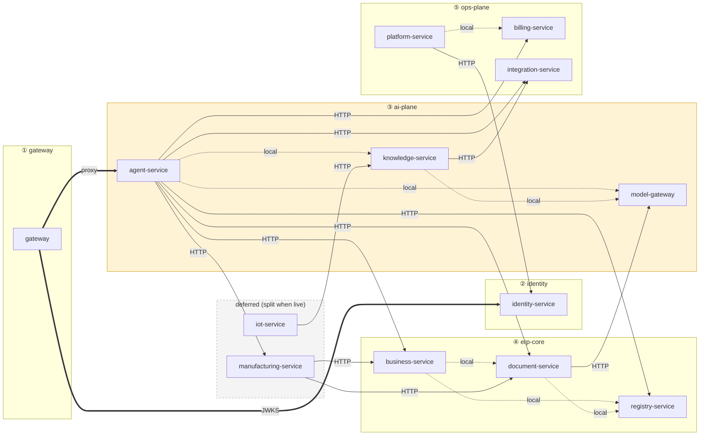
```mermaid
flowchart LR
    subgraph edge["① gateway"]
        gw["gateway"]
    end
    subgraph idn["② identity"]
        id["identity-service"]
    end
    subgraph ai["③ ai-plane"]
        agent["agent-service"]
        mg["model-gateway"]
        kn["knowledge-service"]
    end
    subgraph erp["④ erp-core"]
        reg["registry-service"]
        biz["business-service"]
        doc["document-service"]
    end
    subgraph ops["⑤ ops-plane"]
        bill["billing-service"]
        intg["integration-service"]
        plat["platform-service"]
    end
    subgraph later["deferred (split when live)"]
        iot["iot-service"]
        mf["manufacturing-service"]
    end

    %% in-box = local calls (loopback / in-process)
    agent -.local.-> mg
    agent -.local.-> kn
    kn -.local.-> mg
    biz -.local.-> reg
    biz -.local.-> doc
    doc -.local.-> reg
    plat -.local.-> bill

    %% crossing a box = network hop
    gw ==>|"JWKS"| id
    gw ==>|"proxy"| agent
    agent -->|HTTP| reg
    agent -->|HTTP| biz
    agent -->|HTTP| doc
    agent -->|HTTP| bill
    agent -->|HTTP| intg
    doc -->|HTTP| mg
    kn -->|HTTP| intg
    plat -->|HTTP| id
    iot -->|HTTP| kn
    mf -->|HTTP| biz
    mf -->|HTTP| doc
    agent -->|HTTP| mf

    style ai fill:#fff3d6,stroke:#cc9a06
    style later fill:#f4f4f4,stroke:#aaa,stroke-dasharray: 4 4
```

What collapses inside a box (`-.local.->`) vs. what stays on the wire (`-->|HTTP|`):

| Becomes a local call (in-box) | Stays a network hop (crosses a box) |
|---|---|
| `agent → model-gateway` (hottest hop, every ReAct step) | `agent → registry / business / document` (ai-plane → erp-core) |
| `agent → knowledge` (RAG on most turns) | `agent → billing` (balance check), `agent → integration` |
| `knowledge → model-gateway` (embeddings) | `document → model-gateway` (erp-core → ai-plane) |
| `business → registry`, `business → document` | `knowledge → integration` (file IO) |
| `document → registry` | `platform → identity` |
| `platform → billing` | `gateway → *` (proxy, always a hop) |

Three invariants survive the overlay unchanged:

- **The DAG is identical.** Grouping draws boxes around existing edges; it adds none and
  removes none. Every rule in §6 still holds (one hub, leaves stay leaves, no cycles).
- **All events stay on Redis Streams** (§3) — co-location never turns a published fact into
  an in-process side effect. The `token.usage` outbox in particular is untouchable even
  though model-gateway now shares a box with agent-service.
- **Databases stay private** (§4) — one logical DB per service, even when two services'
  schemas live on the same Postgres cluster. That privacy is what keeps splitting a service
  back out a config change, not a rewrite (split triggers: [10 §5](./10-phase1-co-deployment.md#5-when-to-split-each-group-back-out)).

---

## 5. Per-service dependency graphs

Each graph shows three things at once:

1. **In-service dependencies** (center) — the hexagonal layering inside the service:
   routes/workers → domain services → ports ← adapters. Arrows inside the service box
   follow the fixed dependency direction; adapters *implement* ports (dashed).
2. **Inbound** (left) — who calls this service and why.
3. **Outbound** (right) — internal services, infrastructure, and third-party systems this
   service depends on, plus events produced/consumed.

### 5.1 gateway

No database, no domain logic — pure edge. Its only hard internal dependency is
identity-service's JWKS endpoint (cached, so brief identity downtime does not take the
edge down).

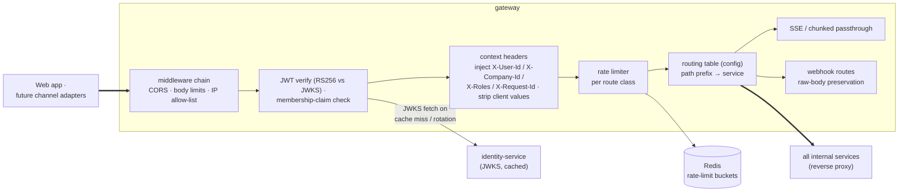
```mermaid
flowchart LR
    clients["Web app ·<br/>future channel adapters"]

    subgraph gw["gateway"]
        direction TB
        mw["middleware chain<br/>CORS · body limits · IP allow-list"]
        authmw["JWT verify (RS256 vs JWKS) ·<br/>membership-claim check"]
        ctx["context headers<br/>inject X-User-Id / X-Company-Id /<br/>X-Roles / X-Request-Id · strip client values"]
        rl["rate limiter<br/>per route class"]
        rt["routing table (config)<br/>path prefix → service"]
        sse["SSE / chunked passthrough"]
        wh["webhook routes<br/>raw-body preservation"]

        mw --> authmw --> ctx --> rl --> rt
        rt --> sse
        rt --> wh
    end

    id["identity-service<br/>(JWKS, cached)"]
    all["all internal services<br/>(reverse proxy)"]
    rd[("Redis<br/>rate-limit buckets")]

    clients ==> mw
    authmw -->|"JWKS fetch on<br/>cache miss / rotation"| id
    rt ==> all
    rl --> rd
```

| Direction | Dependency | Failure impact |
|---|---|---|
| Outbound | identity-service JWKS | Cached — tolerates brief outage; cold start needs it |
| Outbound | Redis | Rate limiting degrades (fail-open or fail-closed by config) |
| Outbound | every service | Per-route: only that prefix 502s |
| Inbound | all clients | Single point of entry — run ≥ 2 replicas first |

### 5.2 identity-service

A deliberate **leaf**: calls no internal service, so the auth path never has a
transitive dependency. Sends OTP/reset emails by publishing events, never by holding
SMTP credentials.

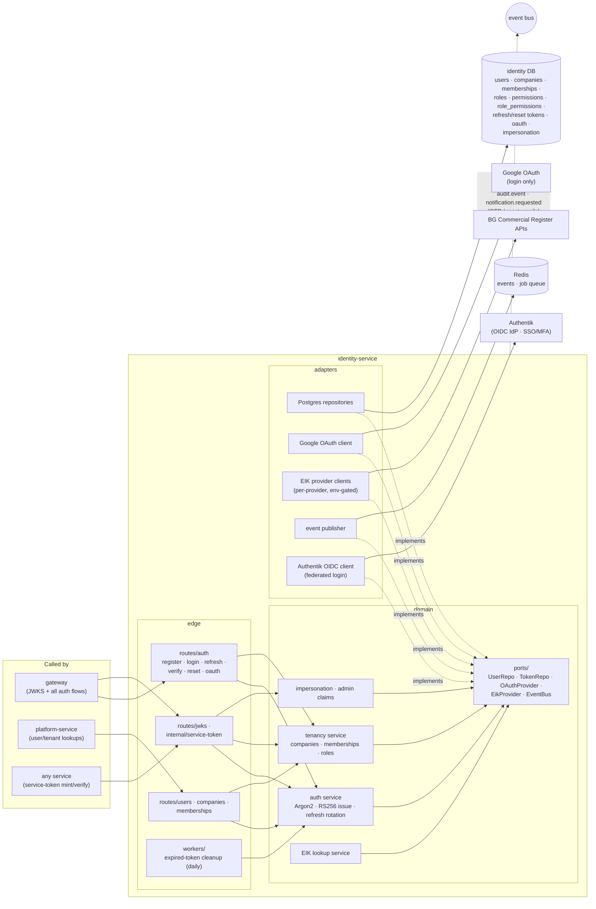
```mermaid
flowchart LR
    subgraph callers["Called by"]
        gw["gateway<br/>(JWKS + all auth flows)"]
        plat["platform-service<br/>(user/tenant lookups)"]
        anysvc["any service<br/>(service-token mint/verify)"]
    end

    subgraph id["identity-service"]
        direction TB
        subgraph edge["edge"]
            r1["routes/auth<br/>register · login · refresh ·<br/>verify · reset · oauth"]
            r2["routes/users · companies ·<br/>memberships"]
            r3["routes/jwks ·<br/>internal/service-token"]
            w1["workers/<br/>expired-token cleanup (daily)"]
        end
        subgraph domain["domain"]
            s1["auth service<br/>Argon2 · RS256 issue · refresh rotation"]
            s2["tenancy service<br/>companies · memberships · roles"]
            s3["impersonation · admin claims"]
            s4["EIK lookup service"]
            p1["ports/<br/>UserRepo · TokenRepo · OAuthProvider ·<br/>EikProvider · EventBus"]
        end
        subgraph adapters["adapters"]
            a1["Postgres repositories"]
            a2["Google OAuth client"]
            a3["EIK provider clients<br/>(per-provider, env-gated)"]
            a4["event publisher"]
            a5["Authentik OIDC client<br/>(federated login)"]
        end
        r1 & r2 & r3 --> s1 & s2
        r3 --> s3
        w1 --> s1
        s1 & s2 & s3 & s4 --> p1
        a1 & a2 & a3 & a4 & a5 -.implements.-> p1
    end

    db[("identity DB<br/>users · companies · memberships ·<br/>roles · permissions · role_permissions ·<br/>refresh/reset tokens · oauth ·<br/>impersonation")]
    rd[("Redis<br/>events · job queue")]
    goog["Google OAuth<br/>(login only)"]
    ak["Authentik<br/>(OIDC IdP · SSO/MFA)"]
    eik["BG Commercial Register APIs"]
    bus(("event bus"))

    gw --> r1 & r3
    plat --> r2
    anysvc --> r3
    a1 --> db
    a2 --> goog
    a3 --> eik
    a4 --> rd
    a5 --> ak
    id -.->|"tenant.created · user.registered ·<br/>audit.event · notification.requested<br/>(OTP / reset emails)"| bus
```

| Direction | Dependency | Notes |
|---|---|---|
| Calls (internal) | **none** — leaf service | Keeps the auth path dependency-free |
| Calls (external) | **Authentik (OIDC IdP)**, Google OAuth, EIK registers | Authentik = primary federated login (authn); authorization (roles/permissions) stays local; EIK = company onboarding lookup |
| Events out | `tenant.created`, `user.registered`, `audit.event`, `notification.requested` | Email delivery is platform-service's job |
| Inbound | gateway (JWKS, auth), platform-service, any service (service tokens) | JWKS consumers cache keys |

### 5.3 agent-service

The **only fan-out hub** in the system — every tool target is a port + httpx adapter so
targets can be flipped (monolith → new service) during migration without touching the
domain. Conversations are an internal module, not a service.

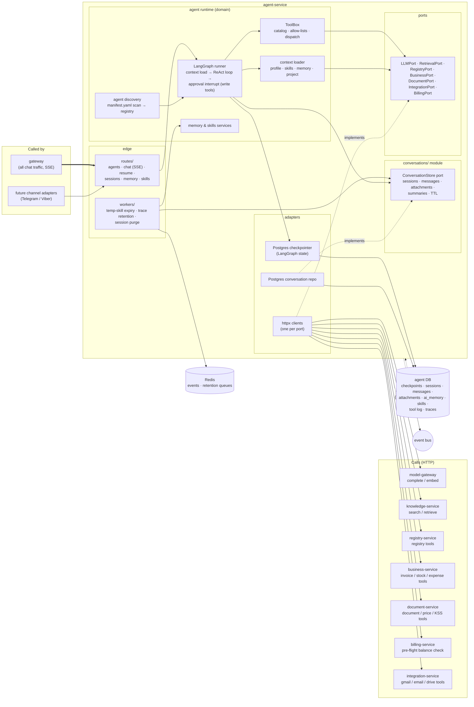
```mermaid
flowchart LR
    subgraph callers["Called by"]
        gw["gateway<br/>(all chat traffic, SSE)"]
        ch["future channel adapters<br/>(Telegram / Viber)"]
    end

    subgraph agent["agent-service"]
        direction TB
        subgraph edge["edge"]
            r1["routes/<br/>agents · chat (SSE) · resume ·<br/>sessions · memory · skills"]
            w1["workers/<br/>temp-skill expiry · trace retention ·<br/>session purge"]
        end
        subgraph runtime["agent runtime (domain)"]
            disc["agent discovery<br/>manifest.yaml scan → registry"]
            runner["LangGraph runner<br/>context load → ReAct loop →<br/>approval interrupt (write tools)"]
            tb["ToolBox<br/>catalog · allow-lists · dispatch"]
            ctxl["context loader<br/>profile · skills · memory · project"]
            mem["memory & skills services"]
        end
        subgraph conv["conversations/ module"]
            cs["ConversationStore port<br/>sessions · messages · attachments ·<br/>summaries · TTL"]
        end
        subgraph ports["ports"]
            p1["LLMPort · RetrievalPort ·<br/>RegistryPort · BusinessPort ·<br/>DocumentPort · IntegrationPort ·<br/>BillingPort"]
        end
        subgraph adapters["adapters"]
            a1["httpx clients<br/>(one per port)"]
            a2["Postgres checkpointer<br/>(LangGraph state)"]
            a3["Postgres conversation repo"]
        end
        r1 --> runner
        w1 --> mem & cs
        runner --> tb & ctxl & cs
        disc --> runner
        tb & ctxl --> p1
        runner --> a2
        a1 -.implements.-> p1
        a3 -.implements.-> cs
    end

    subgraph downstream["Calls (HTTP)"]
        mg["model-gateway<br/>complete / embed"]
        kn["knowledge-service<br/>search / retrieve"]
        reg["registry-service<br/>registry tools"]
        biz["business-service<br/>invoice / stock / expense tools"]
        doc["document-service<br/>document / price / KSS tools"]
        bill["billing-service<br/>pre-flight balance check"]
        intg["integration-service<br/>gmail / email / drive tools"]
    end

    db[("agent DB<br/>checkpoints · sessions · messages ·<br/>attachments · ai_memory · skills ·<br/>tool log · traces")]
    rd[("Redis<br/>events · retention queues")]
    bus(("event bus"))

    gw ==> r1
    ch --> r1
    a1 --> mg & kn & reg & biz & doc & bill & intg
    a2 & a3 --> db
    agent -.->|"audit.event"| bus
    bus -.->|"document.ingested<br/>(context cache bust)"| agent
    w1 --> rd
```

| Direction | Dependency | Notes |
|---|---|---|
| Calls | model-gateway, knowledge, registry, business, document, billing, integration | All behind ports — tool targets are swappable |
| Events out / in | `audit.event` / `document.ingested` | Cache bust is soft |
| Inbound | gateway, future channel adapters | Channels use the chat API, never the store |
| Critical path | model-gateway | A chat turn cannot complete without it |

### 5.4 model-gateway

The only service holding LLM provider keys — a **thin owner backed by LiteLLM**. Internal
fan-out: zero — it only goes outward, to LiteLLM, which fans out to providers (cloud
Anthropic/Claude + local Ollama, more by config). Metering is a structural side effect:
every completion emits `token.usage`, so billing cannot be bypassed. LiteLLM is an
implementation detail behind the provider port (swappable; an MVP may start with a direct
adapter and switch to LiteLLM when the second provider lands).

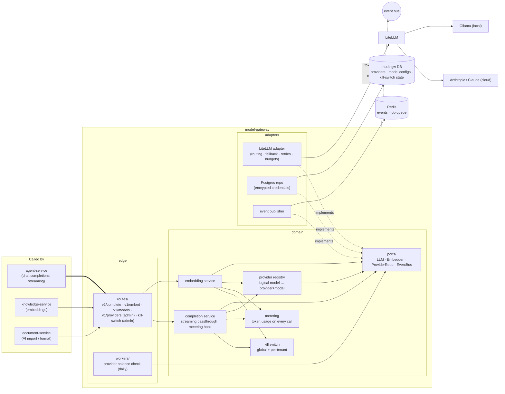
```mermaid
flowchart LR
    subgraph callers["Called by"]
        agent["agent-service<br/>(chat completions, streaming)"]
        kn["knowledge-service<br/>(embeddings)"]
        doc["document-service<br/>(AI import / format)"]
    end

    subgraph mg["model-gateway"]
        direction TB
        subgraph edge["edge"]
            r1["routes/<br/>v1/complete · v1/embed · v1/models ·<br/>v1/providers (admin) · kill-switch (admin)"]
            w1["workers/<br/>provider balance check (daily)"]
        end
        subgraph domain["domain"]
            comp["completion service<br/>streaming passthrough ·<br/>metering hook"]
            emb["embedding service"]
            meter["metering<br/>token.usage on every call"]
            ks["kill switch<br/>global + per-tenant"]
            preg["provider registry<br/>logical model → provider+model"]
            p1["ports/<br/>LLM · Embedder · ProviderRepo · EventBus"]
        end
        subgraph adapters["adapters"]
            a1["LiteLLM adapter<br/>(routing · fallback · retries · budgets)"]
            a3["Postgres repo<br/>(encrypted credentials)"]
            a4["event publisher"]
        end
        r1 --> comp & emb
        comp & emb --> ks & meter & preg
        comp & emb & preg --> p1
        w1 --> p1
        a1 & a3 & a4 -.implements.-> p1
    end

    litellm["LiteLLM"]
    anthropic["Anthropic / Claude (cloud)"]
    ollama["Ollama (local)"]
    db[("modelgw DB<br/>providers · model configs ·<br/>kill-switch state")]
    rd[("Redis<br/>events · job queue")]
    bus(("event bus"))

    agent ==> r1
    kn --> r1
    doc --> r1
    a1 --> litellm
    litellm --> anthropic
    litellm --> ollama
    a3 --> db
    a4 --> rd
    mg -.->|"token.usage (every call) ·<br/>audit.event ·<br/>notification.requested (balance alert)"| bus
```

| Direction | Dependency | Notes |
|---|---|---|
| Calls (internal) | **none** | Leaf for internal traffic |
| Calls (external) | **LiteLLM** → Anthropic/Claude, local Ollama, … | Provider switch/fallback = LiteLLM config, invisible to callers |
| Events out | `token.usage`, `audit.event` | Metering is not optional for callers; our event is billing truth |
| Inbound | agent (hottest path), knowledge, document | Streaming must add near-zero latency |

### 5.5 knowledge-service

The ingestion pipeline orchestrates parse → chunk → embed → index; the outbound dependencies
are parsing (the internal **Unstructured** service), embeddings (model-gateway), and file IO
for sync sources (integration-service). Both the vector store and the parser hide behind
ports — Qdrant and Unstructured respectively.

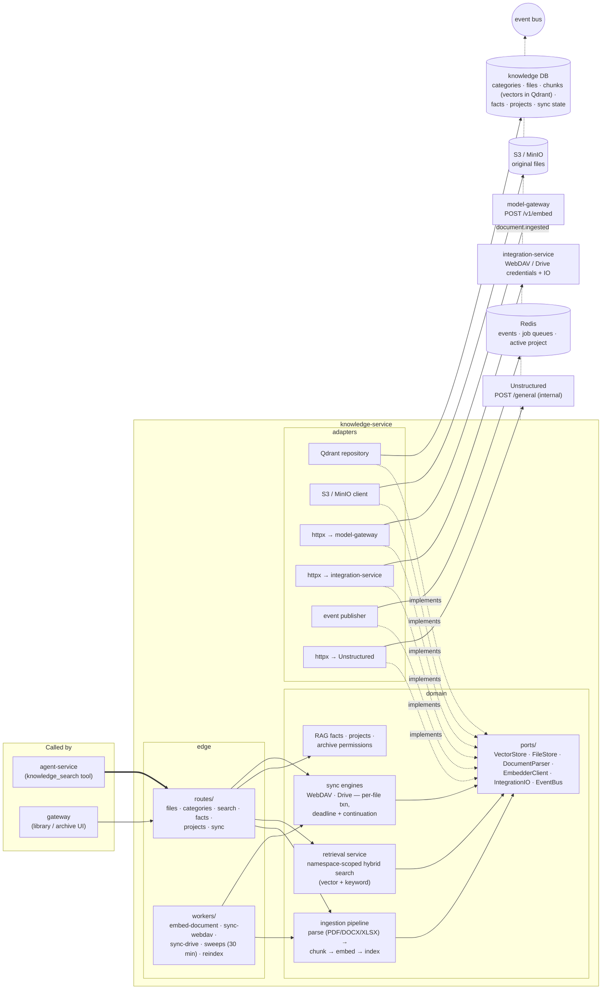
```mermaid
flowchart LR
    subgraph callers["Called by"]
        agent["agent-service<br/>(knowledge_search tool)"]
        gw["gateway<br/>(library / archive UI)"]
    end

    subgraph kn["knowledge-service"]
        direction TB
        subgraph edge["edge"]
            r1["routes/<br/>files · categories · search · facts ·<br/>projects · sync"]
            w1["workers/<br/>embed-document · sync-webdav ·<br/>sync-drive · sweeps (30 min) · reindex"]
        end
        subgraph domain["domain"]
            ing["ingestion pipeline<br/>parse (PDF/DOCX/XLSX) →<br/>chunk → embed → index"]
            ret["retrieval service<br/>namespace-scoped hybrid search<br/>(vector + keyword)"]
            facts["RAG facts · projects ·<br/>archive permissions"]
            sync["sync engines<br/>WebDAV · Drive — per-file txn,<br/>deadline + continuation"]
            p1["ports/<br/>VectorStore · FileStore · DocumentParser ·<br/>EmbedderClient · IntegrationIO · EventBus"]
        end
        subgraph adapters["adapters"]
            a1["Qdrant repository"]
            a2["S3 / MinIO client"]
            a3["httpx → model-gateway"]
            a4["httpx → integration-service"]
            a5["event publisher"]
            a6["httpx → Unstructured"]
        end
        r1 --> ing & ret & facts & sync
        w1 --> ing & sync
        ing & ret & sync --> p1
        a1 & a2 & a3 & a4 & a5 & a6 -.implements.-> p1
    end

    mg["model-gateway<br/>POST /v1/embed"]
    unstr["Unstructured<br/>POST /general (internal)"]
    intg["integration-service<br/>WebDAV / Drive credentials + IO"]
    db[("knowledge DB<br/>categories · files · chunks (vectors in Qdrant) ·<br/>facts · projects · sync state")]
    s3[("S3 / MinIO<br/>original files")]
    rd[("Redis<br/>events · job queues · active project")]
    bus(("event bus"))

    agent ==> r1
    gw --> r1
    a3 --> mg
    a6 --> unstr
    a4 --> intg
    a1 --> db
    a2 --> s3
    a5 --> rd
    kn -.->|"document.ingested"| bus
```

| Direction | Dependency | Notes |
|---|---|---|
| Calls | Unstructured (parse), model-gateway (embed), integration-service (sync IO) | All only on ingestion paths — search itself is self-contained |
| Events out | `document.ingested` | Consumed by agent (cache bust) + platform |
| Inbound | agent-service, gateway | Search is on the agent tool path |
| Infra | Postgres + Qdrant, S3, Redis | Only service (with document) needing object storage |

### 5.6 registry-service

A synchronous **leaf** with no jobs — the simplest runtime profile in the system. Its
only asynchronous duty is consuming `tenant.created` to seed system registries.

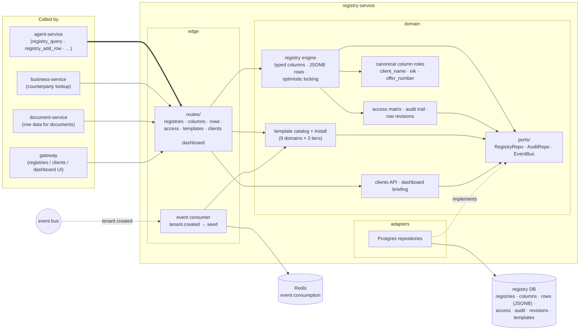
```mermaid
flowchart LR
    subgraph callers["Called by"]
        agent["agent-service<br/>(registry_query · registry_add_row · …)"]
        biz["business-service<br/>(counterparty lookup)"]
        doc["document-service<br/>(row data for documents)"]
        gw["gateway<br/>(registries / clients / dashboard UI)"]
    end

    subgraph reg["registry-service"]
        direction TB
        subgraph edge["edge"]
            r1["routes/<br/>registries · columns · rows ·<br/>access · templates · clients ·<br/>dashboard"]
            ev["event consumer<br/>tenant.created → seed"]
        end
        subgraph domain["domain"]
            eng["registry engine<br/>typed columns · JSONB rows ·<br/>optimistic locking"]
            acc["access matrix · audit trail ·<br/>row revisions"]
            can["canonical column roles<br/>client_name · eik · offer_number"]
            tpl["template catalog + install<br/>(9 domains × 3 tiers)"]
            cli["clients API · dashboard briefing"]
            p1["ports/<br/>RegistryRepo · AuditRepo · EventBus"]
        end
        subgraph adapters["adapters"]
            a1["Postgres repositories"]
        end
        r1 --> eng & tpl & cli
        eng --> acc & can
        ev --> tpl
        eng & acc & tpl & cli --> p1
        a1 -.implements.-> p1
    end

    db[("registry DB<br/>registries · columns · rows (JSONB) ·<br/>access · audit · revisions · templates")]
    rd[("Redis<br/>event consumption")]
    bus(("event bus"))

    agent ==> r1
    biz --> r1
    doc --> r1
    gw --> r1
    a1 --> db
    ev --> rd
    bus -.->|"tenant.created"| ev
```

| Direction | Dependency | Notes |
|---|---|---|
| Calls (internal) | **none** — leaf | No jobs either; fully synchronous domain |
| Events in | `tenant.created` | Seeds work pipeline, invoices, tasks registries |
| Inbound | agent, business, document, gateway | Highest sync fan-in after the gateway |

### 5.7 business-service

Typed ERP domains with hard invariants. Two outbound dependencies: registry-service for
counterparty resolution and document-service for PDF rendering + price reads. Issued
invoices snapshot counterparty data — so a registry outage never corrupts a legal
document, only blocks new lookups.

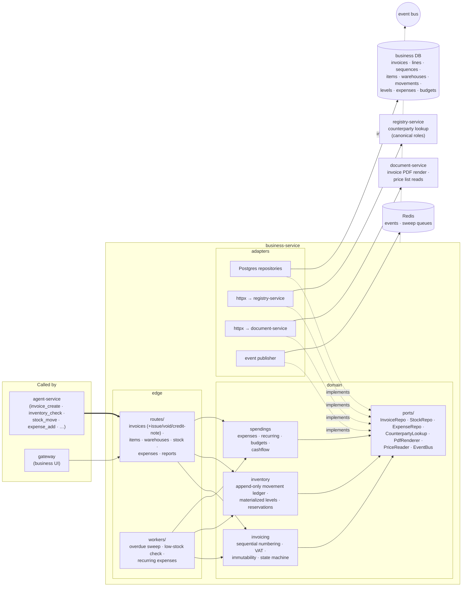
```mermaid
flowchart LR
    subgraph callers["Called by"]
        agent["agent-service<br/>(invoice_create · inventory_check ·<br/>stock_move · expense_add · …)"]
        gw["gateway<br/>(business UI)"]
    end

    subgraph biz["business-service"]
        direction TB
        subgraph edge["edge"]
            r1["routes/<br/>invoices (+issue/void/credit-note) ·<br/>items · warehouses · stock ·<br/>expenses · reports"]
            w1["workers/<br/>overdue sweep · low-stock check ·<br/>recurring expenses"]
        end
        subgraph domain["domain"]
            inv["invoicing<br/>sequential numbering · VAT ·<br/>immutability · state machine"]
            stk["inventory<br/>append-only movement ledger ·<br/>materialized levels · reservations"]
            exp["spendings<br/>expenses · recurring · budgets ·<br/>cashflow"]
            p1["ports/<br/>InvoiceRepo · StockRepo · ExpenseRepo ·<br/>CounterpartyLookup · PdfRenderer ·<br/>PriceReader · EventBus"]
        end
        subgraph adapters["adapters"]
            a1["Postgres repositories"]
            a2["httpx → registry-service"]
            a3["httpx → document-service"]
            a4["event publisher"]
        end
        r1 --> inv & stk & exp
        w1 --> inv & stk & exp
        inv & stk & exp --> p1
        a1 & a2 & a3 & a4 -.implements.-> p1
    end

    reg["registry-service<br/>counterparty lookup<br/>(canonical roles)"]
    doc["document-service<br/>invoice PDF render ·<br/>price list reads"]
    db[("business DB<br/>invoices · lines · sequences ·<br/>items · warehouses · movements ·<br/>levels · expenses · budgets")]
    rd[("Redis<br/>events · sweep queues")]
    bus(("event bus"))

    agent ==> r1
    gw --> r1
    a2 --> reg
    a3 --> doc
    a1 --> db
    a4 --> rd
    biz -.->|"invoice.issued · stock.low"| bus
```

| Direction | Dependency | Notes |
|---|---|---|
| Calls | registry-service, document-service | Counterparty IDs + display snapshots stored locally on issue |
| Events out | `invoice.issued`, `stock.low` | Turned into notifications by platform-service; `invoice.issued`/contract flows may optionally trigger an e-signature request in integration-service |
| Inbound | agent-service (write tools → approval interrupts), gateway | |

### 5.8 document-service

Rendering is delegated to **Carbone** (internal engine, behind the render port) and
isolated here on purpose — Carbone's bundled headless LibreOffice runs with hard
memory/time limits, the same constraint the in-process Chromium pool was meant to have.
Outbound: Carbone for rendering, model-gateway for AI-assisted imports/formatting, and
registry-service for row data feeding document generation.

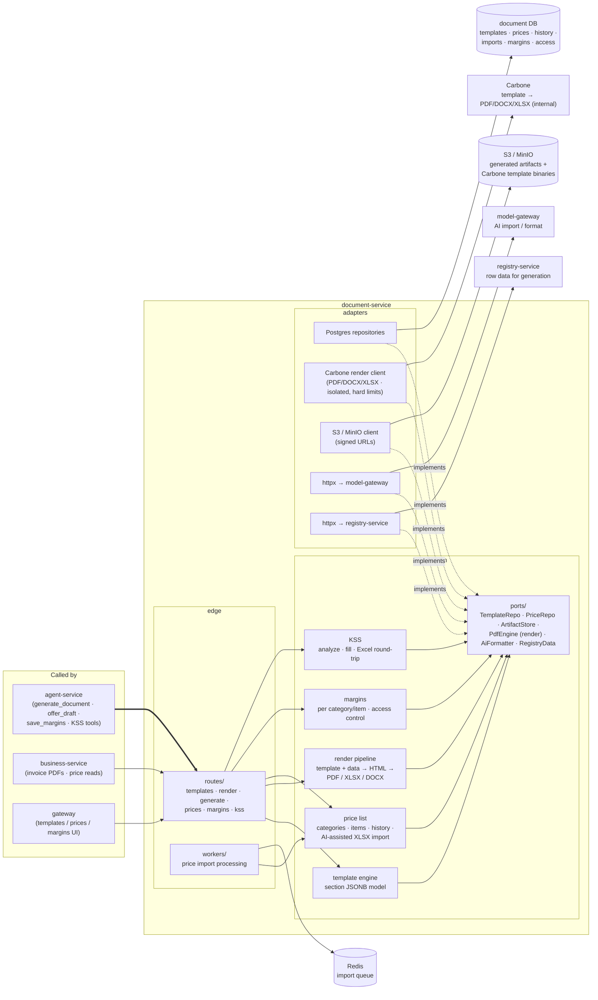
```mermaid
flowchart LR
    subgraph callers["Called by"]
        agent["agent-service<br/>(generate_document · offer_draft ·<br/>save_margins · KSS tools)"]
        biz["business-service<br/>(invoice PDFs · price reads)"]
        gw["gateway<br/>(templates / prices / margins UI)"]
    end

    subgraph doc["document-service"]
        direction TB
        subgraph edge["edge"]
            r1["routes/<br/>templates · render · generate ·<br/>prices · margins · kss"]
            w1["workers/<br/>price import processing"]
        end
        subgraph domain["domain"]
            tpl["template engine<br/>section JSONB model"]
            rend["render pipeline<br/>template + data → HTML →<br/>PDF / XLSX / DOCX"]
            price["price list<br/>categories · items · history ·<br/>AI-assisted XLSX import"]
            marg["margins<br/>per category/item · access control"]
            kss["KSS<br/>analyze · fill · Excel round-trip"]
            p1["ports/<br/>TemplateRepo · PriceRepo · ArtifactStore ·<br/>PdfEngine (render) · AiFormatter · RegistryData"]
        end
        subgraph adapters["adapters"]
            a1["Postgres repositories"]
            a2["Carbone render client<br/>(PDF/DOCX/XLSX · isolated, hard limits)"]
            a3["S3 / MinIO client<br/>(signed URLs)"]
            a4["httpx → model-gateway"]
            a5["httpx → registry-service"]
        end
        r1 --> tpl & rend & price & marg & kss
        w1 --> price
        tpl & rend & price & marg & kss --> p1
        a1 & a2 & a3 & a4 & a5 -.implements.-> p1
    end

    carbone["Carbone<br/>template → PDF/DOCX/XLSX (internal)"]
    mg["model-gateway<br/>AI import / format"]
    reg["registry-service<br/>row data for generation"]
    db[("document DB<br/>templates · prices · history ·<br/>imports · margins · access")]
    s3[("S3 / MinIO<br/>generated artifacts +<br/>Carbone template binaries")]
    rd[("Redis<br/>import queue")]

    agent ==> r1
    biz --> r1
    gw --> r1
    a2 --> carbone
    a4 --> mg
    a5 --> reg
    a1 --> db
    a3 --> s3
    w1 --> rd
```

| Direction | Dependency | Notes |
|---|---|---|
| Calls (external) | **Carbone** (rendering, internal — behind the render port) | One engine for PDF/DOCX/XLSX; an implementation detail, swappable |
| Calls (internal) | model-gateway (AI import), registry-service (row data) | Both optional per endpoint — plain rendering needs neither |
| Inbound | agent, business, gateway | business → doc is on the invoice-issue path |
| Infra | document DB, S3, Redis, Carbone (internal engine) | Artifacts never touch local disk; Carbone is stateless |

### 5.9 billing-service

Listens more than it talks: metering and the welcome bonus arrive as events; the only
outbound calls go to Stripe. The webhook enters through the gateway with raw body
preserved and is signature-verified here.

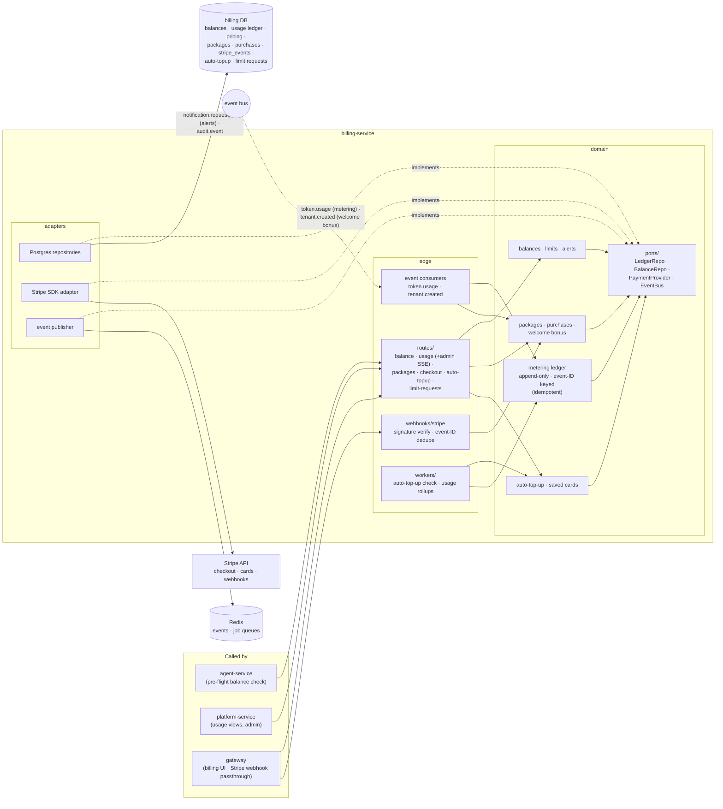
```mermaid
flowchart LR
    subgraph callers["Called by"]
        agent["agent-service<br/>(pre-flight balance check)"]
        plat["platform-service<br/>(usage views, admin)"]
        gw["gateway<br/>(billing UI · Stripe webhook passthrough)"]
    end

    subgraph bill["billing-service"]
        direction TB
        subgraph edge["edge"]
            r1["routes/<br/>balance · usage (+admin SSE) ·<br/>packages · checkout · auto-topup ·<br/>limit-requests"]
            wh["webhooks/stripe<br/>signature verify · event-ID dedupe"]
            ev["event consumers<br/>token.usage · tenant.created"]
            w1["workers/<br/>auto-top-up check · usage rollups"]
        end
        subgraph domain["domain"]
            led["metering ledger<br/>append-only · event-ID keyed<br/>(idempotent)"]
            bal["balances · limits · alerts"]
            pkg["packages · purchases ·<br/>welcome bonus"]
            top["auto-top-up · saved cards"]
            p1["ports/<br/>LedgerRepo · BalanceRepo ·<br/>PaymentProvider · EventBus"]
        end
        subgraph adapters["adapters"]
            a1["Postgres repositories"]
            a2["Stripe SDK adapter"]
            a3["event publisher"]
        end
        r1 --> bal & pkg & top
        wh --> pkg
        ev --> led & pkg
        w1 --> top & led
        led & bal & pkg & top --> p1
        a1 & a2 & a3 -.implements.-> p1
    end

    stripe["Stripe API<br/>checkout · cards · webhooks"]
    db[("billing DB<br/>balances · usage ledger · pricing ·<br/>packages · purchases · stripe_events ·<br/>auto-topup · limit requests")]
    rd[("Redis<br/>events · job queues")]
    bus(("event bus"))

    agent --> r1
    plat --> r1
    gw --> r1 & wh
    a2 --> stripe
    a1 --> db
    a3 --> rd
    bus -.->|"token.usage (metering) ·<br/>tenant.created (welcome bonus)"| ev
    bill -.->|"notification.requested (alerts) ·<br/>audit.event"| bus
```

| Direction | Dependency | Notes |
|---|---|---|
| Calls (internal) | **none** | Leaf for internal sync traffic |
| Calls (external) | Stripe | Highest-risk code — idempotent webhooks, stored event IDs |
| Events in / out | `token.usage`, `tenant.created` / `notification.requested`, `audit.event` | Ledger keyed by event ID |
| Inbound | agent (balance check), platform, gateway | |

### 5.10 integration-service

The platform's outward arm: every external connectivity concern (OAuth scopes,
IMAP/SMTP, WebDAV, e-signature) lives behind folder-discovered adapters with a uniform
contract. Calls no internal first-party service. The `google` adapter delegates the OAuth
dance + token refresh to **Nango** (self-hosted, behind the OAuth port) and calls Google
through Nango's proxy by `connection_id`; `email`/`webdav` keep their secrets in the local
vault; the `esign` adapter delegates signing to **Documenso** (self-hosted, behind the
`SignaturePort`) and emits `document.signed` on its completion webhook.

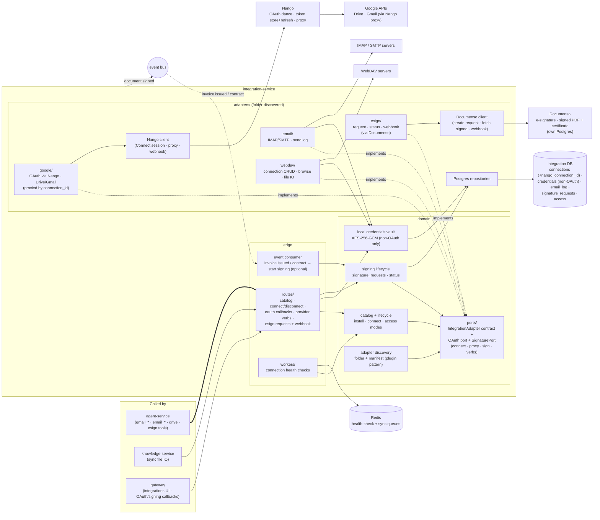
```mermaid
flowchart LR
    subgraph callers["Called by"]
        agent["agent-service<br/>(gmail_* · email_* · drive · esign tools)"]
        kn["knowledge-service<br/>(sync file IO)"]
        gw["gateway<br/>(integrations UI · OAuth/signing callbacks)"]
    end

    subgraph intg["integration-service"]
        direction TB
        subgraph edge["edge"]
            r1["routes/<br/>catalog · connect/disconnect ·<br/>oauth callbacks · provider verbs ·<br/>esign requests + webhook"]
            ev["event consumer<br/>invoice.issued / contract →<br/>start signing (optional)"]
            w1["workers/<br/>connection health checks"]
        end
        subgraph domain["domain"]
            cat["catalog + lifecycle<br/>install · connect · access modes"]
            vault["local credentials vault<br/>AES-256-GCM (non-OAuth only)"]
            sign["signing lifecycle<br/>signature_requests · status"]
            disc["adapter discovery<br/>folder + manifest (plugin pattern)"]
            p1["ports/<br/>IntegrationAdapter contract +<br/>OAuth port + SignaturePort<br/>(connect · proxy · sign · verbs)"]
        end
        subgraph adapters["adapters/ (folder-discovered)"]
            a1["google/<br/>OAuth via Nango · Drive/Gmail<br/>(proxied by connection_id)"]
            a2["email/<br/>IMAP/SMTP · send log"]
            a3["webdav/<br/>connection CRUD · browse · file IO"]
            a6["esign/<br/>request · status · webhook<br/>(via Documenso)"]
            a4["Postgres repositories"]
            a5["Nango client<br/>(Connect session · proxy · webhook)"]
            a7["Documenso client<br/>(create request · fetch signed · webhook)"]
        end
        r1 --> cat & vault & sign
        ev --> sign
        w1 --> cat
        cat & disc & sign --> p1
        a1 & a2 & a3 & a6 -.implements.-> p1
        a1 --> a5
        a6 --> a7
        a2 & a3 --> vault
        vault --> a4
        sign --> a4
    end

    nango["Nango<br/>OAuth dance · token store+refresh · proxy"]
    documenso["Documenso<br/>e-signature · signed PDF + certificate<br/>(own Postgres)"]
    goog["Google APIs<br/>Drive · Gmail (via Nango proxy)"]
    mail["IMAP / SMTP servers"]
    wdav["WebDAV servers"]
    db[("integration DB<br/>connections (+nango_connection_id) ·<br/>credentials (non-OAuth) · email_log ·<br/>signature_requests · access")]
    rd[("Redis<br/>health-check + sync queues")]
    bus(("event bus"))

    agent ==> r1
    kn --> r1
    gw --> r1
    a5 --> nango
    a7 --> documenso
    nango --> goog
    a2 --> mail
    a3 --> wdav
    a4 --> db
    w1 --> rd
    bus -.->|"invoice.issued / contract"| ev
    intg -.->|"document.signed"| bus
```

| Direction | Dependency | Notes |
|---|---|---|
| Calls (internal first-party) | **none** | Leaf for internal sync traffic |
| Calls (external) | **Nango** (OAuth/token backend + proxy), **Documenso** (e-signature), Google (via Nango), IMAP/SMTP, WebDAV | OAuth via Nango; e-sign via Documenso behind `SignaturePort`; non-OAuth via local vault. Each behind one adapter folder |
| Events in / out | (in, optional) `invoice.issued` / contract → start signing / (out) `document.signed` | Signed PDF + certificate retained by Documenso |
| Inbound | agent (email/drive/esign tools), knowledge (sync IO), gateway | |

### 5.11 platform-service

The event sink of the system — four low-traffic modules that mostly consume what other
services publish. Only service holding email (Brevo) and ops-alert (Telegram)
credentials.

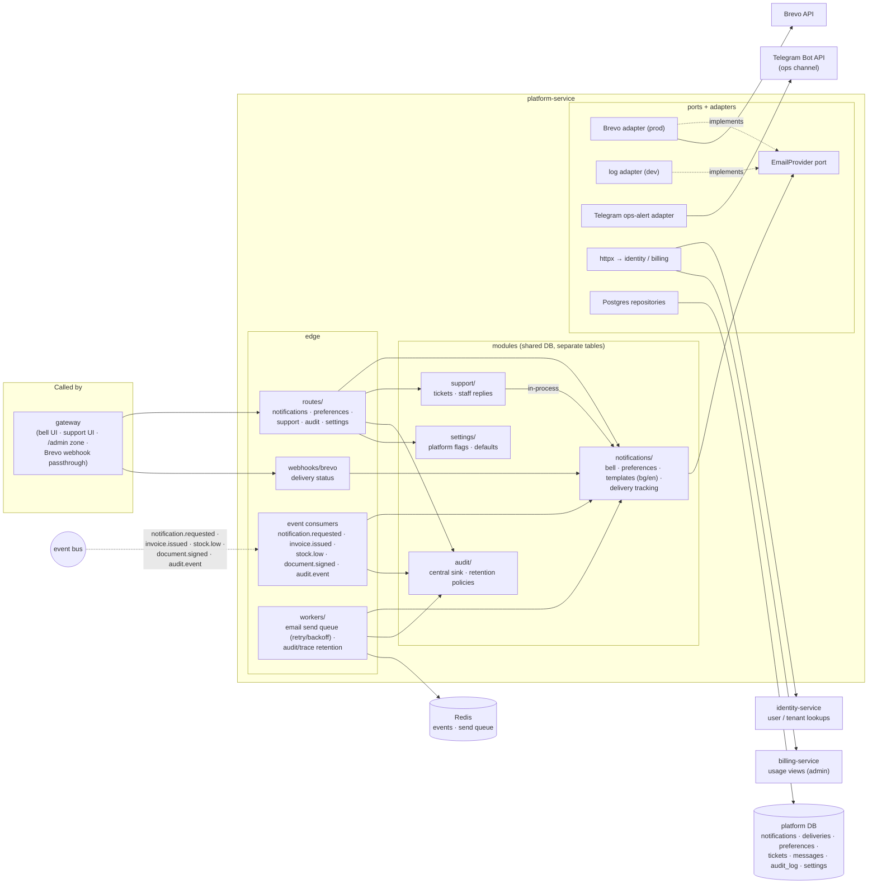
```mermaid
flowchart LR
    subgraph callers["Called by"]
        gw["gateway<br/>(bell UI · support UI · /admin zone ·<br/>Brevo webhook passthrough)"]
    end

    subgraph plat["platform-service"]
        direction TB
        subgraph edge["edge"]
            r1["routes/<br/>notifications · preferences ·<br/>support · audit · settings"]
            wh["webhooks/brevo<br/>delivery status"]
            ev["event consumers<br/>notification.requested · invoice.issued ·<br/>stock.low · document.signed · audit.event"]
            w1["workers/<br/>email send queue (retry/backoff) ·<br/>audit/trace retention"]
        end
        subgraph modules["modules (shared DB, separate tables)"]
            notif["notifications/<br/>bell · preferences · templates (bg/en) ·<br/>delivery tracking"]
            sup["support/<br/>tickets · staff replies"]
            aud["audit/<br/>central sink · retention policies"]
            set["settings/<br/>platform flags · defaults"]
        end
        subgraph ports["ports + adapters"]
            p1["EmailProvider port"]
            a1["Brevo adapter (prod)"]
            a2["log adapter (dev)"]
            a3["Telegram ops-alert adapter"]
            a4["httpx → identity / billing"]
            a5["Postgres repositories"]
        end
        r1 --> notif & sup & aud & set
        wh --> notif
        ev --> notif & aud
        w1 --> notif & aud
        sup -->|"in-process"| notif
        notif --> p1
        a1 & a2 -.implements.-> p1
    end

    idsvc["identity-service<br/>user / tenant lookups"]
    bill["billing-service<br/>usage views (admin)"]
    brevo["Brevo API"]
    tg["Telegram Bot API<br/>(ops channel)"]
    db[("platform DB<br/>notifications · deliveries · preferences ·<br/>tickets · messages · audit_log · settings")]
    rd[("Redis<br/>events · send queue")]
    bus(("event bus"))

    gw --> r1 & wh
    a4 --> idsvc & bill
    a1 --> brevo
    a3 --> tg
    a5 --> db
    w1 --> rd
    bus -.->|"notification.requested ·<br/>invoice.issued · stock.low ·<br/>document.signed · audit.event"| ev
```

| Direction | Dependency | Notes |
|---|---|---|
| Calls | identity-service (lookups), billing-service (usage views) | Both read-only, admin/UI paths |
| Calls (external) | Brevo, Telegram Bot API | Sole holder of these credentials |
| Events in | `notification.requested`, `invoice.issued`, `stock.low`, `document.signed`, `audit.event` | All consumers idempotent (dedupe keys) |
| Inbound | gateway only | Lowest sync fan-in in the system |

---

### 5.12 iot-service

The IoT vertical: device registry, TimescaleDB time-series, and **our own** per-organization
alerting (no Grafana). Readings arrive decoded from the **Node-RED** edge through the gateway;
the only sync call out is anomaly embeddings to knowledge-service; everything else is events.

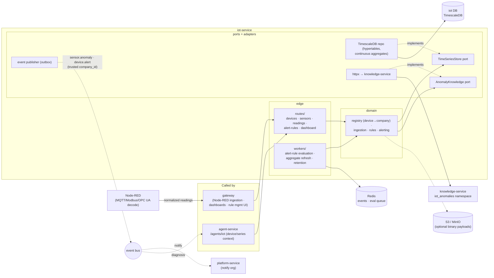
```mermaid
flowchart LR
    subgraph callers["Called by"]
        gw["gateway<br/>(Node-RED ingestion ·<br/>dashboards · rule mgmt UI)"]
        ag["agent-service<br/>/agents/iot (device/series context)"]
    end

    subgraph iot["iot-service"]
        direction TB
        subgraph edge["edge"]
            r1["routes/<br/>devices · sensors · readings ·<br/>alert-rules · dashboard"]
            w1["workers/<br/>alert-rule evaluation ·<br/>aggregate refresh · retention"]
        end
        subgraph dom["domain"]
            d1["registry (device→company) ·<br/>ingestion · rules · alerting"]
        end
        subgraph ports["ports + adapters"]
            p1["TimeSeriesStore port"]
            a1["TimescaleDB repo (hypertables,<br/>continuous aggregates)"]
            p2["AnomalyKnowledge port"]
            a2["httpx → knowledge-service"]
            a3["event publisher (outbox)"]
        end
        r1 --> d1
        w1 --> d1
        d1 --> p1 & p2
        a1 -.implements.-> p1
        a2 -.implements.-> p2
    end

    nodered["Node-RED<br/>(MQTT/Modbus/OPC UA decode)"]
    kn["knowledge-service<br/>iot_anomalies namespace"]
    ts[("iot DB<br/>TimescaleDB")]
    rd[("Redis<br/>events · eval queue")]
    s3[("S3 / MinIO<br/>(optional binary payloads)")]
    bus(("event bus"))

    plat["platform-service<br/>(notify org)"]
    nodered -->|"normalized readings"| gw --> r1
    ag --> r1
    a1 --> ts
    a2 --> kn
    w1 --> rd
    a3 -.->|"sensor.anomaly · device.alert<br/>(trusted company_id)"| bus
    bus -.->|"notify"| plat
    bus -.->|"diagnosis"| ag
    d1 -.-> s3
```

| Direction | Dependency | Notes |
|---|---|---|
| Inbound | gateway (Node-RED ingestion + UI), agent-service (`/agents/iot` reads) | Node-RED posts via the gateway with a service account — never a direct port |
| Calls | knowledge-service (anomaly embeddings) | Single sync fan-out (≤ 2 rule holds) |
| Events out | `sensor.anomaly`, `device.alert` | Carry the trusted `company_id`; consumed by platform-service (notify) and agent-service (diagnosis) |
| Infra | **TimescaleDB** (`iot`), Redis, optional S3/MinIO | TimescaleDB is Postgres + extension — DB-per-service holds |
| Owns external | **Node-RED** (ingestion edge) | Gateway-only, like n8n; not a port-wrapped adapter |

---

### 5.13 manufacturing-service

The production-domain coordinator: it owns orders, BOM/routing, MRP, and capacity, and
drives the shop floor from both segments. Its sync fan-out is **2** (business-service for
stock/items, document-service for work cards) — purchasing, the ERP→SCADA push, and energy
correlation all go via **events** or **gateway ingest**, so it never becomes a second hub.
Machine production facts and MES confirmations enter through the gateway (service account),
the same gateway-only rule as Node-RED.

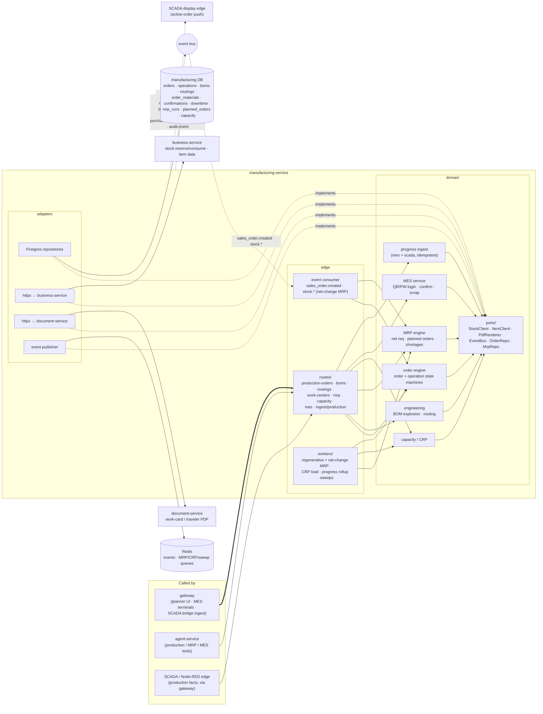
```mermaid
flowchart LR
    subgraph callers["Called by"]
        gw["gateway<br/>(planner UI · MES terminals ·<br/>SCADA bridge ingest)"]
        agent["agent-service<br/>(production / MRP / MES tools)"]
        scadain["SCADA / Node-RED edge<br/>(production facts, via gateway)"]
    end

    subgraph mf["manufacturing-service"]
        direction TB
        subgraph edge["edge"]
            r1["routes/<br/>production-orders · boms · routings ·<br/>work-centers · mrp · capacity ·<br/>mes · ingest/production"]
            ev["event consumer<br/>sales_order.created · stock.* (net-change MRP)"]
            w1["workers/<br/>regenerative + net-change MRP ·<br/>CRP load · progress rollup · sweeps"]
        end
        subgraph domain["domain"]
            ord["order engine<br/>order + operation state machines"]
            eng["engineering<br/>BOM explosion · routing"]
            mrp["MRP engine<br/>net req · planned orders · shortages"]
            cap["capacity / CRP"]
            mes["MES service<br/>QR/PIN login · confirm · scrap"]
            ing["progress ingest<br/>(mes + scada, idempotent)"]
            p1["ports/<br/>StockClient · ItemClient · PdfRenderer ·<br/>EventBus · OrderRepo · MrpRepo"]
        end
        subgraph adapters["adapters"]
            a1["Postgres repositories"]
            a2["httpx → business-service"]
            a3["httpx → document-service"]
            a4["event publisher"]
        end
        r1 --> ord & eng & mrp & cap & mes & ing
        ev --> ord & mrp
        w1 --> mrp & cap & ord
        ord & eng & mrp & cap & mes & ing --> p1
        a1 & a2 & a3 & a4 -.implements.-> p1
    end

    biz["business-service<br/>stock reserve/consume · item data"]
    doc["document-service<br/>work-card / traveler PDF"]
    scadaout["SCADA display edge<br/>(active-order push)"]
    db[("manufacturing DB<br/>orders · operations · boms · routings ·<br/>order_materials · confirmations · downtime ·<br/>mrp_runs · planned_orders · capacity")]
    rd[("Redis<br/>events · MRP/CRP/sweep queues")]
    bus(("event bus"))

    gw ==> r1
    agent --> r1
    scadain --> r1
    a2 --> biz
    a3 --> doc
    a1 --> db
    a4 --> rd
    bus -.->|"sales_order.created · stock.*"| ev
    mf -.->|"production_order.* · operation.confirmed ·<br/>production.progress · material.shortage ·<br/>purchase.requisition.requested · audit.event"| bus
    mf -.->|"active-order push (via event)"| scadaout
```

| Direction | Dependency | Notes |
|---|---|---|
| Calls | business-service (stock reserve/consume, item data), document-service (work-card PDF) | Sync fan-out = 2 — the ≤2 rule holds |
| Events out | `production_order.released/.completed`, `operation.confirmed`, `production.progress`, `material.shortage`, `purchase.requisition.requested` | Purchasing + SCADA push are event-driven, not sync |
| Events in | `sales_order.created` (make-to-order), `stock.*` (net-change MRP) | Both soft — re-plan/seed delayed, never lost |
| Inbound | gateway (planner UI, MES terminals, SCADA ingest), agent-service (tools) | SCADA/Node-RED posts via gateway with a service account — never a direct port |
| Infra | `manufacturing` Postgres, Redis | No object storage — PDFs live in document-service |

---

## 6. Dependency rules (the invariants behind the graphs)

These are the rules the graphs above must keep satisfying as the system grows — review
any new edge against them:

1. **One hub.** Only agent-service may have sync fan-out > 2. A second hub means a
   boundary was drawn wrong.
2. **Leaves stay leaves.** identity-service and registry-service call no internal
   service. The auth path and the data backbone must not acquire transitive
   dependencies. (Service-token minting is the one sanctioned inbound exception for
   identity — and it is cached and locally verified precisely so it never becomes a
   per-request edge.)
3. **No cycles.** The sync HTTP graph is a DAG (§2). If a new feature seems to need
   `A → B → A`, the shared concept belongs in one of them — or in an event.
4. **External systems have exactly one owner.** LLM providers → model-gateway; Stripe →
   billing; **Carbone** (rendering) → document; **Nango/Documenso**/Google/IMAP/WebDAV →
   integration; Brevo/Telegram → platform; Authentik + Google OAuth login + EIK → identity;
   **Node-RED** (IoT ingestion edge) → iot-service. No second service may ever hold those
   credentials. (Note the two distinct Google uses: *login* belongs to identity;
   *on-behalf-of Drive/Gmail via Nango* belongs to integration — see
   [09 §3.6](./09-industry4z-platform-integration.md#36-integrations--nango-).) Node-RED, like
   n8n, is **gateway-only** rather than port-wrapped, but iot-service is still its sole platform
   counterpart. The same applies to the **SCADA / Node-RED edge** that posts order-linked
   production facts (and renders MES displays) — gateway-only, with **manufacturing-service** as
   its sole platform counterpart.
5. **Databases are private.** No edge may ever point at another service's cylinder.
   Cross-service data moves over HTTP or events only.
6. **Events for facts, HTTP for questions.** If the caller needs an answer to proceed,
   it's a sync call; if it's informing the world, it's an event. Don't disguise
   commands as events.
7. **Inside a service, dependencies point inward.** routes/workers → domain → ports;
   adapters implement ports. A domain module importing httpx or SQLAlchemy is a
   layering bug.
8. **`x7-common` is the only shared code.** Build-time, business-logic-free. Service A
   importing service B's code is forbidden in all cases.

## References

- [01 §3 — system topology](./01-architecture-overview.md#3-system-topology) ·
  [01 §7 — events](./01-architecture-overview.md#7-asynchronous-work-and-events)
- [02 — service catalog + call matrix](./02-service-catalog.md#service-to-service-call-matrix)
- [06 — architectural patterns](./06-architectural-patterns.md)
- Per-service READMEs under [services/](./services/README.md) — each `Dependencies`
  table is the source for the graphs here
