# 08 — Database Architecture

How data is stored across the platform: the **database-per-service** model, what each
database owns, and — most importantly — how databases that may **never share a table or a
join** still reference each other through *logical* links resolved over HTTP, events, and
denormalized snapshots.

> **Status note.** All services are 📋 planned. The table inventories below are taken from
> each service's *Data owned* section (see [02 — service catalog](./02-service-catalog.md)
> and the per-service READMEs under [services/](./services/README.md)); column-level
> details are the **intended/target** schema and are indicative until the Alembic
> baselines land.

---

## 1. The one rule: database per service

Every service owns exactly one PostgreSQL database. No service connects to another
service's database — there are **no cross-database foreign keys and no cross-database
joins**. The only way to read another service's data is through its public API (sync HTTP
with a service token) or by reacting to its events.

```mermaid
flowchart TB
    subgraph svcs["Services (own their data)"]
        gw["gateway<br/>(no DB)"]
        id["identity-service"]
        agent["agent-service"]
        mg["model-gateway"]
        kn["knowledge-service"]
        reg["registry-service"]
        biz["business-service"]
        doc["document-service"]
        bill["billing-service"]
        intg["integration-service"]
        plat["platform-service"]
        iot["iot-service"]
        mf["manufacturing-service"]
    end

    subgraph pgs["PostgreSQL — one database each"]
        dbid[("identity")]
        dbag[("agent<br/>+ LangGraph checkpoints")]
        dbmg[("modelgw")]
        dbkn[("knowledge<br/>+ Qdrant")]
        dbrg[("registry")]
        dbbz[("business")]
        dbdc[("document")]
        dbbl[("billing")]
        dbin[("integration")]
        dbpl[("platform")]
        dbio[("iot<br/>+ TimescaleDB extension")]
        dbmf[("manufacturing")]
    end

    rd[("Redis 7<br/>cache · rate limits · arq queues ·<br/>event streams · active project")]
    s3[("S3 / MinIO<br/>originals · generated artifacts")]

    id --> dbid
    agent --> dbag
    mg --> dbmg
    kn --> dbkn & s3
    reg --> dbrg
    biz --> dbbz
    doc --> dbdc & s3
    bill --> dbbl
    intg --> dbin
    plat --> dbpl
    iot --> dbio
    mf --> dbmf

    gw --> rd
    id --> rd
    agent --> rd
    mg --> rd
    kn --> rd
    reg --> rd
    biz --> rd
    doc --> rd
    bill --> rd
    intg --> rd
    plat --> rd
    iot --> rd
    mf --> rd
```

### Why
- **Independent deployability & blast radius** — a schema migration or an outage in one
  database cannot corrupt or block another service.
- **Clear ownership** — one writer per table; everyone else reads through the API.
- **Polyglot persistence where it pays** — `knowledge` pairs Postgres with an external
  **Qdrant** vector store, `agent` hosts LangGraph's checkpoint tables, and `iot` runs on
  **TimescaleDB** (Postgres + the Timescale extension) for time-series; the rest stay plain
  relational. Note `iot` is still Postgres, so database-per-service holds unchanged.

### The cost (and how we pay it)
- No DB-level referential integrity across services → integrity is enforced by the owning
  service and by **idempotent, eventually-consistent** event consumers.
- No joins across services → you either call the owner's API or keep a **denormalized
  snapshot** of the few fields you need (see invoices ↔ counterparties below).

---

## 2. Cross-cutting conventions

These hold for every database unless noted.

| Convention | Detail |
|---|---|
| **Tenant scoping** | Almost every business table carries a `company_id` (the tenant). This is a *logical* reference to `identity.companies.id` — never a SQL FK. Postgres **Row-Level Security (RLS)** policies enforce tenant isolation (called out in the registry/agent checklists). |
| **User reference** | User-owned rows carry `user_id`, a logical reference to `identity.users.id`. |
| **Primary keys** | UUIDs (safe to mint client-side, no cross-service sequence coupling). The exception is **legal invoice numbering**, which uses per-tenant sequence rows for gap-free numbers. |
| **Encryption at rest (field level)** | Secrets are AES-256-GCM encrypted in-column: `identity` external tokens, `modelgw.providers` credentials, `integration.credentials` (**non-OAuth only** — OAuth tokens live in self-hosted **Nango**, not in our DB; `integration.connections` keeps a `nango_connection_id` reference). |
| **Migrations** | Alembic per service; each service has its own migration history. |
| **Idempotency** | Event-fed tables dedupe on an event/idempotency key (`billing.usage_ledger` by event ID, `billing.stripe_events` by Stripe event ID, notifications by payload dedupe key). |
| **Object storage** | Large binaries never live in Postgres — originals and generated artifacts go to S3/MinIO; the database stores keys/metadata only. |

---

## 3. Database catalog

| Database | Owning service | Port | Extensions / notable | Stores |
|---|---|---|---|---|
| `identity` | identity-service | 8010 | RS256 keypair (JWKS) | users, companies, memberships, tokens |
| `agent` | agent-service | 8020 | LangGraph checkpoint tables | sessions, messages, memory, skills, traces |
| `modelgw` | model-gateway | 8030 | AES-GCM credentials | providers, model configs, kill switch |
| `knowledge` | knowledge-service | 8040 | **Qdrant** vectors | documents, chunks (vectors in Qdrant), facts, sync state |
| `registry` | registry-service | 8050 | JSONB rows, RLS | dynamic registries, templates, audit |
| `document` | document-service | 8060 | JSONB templates (rendered by **Carbone**) | templates, price list, margins |
| `billing` | billing-service | 8070 | append-only ledger | balances, usage ledger, Stripe data |
| `integration` | integration-service | 8080 | AES-GCM credentials (non-OAuth); OAuth tokens in **Nango**; signed docs in **Documenso** | connections (+`nango_connection_id`), local credentials vault, email log, signature requests |
| `platform` | platform-service | 8090 | — | notifications, support, audit sink, settings |
| `business` | business-service | 8100 | per-tenant sequences | invoices, inventory, expenses |
| `iot` | iot-service | 8110 | **TimescaleDB** (hypertables, continuous aggregates, retention), RLS | devices, sensor readings (time-series), alert rules, alerts |
| `manufacturing` | manufacturing-service | 8120 | per-tenant order sequences, RLS | production orders, BOM/routing, MRP runs, confirmations, capacity |
| — | gateway | 8000 | **no database** | (Redis only: rate limits, JWKS cache) |

---

## 4. Per-database schemas

Each diagram shows the **intra-database** relationships (real FKs inside that DB). Columns
suffixed with `_ref` or annotated *"logical → …"* are cross-service references that are
**not** SQL foreign keys (resolved per §5).

### 4.1 `identity` — users, tenants, trust

Source of truth that every other database's `company_id` / `user_id` ultimately points at.

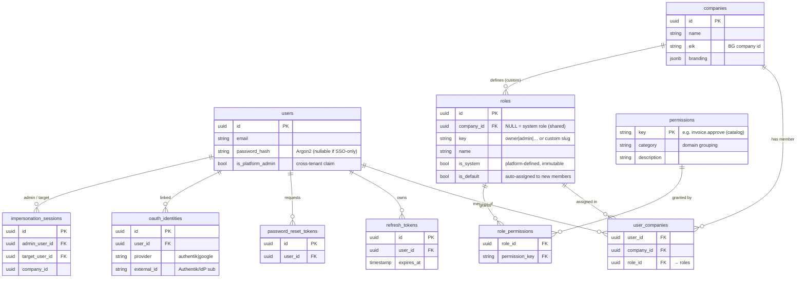

`user_companies` is the membership join: it links a user to a company **and to a role**.
That role resolves (via `role_permissions`) to a permission set, which powers the `X-Roles`
header and all tenant authorization (see
[01 §6](./01-architecture-overview.md#6-identity-tenancy-and-authorization)).

- **`roles`** holds both **system roles** (`company_id = NULL`, `is_system = true`, shared by
  all tenants: `owner`/`co-owner`/`admin`/`member`/`viewer`) and **custom roles** a tenant
  creates (`company_id = X`, scoped to that tenant only).
- **`permissions`** is the platform-owned **catalog** (seeded, not tenant-editable);
  **`role_permissions`** assigns catalog permissions to a role. Tenants compose custom roles
  from the catalog; services check permissions, never role names.
- **`oauth_identities`** now also stores the **Authentik** federation link (`provider =
  'authentik'`, `external_id` = the IdP `sub`) alongside Google — see
  [01 §6](./01-architecture-overview.md#6-identity-tenancy-and-authorization). `password_hash`
  is nullable for users that authenticate only through SSO.

### 4.2 `agent` — conversations & agent runtime

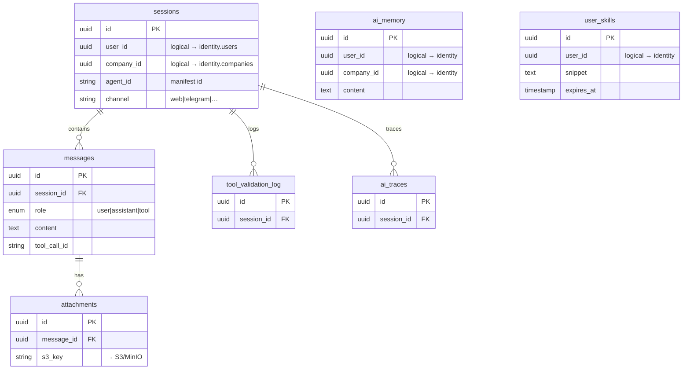

Plus **LangGraph checkpoint tables** (managed by the Postgres checkpointer) keyed by a
thread id aligned with `sessions` — these store interrupt/resume state for write-approval
pauses.

### 4.3 `modelgw` — provider registry

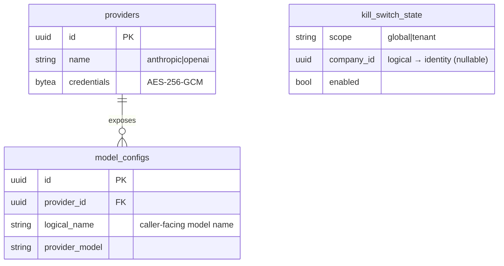

### 4.4 `knowledge` — library, vectors, sync

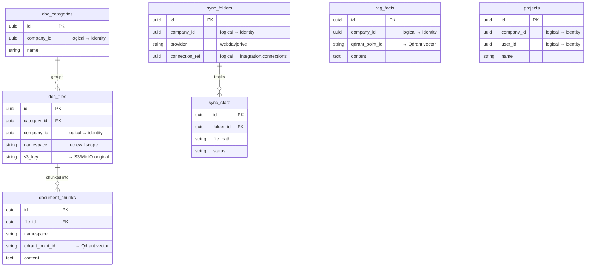

The active project per user is cached in **Redis**, not stored here.

### 4.5 `registry` — dynamic tables

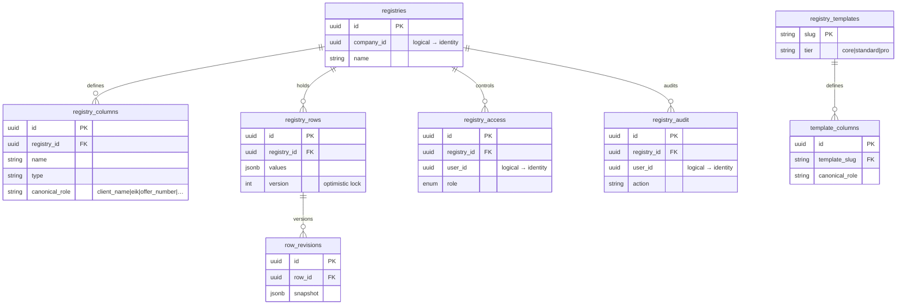

**Canonical column roles** are the semantic glue that lets other services (and agents)
find e.g. a counterparty by `client_name`/`eik` across differently-named tenant tables.

### 4.6 `document` — templates, price list, margins

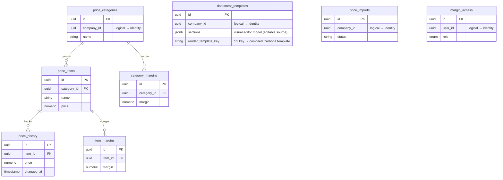

**Rendering via [Carbone](./services/external/carbone/README.md).** The editable template source
stays the `document_templates.sections` JSONB (our visual editor); it compiles to a Carbone
office template whose binary lives in object storage, referenced by `render_template_key`. At
render time `document-service` sends template + row data to Carbone and gets back PDF/DOCX/XLSX,
which is streamed to object storage and returned as a signed URL. Carbone is a stateless,
internal-only engine behind the render port — no rows of its own in this DB. See
[09 §3.7](./09-industry4z-platform-integration.md#37-documents--carbone--documenso-).

### 4.7 `billing` — token economy & payments

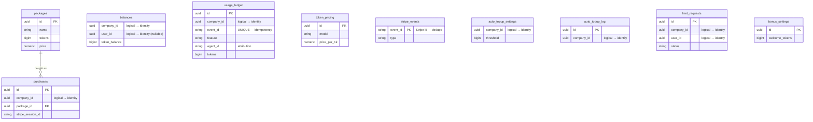

`usage_ledger` is **append-only** and keyed by the `token.usage` event ID so at-least-once
delivery never double-bills.

### 4.8 `integration` — connections & credential vault

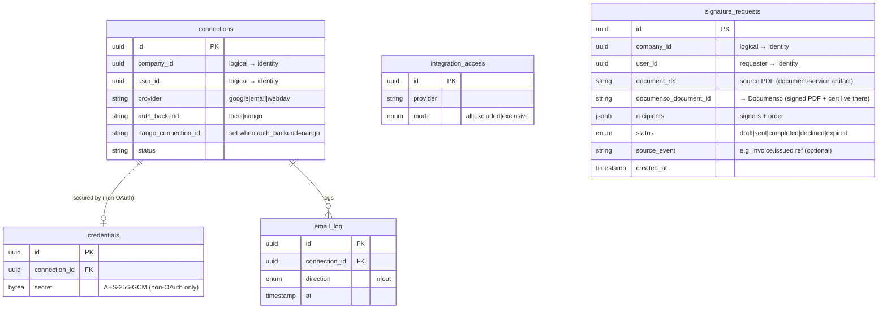

**Credential split (OAuth → Nango, basic/secret → local vault).** OAuth providers
(`auth_backend = 'nango'`) carry **no** `credentials` row — the access/refresh tokens live in
self-hosted [Nango](./services/external/nango/README.md); the connection stores only a
`nango_connection_id`, and provider calls go through Nango's proxy. Non-OAuth providers
(`auth_backend = 'local'`: IMAP/SMTP, WebDAV basic auth) keep their secret in the AES-256-GCM
`credentials` row. Either way, `connections` rows remain the target of
`knowledge.sync_folders.connection_ref` — knowledge-service references a connection, never a
token. See [09 §3.6](./09-industry4z-platform-integration.md#36-integrations--nango-).

**E-signature via [Documenso](./services/external/documenso/README.md).** `signature_requests`
tracks the **lifecycle** of a signing request — the source document (a `document-service`
artifact), recipients, and status — but **not** the signed file: the completed PDF + audit
certificate are retained by self-hosted Documenso (on our infra) and referenced by
`documenso_document_id`. A request is created via `POST /esign/requests` (explicit, or triggered
by consuming `invoice.issued`/a contract event); Documenso's completion webhook flips `status`
and emits `document.signed`. Documenso sits behind the `SignaturePort` — swappable, internal-only,
its own Postgres. See [09 §3.7](./09-industry4z-platform-integration.md#37-documents--carbone--documenso-).

### 4.9 `platform` — notifications, support, audit, settings

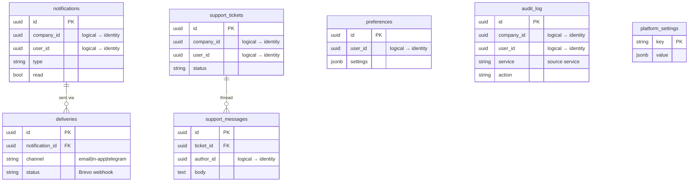

`audit_log` is the **central sink** — every service writes here indirectly by publishing
`audit.event`; rows reference users/companies/actions across all services logically.

### 4.10 `business` — invoicing, inventory, spendings

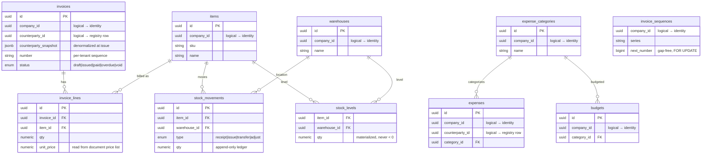

`invoices.counterparty_snapshot` is the key denormalization: a legal document must not
change when the counterparty's registry row is later edited.

### 4.11 `iot` — devices, readings, alert rules (TimescaleDB)

Runs on **TimescaleDB** (PostgreSQL 16 + the Timescale extension). `sensor_readings` is a
**hypertable** (time-partitioned); `readings_1m` / `readings_1h` are **continuous aggregates**
that serve dashboards cheaply; **retention + compression policies** drop/compact old raw rows
automatically. Everything is tenant-scoped (`company_id`, RLS). Readings arrive already
normalized from the **[Node-RED](./services/external/node-red/README.md)** ingestion edge via
the gateway; `devices` holds the **trusted `device → company_id` mapping** that stamps every
reading and emitted event.

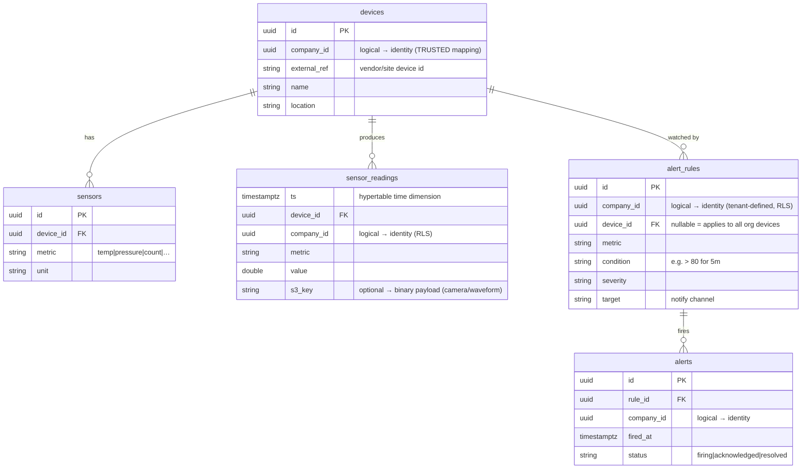

- **`devices.company_id` is the tenancy anchor.** Ingestion sources (Node-RED, plain HTTP
  sensors) send only a device identifier; iot-service resolves it to `company_id` here, so a
  bad reading can at worst mislabel a device, never act for the wrong tenant.
- **`alert_rules` are tenant data** (managed via the API + `iot.alerts.manage` permission) —
  this is the **own alerting mechanism that replaces Grafana**. The evaluation worker reads the
  continuous aggregates and, on a breach, iot-service emits `sensor.anomaly` / `device.alert`
  with the trusted `company_id`.
- **Binary payloads** (camera frames, vibration waveforms), if present, live in S3/MinIO with
  `sensor_readings.s3_key` as the pointer — never inline in the time-series.

### 4.12 `manufacturing` — production orders, BOM, routing, MRP

The production plan and execution facts. Engineering master data (BOM, routing, work
centers) and transactional data (orders, operations, confirmations) coexist; all
tenant-scoped (`company_id`, RLS). Cross-service columns suffixed `_id`/`_ref` and annotated
*"logical → …"* are **not** SQL FKs: `item_id` → `business.items`, `counterparty_id` →
`registry.registry_rows`, `iot_device_id` → `iot.devices`, `operator_user_id` →
`identity.users`, `instruction_doc_id` → `document` artifacts. Stock itself is **never** here
— `order_materials` holds only the per-order plan/tally; the ledger lives in business-service.

```mermaid
erDiagram
    boms ||--o{ bom_lines : "has"
    routings ||--o{ routing_operations : "has"
    work_centers ||--o{ routing_operations : "default WC"
    work_centers ||--o{ capacity_calendars : "capacity"
    production_orders ||--o{ production_order_operations : "explodes to"
    production_orders ||--o{ order_materials : "explodes to"
    production_order_operations ||--o{ production_confirmations : "confirmed by"
    production_order_operations ||--o{ downtime_events : "has"
    mrp_runs ||--o{ planned_orders : "produces"
    mrp_runs ||--o{ mrp_messages : "produces"

    work_centers {
        uuid id PK
        uuid company_id "logical → identity (RLS)"
        string code
        string kind "machine|manual"
        uuid iot_device_id "logical → iot.devices (nullable)"
        numeric cost_rate_per_hour
    }
    boms {
        uuid id PK
        uuid company_id "logical → identity"
        uuid parent_item_id "logical → business.items"
        int version
        bool is_default
    }
    bom_lines {
        uuid id PK
        uuid bom_id FK
        uuid component_item_id "logical → business.items"
        numeric qty_per
        numeric scrap_factor
    }
    routings {
        uuid id PK
        uuid company_id "logical → identity"
        uuid item_id "logical → business.items"
        int version
    }
    routing_operations {
        uuid id PK
        uuid routing_id FK
        int seq
        string name "рязане|огъване|…"
        uuid work_center_id FK
        interval setup_time
        interval run_time_per_unit
        uuid instruction_doc_id "logical → document"
    }
    production_orders {
        uuid id PK
        uuid company_id "logical → identity (RLS)"
        string order_number "per-tenant sequence"
        uuid item_id "logical → business.items"
        numeric qty
        date due_date
        string status "draft|planned|released|in_progress|completed|closed"
        uuid source_sales_order_id "logical → business (make-to-order)"
        uuid bom_id "snapshot"
        uuid routing_id "snapshot"
        numeric progress_pct "derived"
    }
    production_order_operations {
        uuid id PK
        uuid order_id FK
        int seq
        uuid work_center_id "logical (WC)"
        string status "pending|ready|active|paused|done"
        numeric good_qty
        numeric scrap_qty
        bool is_active
    }
    order_materials {
        uuid id PK
        uuid order_id FK
        uuid item_id "logical → business.items"
        numeric required_qty
        numeric reserved_qty "reservation lives in business-service"
        numeric consumed_qty
    }
    production_confirmations {
        uuid id PK
        uuid operation_id FK
        string source "mes|scada"
        uuid operator_user_id "logical → identity (MES)"
        timestamptz ts
        numeric good_qty
        numeric scrap_qty
        uuid scrap_reason_id "→ scrap_reasons"
        string idempotency_key "dedupe (SCADA retransmit safe)"
    }
    downtime_events {
        uuid id PK
        uuid operation_id FK "nullable"
        uuid work_center_id "logical (WC)"
        uuid reason_id "→ downtime_reasons"
        timestamptz started_at
        timestamptz ended_at
        string source "mes|scada"
    }
    mrp_runs {
        uuid id PK
        uuid company_id "logical → identity"
        string mode "regenerative|net_change|on_release"
        timestamptz finished_at
    }
    planned_orders {
        uuid id PK
        uuid mrp_run_id FK
        string type "purchase_requisition|production"
        uuid item_id "logical → business.items"
        numeric qty
        date need_date
        date order_date "lead-time offset"
        string status "proposed|firmed|converted"
    }
    mrp_messages {
        uuid id PK
        uuid mrp_run_id FK
        string kind "shortage|reschedule_in|reschedule_out"
        uuid item_id "logical → business.items"
        string severity
    }
```

- **`order_materials` is a plan, not a ledger.** `reserved_qty` / `consumed_qty` are tallies
  kept in sync by calling business-service (reserve on release, consume on MES confirm); the
  authoritative stock movement is recorded there, so stock can never go negative behind
  manufacturing's back.
- **Confirmations are append-only and idempotent.** `(operation_id, source, idempotency_key)`
  dedupe makes SCADA buffering + retransmit (ТЗ §5.3) safe, and is the audit trail + the
  feed for §4.2 OEE/productivity analytics.
- **Snapshots keep in-flight orders stable.** A production order pins the `bom_id` /
  `routing_id` versions used at planning time, so later engineering edits never mutate
  running work.
- **Energy-per-order is not stored here.** Manufacturing owns the order→machine→time-window
  binding (on its events); the kWh series lives in `iot`; the §4.2 dashboards join the two.

---

## 5. Connections between databases

Because there are no cross-database FKs, every inter-database "connection" is a **logical
reference** resolved at runtime by one of three mechanisms:

| Mechanism | When used | Consistency | Example |
|---|---|---|---|
| **Sync HTTP** (service token) | Need fresh data right now | Strong (read-through) | business → registry counterparty lookup; business → document price reads |
| **Event (Redis Streams)** | React to a fact; decouple producers | Eventual, at-least-once | `tenant.created` → registry seeds + billing bonus; `token.usage` → billing ledger |
| **Denormalized snapshot** | Value must be frozen / hot path | Point-in-time copy | invoice counterparty snapshot; `X-Roles` claims copied into the JWT |

### 5.1 Logical reference map

Solid = synchronous HTTP read; dashed = event-driven write/seed; every `company_id` /
`user_id` column is an implicit reference to `identity` (drawn as the central hub).

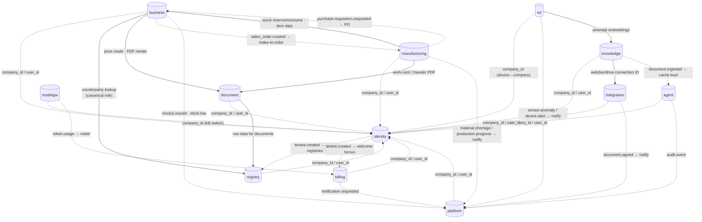

> The gateway has no database; it injects the verified `X-User-Id` / `X-Company-Id` /
> `X-Roles` headers that let every service *use* `identity` references without calling
> `identity` on the hot path.

### 5.2 Notable cross-database links explained

| From (DB.column) | To (DB.table) | How resolved | Notes |
|---|---|---|---|
| *every* `*.company_id` | `identity.companies` | header/JWT claim (no call) | tenant scoping; RLS enforced locally |
| *every* `*.user_id` | `identity.users` | header/JWT claim (no call) | row ownership |
| `business.invoices.counterparty_id` | `registry.registry_rows` | sync HTTP + **snapshot** | snapshot frozen at issue for legal immutability |
| `business.expenses.counterparty_id` | `registry.registry_rows` | sync HTTP | supplier linkage |
| `business.invoice_lines.unit_price` | `document.price_items` | sync HTTP | prices live in document-service |
| `knowledge.sync_folders.connection_ref` | `integration.connections` | sync HTTP | sync engine uses integration's file IO |
| `billing.usage_ledger.{feature,agent_id}` | model-gateway call metadata | **event** `token.usage` | attribution carried in event payload |
| `registry` system registries | `identity.companies` | **event** `tenant.created` | seeded on tenant creation |
| `billing.balances` welcome bonus | `identity.companies` | **event** `tenant.created` | initial token grant |
| `agent` context cache | `knowledge` | **event** `document.ingested` | invalidate stale retrieval cache |
| `integration.signature_requests.document_ref` | `document` artifact (S3 URL) | sync (caller-supplied) | the PDF sent for signing is produced by document-service/Carbone |
| `platform.notifications` ← signing | `integration.signature_requests` | **event** `document.signed` | notify on completed e-signature |
| `platform.audit_log` | all services | **event** `audit.event` | central audit sink |
| `platform.notifications` | all services | **event** `notification.requested` | central delivery |
| `iot.devices.company_id` | `identity.companies` | header/registry (trusted mapping) | the tenancy anchor for all readings/alerts; ingestion sources never supply it |
| `iot.sensor_readings.s3_key` | S3/MinIO object | sync (optional) | binary payloads (camera/waveform) only; scalars stay in TimescaleDB |
| `iot` anomaly embeddings | `knowledge` `iot_anomalies` | sync HTTP | iot-service writes anomaly vectors for `/agents/iot` semantic search |
| `platform.notifications` ← IoT | `iot.alerts` | **event** `sensor.anomaly` / `device.alert` | notify org on a rule breach (carries trusted `company_id`) |
| `manufacturing.order_materials.{reserved,consumed}_qty` | `business.stock_movements` / `stock_levels` | sync HTTP | manufacturing requests reserve/consume; the stock ledger stays in business-service |
| `manufacturing.*.item_id` | `business.items` | sync HTTP | item master (make/buy, lead time, units) lives in business-service |
| `business` purchasing ← MRP | `manufacturing.planned_orders` | **event** `purchase.requisition.requested` | MRP shortage → business-service creates a PO (ТЗ §4.4) |
| `manufacturing` make-to-order ← sales | `business` sales order | **event** `sales_order.created` | a sales order spawns a production order (ТЗ §4.5) |
| `manufacturing.work_centers.iot_device_id` | `iot.devices` | logical (analytics join) | order→machine binding; energy-per-order/OEE joins manufacturing windows with `iot` series — no cross-DB read |
| `platform.notifications` ← manufacturing | `manufacturing` orders | **event** `material.shortage` / `production.progress` | notify planner; feeds §4.2 dashboards |

---

## 6. Shared infrastructure (not per-service databases)

### 6.1 Redis 7
One logical Redis, used by many services but with **non-overlapping key namespaces** — it
is infrastructure, not a shared database.

| User | What it stores in Redis |
|---|---|
| gateway | rate-limit buckets, JWKS cache |
| identity | token-cleanup queue |
| agent | event streams, retention queues |
| model-gateway | balance-check queue, `token.usage` outbox flush |
| knowledge | embed/sync queues, **active project per user** |
| registry | event consumption |
| business | sweep queues |
| document | import queue |
| billing | top-up/rollup queues |
| integration | health-check queue |
| platform | email send queue |
| iot | alert-rule evaluation queue, continuous-aggregate refresh |
| manufacturing | MRP (regenerative/net-change) + CRP load + progress-rollup queues |
| *all* | **event bus** (Redis Streams topics + consumer groups) |

Durability: AOF persistence (+ a replica in production); billing-critical events also use a
**transactional outbox** in the producing service so a Redis outage delays but never loses
them (see [01 §7](./01-architecture-overview.md#7-asynchronous-work-and-events)).

### 6.2 S3 / MinIO
Binary blobs that never belong in Postgres:

| Owner | Objects | DB pointer |
|---|---|---|
| knowledge-service | uploaded document originals | `doc_files.s3_key` |
| agent-service | chat attachments | `attachments.s3_key` |
| document-service | generated PDFs/XLSX/DOCX artifacts + compiled **Carbone** template binaries | artifacts returned as signed URLs; template binary in `document_templates.render_template_key` |

> **Documenso retains signed documents.** The signed PDF + audit certificate produced by an
> e-signature flow are stored by self-hosted **Documenso** (its own Postgres/storage, on our
> infra), referenced from `integration.signature_requests.documenso_document_id` and fetched on
> demand — they are **not** in our object storage by default. Durable archival to S3/MinIO is an
> optional follow-up if a retention policy requires it.

---

## 7. See also

- [01 §6 — Identity, tenancy, authorization](./01-architecture-overview.md#6-identity-tenancy-and-authorization)
- [01 §7 — Asynchronous work and events](./01-architecture-overview.md#7-asynchronous-work-and-events)
- [02 — Service catalog](./02-service-catalog.md) (per-service *Data owned*)
- [06 — Architectural patterns](./06-architectural-patterns.md) (database-per-service, events, outbox)
- [07 §4 — Infrastructure dependency graph](./07-dependency-graphs.md#4-infrastructure-dependency-graph)
- Per-service detail: [services/](./services/README.md)
