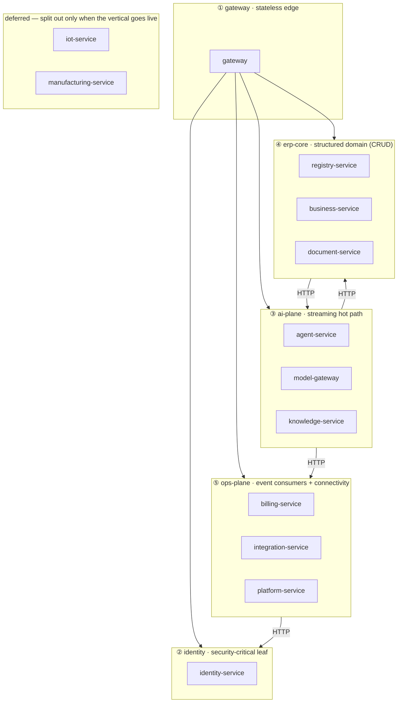

# 10 — Phase-1 Co-Deployment Topology

The service catalog ([02](./02-service-catalog.md)) defines **13 logical services**. Principle 8
([01 §2](./01-architecture-overview.md#2-architectural-principles)) and the migration bottom
line ([05 §6](./05-migration-pros-and-cons.md#6-bottom-line)) both say the same thing:

> Adopt the service *boundaries* immediately (separate FastAPI apps, separate schemas,
> ports/adapters), but **co-deploy aggressively and split processes only when load or team
> structure forces it.**

This document makes that concrete. It answers: *for a small team shipping to SME tenants on a
single host, which logical services share a deployable on day one, what stays split, and what
event forces each split later?* Nothing here changes the catalog — the boundaries are code
boundaries; this is purely about how many **processes/images/CI targets** we run.

## 1. The distinction that makes this safe

A "service" in this architecture is **three separable things**, and co-deployment only collapses
the third:

| Layer | Stays split (always) | Phase-1 reality |
|---|---|---|
| **Code boundary** | One FastAPI app package per service, hexagonal layering, ports/adapters | Unchanged — 13 packages |
| **Data boundary** | One logical Postgres DB + Alembic history per service; **no cross-schema joins** | Unchanged — 13 schemas on **one** Postgres cluster (already the plan, [01 §9](./01-architecture-overview.md#9-deployment--environments)) |
| **Process boundary** | *Negotiable* — when does this code run in its own container? | **Collapsed into ~5 deployables** |

Because the data boundary never collapses, **splitting a service back out later is a deployment
change, not a rewrite**: point its router at a new container, give its schema its own connection
string, done. We keep all the cost of disciplined boundaries (13 Alembic histories) precisely so
the split stays free — co-deployment does **not** reduce the migration/DB count, and it
shouldn't.

## 2. The recommended grouping

Five core deployables, grouped by **scaling profile + trust boundary + statefulness** — not by
domain proximity:



| # | Deployable | Logical services | Why grouped | Why not merged further |
|---|---|---|---|---|
| ① | **gateway** | gateway | Stateless, the only public entry point, scales horizontally on a totally different curve from everything else. Must restart/deploy independently. | It is the one thing that can never share a fate with a domain service. |
| ② | **identity** | identity-service | Everyone depends on it; it is security-critical and low-churn. The gateway hits its JWKS on every request. Keeping it isolated keeps the auth blast radius small and lets it be the first thing migrated ([05 §5 Phase 1](./05-migration-pros-and-cons.md#5-risk-reducing-migration-strategy-strangler-not-big-bang)). | A bug in ERP CRUD must never be able to take down login. |
| ③ | **ai-plane** | agent-service + model-gateway + knowledge-service | This is the **hot path**: every chat turn is agent → model-gateway (LLM) and agent → knowledge (RAG). Co-locating turns the two chattiest hops in the system into local calls. All three are AI-specific and scale on chat volume together. | model-gateway stays the *only* key holder — co-location is within one trust boundary, not a key leak. See §4 on keeping the metering outbox intact. |
| ④ | **erp-core** | registry-service + business-service + document-service | The structured-data domain. `business → registry` (counterparties), `business → document` (PDF/prices), `document → registry` (row data) are all internal-to-this-group calls. One bounded "ERP" context for one team. | The registry-vs-business *invariant* boundary ([02](./02-service-catalog.md#boundary-with-registry-service-important)) is still enforced in code — typed invoices never become JSONB rows just because they share a process. |
| ⑤ | **ops-plane** | billing-service + integration-service + platform-service | Mostly **event consumers** and outbound connectivity (Stripe, Nango, Brevo, Documenso). Low request-rate, bursty background jobs, no place on the hot path. `platform → billing` becomes local. Extends the same logic that already merged 4 modules into platform-service ([02 § Deliberately merged](./02-service-catalog.md#deliberately-merged-boundaries)). | Each keeps its own schema; billing's Stripe webhook idempotency and integration's vault are unchanged. |
| — | **iot / manufacturing** | (deferred) | Net-new verticals on a different storage engine (TimescaleDB) and ingestion edge (Node-RED / SCADA). They may not even ship in the first cut. | Split from day one *if* the vertical is live — their load (time-series ingest, MRP runs) has nothing to do with the core curve. Until then, don't build the container. |

This is **5 deployables instead of 13** — a ~60% cut in images, CI deploy targets, health-check
units, and restart/rollout choreography, with the heaviest internal traffic moved off the
network.

## 3. What each internal call becomes

Mapping the call matrix ([02 § Service-to-service call matrix](./02-service-catalog.md#service-to-service-call-matrix))
onto the grouping shows the payoff — most chatty hops go local:

| Caller → Callee | Phase-1 | Notes |
|---|---|---|
| agent → **model-gateway** | **local** ✅ | The hottest hop in the system, every ReAct step |
| agent → **knowledge** | **local** ✅ | RAG retrieval on most turns |
| knowledge → **model-gateway** | **local** ✅ | Embedding calls |
| business → **registry** | **local** ✅ | Counterparty lookup |
| business → **document** | **local** ✅ | Invoice/offer PDF |
| document → **registry** | **local** ✅ | Row data for docs |
| platform → **billing** | **local** ✅ | Usage views |
| agent → registry / business / document | network | ai-plane → erp-core (tool calls) |
| agent → billing (balance check) | network | ai-plane → ops-plane |
| agent → integration | network | ai-plane → ops-plane |
| document → model-gateway (AI import) | network | erp-core → ai-plane |
| knowledge → integration (file IO) | network | ai-plane → ops-plane |
| platform → identity | network | ops-plane → identity |

"Local" has two valid implementations — pick per call:

- **Loopback HTTP (default, zero code change):** the existing `httpx` adapter just resolves to
  `127.0.0.1`. Still a serialize/deserialize round-trip, but no network, no TLS, sub-millisecond.
  Simplest; keeps the adapter identical to the eventual split.
- **In-process port adapter (for the truly hot calls):** because the domain depends on a
  `Protocol`, you can wire a second adapter that calls the co-located service's domain function
  directly — no serialization at all. Worth it for `agent → model-gateway`; overkill elsewhere.
  `deps.py` chooses the adapter by env, so flipping back to HTTP on split is a config change.

> Cross-deployable calls (the "network" rows) and **all cross-service events stay exactly as
> specified** — Redis Streams, consumer groups, the `token.usage` outbox. Co-deployment must not
> tempt anyone into an in-process shortcut that a later split would have to unwind. Events are the
> contract; keep them.

## 4. Rules that keep co-deployment honest

1. **No cross-schema SQL, ever** — even when two schemas live in the same Postgres cluster.
   Enforce with a per-service DB role whose `search_path`/grants only see its own schema. This is
   the single rule that keeps the split free.
2. **Web and worker are separate processes within a deployable.** Each service's `arq` workers
   run as their own process/container off the shared image, so a heavy knowledge embedding sweep
   or nightly MRP run never starves HTTP latency in the same group (the monolith's `sync-worker`
   lesson, [05 §2](./05-migration-pros-and-cons.md#2-pros)).
3. **The metering outbox is untouchable.** model-gateway's `token.usage` still commits to its own
   schema's outbox and flushes to the stream — co-location with agent-service does not let billing
   become an in-process side effect. Billing truth stays event-sourced.
4. **One image per deployable, mounting N routers.** `gateway`'s routing table is unchanged — it
   still routes per path prefix; it just happens to resolve several prefixes to the same upstream
   host. The routing table, not the process count, is the source of truth for "where does
   `/api/v1/x` go".
5. **Identity and gateway never share a deployable with anything.** Security and entry-point
   isolation are non-negotiable.

## 5. When to split each group back out

A group earns its own process the moment one of these fires — not before:

| Split this out | Trigger |
|---|---|
| **knowledge-service** from ai-plane | Ingestion/sync CPU or memory starts contending with chat latency on the shared host, or embedding throughput needs its own replicas. |
| **model-gateway** from ai-plane | A second non-agent consumer needs LLM access at scale, or provider-key isolation must be a hard process boundary (compliance). |
| **business-service** from erp-core | Invoicing/inventory load (or a finance team owning it) diverges from registry CRUD. |
| **billing / integration / platform** from ops-plane | Stripe/webhook traffic or a specific integration's sync load needs independent scaling, or distinct on-call ownership appears. |
| **any group** | **Team count exceeds deployable count** — the real microservices payoff is org alignment, so split when a boundary needs an owner. |
| **iot / manufacturing** | The vertical goes live at all — start it split. |

Each split is: new container + its schema gets its own connection string + flip the relevant
`deps.py` adapter from in-process/loopback back to a network URL + update the gateway routing
table. No domain-code change.

## 6. Phase-1 vs. target topology

```mermaid
flowchart LR
    subgraph p1["Phase-1 (single host, ~5 deployables)"]
        direction TB
        a1["gateway"]
        a2["identity"]
        a3["ai-plane<br/>agent · model-gateway · knowledge"]
        a4["erp-core<br/>registry · business · document"]
        a5["ops-plane<br/>billing · integration · platform"]
    end

    subgraph tgt["Target (split on demand, 13+)"]
        direction TB
        b1["gateway"]
        b2["identity"]
        b3["agent"]; b4["model-gateway"]; b5["knowledge"]
        b6["registry"]; b7["business"]; b8["document"]
        b9["billing"]; b10["integration"]; b11["platform"]
        b12["iot"]; b13["manufacturing"]
    end

    p1 ==>|"split only when load or<br/>team structure forces it"| tgt
```



## 7. Sample dev `docker-compose` sketch

The full deployment guide — the single image, the `SERVICES` wiring code, config/secrets,
data-plane init, migrations, networking, health, prod topology, and the split procedure —
is [11-deployment.md](./11-deployment.md). The compose below is the working dev reference.

Illustrative, not exhaustive — it shows the **shape**: 5 app deployables (each a `web` plus,
where it has background jobs, a `worker` process off the *same image*), one Postgres cluster
hosting all 13 logical schemas, one Redis, and the internal backers. Each app container
mounts only the routers it owns via a `SERVICES` env; the gateway routing table maps path
prefixes onto these hosts. The grouping is drawn against the sync graph in
[07 §4.5](./07-dependency-graphs.md#45-phase-1-co-deployment-overlay).

```yaml
# docker-compose.yml — phase-1 (~5 deployables). Illustrative.
# Plain style: no YAML anchors, no inline {}/[]. Every app service is built from the
# same image (build: context: .) and selects its routers/queues via the SERVICES env var.

services:
  # ---- infrastructure (one cluster each) ----
  postgres:                          # one server, 13 logical DBs (init script creates them)
    image: postgres:16
    environment:
      POSTGRES_MULTIPLE_DBS: "identity,agent,modelgw,knowledge,registry,business,document,billing,integration,platform,iot,manufacturing"
    volumes:
      - ./infra/pg-init:/docker-entrypoint-initdb.d
      - pgdata:/var/lib/postgresql/data

  redis:                             # cache · arq queues · event streams
    image: redis:7
    command: ["redis-server", "--appendonly", "yes"]

  qdrant:                            # vector store for knowledge-service
    image: qdrant/qdrant

  minio:                             # S3-compatible object storage
    image: minio/minio
    command: server /data

  # ---- internal backers (behind ports; one owner each) ----
  litellm:                           # owned by model-gateway
    image: ghcr.io/berriai/litellm

  carbone:                           # owned by document-service (render)
    build:
      context: ./infra/carbone

  unstructured:                      # document parsing for knowledge-service
    image: downloads.unstructured.io/unstructured-io/unstructured-api

  nango:                             # OAuth/token backend (own pg/redis)
    image: nangohq/nango-server

  documenso:                         # e-signature (own pg)
    image: documenso/documenso

  # ---- ① gateway (stateless edge; scale this first) ----
  gateway:
    build:
      context: .
    env_file:
      - .env
    depends_on:
      - postgres
      - redis
    restart: unless-stopped
    environment:
      SERVICES: "gateway"
    ports:
      - "8000:8000"

  # ---- ② identity (security-critical leaf; isolated) ----
  identity:
    build:
      context: .
    env_file:
      - .env
    depends_on:
      - postgres
      - redis
    restart: unless-stopped
    environment:
      SERVICES: "identity"

  identity-worker:                   # background jobs for identity (token cleanup)
    build:
      context: .
    env_file:
      - .env
    depends_on:
      - postgres
      - redis
    restart: unless-stopped
    command: ["arq", "app.workers.WorkerSettings"]
    environment:
      SERVICES: "identity"

  # ---- ③ ai-plane: agent + model-gateway + knowledge (the hot path) ----
  ai-plane:
    build:
      context: .
    env_file:
      - .env
    depends_on:
      - postgres
      - redis
      - qdrant
      - minio
      - litellm
      - unstructured
    restart: unless-stopped
    environment:
      SERVICES: "agent,model-gateway,knowledge"

  ai-plane-worker:                   # embed / sync / retention queues — own process, no HTTP contention
    build:
      context: .
    env_file:
      - .env
    depends_on:
      - postgres
      - redis
      - qdrant
      - minio
      - litellm
      - unstructured
    restart: unless-stopped
    command: ["arq", "app.workers.WorkerSettings"]
    environment:
      SERVICES: "agent,model-gateway,knowledge"

  # ---- ④ erp-core: registry + business + document ----
  erp-core:
    build:
      context: .
    env_file:
      - .env
    depends_on:
      - postgres
      - redis
      - minio
      - carbone
    restart: unless-stopped
    environment:
      SERVICES: "registry,business,document"

  erp-core-worker:                   # invoice sweeps · low-stock · price import
    build:
      context: .
    env_file:
      - .env
    depends_on:
      - postgres
      - redis
      - minio
      - carbone
    restart: unless-stopped
    command: ["arq", "app.workers.WorkerSettings"]
    environment:
      SERVICES: "registry,business,document"

  # ---- ⑤ ops-plane: billing + integration + platform (event consumers) ----
  ops-plane:
    build:
      context: .
    env_file:
      - .env
    depends_on:
      - postgres
      - redis
      - nango
      - documenso
    restart: unless-stopped
    environment:
      SERVICES: "billing,integration,platform"

  ops-plane-worker:                  # email send · top-up · health checks · audit retention
    build:
      context: .
    env_file:
      - .env
    depends_on:
      - postgres
      - redis
      - nango
      - documenso
    restart: unless-stopped
    command: ["arq", "app.workers.WorkerSettings"]
    environment:
      SERVICES: "billing,integration,platform"

  # ---- deferred verticals — uncomment (and add a timescaledb service) only when live ----
  # iot:
  #   build:
  #     context: .
  #   env_file:
  #     - .env
  #   depends_on:
  #     - timescaledb
  #     - redis
  #   restart: unless-stopped
  #   environment:
  #     SERVICES: "iot"
  #
  # manufacturing:
  #   build:
  #     context: .
  #   env_file:
  #     - .env
  #   depends_on:
  #     - postgres
  #     - redis
  #   restart: unless-stopped
  #   environment:
  #     SERVICES: "manufacturing"

volumes:
  pgdata:
```

Notes that keep this faithful to the architecture:

- **`web` and `worker` are separate containers per deployable** off the same image (rule
  [§4.2](#4-rules-that-keep-co-deployment-honest)) — a heavy embedding sweep or nightly MRP
  run never blocks HTTP latency in the same group.
- **One Postgres, 13 schemas, no cross-schema joins.** The init script creates a DB + a
  scoped role per service; co-location is operational only.
- **Splitting later is a compose edit:** lift e.g. `knowledge` out of `ai-plane`'s `SERVICES`
  into its own `knowledge` service block, give it its own connection string, and flip the
  relevant `deps.py` adapter back to a network URL — no domain-code change ([§5](#5-when-to-split-each-group-back-out)).
- Production swaps Compose for the same images under your orchestrator of choice; only
  replica counts and endpoints differ ([01 §9](./01-architecture-overview.md#9-deployment--environments)).

## 8. Bottom line

| | Verdict |
|---|---|
| Are the 13 boundaries wrong? | **No** — keep them in code and data ([02](./02-service-catalog.md)). |
| Run 13 containers on day one? | **No** — run **5**, grouped by scaling/trust profile as above. |
| Does this lose the split-later option? | **No** — schemas and ports stay separate, so each split is config, not rewrite. |
| Does it reduce the DB/migration count? | **No, deliberately** — 13 schemas remain on one Postgres cluster; that discipline is what keeps splitting free. |
| What does it actually save? | ~60% fewer images / CI deploy targets / restart units, and the two chattiest hops (`agent→model-gateway`, `business→registry` family) move off the network. |
