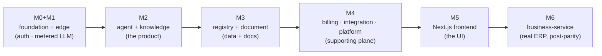

# Explanation docs — "what you get" per milestone

Plain-language guides that explain, for each milestone of the greenfield build, **what the
platform can actually do once it's implemented and how it works** — for humans onboarding and
for future AI runs. They are the readable companion to the formal specs in `docs/` and the
step-by-step build plans in `plans/`.

Each doc follows the same shape: one-sentence outcome → what exists (concretely) → mental model
→ how it works (with diagrams) → ideas worth internalizing → why this order → how you'll know it
works → what it is NOT.

## The milestones

| Doc | Milestone | What you get |
|---|---|---|
| [`m0-m1-what-you-get.md`](./m0-m1-what-you-get.md) | M0 + M1 | Foundation (uv monorepo, `x7-common`, infra, CI) + first runnable slice: gateway + identity-service + model-gateway. Login → JWT → metered LLM call. |
| [`m2-what-you-get.md`](./m2-what-you-get.md) | M2 | The AI workspace: agent-service (LangGraph chat, tools, approval interrupts) + knowledge-service (ingest + RAG search). |
| [`m3-what-you-get.md`](./m3-what-you-get.md) | M3 | Structured data + documents: registry-service (dynamic tables, canonical roles) + document-service (templates, PDF/Excel, prices, KSS). |
| [`m4-what-you-get.md`](./m4-what-you-get.md) | M4 | Supporting plane: billing-service (tokens + Stripe), integration-service (Google/email/WebDAV), platform-service (notifications/support/audit/settings). |
| [`m5-what-you-get.md`](./m5-what-you-get.md) | M5 | The web app: one Next.js application (tenant `/` + `/admin`), generated TS client, chat workspace with SSE + approval cards. |
| [`m6-what-you-get.md`](./m6-what-you-get.md) | M6 | Real ERP (post-parity, net-new): business-service — typed invoicing, inventory ledger, spendings. |

## How the milestones build on each other

## Where these fit among the other docs

- **`docs/01`–`docs/08`** — the authoritative architecture spec (overview, service catalog,
  agent platform, functional coverage, patterns, dependency graphs, database design).
- **`docs/services/*/README.md`** — per-service contracts and checklists.
- **`docs/libs/common/README.md`** — the `x7-common` shared-kernel contract.
- **`plans/`** — the executable, step-by-step build plans (with pseudo-code).
- **`docs/explanation/`** (this folder) — the "why and what you get" narrative layer.

> Source of truth for *what to build* is `docs/` + `plans/`. These explanation docs are the
> orientation layer; if they ever disagree with the specs, the specs win.
