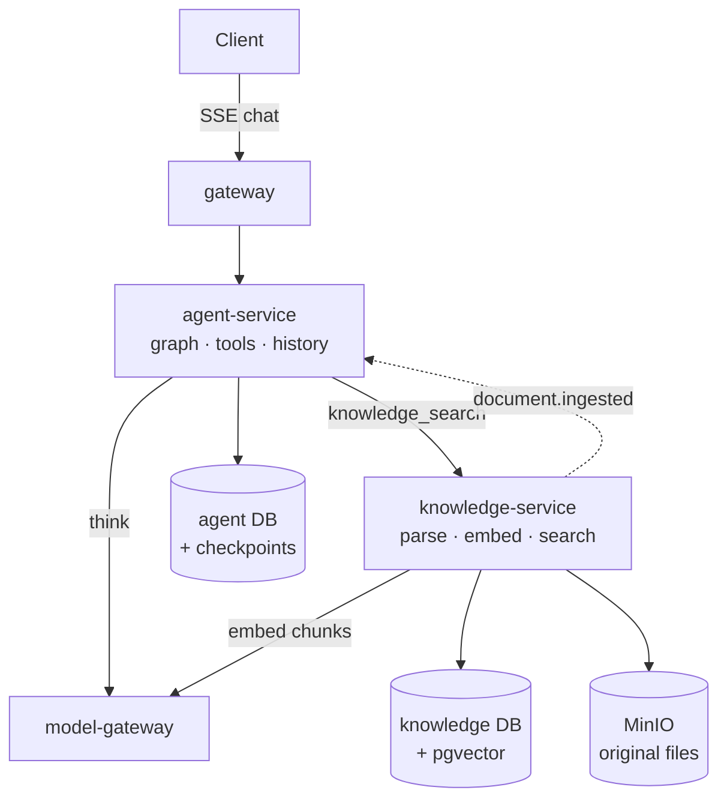
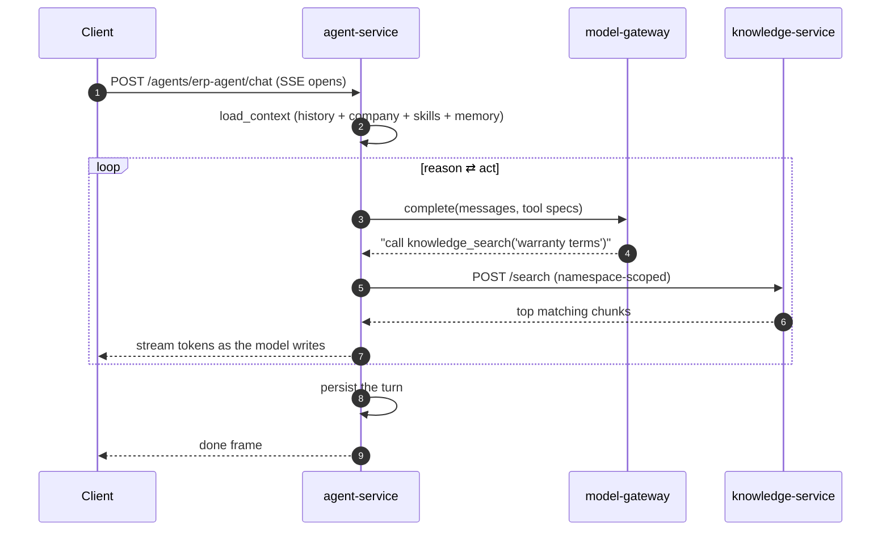
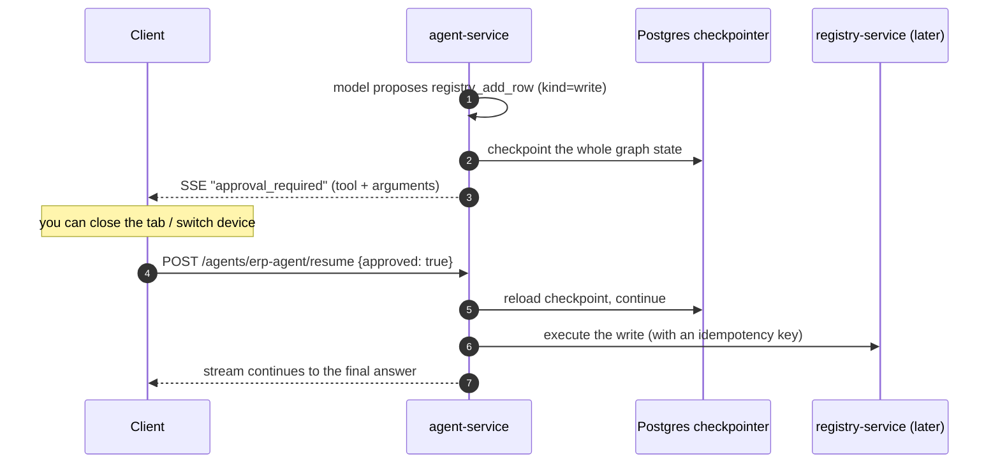
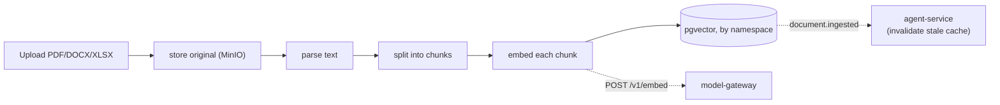

# What you get after Milestone 2 — the AI workspace

> Plain-language companion to `plans/` and the milestone map
> (`.cursor/plans/7x7_greenfield_build_e8060d34.plan.md`). Milestone 2 builds the
> **agent-service** and the **knowledge-service** — the highest-value vertical, the actual
> product. Read `m0-m1-what-you-get.md` first; this builds directly on that slice.

---

## 1. The one-sentence outcome

After Milestone 2 you have a **real AI chat** that can read your company's documents and
business data, answer grounded in them, and **propose changes that a human must approve**
before they happen — all streamed live to the client.

This is the moment the platform stops being plumbing and starts being the product. M0/M1
proved a raw model call works; M2 turns that into a tool-using agent with memory, retrieval,
and a safety rail on every write.

---

## 2. What exists when you're done (concretely)

| You can… | Because of… |
|---|---|
| Hold a streaming chat with an agent | **agent-service** + SSE (token-by-token) |
| Have the agent call tools mid-answer (read data, then reason) | the ReAct loop in the default graph |
| Have the agent retrieve facts from your uploaded docs | **knowledge-service** `/search` + the `knowledge_search` tool |
| Upload PDFs/DOCX/XLSX and have them indexed for search | knowledge-service ingest pipeline (parse → chunk → embed) |
| Get an "approve this action?" card before any write | the human-in-the-loop **interrupt** on `kind="write"` tools |
| Resume a paused chat after closing the tab | Postgres **checkpointer** + `POST /agents/{id}/resume` |
| Add a brand-new agent by dropping in a folder | manifest discovery (`app/agents/<id>/manifest.yaml`) |
| Keep conversation history per user/agent | the `conversations/` module in the agent DB |

The first agent shipped is `erp-agent` (the general business assistant), with the first tools:
`knowledge_search` (read), `registry_query` (read), and `registry_add_row` (write — so you
see the approval flow end to end).

---

## 3. The mental model: two new rooms

- **agent-service is the brain and the conversation.** It runs the agent "graph" (think: a
  flowchart the AI walks through), keeps chat history in its own database, talks to the
  model-gateway for thinking, and calls tools to act. It is the **only service that fans out**
  to everything else — because tools need to touch everything.
- **knowledge-service is the company's searchable memory.** You upload documents; it parses
  them, slices them into chunks, turns each chunk into a vector (a numeric fingerprint of
  meaning) via the model-gateway, and stores them so the agent can later ask "what do we know
  about X?" and get the relevant passages back.

---

## 4. How it works

### 4.1 A grounded chat turn (the ReAct loop)

The agent **reasons, acts, observes, repeats** — it can read a registry, search documents,
then compose an answer, all in one turn. Read tools run automatically; the model never sees a
tool it wasn't explicitly granted in its manifest (the allow-list is the security boundary).

### 4.2 A write needs your approval (durable interrupt)

The key idea: **the AI cannot change anything without a human "yes."** And because the paused
state is saved to Postgres (not held in memory), the approval survives a disconnect, a server
restart, or switching from web to phone. The write also carries an idempotency key, so even if
the system retries, the action happens exactly once.

### 4.3 Documents become searchable

A **namespace** is just a labelled bucket of knowledge (e.g. `library`, `offers-kb`). An agent's
manifest lists which namespaces it may search, so different agents can have different knowledge.

---

## 5. The ideas worth internalizing

- **Extensibility by convention.** A new agent is a folder + a `manifest.yaml`; a new tool is
  one module + one line in the catalog, then agents opt in via their manifest. No core code
  changes. This is the same plugin pattern used later for integration adapters.
- **The manifest is a contract, not code.** Model, allowed tools, knowledge namespaces, and
  channels are *data* you can edit and review — not buried in logic.
- **Write = interrupt, by construction.** A tool marked `write` always pauses for approval; a
  tool author cannot bypass it with clever prompt wording. Safety is structural.
- **Conversation history is a module, not a service.** It sits inside agent-service behind a
  `ConversationStore` port, because history reads/writes happen on every single turn — a
  network hop there would be pure latency tax. The port keeps it cheap to extract later if
  ever needed.
- **The agent never touches another service's database.** It retrieves through
  knowledge-service's `/search` API and acts through tool HTTP calls — never by reaching into
  tables.

---

## 6. Why this milestone comes here

The agent platform is the product's core value, so it's built as early as the foundation
allows — right after M1 gives it a working model-gateway (to think) and identity (to know who's
asking). knowledge-service ships alongside it because an agent without retrieval can't answer
grounded business questions. The structured-data tools (registries, documents) are stubbed/
minimal here and get their real backends in M3.

---

## 7. How you'll know it works (the exit test)

> A real chat turn that retrieves grounded context **and** proposes an approved write.

1. Upload a document to a namespace; confirm it gets chunked and embedded.
2. Ask `erp-agent` a question whose answer is in that document → the agent calls
   `knowledge_search` and answers using the retrieved passages.
3. Ask it to add a row to a registry → the stream pauses with `approval_required`; approve →
   the write executes and the answer completes.
4. Close the tab during the approval and reopen → the pending approval is still there.

---

## 8. What this is NOT (so expectations are right)

- **Registries and documents aren't fully real yet.** `registry_query`/`registry_add_row`
  work against an early registry-service; the rich registry engine, templates, pricing, and
  document generation arrive in **Milestone 3**.
- **No billing enforcement yet.** The agent does a pre-flight balance check stub, but the
  billing-service that actually tracks balances comes in **Milestone 4**. (Metering events
  from M1 are already flowing.)
- **No integrations (email/Drive/WebDAV) yet.** Those tools and the file-sync engines wire up
  in **Milestone 4** once integration-service exists.
- **No UI yet.** Exercised via `curl`/tests; the chat workspace UI is **Milestone 5**.

---

## See also
- `docs/explanation/m0-m1-what-you-get.md` — the foundation this builds on.
- `docs/03-agent-platform.md` — the full agent/tool/graph design and the "add an agent" recipe.
- `docs/services/agent-service/README.md`, `docs/services/knowledge-service/README.md`.
- `docs/01-architecture-overview.md` §key flows 1–3 (chat turn, approval, ingestion).
