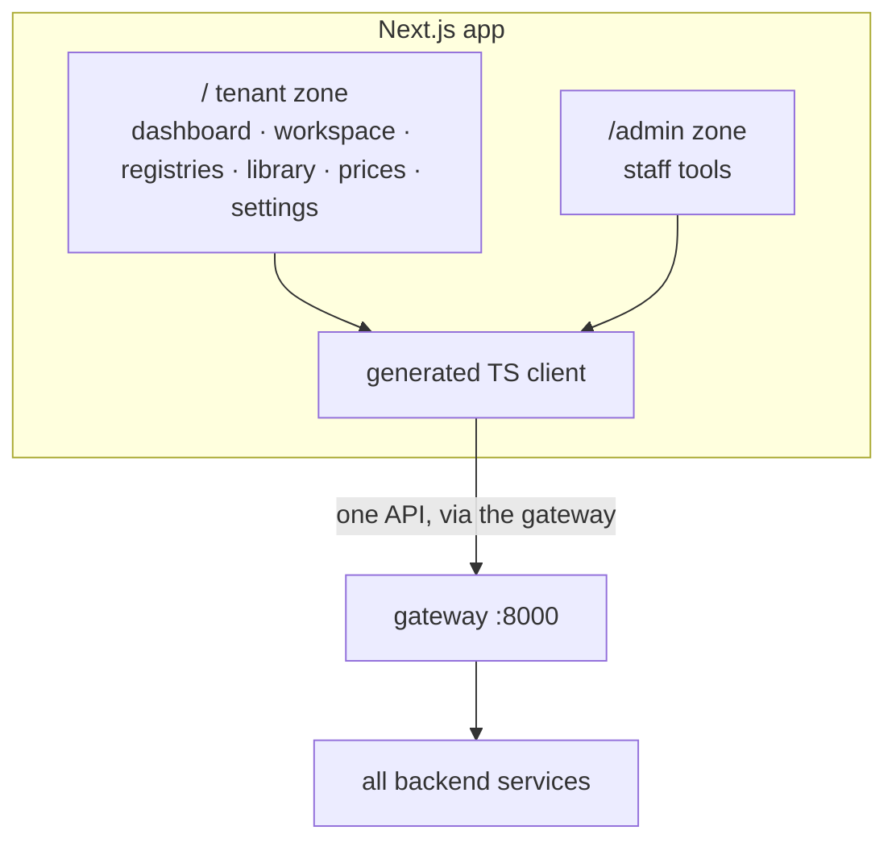
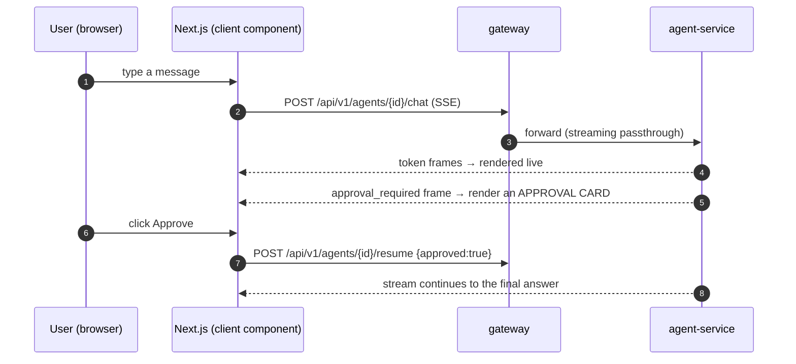

# What you get after Milestone 5 — the web app

> Plain-language companion to the milestone map
> (`.cursor/plans/7x7_greenfield_build_e8060d34.plan.md`). Milestone 5 builds the **Next.js
> frontend** — one app, two zones (`/` tenant app and `/admin`) — on top of everything the
> backend already exposes.

---

## 1. The one-sentence outcome

After Milestone 5 there's a **real product people can click**: log in, chat with agents (with
live streaming and approval cards), browse and edit registries, manage the library, prices, and
templates, configure integrations and settings, and — for staff — an admin zone.

M1–M4 made the backend fully capable through APIs. M5 puts a polished, modern UI in front of it
so it's usable by humans, not just `curl`.

---

## 2. What exists when you're done (concretely)

| You can… | Because of… |
|---|---|
| Log in / register / reset password in a real UI | `/auth/**` pages → identity-service |
| Chat with an agent, watch tokens stream, approve writes | `/workspace` (client components + SSE + approval cards) |
| Browse a dashboard briefing | `/` (server-rendered, data from registry-service) |
| View/edit registries and rows | `/registries`, `/registries/[id]` |
| Manage the document library and archive | `/library`, `/archive` |
| Manage the price list | `/prices` |
| Edit visual document templates | `/templates/[id]/edit` |
| Manage skills, settings, integrations, support | `/skills`, `/settings/**`, `/integrations`, `/support` |
| Use a separate staff admin area | `/admin/**` zone |
| Use the app in Bulgarian or English | bg/en i18n catalogs |

The whole UI talks to the backend through a **generated TypeScript client** built from the
gateway's merged OpenAPI spec — no hand-written fetch code that can drift from the API.

---

## 3. The mental model: one app, talking only to the door

- **It's a single Next.js application** with two zones: the tenant app at `/` and a staff admin
  SPA at `/admin`. Everything goes through the **gateway** — the frontend never knows internal
  service URLs and has no privileged access.
- **Server Components for data-heavy pages** (registries, library, dashboard) render on the
  server for speed and small bundles. **Client Components for interactivity** (the chat
  workspace with streaming and approval cards, the editors).
- **The API client is generated, not written.** Because the gateway exposes a merged OpenAPI
  spec, the TS types and calls are generated from it — when the backend contract changes, the
  client regenerates and type errors surface immediately.

---

## 4. How it works

### 4.1 The chat workspace (the most interactive screen)

The approval card is the UI for the durable interrupt from M2: the stream pauses, the user sees
exactly what the agent wants to do (tool + arguments), and clicking Approve/Reject resumes the
backend graph. Because the pause is checkpointed server-side, a refresh doesn't lose it.

### 4.2 Why most pages are server-rendered

A registry list or the library is a lot of data and little interaction — rendering it on the
server (a React Server Component) means the browser downloads HTML, not a big JavaScript bundle
plus a data-fetch waterfall. The chat workspace is the opposite (constant interaction, live
streaming), so it's a client component. The split keeps each page fast for its job.

### 4.3 Two zones, one security model

The `/admin` zone is the same app but gated by the platform-admin claim. The gateway enforces
admin access (and the 404-for-non-admins behavior) and the impersonation read-only guard — the
frontend just renders what it's allowed to see. No special backend access lives in the browser.

---

## 5. The ideas worth internalizing

- **The gateway is the only API surface.** Every current and future client (web now; mobile,
  Telegram/Viber later) hits the same gateway with the same security. The web app is just the
  first client.
- **Generated client = no drift.** The contract is the OpenAPI spec; the client is downstream of
  it. You don't hand-maintain request/response types.
- **Render where it makes sense.** Server Components for data, Client Components for
  interactivity and streaming — not everything-is-a-SPA.
- **The UI holds no privilege.** All authorization is enforced at the gateway and in services;
  the browser can't bypass it by calling a service directly (services aren't reachable).
- **i18n is first-class.** bg/en catalogs carry over so the product ships bilingual.

---

## 6. Why this milestone comes here

The frontend is built last (before the post-parity M6) on purpose: it's a thin consumer of
backend capabilities, so building it after the APIs are stable means no rework chasing a moving
contract. The generated client makes this concrete — it can only be generated once the gateway's
merged OpenAPI is real, which it is after M1–M4.

---

## 7. How you'll know it works (the exit test)

1. Register and log in entirely through the UI.
2. Open the workspace, send a message, watch tokens stream in; trigger a write, see the approval
   card, approve it, watch the answer complete; refresh mid-approval and confirm it's still
   pending.
3. Browse/edit a registry; manage the library and prices; edit a template.
4. Connect an integration and adjust settings from the UI.
5. As a staff user, open `/admin`; as a normal user, confirm `/admin` routes 404.
6. Switch language bg ↔ en.

---

## 8. What this is NOT (so expectations are right)

- **No new backend capability.** M5 surfaces what M1–M4 already do; if something isn't in the
  API, it isn't on screen.
- **No typed invoicing/inventory UI yet** beyond the registry-based "Фактури" — the
  business-service screens come with **Milestone 6**.
- **Marketing site is optional/separate.** Landing/pricing pages may live in a separate static
  site to keep the product app lean (a decide-during item).

---

## See also
- `docs/explanation/m0-m1-what-you-get.md` … `m4-what-you-get.md` — the backend it consumes.
- `docs/01-architecture-overview.md` §8 — frontend architecture.
- `docs/04-functional-coverage.md` §2 — the monolith-page → Next.js-route map.
