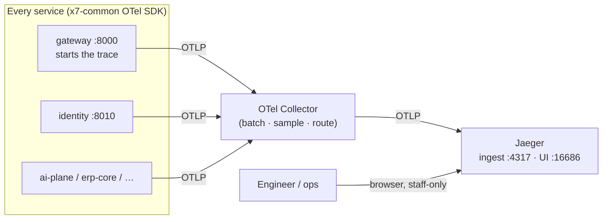

# Jaeger

> The **distributed-tracing backend + UI**: the place where the OpenTelemetry spans every
> service emits are collected, stored, and made browsable as request waterfalls. It is the
> "where do I *look* at a trace" half of our observability stack — the OTel SDK in
> [`x7-common`](../../../libs/common/README.md) produces spans; Jaeger is what turns them into a
> searchable timeline. It is an **internal ops/engineering console**, never tenant-facing and
> never on the application data path.

**Type:** third-party engine (self-hosted observability backend) · **Scope:** engineering/ops
tracing (not tenant-facing) · **Owner:** no single service — fed by **every** service via the
OpenTelemetry exporter in `x7-common` (cross-cutting, not port-wrapped) · **Internal endpoints:**
`jaeger:4317` (OTLP gRPC ingest), `jaeger:4318` (OTLP HTTP ingest), `jaeger:16686` (UI) ·
**UI:** Authentik-fronted, staff-only · **Public:** no

## What it is

[Jaeger](https://www.jaegertracing.io/) is an open-source, CNCF distributed-tracing system. A
**trace** is one request's journey across processes; each hop is a **span** (name, start/stop,
attributes, parent). Because our gateway **starts** a trace and every downstream service
**continues** it ([01 §10](../../../01-architecture-overview.md#10-cross-cutting-standards-every-service)),
a single login or chat turn becomes one connected waterfall even when it crosses
`gateway → identity → …` or several services co-located in one deployable.

Jaeger has two halves we care about:

| Half | What it does | Endpoint |
|---|---|---|
| **Ingest (OTLP receiver)** | accepts spans pushed by the OTel SDK / Collector | `jaeger:4317` (gRPC), `jaeger:4318` (HTTP) |
| **Query UI** | search by service/operation/tag/trace-id; render the span waterfall | `jaeger:16686` |

> **Jaeger is for *traces*. Sentry is for *errors*; structured JSON logs (structlog) are for
> *log lines*.** The three are correlated by the shared `request_id` / `trace_id`, but they are
> separate tools — Jaeger does not store logs and is not an alerting system.

## Why we use it

- **It is the missing viewer.** An OTel Collector *receives and forwards* spans but has **no
  UI** — without a tracing backend you have nowhere to actually look at a trace. Jaeger
  all-in-one is the lightest way to get a real trace UI in dev.
- **It fits the "no Grafana" stance.** Engineering observability is explicitly **OTel + Sentry**,
  and Grafana is deliberately rejected (and would drag in a parallel UI/auth model) —
  [09 §3.10](../../../09-industry4z-platform-integration.md#310-iot-vertical--iot-service--timescaledb--node-red--decided-adopt-grafana-rejected),
  [09 integration matrix](../../../09-industry4z-platform-integration.md). Jaeger is a
  trace-only backend with its own UI, so it satisfies "let me see a trace" without reintroducing
  Grafana.
- **Debugging across hops is the thing we lose moving off the monolith.** A single monolith
  stack trace becomes a multi-service request; tracing is how we get that visibility back
  ([05 migration cons](../../../05-migration-pros-and-cons.md)).

## What we use it for (all engineering-side)

1. **End-to-end request inspection** — open a login / `/users/me` / chat turn and see every span
   and where the time went.
2. **Latency analysis** — find the slow hop (a slow DB call, a slow upstream service) in the
   waterfall.
3. **Cross-reference from a crash** — jump from a Sentry issue's `trace_id` to the full trace in
   Jaeger, then to the matching `request_id` log lines.

> **What it does *not* do:** it never sees tenant business data beyond span attributes, never
> evaluates alerts, and is never called by application code on the request path — services only
> *push* spans to it asynchronously.

## How it is wired in

Spans flow **out** of every service to Jaeger; nothing flows back on the request path:



- **Producers.** Each service's `x7-common.telemetry` initializes the OTel SDK and exports OTLP
  to `OTEL_EXPORTER_OTLP_ENDPOINT` (the config keys `otel_enabled` /
  `otel_exporter_otlp_endpoint` already exist in [`x7-common`](../../../libs/common/README.md)).
- **Collector (recommended in prod, optional in dev).** Point services at the **OTel Collector**,
  which batches/samples/routes and forwards to Jaeger. In **dev** you can skip the Collector and
  export **directly to `jaeger:4317`**, since Jaeger all-in-one is itself an OTLP receiver.
- **No gateway involvement.** Trace export is a side channel from each service to Jaeger — it
  does **not** go through the API gateway (the gateway is for authenticated *application* API
  traffic only).

## Interface & access (how the UI is reached)

Jaeger has **one** human surface — the **Query UI** at `:16686` — plus the machine ingest path
(services pushing OTLP). Jaeger all-in-one ships **no authentication of its own**, so the UI is
locked down exactly like the other internal consoles (n8n / Node-RED editors) to preserve the
single-public-door invariant ([01 §2.1](../../../01-architecture-overview.md), [external services README](../README.md)).

| Surface | Who | How it's reached | Notes |
|---|---|---|---|
| **Query UI (`:16686`)** | platform/eng staff only | **Dev:** publish the port and open `http://localhost:16686`. **Prod:** never publish it — reach it via an **SSH tunnel** (`ssh -L 16686:localhost:16686 host`) or an **Authentik SSO** forward-auth subdomain on Coolify/Traefik (e.g. `jaeger.internal.…`), optionally locked to the **Tailscale** mesh VPN. | **Not** served through our API gateway and **never** publicly exposed. |
| **OTLP ingest (`:4317`/`:4318`)** | the services (via OTel SDK / Collector) | internal network only (`jaeger:4317`) | No port publish needed in prod; dev only publishes it if exporting from the host. |

### Opening the UI, step by step

**Dev (Docker Compose on your machine):**

```yaml
# docker-compose.yml (dev)
jaeger:
  image: jaegertracing/all-in-one:latest
  ports:
    - "16686:16686"   # UI  -> http://localhost:16686
    - "4317:4317"     # OTLP gRPC (services -> jaeger)
    - "4318:4318"     # OTLP HTTP
```

```bash
OTEL_ENABLED=true
OTEL_EXPORTER_OTLP_ENDPOINT=http://jaeger:4317   # services point here (or at the Collector)
```

Then open **http://localhost:16686**, pick a service (e.g. `gateway`), click **Find Traces**,
and open a trace to see the span waterfall. You can also paste a known `trace_id` to jump
straight to it.

**Prod (single host, Coolify) — pick one, do not publish `16686`:**

```bash
# Option A — quick look via SSH tunnel (zero extra infra)
ssh -L 16686:localhost:16686 youruser@your-server
# then open http://localhost:16686 locally

# Option B — permanent staff URL: Authentik SSO forward-auth on a Coolify/Traefik subdomain
#   jaeger.internal.<yourco>  ->  Authentik login  ->  Jaeger UI   (optionally Tailscale-only)
```

## Deployment & access

- **Dev:** `jaegertracing/all-in-one` — a single container. **In-memory storage by default**
  (traces are wiped on restart), which is fine for local debugging; use the on-disk Badger
  backend if you want them to survive a restart.
- **Prod:** all-in-one's memory store is **not** durable/scalable. Either run Jaeger with a
  persistent backend (Elasticsearch/Cassandra) or a managed OTLP tracing backend, fed by the
  OTel Collector. Size disk for the trace volume × retention window; sampling at the Collector
  controls cost.
- **Auth/network:** Jaeger has no built-in auth — front the UI with **Authentik** (and/or
  **Tailscale**), exactly as the n8n/Node-RED editors are fronted. Ingest stays on the internal
  network.
- **Secrets:** any backend credentials (e.g. Elasticsearch) come from **Infisical**, never baked
  into the image.

## Trade-off

Adds an internal observability backend (one container in dev; a persistent store in prod) and a
staff-only UI that must be access-controlled like the other ops consoles. Accepted because
without a trace viewer the OTel spans we already emit are unviewable, and Jaeger is the
lightest option that fits the **OTel + Sentry, no-Grafana** stance. It is **non-critical**: if
Jaeger is down, services keep serving — only trace *visibility* is affected, not traffic. For a
minimal first slice it can even be deferred to "logs + Sentry," but it's cheap to stand up and
turns "debug across hops" from aspirational into real.

## Value to the product & team

- **Product:** indirectly — faster diagnosis of latency/incidents means a more reliable platform.
- **Team:** a single request's path across services becomes one clickable waterfall; combined
  with Sentry (errors) and structured logs (lines), engineers can follow one `request_id` from
  crash → trace → logs instead of guessing across process boundaries.

## References

- [01 §10 — Cross-cutting standards](../../../01-architecture-overview.md#10-cross-cutting-standards-every-service) — OTel traces + structlog + Sentry; gateway starts the trace, every hop continues it.
- [09 §3.10 — IoT vertical / Grafana rejected](../../../09-industry4z-platform-integration.md#310-iot-vertical--iot-service--timescaledb--node-red--decided-adopt-grafana-rejected) — why engineering observability stays OTel/Sentry, not Grafana.
- [libs/common README](../../../libs/common/README.md) — the `telemetry.py` module and `otel_enabled` / `otel_exporter_otlp_endpoint` config keys that export spans.
- [devops-handoff §4.5](../../../devops-handoff.md) — health & observability summary.
- [external services README](../README.md) — the off-the-shelf engine catalog and the single-public-door rule.
