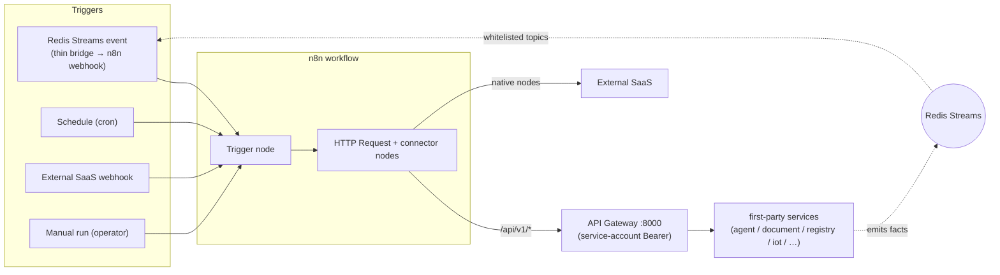

# n8n

> The **platform automation plane**: a visual, node-based workflow engine used by *us* (the
> platform team) to wire cross-service glue — react to events, call our APIs, fan out to
> external SaaS — without writing a bespoke `arq` job for every one-off. It is **internal /
> platform-only**, never tenant-facing, and it talks to the platform **only through the API
> gateway**. We orchestrate with it; we never let it hold keys or assert tenancy on its own.

**Type:** third-party engine (self-hosted, **stateful** — own Postgres) · **Scope:**
platform/internal-ops only (not tenant-facing) · **Owner:** no single first-party service — it
is a platform-level orchestration plane governed by the **gateway-only rule** · **Internal
endpoint:** `n8n:5678` · **Editor UI:** Authentik-fronted, staff-only · **Public:** no

## What it is

[n8n](https://n8n.io/) is an open-source **workflow automation tool**. You build workflows
visually from **nodes**: a *trigger* node (webhook, schedule/cron, manual) starts a run, and
*action* nodes (HTTP Request + 400+ native connectors for Slack, Google, accounting tools, …)
do the work, passing data node-to-node. Workflows live in n8n's own **Postgres**; executions
are logged. It is the visual counterpart to code-defined automation.

> **Not a replacement for our async model.** Our core async machinery is **Redis Streams events
> + per-service `arq` jobs** ([01 §7](../../../01-architecture-overview.md#7-asynchronous-work-and-events)) —
> code, tested, on the critical path. n8n is the **non-critical glue plane** beside it, not a
> substitute for it. See the boundary table below.

## Why we use it

We accumulate a long tail of cross-service "glue" automations (notify, sync, escalate,
schedule, fan-out to SaaS) that are real but not worth a hand-rolled, code-reviewed `arq` job —
and that need no AI reasoning. n8n is the right home for that tail: fast to author, editable by
ops staff, and a huge connector catalog. It is also the natural home for the **sync
orchestration we deliberately kept out of Nango** (Nango's Syncs/Functions are Enterprise-gated,
[09 §3.6](../../../09-industry4z-platform-integration.md#36-integrations--nango-)).

| n8n gives us (don't build) | We still own (in first-party code) |
|---|---|
| Visual workflow runtime + 400+ connectors | The gateway as the single door; service APIs and business rules |
| Schedules, retries, execution logs/UI | `token.usage` billing truth, tenant attribution, kill switch |
| Fast iteration for ops/internal glue | Anything **critical-path** (stays in `arq` + transactional outbox) |
| Fan-out to external SaaS (Slack, accounting, …) | The **act-on-behalf-of-a-tenant** capability (never n8n's) |

### Where it sits relative to the three things we already have

| Plane | Owns | n8n? |
|---|---|---|
| **`arq` jobs** | per-service, private, **critical path** (`token.usage` outbox, embeddings, retention) | **No** — never |
| **LangGraph agents** ([03](../../../03-agent-platform.md)) | AI reasoning, approval-gated writes, versioned/tested | **No** — but a workflow *may call* an agent as a step |
| **n8n** | cross-service **non-critical glue**, internal ops workflows, fast-changing 3rd-party hooks | **Yes** |

The dividing line: **if losing or double-running a workflow can corrupt money or core domain
state, it does not live in n8n.** Events redeliver, so every n8n action must be idempotent;
billing-critical work stays in `arq` + the transactional outbox.

## What we use it for (all internal)

1. **IoT diagnosis loop** — consume `sensor.anomaly` / `device.alert`
   ([09 §3.10](../../../09-industry4z-platform-integration.md#310-iot-vertical--iot-service--timescaledb--node-red--decided-adopt-grafana-rejected)),
   call `agent-service` `/agents/iot` through the gateway, route the diagnosis to
   `platform-service` notifications. The flagship pattern.
2. **Business glue on existing events** — `invoice.issued` → post to Slack/Teams, create a task
   in an external PM tool, push to an accounting system (the reserved "accounting export" hook).
3. **Workflow chaining over our own APIs** — e.g. render a contract via `document-service`, then
   trigger a Documenso `esign` request via `integration-service` — all through the gateway.
4. **Scheduled digests/reports** — cron → call `registry-service`'s briefing endpoint → emit
   `notification.requested`.
5. **Low-value inbound webhooks** from third parties that don't justify a coded adapter.

## How it is wired in

A workflow is always *trigger in → actions through the gateway → results recorded as facts*:

- **Triggers in.** Events reach n8n only via a **thin bridge** (a small first-party consumer
  that forwards a *whitelisted* set of Redis Streams topics to a workflow's webhook). n8n does
  **not** read the stream directly — this keeps consumer-group offset/ack/idempotency in our code
  and controls exactly which events n8n can see.
- **Actions out.** Every call into the platform is an HTTP Request node to `/api/v1/*` with the
  **n8n service-account** Bearer token, subject to the same rate-limit buckets and
  `require_permission(...)` as any client. No node ever touches a service DB or internal port.
- **Results as facts.** To record/notify, a workflow **calls the owning service's API**, and that
  service emits the event (e.g. ends up as `notification.requested`). n8n is an orchestrator and
  a *consumer*, **never a direct event producer** — otherwise it starts owning domain facts and
  breaks database-per-service.
- **Auth.** A dedicated **service account in `identity-service`** with a least-privilege role from
  the permission catalog ([01 §6](../../../01-architecture-overview.md#authorization-model--roles--permissions-rbac));
  credential stored in **Infisical**, not in workflow JSON.

## Tenant context & billing (the core constraint)

This is the most important rule for n8n and the reason it is platform-only. Read it before
authoring any workflow that touches tenant data or spends tokens.

**The setup.** Everything in the platform is **company-scoped** — to read data, write rows, or
spend LLM tokens you need a `company_id`. In a normal request that `company_id` is *proven* by a
user's login token: the gateway reads the token, injects `X-Company-Id`, and **strips any
client-supplied value** ([01 §5](../../../01-architecture-overview.md#5-the-api-gateway)). Tenant
context is therefore **structurally enforced** — no caller can act for the wrong company.

**The problem.** n8n has **no login** and runs as a single shared **platform** service account.
It still must do company-specific work (diagnose org C's device, generate org C's document) and
that work must be billed to the right org via `token.usage`
([09 §3.2](../../../09-industry4z-platform-integration.md#32-llm-access--litellm-vs-model-gateway-),
[01 §7](../../../01-architecture-overview.md#7-asynchronous-work-and-events)). But n8n has **no
trusted source** of `company_id` the way a logged-in user does. If n8n could simply assert
"do this for company C", a bug or a bad workflow could assert company **B** — reading B's data
or billing B's tokens. So the real risk n8n introduces is that **tenant-context enforcement
moves out of the gateway (structural) and into workflow discipline (convention).**

**The rule (safe `company_id` propagation).**

1. **`company_id` originates from the trigger, not from n8n.** It must come from the **triggering
   event**, emitted by a first-party service that *legitimately knows the mapping* — e.g.
   `iot-service` knows `device 123 → company C`, so it emits
   `sensor.anomaly { device: 123, company_id: C }`. n8n receives `C`; it never invents or
   iterates over `company_id`s.
2. **A first-party service does the company-scoped work — not n8n.** The workflow **forwards**
   `company_id` to a **first-party endpoint** (e.g. `iot-service`, or a workflow-as-tool
   endpoint). That service — holding a system token with a narrow, audited **act-on-behalf-of**
   capability — makes the company-scoped call. `model-gateway` then emits `token.usage` attributed
   to `C`, and the per-tenant **kill switch + budgets** apply because `company_id` is present.
3. **n8n never calls an LLM provider directly.** No native OpenAI/LangChain LLM nodes, no provider
   keys in n8n. All model calls go through `model-gateway` via the gateway — otherwise there is
   **no `token.usage` event** (unbilled) and it violates **principle 5** ("no service holds
   provider keys except the Model Gateway",
   [01 §2](../../../01-architecture-overview.md#2-architectural-principles)).
4. **Platform-overhead LLM usage is attributed to a system company.** Genuine internal-ops model
   usage tied to no tenant is billed to a dedicated **system/platform `company_id`** — platform
   overhead, never charged to a real org.

**The danger zone (forbidden).** Any workflow that needs a `company_id` that did **not** come
from a trusted trigger — it hardcodes one, picks one, or loops over *all* companies — is exactly
where billing mis-attribution and tenant-isolation breaches happen. Such a workflow must not
exist; if a real use case needs it, it is a first-party feature with proper tenant isolation,
not an n8n workflow.

> **One-line summary:** n8n may *carry* a `company_id` that a trusted event gave it, but it may
> never *originate, choose, or assert* one — and a first-party service, never n8n, performs the
> tenant-scoped action.

## Deployment & access

Unlike the stateless engines (LiteLLM, Unstructured, Carbone), n8n is **stateful** (its own
Postgres holds workflows, credentials metadata, and execution history) — treat it like a small
stateful service: persistent volume + backups, and its encryption key managed via **Infisical**.

- **Runtime (internal):** `n8n:5678` on the private network. Inbound is the **thin bridge**
  (webhook triggers) and operators (editor UI); outbound to the platform is **only** the gateway
  `:8000`, enforced at the network layer — no route to Postgres or service ports. Deployed by
  **Coolify**.
- **Editor UI (operators only):** the n8n editor is n8n's own web UI — it is **not** served
  through our API gateway and is **not** publicly exposed (single-public-door invariant). It is
  reached on a Coolify/Traefik subdomain behind **Authentik SSO** (forward-auth), the same way the
  other internal ops consoles are fronted ([09 §3.1](../../../09-industry4z-platform-integration.md#31-identity--authentik-)),
  restricted to a platform-staff group; optionally additionally locked to the **Tailscale** mesh
  VPN. **Operator login = Authentik; n8n calling our APIs = the `identity-service` service
  account** — two separate auth paths, not to be conflated.

## Governance & lifecycle

- Author in a dev/staging instance; **export workflows to JSON and commit them to the repo**
  (n8n source-control). Prod workflows are reviewed artifacts, promoted dev→prod — not
  click-together state that exists only in one DB (same discipline as Flowise flows,
  [09 §3.4](../../../09-industry4z-platform-integration.md#34-visual-ai-builder--flowise-)).
- **Credentials by reference**, resolved from Infisical / n8n's credential store at runtime —
  never embedded in exported JSON.
- **Idempotency + observability:** events redeliver, so write actions must be idempotent;
  workflow failures raise an alert back through `platform-service` (via the gateway) so a broken
  workflow is visible, not silent.

## Trade-off

Adds a **stateful** component (own Postgres) and a powerful UI that can trigger real workflows.
Accepted because it removes a long tail of bespoke glue jobs and stays internal-only behind the
gateway. The principal risk is governance — workflows are code-without-review by default — which
the source-control + tenant-context rules above contain. If the automation tail stays small,
n8n can be **deferred** with no architecture change; the events and APIs it would consume exist
regardless.

## Value to the product & team

- **Product:** fast cross-service automations (IoT alert→diagnosis→notify, accounting export,
  scheduled digests) without backend releases for each.
- **Team:** ops/internal glue is built and changed visually instead of as one-off `arq` jobs;
  core services stay focused on their domain, and the dangerous tenant-context power stays in
  audited first-party code.

## References

- [09 §3.9 — Automation: n8n](../../../09-industry4z-platform-integration.md#39-automation--n8n-) — the adoption analysis and rules.
- [01 §7 — Asynchronous work and events](../../../01-architecture-overview.md#7-asynchronous-work-and-events) — the events n8n reacts to (and the boundary vs `arq`).
- [01 §5 — The API Gateway](../../../01-architecture-overview.md#5-the-api-gateway) — single door + header stripping (why n8n can't assert tenancy).
- [01 §2 — Architectural principles](../../../01-architecture-overview.md#2-architectural-principles) — gateway-only, database-per-service, LLM-only-via-model-gateway.
- [09 §3.2 — model-gateway / LiteLLM](../../../09-industry4z-platform-integration.md#32-llm-access--litellm-vs-model-gateway-) — `token.usage` as billing truth.
- [external services README](../README.md) — the off-the-shelf engine catalog.
