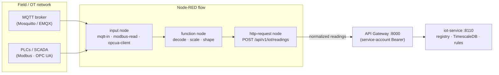

# Node-RED

> The **IoT protocol-ingestion edge**: a visual, flow-based engine that speaks the industrial
> protocols sensors actually use (**MQTT / Modbus / OPC UA / HTTP**), decodes their raw frames
> into normalized readings, and **posts them to `iot-service` through the API gateway**. It is
> the IoT-side twin of [n8n](../n8n/README.md): an internal, gateway-only glue plane — we
> orchestrate ingestion with it, but it never holds tenant context, keys, or a database row.

**Type:** third-party engine (self-hosted, **stateful** — flows/credentials on disk) · **Scope:**
IoT ingestion edge (not tenant-facing) · **Owner:** no single port — it is the ingestion plane
in front of [`iot-service`](../../iot-service/README.md) (8110), governed by the
**gateway-only rule** · **Internal endpoint / editor UI:** `node-red:1880` · **Editor UI:**
Authentik-fronted, staff-only · **Public:** no

## What it is

[Node-RED](https://nodered.org/) is an open-source, **Node.js flow-programming** tool built for
wiring hardware and event sources together. You program it visually in a browser **editor**
(`:1880`): a *trigger/input* node (an `mqtt-in` subscription, a `modbus-read` poll, an
`opcua-client` subscription, an `http-in` endpoint, or an `inject` timer) starts a flow, and
nodes pass a message object (`msg.payload`) left-to-right through *function* nodes (small JS:
decode, scale, map) into an `http-request` *output* node. Flows are stored on disk as
`flows.json`; credentials are encrypted with a `credentialSecret`.

Its decisive feature is the **industrial-protocol palette** — the languages PLCs/SCADA/sensors
speak, which our FastAPI services have no reason to implement by hand:

| Protocol | Node | Use |
|---|---|---|
| **MQTT** | built-in `mqtt-in` / `mqtt-out` | subscribe to a broker (sensors publish here) |
| **Modbus** | `node-red-contrib-modbus` | poll PLC holding/input registers (TCP + serial) |
| **OPC UA** | `node-red-contrib-opcua` | subscribe to tags in an OPC UA address space |
| **HTTP / serial / S7 / BACnet** | built-in / community | misc. gateways and controllers |

> **Not a replacement for our async model.** Like n8n, Node-RED is **non-critical glue**, not a
> substitute for Redis Streams + `arq`. It only does protocol decode + forward; all storage,
> tenancy, rules, and events are first-party (`iot-service`).

## Why we use it

The IoT vertical can't exist without a protocol edge: sensors emit Modbus registers and OPC UA
tags, not clean JSON. Hand-rolling and maintaining decoders for every protocol and device model
inside `iot-service` would be a large, fragile, low-value effort. Node-RED gives us that layer
off-the-shelf, editable visually by an OT/integration engineer **without a backend release** for
each new sensor type — and it keeps all industrial-protocol complexity quarantined out of our
Python services.

| Node-RED gives us (don't build) | `iot-service` still owns (first-party code) |
|---|---|
| Protocol decoding (MQTT/Modbus/OPC UA), persistent device connections | The gateway as the single door; the ingestion API + validation |
| Visual flows, fast iteration for new sensor types | The `device→company` mapping (tenancy truth) |
| Edge buffering/retry toward the gateway | Time-series storage, alert rules, anomaly **events** |
| A large connector palette | Anything tenant-scoped or billing-relevant |

## What we use it for (all ingestion-side)

1. **Sensor ingestion** — subscribe/poll a fleet, decode + scale to a normalized reading
   `{ device_id, metric, value, unit, ts }`, and `POST /api/v1/iot/readings` (batched for
   high-frequency sources).
2. **Protocol bridging** — translate a site's Modbus/OPC UA into the same normalized shape so
   `iot-service` sees one contract regardless of device vendor.
3. **Edge resilience** — buffer readings locally and retry toward the gateway if the uplink
   blips, so data isn't lost during transient outages.

> **What it does *not* do:** it never evaluates alert thresholds (that's `iot-service`), never
> calls an LLM, never asserts a `company_id`, and never produces a domain event. It decodes and
> forwards — nothing more.

## How it is wired in

A flow is always *protocol in → normalize → forward through the gateway*:

- **Inbound (dirty side).** Node-RED connects to the **OT/field network** — an MQTT broker
  (typically a new **Mosquitto/EMQX** component), or directly to PLCs/OPC UA servers over TCP.
  In many deployments Node-RED runs **at the customer site / on an edge box** and reaches the
  platform over the public gateway door.
- **Outbound (to us).** Every call into the platform is an `http-request` node to `/api/v1/*`
  with the **Node-RED service-account** Bearer token, subject to the same rate-limit buckets and
  `require_permission(...)` as any client. **No node ever touches TimescaleDB or an internal
  service port** — same gateway-only rule as [n8n](../n8n/README.md#how-it-is-wired-in).
- **Tenancy stays first-party.** Node-RED sends `device_id`; `iot-service` resolves
  `device→company` and is the only thing that attaches `company_id`. A bug in a flow can at
  worst mislabel a *device*, never act for the wrong company.
- **Auth.** A dedicated **service account in `identity-service`** with a least-privilege role
  (e.g. only `iot.readings.write`); the credential is stored in **Infisical**, never in flow
  JSON.

## Interface & access (how the editor is reached)

Node-RED has **one** human surface — its **flow editor** at `:1880` — plus the machine path
(its `http-request` nodes calling our gateway). Both are locked down to preserve the
single-public-door invariant.

| Surface | Who | How it's reached | Notes |
|---|---|---|---|
| **Flow editor (`:1880`)** | platform/OT staff only | **Authentik SSO** forward-auth on a Coolify/Traefik subdomain (e.g. `nodered.internal.…`); optionally additionally locked to the **Tailscale** mesh VPN | **Not** served through our API gateway and **never** publicly exposed — same fronting as the [n8n editor](../n8n/README.md#deployment--access). |
| **Outbound to platform** | the Node-RED runtime | `http-request` → API gateway `:8000` with the `identity-service` service-account Bearer | The only route from Node-RED into the platform; no internal ports. |
| **Inbound from field** | sensors / brokers / PLCs | MQTT/Modbus/OPC UA on the OT network (or an edge VPN) | The "dirty side"; firewalled to *field + gateway only*. |

> **Two separate auth paths, never conflated:** *operator login to the editor = Authentik*;
> *Node-RED calling our APIs = the `identity-service` service account*. The editor's own
> user/credential store is not our RBAC.

## Deployment & access

Unlike the stateless engines (LiteLLM, Unstructured, Carbone), Node-RED is **stateful** (its
`/data` dir holds `flows.json`, installed palette nodes, and encrypted credentials) — treat it
like a small stateful service.

- **Runtime (internal):** `node-red:1880` on the private network, deployed by **Coolify**.
  Inbound = field/OT connections + operators (editor). Outbound to the platform = **only** the
  gateway `:8000`, enforced at the network layer — no route to TimescaleDB or service ports.
- **Persistence:** a **persistent volume** for `/data` (+ backups), and the `credentialSecret`
  and any broker/PLC credentials resolved from **Infisical**, never baked into the image or
  committed in flows.
- **MQTT broker (likely new infra):** most fleets publish to **Mosquitto/EMQX**; plan it as a
  new component. Modbus/OPC UA connect directly (no broker).
- **Scaling:** Node-RED is a single Node.js process — scale by **partitioning** (one instance
  per site/protocol/customer), not by load-balancing one instance.

## Governance & lifecycle

- Use Node-RED's **Projects** feature (git-backed): author in dev/staging, **commit flows to
  the repo**, promote dev→prod — flows are reviewed artifacts, not click-together state living
  only on one disk (same discipline as [n8n](../n8n/README.md#governance--lifecycle) and
  Flowise).
- **Credentials by reference** (Infisical / Node-RED credential store), never embedded in
  exported JSON.
- **Idempotency + observability:** `iot-service` deduplicates readings (device + ts), so retries
  from edge buffering are safe; ingestion failures surface as ops alerts via `platform-service`.

## Trade-off

Adds a **stateful** component (persistent volume) and usually an **MQTT broker**, plus a real
**OT-network footprint** — it is the component most exposed to the "dirty" field side, so its
network reach (field + gateway only) and editor access (Authentik/Tailscale) matter. Accepted
because it is the only practical way to ingest industrial protocols, it keeps that complexity
out of our Python services, and it stays internal + gateway-only. If the first IoT build only
needs simple HTTP-posting sensors, Node-RED can be **deferred** — `iot-service`'s ingestion API
exists either way.

## Value to the product & team

- **Product:** unlocks the IoT vertical at all (no edge, no data); fast onboarding of new sensor
  types/customers without backend releases; edge resilience for lossy field links.
- **Team:** all industrial-protocol complexity is quarantined in Node-RED; `iot-service` stays a
  clean FastAPI service receiving normalized JSON; OT/integration engineers own ingestion
  visually without touching the core codebase.

## References

- [09 §3.10 — IoT vertical (decision)](../../../09-industry4z-platform-integration.md#310-iot-vertical--iot-service--timescaledb--node-red--decided-adopt-grafana-rejected) — the adoption analysis and rules (incl. why Grafana is rejected).
- [iot-service README](../../iot-service/README.md) — the owning first-party service.
- [n8n engine doc](../n8n/README.md) — the automation-plane twin (same gateway-only governance).
- [01 §5 — The API Gateway](../../../01-architecture-overview.md#5-the-api-gateway) — single door + header stripping (why Node-RED can't assert tenancy).
- [01 §7 — Asynchronous work and events](../../../01-architecture-overview.md#7-asynchronous-work-and-events) — `sensor.anomaly` / `device.alert` (emitted by `iot-service`, not Node-RED).
- [external services README](../README.md) — the off-the-shelf engine catalog.
